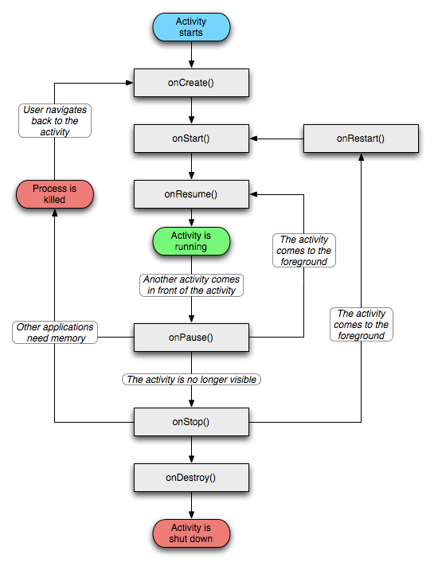
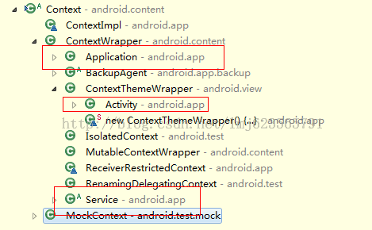
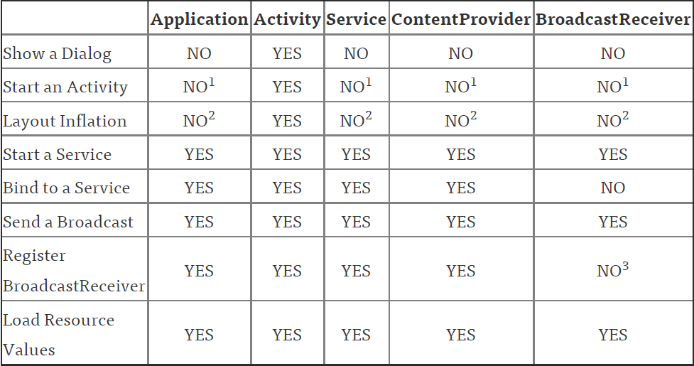

# 四大组件-> Activity

## Activity的生命周期

1.几个状态

	活动状态：当前Activity位于前台，用户可见，可以获得焦点。
	暂停状态：其他Activity位于前台，该Activity可见，不能获得焦点。
	停止状态：该Activity不可见，不能获得焦点。
	销毁状态：该Activity结束。

2.生命周期方法   **7个**

	onCreate：创建Activity时被回调
	onStart：启动Activity时被回调
	onRestart：重新启动Activity时被回调
	onResume：显示（可见）Activity时被回调。
	onPause：暂停Activity时被回调
	onStop：停止Activity时被回调
	onDestroy：销毁Activity时被回调

3.启动Activity

	运行的生命周期函数为：
	onCreate
	onStart
	onResume

4.按back键返回

	运行的生命周期函数为：
	onPause
	onStop
	onDestroy

5.按home键

	运行的生命周期函数为：
	onPause
	onStop
	
	然后再次进入
	运行的生命周期函数为：
	onRestart
	onStart
	onResume

6.finish方法

在Actyvity A 中的onResume方法中使用startActivity的方法进行开启另外一个Activity B，如下：

	protected void onResume() {
		// TODO Auto-generated method stub
		super.onResume();
		Log.d("zmq","onResume()");
		Intent intent = new Intent();
		intent.setClass(MainActivity.this, TestActivity.class);
		startActivity(intent);
		finish();
		Log.d("zmq","onResume() I hava run finish()");
	}

此时从Activity A开始运行到打开另外一个Activity B，Activity A中生命周期函数调用顺序：

	onCreate -> B
	onStart  -> B
	onResume -> B
	onPause  -> A
	onStop   -> A

finish()方法调用后

	onDestroy  -> A

7.打开一个一般的Activity，不做finish动作

	@Override
	public void onClick(View v) {
		// TODO Auto-generated method stub
		if (v.getId() == R.id.enterBtn) {
			Intent intent = new Intent();
			intent.setClass(MainActivity.this, TestActivity.class);
			startActivity(intent);
		}
	}

此时从Activity A开始运行到打开另外一个Activity B，Activity A中生命周期函数调用顺序：

	onCreate
	onStart
	onResume
	onPause
	onStop

然后按返回键退出，Activity A运行的生命周期函数为：
	
	onRestart
	onStart
	onResume

8.dialog对话框

在Activity A中启动一个对话框风格的Activity

	Activity A运行的生命周期函数为：
	onPause

	点击返回键，Activity A运行的生命周期函数为：
	onResume

9.两个Activity之间跳转时必然会执行的是哪几个方法？ **上面的回答都没有分情况，不太好**

	一般情况下比如说有两个activity,分别叫A,B。
	当在A 里面激活B 组件的时候, A会调用onPause()方法,然后B调用onCreate() ,onStart(), onResume()。
	这个时候B覆盖了A的窗体, A会调用onStop()方法。
	如果B是个透明的窗口,或者是对话框的样式, 就不会调用A的onStop()方法。
	如果B已经存在于Activity栈中，B就不会调用onCreate()方法。

## Activity之间通信 （传递数据）

2.1 通过Intent传递数据

通过Intent.putExtra方法可以将**简单数据类型**或**可序列化对象**保存在Intent对象中，然后在另一个Activity中使用getIntent等方法获得这些数据

	Intent intent = new Intent(CurrentActivity.this,OtherActivity.class);
	Bundle bundle = new Bundle();

	//传递数据
	bundle.putBoolean("boolean_key", true);
	bundle.putString("string_key", "string_value"); 
	...
	intent.putExtra("key", bundle);
	startActivity(intent);// 启动新的 Activity

下面是获取数据：

	Intent intent = getIntent();
	Bundle bundle = intent.getBundleExtra("key");

	//接收数据
	bundle.getBoolean("boolean_key");
	bundle.getString("string_key");

不过使用Bundle传递数据稍显麻烦，如果你只需要传递一种类型的值可以这样：

	Intent intent = new Intent(CurrentActivity.this,OtherActivity.class); 
	intent.putExtra("boolean_key", true); 
	intent.putExtra("string_key", "string_value"); 
	startActivity(intent);

获取数据：
	
	Intent intent = getIntent(); 
	intent.getBooleanExtra("boolean_key",false); 
	intent.getStringExtra("string_key");

	
2.2 通过静态变量传递数据

适用于**不可序列化的且简单的对象**，不过不推荐使用静态代码块

	public class MainActivity extends Activity {  

	    private Button btn;  

	    @Override  
	    public void onCreate(Bundle savedInstanceState) {  
	        super.onCreate(savedInstanceState);  
	        setContentView(R.layout.main);  
	        btn = (Button)findViewById(R.id.btOpenOtherActivity);  
	        btn.setOnClickListener(new OnClickListener() {  
	            @Override  
	            public void onClick(View v) {  
	                //定义一个意图  
	                Intent intent = new Intent(MainActivity.this,OtherActivity.class);  
	                //改变OtherActivity的三个静态变量的值  
	                OtherActivity.name = "小明";  
	                OtherActivity.age = "22";  
	                OtherActivity.address = "北京";  
	                startActivity(intent);  
	            }  
	        });  
	    }  
	}

	public class OtherActivity extends Activity {
  
		//静态变量
	    public static String name;  
	    public static String age;  
	    public static String address; 
 
	    private TextView text_name;  
	    private TextView text_age;  
	    private TextView text_address;  
	  
	    @Override  
	    public void onCreate(Bundle savedInstanceState) {  
	        super.onCreate(savedInstanceState);  
	        setContentView(R.layout.other);  
	        text_name = (TextView) findViewById(R.id.name);  
	        text_age = (TextView) findViewById(R.id.age);  
	        text_address = (TextView) findViewById(R.id.address);     
	        //设置文本框的数据  
	        text_name.setText("姓名："+name);  
	        text_age.setText("年龄："+age);  
	        text_address.setText("地址:"+address);  
	    }  
	}

2.3 通过全局对象传递数据

如果想使某些数据 **长时间驻留内存，以便程序随时调用**，建议采用全局对象。

Application全局类不需要定义静态变量只要定义普通成员变量即可，但全局类中必须有一个无参构造方法，编写完Application类后，还需要**在<application>标签中制定全局类名，否则系统不会自动创建全局对象**。
	
	//MainApplication
	public class MainApplication extends Application {
		
	   //只要定义普通成员变量
	   private String username;
	
	   public String getUsername() {
	       return username;
	   }
	
	   public void setUsername(String username) {
	       this.username = username;
	   }
	}
	
	
	//MainActivity
	public class MainActivity extends Activity {
		
	   //全局对象
	   private MainApplication application;
	
	   public void onCreate(Bundle savedInstanceState) {
	       super.onCreate(savedInstanceState);
	       setContentView(R.layout.activity_main);

	       application = (MainApplication) getApplication();
	       application.setUsername("小明");
	   }
	
	   public void open(View view) {
	       Intent intent = new Intent(this, OtherActivity.class);
	       startActivity(intent);
	   }
	}

	
	//OtherActivity
	public class OtherActivity extends Activity {
	   private TextView tv_data;

	   //全局对象
	   private MainApplication application;
	   private String username;
	
	   protected void onCreate(Bundle savedInstanceState) {
	       super.onCreate(savedInstanceState);
	       setContentView(R.layout.activity_other);

	       application = (MainApplication) getApplication();
	       username = application.getUsername();

	       tv_data = (TextView) findViewById(R.id.tv_data);
	       tv_data.setText("从上一个 Activity 中获取到的数据为：" + username);
	   }
	}

2.4 从Activity返回数据

要从Activity返回数据，需要使用startActivityForResult方法来显示Activity。

(1). 从Activity1跳转到Activity2

	Intent intent = new Intent();
	intent = intent.setClass(ActivityIntent.this, AnotherActivity.class);
	Bundle bundle = new Bundle();
	bundle.putString("string", et_string.getText().toString());
	intent.putExtras(bundle);
	startActivityForResult(intent,0); //只有这里不同

	
(2). 从Activity2返回数据到Aactivity1：

	Intent intent = new Intent();
	intent = intent.setClass(AnotherActivity.this, ActivityIntent.class);
	Bundle bundle = new Bundle();
	bundle.putInt("result", "Activity2的处理结果");
	intent.putExtras(bundle); 
	AnotherActivity.this.setResult(RESULT_OK, intent); //RESULT_OK是返回状态码
	AnotherActivity.this.finish();

(3). 在Activity1中重写onActivityResault方法，接收数据：

	protected void onActivityResult(int requestCode, int resultCode, Intent data) {
           super.onActivityResult(requestCode, resultCode, data);
           switch(resultCode) { //根据状态码，处理返回结果
			case RESULT_OK: 
			    Bundle bundle = data.getExtras(); //获取intent里面的bundle对象
				String result = bundle.getInt("result"); 
				break; 
			default:
				break;
            } 
     }

## Activity的四种启动模式及其应用场景

首先介绍一下 **任务栈**:

	(1)、程序打开时就创建了一个任务栈, 用于存储当前程序的activity,所有的activity属于一个任务栈。 
	(2)、一个任务栈包含了一个activity的集合, 去有序的选择哪一个activity和用户进行交互:只有在任务栈栈顶的activity才可以跟用户进行交互。 
	(3)、任务栈可以移动到后台, 并且保留了每一个activity的状态. 并且有序的给用户列出它们的任务, 而且还不丢失它们状态信息。 
	(4)、退出应用程序时：当把所有的任务栈中所有的activity清除出栈时,任务栈会被销毁,程序退出。

任务栈的 **缺点**： 

(1)、每开启一次页面都会在任务栈中添加一个Activity,而只有任务栈中的Activity全部清除出栈时，任务栈被销毁，程序才会退出,这样就造成了用户体验差, 需要点击多次返回才可以把程序退出了。

(2)、每开启一次页面都会在任务栈中添加一个Activity还会造成数据冗余, 重复数据太多, 会导致内存溢出的问题(OOM)。

**为了解决任务栈的缺点，我们引入了启动模式。**

- 启动模式（launchMode）：

在多个Activity跳转的过程中扮演着重要的角色，它可以决定是否生成新的Activity实例，是否重用已存在的Activity实例，是否和其他Activity实例共用一个task。

- task：

task是一个具有栈结构的对象，一个task可以管理多个Activity，启动一个应用，也就创建一个与之对应的task。

我们在开发项目的过程中，会涉及到该应用中多个Activity组件之间的跳转，或者夹带其它应用的可复用的Activity。

例如我们可能希望跳转到原来某个Activity实例，而不是产生大量重复的 Activity。这样就需要我们为 Activity 配置特定的加载模式，而不是使用默认的加载模式。

设置启动模式的位置在 Manifest.xml 文件中 Activity的android:launchMode 属性

- standard 模式

**默认模式，无需设置**，每次激活Activity时都会创建Activity实例，并放入任务栈中。

相当于入栈，按back键返回到前一个Activity相当于退栈。

- singleTop 模式

如果在任务的栈顶正好存在该Activity的实例，就**重用该实例**( 会调用实例的 onNewIntent()），否则就会创建新的实例并放入栈顶，即使栈中已经存在该Activity的实例，只要不在栈顶，都会创建新的实例。

可用来解决栈顶多个重复相同的Activity的问题

- singleTask 模式

如果在栈中已经有该Activity的实例，就重用该实例(会调用实例的 onNewIntent() )。**重用时，会让该实例回到栈顶，因此在它上面的实例将会被移出栈**。如果栈中不存在该实例，将会创建新的实例放入栈中。

singleTask 模式可以用来退出整个应用。

将主Activity设为SingTask模式，然后在要退出的Activity中转到主Activity，然后重写主Activity的onNewIntent函数，并在函数中加上一句finish。

- singleInstance 模式

在一个新栈中创建该Activity的实例，并让多个应用共享该栈中的该Activity实例。

一旦该模式的Activity实例已经存在于某个栈中，任何应用再激活该Activity时都会重用该栈中的实例( 会调用实例的 onNewIntent() )。

其效果相当于多个应用共享一个应用，不管谁激活该 Activity 都会进入同一个应用中。

此处延伸：

栈(First In Last Out)与队列(First In First Out)的区别？

## Activity状态的保存与恢复

第一： 有哪些状态是需要保存的？

最简单明了的就是对一些数据的保存，比如你正在操作一些数据，当面临突发情况，你的数据还没有操作完，这时候你就需要将数据进行保存，以便我们再次回到这个页面的时候不用重头再来。

第二： 什么情况下需要Activity状态的保存与恢复？

官方文档的说法是在处理运行时配置变更的时候，来看官方文档介绍的一段话：

	1.有些设备配置可能会在运行时发生变化（例如屏幕方向、键盘可用性及切换语言）。 
	发生这种变化时，Android会重启正在运行的 Activity（先后调用onDestroy()和onCreate()）。

	2.重启行为旨在通过利用与新设备配置匹配的备用资源自动重新加载您的应用，来帮助它适应新配置。

	3.要妥善处理重启行为，Activity必须通过常规的Activity生命周期恢复其以前的状态。
	在Activity生命周期中，Android会在销毁Activity之前调用onSaveInstanceState()，以便您保存有关应用状态的数据。 
	然后，您可以在onCreate()或onRestoreInstanceState()期间恢复Activity 状态。

**首先我总结有如下几种情况是需要对数据进行保存的**

1. 点击了返回键 
2. 锁屏 
3. 点击home键 
4. 有其他APP进入前台（比如接听电话） 
5. 启动了新的Activity 
6. 屏幕方向发生旋转 
7. APP被杀死

第三： 状态为什么会丢失？

当应用启动，首先运行onCreat方法，当我们点击旋转屏幕会发现当前的Activity被销毁了，然后又重新执行了onCreat方法

当点击了屏幕旋转之后，当前Activity会被销毁，然后会重新创建一个新的Activity，如此一来我们在之前Activity的数据如果不保存的话就又可能丢失了

第四： 如何保存与恢复？

onSaveInstanceState是用来保存我们当前activity中的数据的，而onRestoreInstanceState可以让我们获取之前保存的数据从而在新的activity中进行设置。

首先是在onSaveInstanceState中保存数据

	@Override
	public void onSaveInstanceState(Bundle outState) {
	    super.onSaveInstanceState(outState);
	    //保存销毁之前的数据
	    outState.putString("number",mMNumber.getText().toString());
	    Log.d(TAG, "onSaveInstanceState");
	}

紧接着在onRestoreInstanceState对数据进行恢复

	@Override
    protected void onRestoreInstanceState(Bundle savedInstanceState) {
        super.onRestoreInstanceState(savedInstanceState);
        Log.d(TAG, "onRestoreInstanceState");
        //恢复数据
       String s = savedInstanceState.getString("number");
       mMNumber.setText(s);
    }

**总结一下：**

当运行时配置发生变更的时候，程序总会销毁当前的Activity，然后重新创建一个新的Activity。
在这个过程中，销毁当前Activity之前会先调用onSaveInstanceState让我们来保存数据，然后重建Activity调用onCreat方法之后,会调用onRestoreInstanceState让我们来对数据进行恢复，当然也可以在onCreat中进行数据恢复，方法原理相同。

第五： 这个知识点你需要**注意的地方**？

1.关于onSaveInstanceState 

这个方法默认情况下会自动保存有关Activity的视图层次结构的状态信息

简单举个例子，我们以系统控件EditText来说，系统默认会保存有关这个控件的一个信息，也就是当你在这个控件中输入内容的时候，即使旋转屏幕内容也不会丢失，因为系统已经默认为其实现了我们说的那两个方法，

但是有个前提，**这个控件必须设置id，否则数据依旧会丢失**，

另外如果你重写了onRestoreInstanceState也要保证必须有这行代码

	super.onRestoreInstanceState(savedInstanceState);

2.关于旋转屏幕无法调用onSaveInstanceState的问题。

出现这种问题你重写的肯定有以下方法

	public void onSaveInstanceState (Bundle outState, PersistableBundle outPersistentState)； 

改成以下方法即可

	public void onSaveInstanceState (Bundle outState)；

3.若向数据库中插入记录等，保存持久化数据的操作应该放在onPause()中. onSaveInstanceState()方法只适合保存瞬态数据, 比如UI控件的状态, 成员变量的值等

	public class MainActivity extends Activity {  
	    private String temp;    
	    @Override  
	    public void onCreate(Bundle savedInstanceState) {  
	        super.onCreate(savedInstanceState);  
	        // 从savedInstanceState中恢复数据, 如果没有数据需要恢复savedInstanceState为null  
	        if (savedInstanceState != null) {  
	            temp = savedInstanceState.getString("temp");  
	            System.out.println("onCreate: temp = " + temp);  
	        }  
	    }  
	  
	    public void onRestoreInstanceState(Bundle saveInstanceState) {  
	        super.onRestoreInstanceState( saveInstanceState);  
	        String temp  = saveInstanceState.getString("temp");  
	        System.out.println("onResume: temp = " + temp);  
	    }  
	      
	    // 将数据保存到outState对象中, 该对象会在重建activity时传递给onCreate方法和onRestoreInstanceState方法
	    @Override  
	    protected void onSaveInstanceState(Bundle outState) {  
	        super.onSaveInstanceState(outState);  
	        outState.putString("temp", temp);  
	    }
	}

## Activity的启动过程（不要回答生命周期） 

app启动的过程有两种情况：

第一种是从桌面launcher上点击相应的应用图标，

第二种是在activity中通过调用startActivity来启动一个新的activity。

我们创建一个新的项目，默认的根activity都是MainActivity，而所有的activity都是保存在堆栈中的，我们启动一个新的activity就会放在上一个activity上面，而我们从桌面点击应用图标的时候，由于launcher本身也是一个应用，当我们点击图标的时候，系统就会调用startActivitySately(),一般情况下，我们所启动的activity的相关信息都会保存在intent中，比如action，category等等。

我们在安装这个应用的时候，系统也会启动一个PackaManagerService的管理服务，这个管理服务会对AndroidManifest.xml文件进行解析，从而得到应用程序中的相关信息，比如service，activity，Broadcast等等，然后获得相关组件的信息。

当我们点击应用图标的时候，就会调用startActivitySately()方法，而这个方法内部则是调用startActivty(),而startActivity()方法最终还是会调用startActivityForResult()这个方法。而在startActivityForResult()这个方法。因为startActivityForResult()方法是有返回结果的，所以系统就直接给一个-1，就表示不需要结果返回了。而startActivityForResult()这个方法实际是通过Instrumentation类中的execStartActivity()方法来启动activity，Instrumentation这个类主要作用就是监控程序和系统之间的交互。而在这个execStartActivity()方法中会获取ActivityManagerService的代理对象，通过这个代理对象进行启动activity。

启动后就会调用一个checkStartActivityResult()方法，如果说没有在配置清单中配置有这个组件，就会在这个方法中抛出异常了。

当然最后是调用的是Application.scheduleLaunchActivity()进行启动activity，而这个方法中通过获取得到一个ActivityClientRecord对象，而这个ActivityClientRecord通过handler来进行消息的发送，系统内部会将每一个activity组件使用ActivityClientRecord对象来进行描述，而ActivityClientRecord对象中保存有一个LoaderApk对象，通过这个对象调用handleLaunchActivity来启动activity组件，而页面的生命周期方法也就是在这个方法中进行调用。

[Android应用程序启动过程源代码分析](https://blog.csdn.net/luoshengyang/article/details/6689748)

## 一些关于Activity的技巧

1 设置Activity的方向

	android:screenOrientation="portrait">// 竖屏 
	android:screenOrientation="landscape">//横屏

2 设置Activity全屏

	在onCreate方法中添加如下代码：
	
	// 设置全屏模式
	getWindow().setFlags(WindowManager.LayoutParams.FLAG_FULLSCREEN, 
	WindowManager.LayoutParams.FLAG_FULLSCREEN); 

	// 去除标题栏
	requestWindowFeature(Window.FEATURE_NO_TITLE);

	改变窗口大小、位置、透明度
	在onCreate方法中添加如下代码：
	Window w=getWindow();
	w.setBackgroundDrawableResource(resourceID);//设置窗口背景
	WindowManager.LayoutParams layoutParams  = w.getAttributes();
	layoutParams.height = 200; 
	layoutParams.width= 200;
	layoutParams.gravity = Gravity.TOP;
	layoutParams.x=50;//距离Gravity属性的距离
	layoutParams.y=50;
	layoutParams.alpha = 0.5;//0:完全透明，1：不透明
	w.setAttributes(layoutParams);

3 关闭所有窗口

	Intent intent = new Intent(); 
	intent.setClass(Android123.this, CWJ.class); 
	intent.setFlags(Intent.FLAG_ACTIVITY_CLEAR_TOP);  //注意本行的FLAG设置 
	startActivity(intent) 

另一种方法：在调用退出方法中写上MyApplication.getInstance().exit();

	public class MyApplication extends Application {

        private List<Activity> activityList = new LinkedList<Activity>();
        private static MyApplication instance;

        private MyApplication() {
        }

        // 单例模式中获取唯一的MyApplication实例
        public static MyApplication getInstance() {
        	if (null == instance) {
            	instance = new MyApplication();
            }
            return instance;
        }

        // 添加Activity到容器中
        public void addActivity(Activity activity) {
                activityList.add(activity);
        }

        // 遍历所有Activity并finish
        /*
         * 在每一个Activity中的onCreate方法里添加该Activity到MyApplication对象实例容器中
         * 
         * MyApplication.getInstance().addActivity(this);
         * 
         * 在需要结束所有Activity的时候调用exit方法
         * 
         * MyApplication.getInstance().exit();
         */
        public void exit() {
            for (Activity activity : activityList) {
                    activity.finish();
            }
            System.exit(0);
        }
	}

## 横竖屏切换对Activity生命周期的影响

横竖屏切换涉及到的是Activity的android:configChanges属性，而与其android:launchMode属性没有关系；

android:configChanges可以设置的属性值有：
	
	(1)orientation：消除横竖屏的影响
	(2)keyboardHidden：消除键盘的影响
	(3)screenSize：消除屏幕大小的影响

可以发现在设置了orientation|screenSize属性之后，在进行横竖屏切换的时候调用的方法是onConfigurationChanged，而不会重新加载Activity的各个生命周期；

还有一点需要注意的是在进行横竖屏切换的时候在调用onStop之前会调用onSaveInstanceState来进行Activity的状态保存，随后在重新显示该Activity的onResume方法之前会调用onRestoreInstanceState来恢复之前由onSaveInstanceState保存的Activity信息；

当然在显示中我们可以屏蔽掉横竖屏的切换操作，这样就不会出现切换的过程中Activity生命周期重新加载的情况了，具体做法是，在Activity中加入如下语句：

	android:screenOrientation="portrait" 始终以竖屏显示 
	android:screenOrientation="landscape" 始终以横屏显示

如果不想设置整个软件屏蔽横竖屏切换，只想设置屏蔽某个Activity的横竖屏切换功能的话，只需要下面操作：

	Activity.this.setRequestedOrientation(ActivityInfo.SCREEN_ORIENTATION_PORTRAIT);以竖屏显示
	Activity.this.setRequestedOrientation(ActivityInfo.SCREEN_ORIENTATION_LANDSCAPE);以横屏显示

## 参考文档 vs 面试题

[Activity详细总结](https://www.jianshu.com/p/7c193337702d)

[Activity的四种启动模式及其应用场景](https://blog.csdn.net/CodeEmperor/article/details/50481726)

[Activity状态的保存与恢复](https://blog.csdn.net/sinat_33921105/article/details/78631823)

[横竖屏切换对Activity生命周期的影响](https://blog.csdn.net/hzw19920329/article/details/51345971)

1.Activity之间的通信方式？

	1)通过Intent意图传值
	2)静态成员变量传值（不建议使用）
	3)全局对象传值（Application）
	4)回传数据（startActivityForResult , 重写 onActivityResault）

(详细见上文)

2.横竖屏切换的时候，Activity 各种情况下的生命周期？

(见上文)

3.Activity上有Dialog的时候按Home键时的生命周期？

有Dialog, Activity  -> onPause

按Home键， Dialog -> onPause/onStop

重现进入, Dialog -> onRestart/onstart/onResume

4.两个Activity之间跳转时必然会执行的是哪几个方法？

(见上文)

5.Activity的四种启动模式对比以及使用场景？

(见上文)

6.Activity状态保存与恢复？

(见上文)

7.Application 和 Activity 的 Context 对象的区别？

a.Context概念

我们可以直接通过看其类结构来说明答案

可以看到Activity、Service、Application都是Context的子类；

也就是说，Android系统的角度来理解：Context是一个场景，代表与操作系统的交互的一种过程。

从程序的角度上来理解：Context是个抽象类，而Activity、Service、Application等都是该类的一个实现。

在仔细看一下上图：Activity、Service、Application都是继承自ContextWrapper，而ContextWrapper内部会包含一个base context，由这个base context去实现了绝大多数的方法

b.Activity与Application在作为Context时的区别

大家在需要Context的时候，如果是在Activity中，大多直接传个this，当在匿名内部类的时候，因为this不能用，需要写XXXActivity.this;

XXXActivity和getApplicationContext返回的肯定不是一个对象，一个是当前Activity的实例，一个是项目的Application的实例

c.引用的保持

看案例
  
	import android.content.Context;  
	  
	public class CustomManager  {  
	    private static CustomManager sInstance;  
	    private Context mContext;  
	  
	    private CustomManager(Context context) {  
	        this.mContext = context;  
	    }  
	  
	    public static synchronized CustomManager getInstance(Context context) {  
	        if (sInstance == null)  
	        {  
	            sInstance = new CustomManager(context);  
	        }  
	        return sInstance;  
	    }  
	      
	    //some methods   
	    private void someOtherMethodNeedContext() {    
	    }  
	}

这么写是没有问题的，问题在于，这个Context哪来的我们不能确定，很大的可能性，你在某个Activity里面为了方便，直接传了个this;这样问题就来了，我们的这个类中的sInstance是一个static且强引用的，在其内部引用了一个Activity作为Context，也就是说，我们的这个Activity只要我们的项目活着，就没有办法进行内存回收。而我们的Activity的生命周期肯定没这么长，所以造成了内存泄漏

那么，我们如何才能避免这样的问题呢？

有人会说，我们可以软引用，嗯，软引用，假如被回收了，你不怕NullPointException么。

把上述代码做下修改：

	public static synchronized CustomManager getInstance(Context context) {  
        if (sInstance == null)  
        {  
            sInstance = new CustomManager(context.getApplicationContext());  
        }  
        return sInstance;  
    }

这样，我们就解决了内存泄漏的问题，因为我们引用的是一个ApplicationContext，它的生命周期和我们的单例对象一致。

这样的话，可能有人会说，早说嘛，那我们以后都这么用不就行了，很遗憾的说，不行。上面我们已经说过
Context和Application Context的区别是很大的，也就是说，他们的应用场景（你也可以认为是能力）是不同的，并非所有Activity为Context的场景，Application Context都能搞定

d.Context的应用场景

	数字1：启动Activity在这些类中是可以的，但是需要创建一个新的task。一般情况不推荐。
	数字2：在这些类中去layout inflate是合法的，但是会使用系统默认的主题样式，如果你自定义了某些样式可能不会被使用。
	数字3：在receiver为null时允许，在4.2或以上的版本中，用于获取黏性广播的当前值。（可以无视）

Activity和Application，可以看到，和UI相关的方法基本都不建议或者不可使用Application，并且，前三个操作基本不可能在Application中出现。

实际上，只要把握住一点，凡是跟UI相关的，都应该使用Activity做为Context来处理；

其他的一些操作，Service,Activity,Application等实例都可以，当然了，注意Context引用的持有，防止内存泄漏

