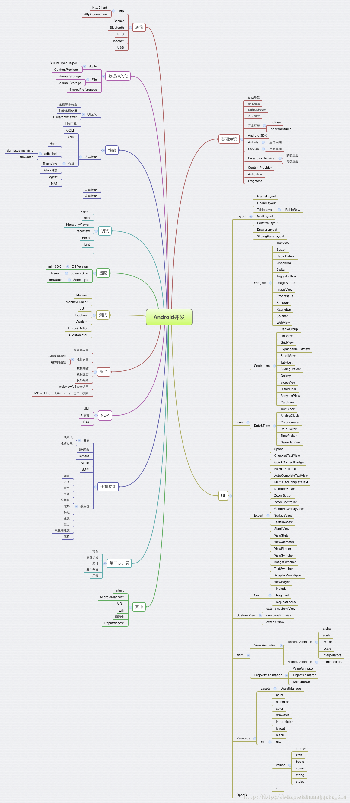
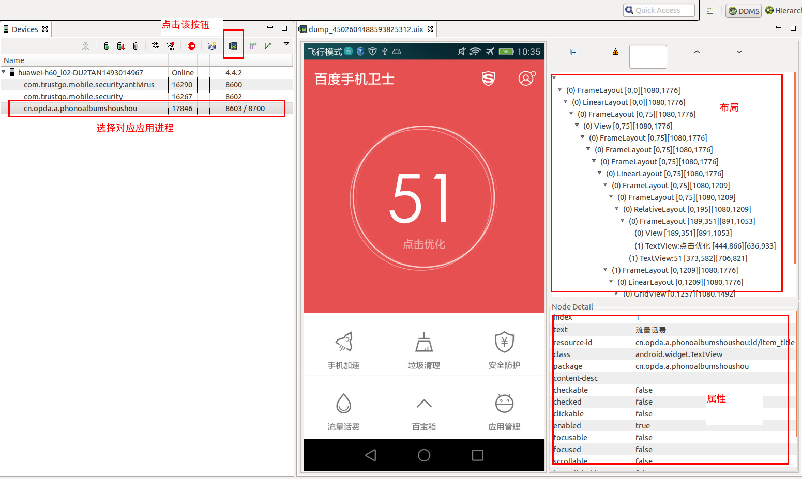

## Android知识图谱

#### 1.四大组件

[Activity](./Activity.md)

[Service](./Service.md)

[Content Provider](./ContentProvider.md)

[Broadcast Receiver](./BroadcastReceiver.md)

#### 2.Fragment 

[Fragment](./Fragment.md)

#### 3.自定义组件、动画 

[Android动画](./Android动画.nd)

#### 4.存储 

[Android存储](./存储.md) 

#### 5.网络

[Android网络](./网络.md)

#### 6.图片

[Android图片](./图片.md)

#### 7.布局 

7.1 Android开发——LinearLayout和RelativeLayout、FrameLayout的性能对比,并介绍使用场景

- RelativeLayout慢于LinearLayout是因为它会让子View调用2次measure过程，而LinearLayout只需一次，但是有weight属性存在时，LinearLayout也需要两次measure。

- RelativeLayout的子View如果高度和RelativeLayout不同，会导致RelativeLayout在onMeasure()方法中做横向测量时，纵向的测量结果尚未完成，只好暂时使用自己的高度传入子View系统。而父View给子View传入的值也没有变化就不会做无谓的测量的优化会失效，解决办法就是可以使用padding代替margin以优化此问题。

- 在不响应层级深度的情况下，使用Linearlayout而不是RelativeLayout

	开发者默认新建RelativeLayout是希望开发者能采用尽量少的View层级，很多效果是需要多层LinearLayout的嵌套，这必然不如一层的RelativeLayout性能更好。因此我们应该尽量减少布局嵌套，减少层级结构，使用比如viewStub，include等技巧。可以进行较大的布局优化。

7.2 布局优化的方案

- 首先是善用相对布局Relativelayout

	一般情况下用LinearLayout的时候总会比RelativeLayout多一个View的层级。而每次往应用里面增加一个View，或者增加一个布局管理器的时候，都会增加运行时对系统的消耗，因此这样就会导致界面初始化、布局、绘制的过程变慢

- 布局优化的另外一种手段就是使用抽象布局标签include、merge、ViewStub

	include标签常用于将布局中的公共部分提取出来
	
	merge标签是作为include标签的一种辅助扩展来使用，它的主要作用是为了防止在引用布局文件时产生多余的布局嵌套

	viewstub是view的子类。他是一个轻量级View， 隐藏的，没有尺寸的View。他可以用来在程序运行时简单的填充布局文件

- Android最新的布局方式ConstaintLayout（约束布局）

	ConstraintLayout允许你在不适用任何嵌套的情况下创建大型而又复杂的布局。它与RelativeLayout非常相似，所有的view都依赖于兄弟控件和父控件的相对关系。但是，ConstraintLayout比RelativeLayout更加灵活

- 利用Android Lint工具寻求可能优化布局的层次

一些Lint规则如下：

	1、使用组合控件： 包含了一个ImageView以及一个TextView控件的LinearLayout如果能够作为一个组合控件将会被更有效的处理。

	2、合并作为根节点的帧布局(Framelayout) ：如果一个帧布局时布局文件中的根节点，而且它没有背景图片或者padding等，更有效的方式是使用merge标签替换该Framelayout标签 。 

	3、无用的叶子节点：通常来说如果一个布局控件没有子视图或者背景图片，那么该布局控件时可以被移除(由于它处于 invisible状态)。

	4、无用的父节点 ：如果一个父视图即有子视图，但没有兄弟视图节点，该视图不是ScrollView控件或者根节点，并且它没有背景图片，也是可以被移除的，移除之后，该父视图的所有子视图都直接迁移至之前父视图的布局层次。同样能够使解析布局以及布局层次更有效。

	5、过深的布局层次：内嵌过多的布局总是低效率地。考虑使用一些扁平的布局控件，例如 RelativeLayout、GridLayout ，来改善布局过程。默认最大的布局深度为10

7.3 Android布局分析的两种方式

- Dump UI Hierarchy for UI Atomator，分析UI层级

从Android Studio中启动Android Device Monitor： Tools -> Android -> Android Device Monitor. 使用方法很简单，如下图

- HierachyViewer 

#### 8.性能优化 

[Android性能优化](./性能优化.md)

#### 9.JNI vs NDK

[Android-JNI-NDK](./JNI-NDK.md)

#### 10.进程间通信-IPC

[进程间通信-IPC](./进程间通信-IPC.md)

#### 11.Hybrid开发

[Hybrid开发](./Hybrid开发.md)

#### 12.架构设计

[架构设计](./架构设计.md)

## 参考文档

[2017-2018最新Android面试题](https://blog.csdn.net/huangqili1314/article/details/72792682)
