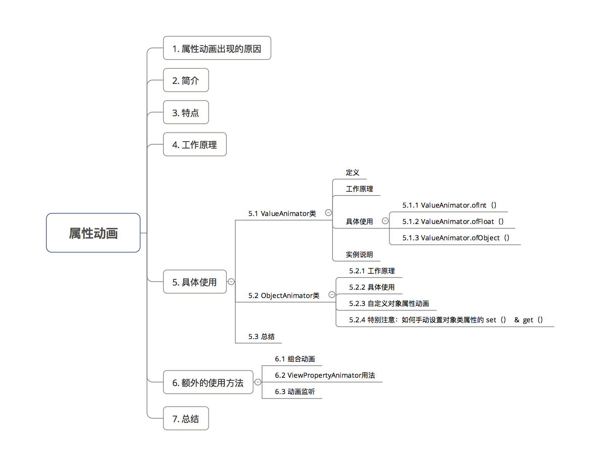
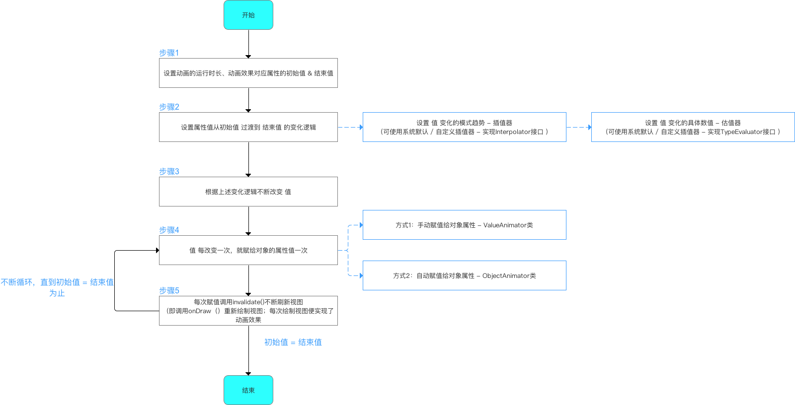
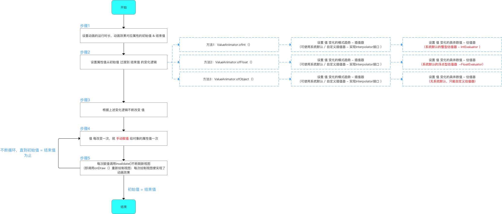
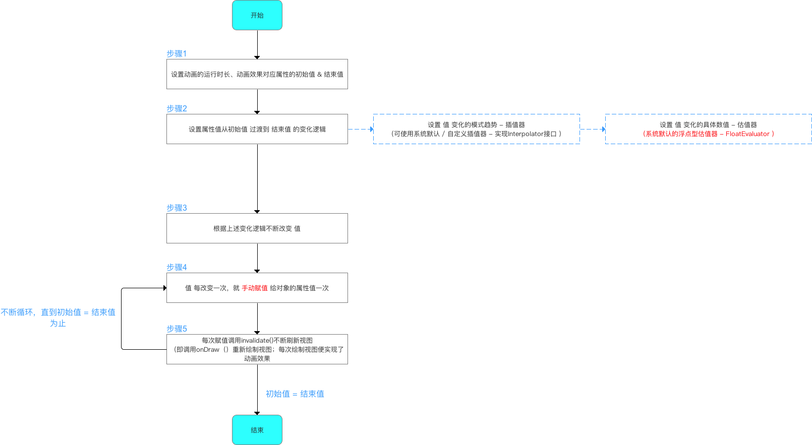
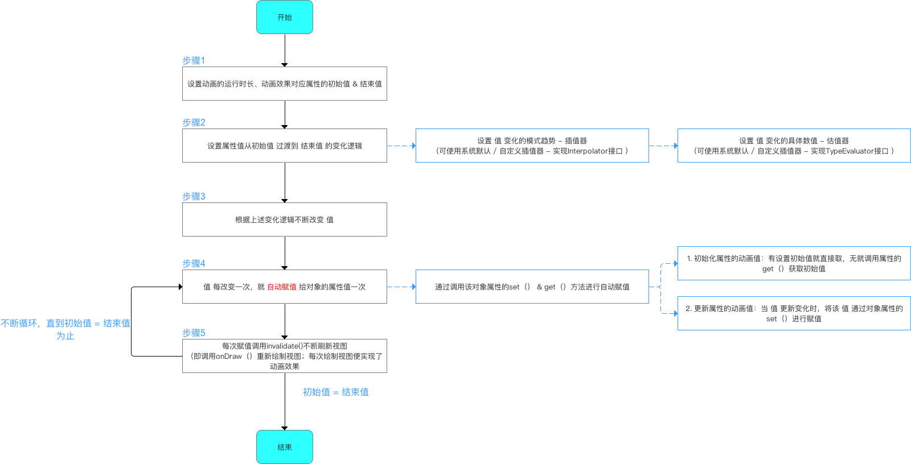
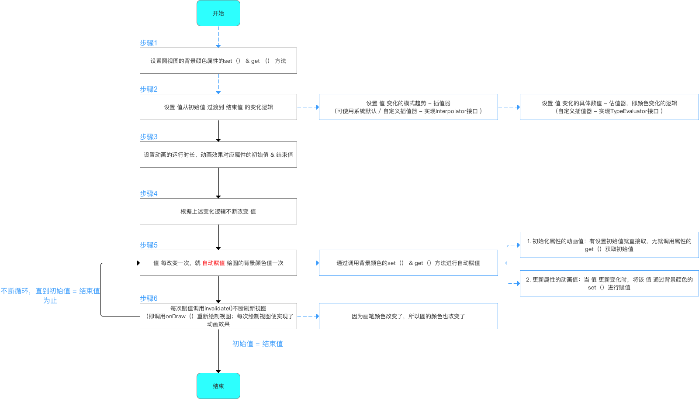
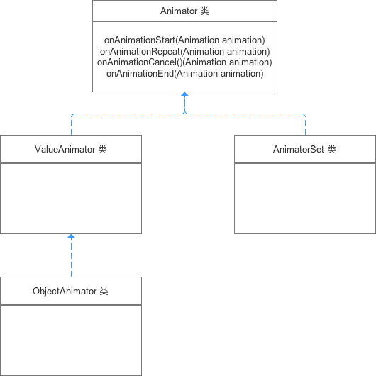
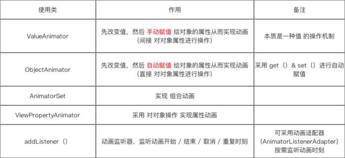

## Android动画 - 属性动画

### 1、属性动画出现的原因

属性动画（Property Animation）是在 Android 3.0（API 11）后才提供的一种全新动画模式。

1.1 背景

实现动画效果在Android开发中非常常见，因此Android系统一开始就提供了两种实现动画的方式：

	逐帧动画（Frame Animation）
	补间动画（Tweened animation）

1.2 问题

逐帧动画 & 补间动画存在一定的缺点：

**a.作用对象局限：View**

即补间动画只能够作用在视图View上，即只可以对一个Button、TextView、甚至是LinearLayout、或者其它继承自View的组件进行动画操作，但无法对非View的对象进行动画操作。

	有些情况下的动画效果只是视图的某个属性 & 对象而不是整个视图；

如，现需要实现视图的颜色动态变化，那么就需要操作视图的颜色属性从而实现动画效果，而不是针对整个视图进行动画操作

**b.没有改变View的属性，只是改变视觉效果**

	补间动画只是改变了View的视觉效果，而不会真正去改变View的属性。

如，将屏幕左上角的按钮，通过补间动画移动到屏幕的右下角。
点击当前按钮位置（屏幕右下角）是没有效果的，因为实际上按钮还是停留在屏幕左上角，补间动画只是将这个按钮绘制到屏幕右下角，改变了视觉效果而已。

**c.动画效果单一**

补间动画只能实现平移、旋转、缩放 & 透明度这些简单的动画需求；

一旦遇到相对复杂的动画效果，即超出了上述4种动画效果，那么补间动画则无法实现。

> 即在功能 & 可扩展性有较大局限性

为了解决补间动画的缺陷，在 Android 3.0（API 11）开始，系统提供了一种全新的动画模式：属性动画（Property Animation）。

### 2、简介

- 作用对象：任意Java对象，不再局限于视图View对象。

- 实现的动画效果：可自定义各种动画效果，不再局限于4种基本变换：平移、旋转、缩放 & 透明度。

### 3、特点

- 作用对象进行了扩展：不只是View对象，甚至没对象也可以

- 动画效果：不只是4种基本变换，还有其他动画效果

- 作用领域：API11后引入的

### 4、工作原理

- 在一定时间间隔内，通过不断对值进行改变，并不断将该值赋给对象的属性，从而实现该对象在该属性上的动画效果。

> 可以是任意对象的任意属性.

- 具体的工作原理逻辑如下：

**从上述工作原理可以看出:**

属性动画有两个非常重要的类：ValueAnimator 类 & ObjectAnimator 类;
其实属性动画的使用基本都是依靠这两个类;

所以，在下面介绍属性动画的具体使用时，我会着重介绍这两个类。

### 5、具体使用

##### 5.1 ValueAnimator类

- 定义：属性动画机制中最核心的一个类。

- 实现动画的原理：通过不断控制**值**的变化，再不断**手动**赋给对象的属性，从而实现动画效果。

如图下：

从上面原理可以看出：ValueAnimator类中有3个重要方法：

	ValueAnimator.ofInt（int values）
	ValueAnimator.ofFloat（float values）
	ValueAnimator.ofObject（int values）

5.1.1 ValueAnimator.ofInt（int values）

- 作用：将初始值**以整型数值的形式**过渡到结束值

> 即估值器是整型估值器 - IntEvaluator

- 工作原理：

- 具体使用：

实际开发中，建议使用Java代码实现属性动画：因为很多时候属性的起始值是无法提前确定的（无法使用XML设置），这就需要在Java代码里动态获取。

**a.设置方式1：Java代码设置**

	// 步骤1：设置动画属性的初始值 & 结束值
	ValueAnimator anim = ValueAnimator.ofInt(0, 3);
	// ofInt（）作用有两个
	// 1. 创建动画实例
	// 2. 将传入的多个Int参数进行平滑过渡:此处传入0和1,表示将值从0平滑过渡到1
	// 如果传入了3个Int参数 a,b,c ,则是先从a平滑过渡到b,再从b平滑过渡到C，以此类推
	// ValueAnimator.ofInt()内置了整型估值器,直接采用默认的.不需要设置，即默认设置了如何从初始值 过渡到 结束值
	// 关于自定义插值器我将在下节进行讲解
	// 下面看看ofInt()的源码分析 ->>关注1
	
	// 步骤2：设置动画的播放各种属性
	anim.setDuration(500);
	// 设置动画运行的时长
	
	anim.setStartDelay(500);
	// 设置动画延迟播放时间
	
	anim.setRepeatCount(0);
	// 设置动画重复播放次数 = 重放次数+1
	// 动画播放次数 = infinite时,动画无限重复
	
	anim.setRepeatMode(ValueAnimator.RESTART);
	// 设置重复播放动画模式
	// ValueAnimator.RESTART(默认):正序重放
	// ValueAnimator.REVERSE:倒序回放
	
	// 步骤3：将改变的值手动赋值给对象的属性值：通过动画的更新监听器
	// 设置 值的更新监听器
	// 即：值每次改变、变化一次,该方法就会被调用一次
	anim.addUpdateListener(new ValueAnimator.AnimatorUpdateListener() {
	    @Override
	    public void onAnimationUpdate(ValueAnimator animation) {
	
	        int currentValue = (Integer) animation.getAnimatedValue();
	        // 获得改变后的值
	        
	        System.out.println(currentValue);
	        // 输出改变后的值
	
	// 步骤4：将改变后的值赋给对象的属性值，下面会详细说明
	        View.setproperty（currentValue）；
	
	// 步骤5：刷新视图，即重新绘制，从而实现动画效果
	        View.requestLayout();
	    }
	});
	
	anim.start();
	// 启动动画
	}
	
	// 关注1：ofInt（）源码分析
	public static ValueAnimator ofInt(int... values) {
		// 允许传入一个或多个Int参数
		// 1. 输入一个的情况（如a）：从0过渡到a；
		// 2. 输入多个的情况（如a，b，c）：先从a平滑过渡到b，再从b平滑过渡到C
		
		ValueAnimator anim = new ValueAnimator();
		// 创建动画对象
		anim.setIntValues(values);
		// 将传入的值赋值给动画对象
		return anim;
	}

**b.设置方法2：在XML 代码中设置**

设置：

	set_animation.xml

	// ValueAnimator采用<animator>  标签
	<animator xmlns:android="http://schemas.android.com/apk/res/android"  
	    android:valueFrom="0"   // 初始值
	    android:valueTo="100"  // 结束值
	    android:valueType="intType" // 变化值类型 ：floatType & intType
	
	    android:duration="3000" // 动画持续时间（ms），必须设置，动画才有效果
	    android:startOffset ="1000" // 动画延迟开始时间（ms）
	    android:fillBefore = “true” // 动画播放完后，视图是否会停留在动画开始的状态，默认为true
	    android:fillAfter = “false” // 动画播放完后，视图是否会停留在动画结束的状态，优先于fillBefore值，默认为false
	    android:fillEnabled= “true” // 是否应用fillBefore值，对fillAfter值无影响，默认为true
	    android:repeatMode= “restart” // 选择重复播放动画模式，restart代表正序重放，reverse代表倒序回放，默认为restart|
	    android:repeatCount = “0” // 重放次数（所以动画的播放次数=重放次数+1），为infinite时无限重复
	    android:interpolator = @[package:]anim/interpolator_resource // 插值器，即影响动画的播放速度,下面会详细讲
	
	/>

使用：

	Animator animator = AnimatorInflater.loadAnimator(context, R.animator.set_animation);  
	// 载入XML动画
	
	animator.setTarget(view);  
	// 设置动画对象
	
	animator.start();  
	// 启动动画

5.1.2 ValueAnimator.oFloat（float values）

- 作用：将初始值**以浮点型数值的形式**过渡到结束值

-工作原理：

**a.设置方法1：在 Java 代码中设置**

	ValueAnimator anim = ValueAnimator.ofFloat(0, 3);  
	// 其他使用类似ValueAnimator.ofInt（int values），此处不作过多描述

**b.设置方法2：在XML 代码中设置**

设置：

	set_animation.xml

	// ValueAnimator采用<animator>  标签
	<animator xmlns:android="http://schemas.android.com/apk/res/android"  
	    // 设置属性同上
	    android:valueFrom="0"  
	    android:valueTo="100"  
	    android:valueType="intType"/>

使用：

	Animator animator = AnimatorInflater.loadAnimator(context, R.animator.set_animation);  
	// 载入XML动画
	
	animator.setTarget(view);  
	// 设置动画对象
	
	animator.start();  
	// 启动动画

**小结：** 从上面可以看出，ValueAnimator.ofInt（）与ValueAnimator.oFloat（）仅仅只是在估值器上的区别：（即如何从初始值 过渡 到结束值）

5.1.3 ValueAnimator.ofObject()

- 作用：将初始值**以对象的形式**过渡到结束值，即通过操作对象实现动画效果。

- 具体使用：

	// 创建初始动画时的对象  & 结束动画时的对象
	myObject object1 = new myObject();  
	myObject object2 = new myObject();  
	
	ValueAnimator anim = ValueAnimator.ofObject(new myObjectEvaluator(), object1, object2);  
	// 创建动画对象 & 设置参数
	// 参数说明
	// 参数1：自定义的估值器对象（TypeEvaluator 类型参数） - 下面会详细介绍
	// 参数2：初始动画的对象
	// 参数3：结束动画的对象
	anim.setDuration(5000);  
	anim.start();

##### 5.2 ObjectAnimator类

5.2.1 实现动画的原理

直接对对象的属性值进行改变操作，从而实现动画效果。

	如直接改变 View的 alpha 属性 从而实现透明度的动画效果
	继承自ValueAnimator类，即底层的动画实现机制是基于ValueAnimator类

- 本质原理： 通过不断控制**值**的变化，再不断**自动**赋给对象的属性，从而实现动画效果。

如下图：

从上面的工作原理可以看出：ObjectAnimator与 ValueAnimator类的区别：

- ValueAnimator类是先改变值，然后**手动赋值**给对象的属性从而实现动画；是**间接**对对象属性进行操作；

- ObjectAnimator类是先改变值，然后**自动赋值**给对象的属性从而实现动画；是**直接**对对象属性进行操作；

5.2.2 具体使用

**a.设置方式1：Java 设置**

	ObjectAnimator animator = ObjectAnimator.ofFloat(Object object, String property, float ....values);  
	
	// ofFloat()作用有两个
	// 1. 创建动画实例
	// 2. 参数设置：参数说明如下
	// Object object：需要操作的对象
	// String property：需要操作的对象的属性
	// float ....values：动画初始值 & 结束值（不固定长度）
	// 若是两个参数a,b，则动画效果则是从属性的a值到b值
	// 若是三个参数a,b,c，则则动画效果则是从属性的a值到b值再到c值
	// 以此类推
	// 至于如何从初始值 过渡到 结束值，同样是由估值器决定，此处ObjectAnimator.ofFloat（）是有系统内置的浮点型估值器FloatEvaluator，同ValueAnimator讲解
	
	anim.setDuration(500);
	// 设置动画运行的时长
	
	anim.setStartDelay(500);
	// 设置动画延迟播放时间
	
	anim.setRepeatCount(0);
	// 设置动画重复播放次数 = 重放次数+1
	// 动画播放次数 = infinite时,动画无限重复
	
	anim.setRepeatMode(ValueAnimator.RESTART);
	// 设置重复播放动画模式
	// ValueAnimator.RESTART(默认):正序重放
	// ValueAnimator.REVERSE:倒序回放
	
	animator.start();  
	// 启动动画

**b.设置方法2：在XML 代码中设置**

设置：

	set_animation.xml

	// ObjectAnimator 采用<animator>  标签
	<objectAnimator xmlns:android="http://schemas.android.com/apk/res/android"  
	    android:valueFrom="1"   // 初始值
	    android:valueTo="0"  // 结束值
	    android:valueType="floatType"  // 变化值类型 ：floatType & intType
	    android:propertyName="alpha" // 对象变化的属性名称
	/>

使用：

	Animator animator = AnimatorInflater.loadAnimator(context, R.animator.view_animation);  
	// 载入XML动画
	
	animator.setTarget(view);  
	// 设置动画对象
	
	animator.start();  
	// 启动动画

- 使用实例

此处先展示四种基本变换：平移、旋转、缩放 & 透明度

a.透明度

	mButton = (Button) findViewById(R.id.Button);
	// 创建动画作用对象：此处以Button为例
	
	ObjectAnimator animator = ObjectAnimator.ofFloat(mButton, "alpha", 1f, 0f, 1f);
	// 表示的是:
	// 动画作用对象是mButton
	// 动画作用的对象的属性是透明度alpha
	// 动画效果是:常规 - 全透明 - 常规
	animator.setDuration(5000);
	animator.start();

b.旋转

	mButton = (Button) findViewById(R.id.Button);
	// 创建动画作用对象：此处以Button为例
	
	ObjectAnimator animator = ObjectAnimator.ofFloat(mButton, "rotation", 0f, 360f);
	
	// 表示的是:
	// 动画作用对象是mButton
	// 动画作用的对象的属性是旋转alpha
	// 动画效果是:0 - 360
	animator.setDuration(5000);
	animator.start();

c.平移

	mButton = (Button) findViewById(R.id.Button);
	// 创建动画作用对象：此处以Button为例
	
	float curTranslationX = mButton.getTranslationX();
	// 获得当前按钮的位置
	ObjectAnimator animator = ObjectAnimator.ofFloat(mButton, "translationX", curTranslationX, 300,curTranslationX);
	
	// 表示的是:
	// 动画作用对象是mButton
	// 动画作用的对象的属性是X轴平移（在Y轴上平移同理，采用属性"translationY"
	// 动画效果是:从当前位置平移到 x=1500 再平移到初始位置
	animator.setDuration(5000);
	animator.start();

d.缩放

	mButton = (Button) findViewById(R.id.Button);
	// 创建动画作用对象：此处以Button为例
	
	ObjectAnimator animator = ObjectAnimator.ofFloat(mButton, "scaleX", 1f, 3f, 1f);
	// 表示的是:
	// 动画作用对象是mButton
	// 动画作用的对象的属性是X轴缩放
	// 动画效果是:放大到3倍,再缩小到初始大小
	animator.setDuration(5000);
	animator.start();

在上面的讲解，我们使用了属性动画最基本的四种动画效果：透明度、平移、旋转 & 缩放：
即在ObjectAnimator.ofFloat（）的第二个参数String property传入alpha、rotation、translationX 和 scaleY 等blabla

5.2.3 通过自定义对象属性实现动画效果

对于属性动画，其拓展性在于：不局限于系统限定的动画，可以自定义动画，即自定义对象的属性，并通过操作自定义的属性从而实现动画。

那么，该如何自定义属性呢？本质上，就是：

	为对象设置需要操作属性的set() & get()方法
	通过实现TypeEvaluator类从而定义属性变化的逻辑

- 自定义属性的逻辑如下：（需要自定义属性为圆的背景颜色）

步骤1：设置对象类属性的set() & get()方法

两种方法：

1)通过继承原始类，直接给类加上该属性的 get()&  set()，从而实现给对象加上该属性的 get()& set();

2)通过包装原始动画对象，间接给对象加上该属性的 get()&
set()。即 用一个类来包装原始对象。

	public class MyView2 extends View {
	    // 设置需要用到的变量
	    public static final float RADIUS = 100f;// 圆的半径 = 100
	    private Paint mPaint;// 绘图画笔
	
	    private String color;
	    // 设置背景颜色属性
	
	    // 设置背景颜色的get() & set()方法
	    public String getColor() {
	        return color;
	    }
	
	    public void setColor(String color) {
	        this.color = color;
	        mPaint.setColor(Color.parseColor(color));
	        // 将画笔的颜色设置成方法参数传入的颜色
	        invalidate();
	        // 调用了invalidate()方法,即画笔颜色每次改变都会刷新视图，然后调用onDraw()方法重新绘制圆
	        // 而因为每次调用onDraw()方法时画笔的颜色都会改变,所以圆的颜色也会改变
	    }
	
	
	    // 构造方法(初始化画笔)
	    public MyView2(Context context, AttributeSet attrs) {
	        super(context, attrs);
	        // 初始化画笔
	        mPaint = new Paint(Paint.ANTI_ALIAS_FLAG);
	        mPaint.setColor(Color.BLUE);
	    }
	
	    // 复写onDraw()从而实现绘制逻辑
	    // 绘制逻辑:先在初始点画圆,通过监听当前坐标值(currentPoint)的变化,每次变化都调用onDraw()重新绘制圆,从而实现圆的平移动画效果
	    @Override
	    protected void onDraw(Canvas canvas) {
	        canvas.drawCircle(500, 500, RADIUS, mPaint);
	    }
	}

步骤2：在布局文件加入自定义View控件

	activity_main.xml
	
	<?xml version="1.0" encoding="utf-8"?>
	<RelativeLayout xmlns:android="http://schemas.android.com/apk/res/android"
	    xmlns:tools="http://schemas.android.com/tools"
	    android:layout_width="match_parent"
	    android:layout_height="match_parent"
	    android:paddingBottom="@dimen/activity_vertical_margin"
	    android:paddingLeft="@dimen/activity_horizontal_margin"
	    android:paddingRight="@dimen/activity_horizontal_margin"
	    android:paddingTop="@dimen/activity_vertical_margin"
	    tools:context="scut.carson_ho.valueanimator_ofobject.MainActivity">
	
	    <com.jie.valueanimator_ofobject.MyView2
	        android:id="@+id/MyView2"
	        android:layout_width="wrap_content"
	        android:layout_height="wrap_content"
	         />
	</RelativeLayout>

步骤3：根据需求实现TypeEvaluator接口

此处实现估值器的本质是：实现 颜色过渡的逻辑。

	ColorEvaluator.java
	
	public class ColorEvaluator implements TypeEvaluator {
	    // 实现TypeEvaluator接口
	
	    private int mCurrentRed;
	
	    private int mCurrentGreen ;
	
	    private int mCurrentBlue ;
	
	    // 复写evaluate（）
	    // 在evaluate（）里写入对象动画过渡的逻辑:此处是写颜色过渡的逻辑
	    @Override
	    public Object evaluate(float fraction, Object startValue, Object endValue) {
	
	        // 获取到颜色的初始值和结束值
	        String startColor = (String) startValue;
	        String endColor = (String) endValue;
	
	        // 通过字符串截取的方式将初始化颜色分为RGB三个部分，并将RGB的值转换成十进制数字
	        // 那么每个颜色的取值范围就是0-255
	        int startRed = Integer.parseInt(startColor.substring(1, 3), 16);
	        int startGreen = Integer.parseInt(startColor.substring(3, 5), 16);
	        int startBlue = Integer.parseInt(startColor.substring(5, 7), 16);
	
	        int endRed = Integer.parseInt(endColor.substring(1, 3), 16);
	        int endGreen = Integer.parseInt(endColor.substring(3, 5), 16);
	        int endBlue = Integer.parseInt(endColor.substring(5, 7), 16);
	
	        // 将初始化颜色的值定义为当前需要操作的颜色值
	            mCurrentRed = startRed;
	            mCurrentGreen = startGreen;
	            mCurrentBlue = startBlue;
	
	
	        // 计算初始颜色和结束颜色之间的差值
	        // 该差值决定着颜色变化的快慢:初始颜色值和结束颜色值很相近，那么颜色变化就会比较缓慢;否则,变化则很快
	        // 具体如何根据差值来决定颜色变化快慢的逻辑写在getCurrentColor()里.
	        int redDiff = Math.abs(startRed - endRed);
	        int greenDiff = Math.abs(startGreen - endGreen);
	        int blueDiff = Math.abs(startBlue - endBlue);
	        int colorDiff = redDiff + greenDiff + blueDiff;
	        if (mCurrentRed != endRed) {
	            mCurrentRed = getCurrentColor(startRed, endRed, colorDiff, 0,
	                    fraction);
	                    // getCurrentColor()决定如何根据差值来决定颜色变化的快慢 ->>关注1
	        } else if (mCurrentGreen != endGreen) {
	            mCurrentGreen = getCurrentColor(startGreen, endGreen, colorDiff,
	                    redDiff, fraction);
	        } else if (mCurrentBlue != endBlue) {
	            mCurrentBlue = getCurrentColor(startBlue, endBlue, colorDiff,
	                    redDiff + greenDiff, fraction);
	        }
	        // 将计算出的当前颜色的值组装返回
	        String currentColor = "#" + getHexString(mCurrentRed)
	                + getHexString(mCurrentGreen) + getHexString(mCurrentBlue);
	
	        // 由于我们计算出的颜色是十进制数字，所以需要转换成十六进制字符串:调用getHexString()->>关注2
	        // 最终将RGB颜色拼装起来,并作为最终的结果返回
	        return currentColor;
	    }
	
	
	    // 关注1:getCurrentColor()
	    // 具体是根据fraction值来计算当前的颜色。
	
	    private int getCurrentColor(int startColor, int endColor, int colorDiff,
	                                int offset, float fraction) {
	        int currentColor;
	        if (startColor > endColor) {
	            currentColor = (int) (startColor - (fraction * colorDiff - offset));
	            if (currentColor < endColor) {
	                currentColor = endColor;
	            }
	        } else {
	            currentColor = (int) (startColor + (fraction * colorDiff - offset));
	            if (currentColor > endColor) {
	                currentColor = endColor;
	            }
	        }
	        return currentColor;
	    }
	
	    // 关注2:将10进制颜色值转换成16进制。
	    private String getHexString(int value) {
	        String hexString = Integer.toHexString(value);
	        if (hexString.length() == 1) {
	            hexString = "0" + hexString;
	        }
	        return hexString;
	    }
	}

步骤4：调用ObjectAnimator.ofObject()方法

	MainActivity.java
	
	public class MainActivity extends AppCompatActivity {
	
	    MyView2 myView2;
	    @Override
	    protected void onCreate(Bundle savedInstanceState) {
	        super.onCreate(savedInstanceState);
	        setContentView(R.layout.activity_main);
	
	        myView2 = (MyView2) findViewById(R.id.MyView2);
	        ObjectAnimator anim = ObjectAnimator.ofObject(myView2, "color", new ColorEvaluator(),
	                "#0000FF", "#FF0000");
	        // 设置自定义View对象、背景颜色属性值 & 颜色估值器
	        // 本质逻辑：
	        // 步骤1：根据颜色估值器不断 改变 值 
	        // 步骤2：调用set（）设置背景颜色的属性值（实际上是通过画笔进行颜色设置）
	        // 步骤3：调用invalidate()刷新视图，即调用onDraw（）重新绘制，从而实现动画效果
	
	        anim.setDuration(8000);
	        anim.start();
	    }
	}

5.2.4 特别注意：如何手动设置对象类属性的 set() & get()

**a.背景**

- ObjectAnimator 类 自动赋给对象的属性 的本质是调用该对象属性的set（） & get（）方法进行赋值

- 所以，ObjectAnimator.ofFloat(Object object, String property, float ....values)的第二个参数传入值的作用是：让ObjectAnimator类根据传入的属性名 去寻找 该对象对应属性名的 set（） & get（）方法，从而进行对象属性值的赋值

从上面的原理可知，如果想让对象的属性a的动画生效，属性a需要同时满足下面两个条件：

(1).对象必须要提供属性a的set（）方法

	1). 如果没传递初始值，那么需要提供get（）方法，因为系统要去拿属性a的初始值
	2). 若该条件不满足，程序直接Crash

(2).对象提供的 属性a的set（）方法 对 属性a的改变 必须通过某种方法反映出来

	1).如带来ui上的变化
	2).若这条不满足，动画无效，但不会Crash

上述条件，一般第二条都会满足，主要是在第一条.

**b.问题**

那么，针对上述对象属性的set（）不是设置属性 或 根本没有set（） / get （）的情况应该如何处理？

**c.解决方案**

手动设置对象类属性的set（） & get（）。共有两种方法：

- 通过继承原始类，直接给类加上该属性的 get（）&  set（），从而实现给对象加上该属性的 get（）&  set（）

- 通过包装原始动画对象，间接给对象加上该属性的 get（）&
set（）。即 用一个类来包装原始对象

对于第一种方法，在上面的例子已经说明；下面主要讲解第二种方法：通过包装原始动画对象，间接给对象加上该属性的get（）& set（）

**注意:** 本质上是采用了设计模式中的装饰模式，即通过包装类从而扩展对象的功能

	public class MainActivity extends AppCompatActivity {
	    Button mButton;
	    ViewWrapper wrapper;
	
	    @Override
	    protected void onCreate(Bundle savedInstanceState) {
	        super.onCreate(savedInstanceState);
	        setContentView(R.layout.activity_main);
	
	        mButton = (Button) findViewById(R.id.Button);
	        // 创建动画作用对象：此处以Button为例
	
	        wrapper = new ViewWrapper(mButton);
	        // 创建包装类,并传入动画作用的对象
	        
	        mButton.setOnClickListener(new View.OnClickListener() {
	            @Override
	            public void onClick(View v) {
	                ObjectAnimator.ofInt(wrapper, "width", 500).setDuration(3000).start();
	                // 设置动画的对象是包装类的对象
	            }
	        });
	    }

	    // 提供ViewWrapper类,用于包装View对象
	    // 本例:包装Button对象
	    private static class ViewWrapper {
	        private View mTarget;
	
	        // 构造方法:传入需要包装的对象
	        public ViewWrapper(View target) {
	            mTarget = target;
	        }
	
	        // 为宽度设置get（） & set（）
	        public int getWidth() {
	            return mTarget.getLayoutParams().width;
	        }
	
	        public void setWidth(int width) {
	            mTarget.getLayoutParams().width = width;
	            mTarget.requestLayout();
	        }
	
	    }
	}

### 6、额外的使用方法

6.1 组合动画（AnimatorSet 类）

- 单一动画实现的效果相当有限，更多的使用场景是同时使用多种动画效果，即组合动画

- 实现 组合动画 的功能：AnimatorSet类

- 具体使用：

		AnimatorSet.play(Animator anim)   ：播放当前动画
		AnimatorSet.after(long delay)   ：将现有动画延迟x毫秒后执行
		AnimatorSet.with(Animator anim)   ：将现有动画和传入的动画同时执行
		AnimatorSet.after(Animator anim)   ：将现有动画插入到传入的动画之后执行
		AnimatorSet.before(Animator anim) ：  将现有动画插入到传入的动画之前执行

- 实例：

主要动画是平移，平移过程中伴随旋转动画，平移完后进行透明度变化。

**a.设置方式1：Java代码设置**

	// 步骤1：设置需要组合的动画效果
	ObjectAnimator translation = ObjectAnimator.ofFloat(mButton, "translationX", curTranslationX, 300,curTranslationX);  
	// 平移动画
	ObjectAnimator rotate = ObjectAnimator.ofFloat(mButton, "rotation", 0f, 360f);  
	// 旋转动画
	ObjectAnimator alpha = ObjectAnimator.ofFloat(mButton, "alpha", 1f, 0f, 1f);  
	// 透明度动画
	
	// 步骤2：创建组合动画的对象
	AnimatorSet animSet = new AnimatorSet();  
	
	// 步骤3：根据需求组合动画
	animSet.play(translation).with(rotate).before(alpha);  
	animSet.setDuration(5000);  
	
	// 步骤4：启动动画
	animSet.start();

**b.设置方式2：XML设置**

设置：

	set_animation.xml
	
	<?xml version="1.0" encoding="utf-8"?>
	<set xmlns:android="http://schemas.android.com/apk/res/android"
	    android:ordering="sequentially" >
	    // 表示Set集合内的动画按顺序进行
	    // ordering的属性值:sequentially & together
	    // sequentially:表示set中的动画，按照先后顺序逐步进行（a 完成之后进行 b ）
	    // together:表示set中的动画，在同一时间同时进行,为默认值
	
	    <set android:ordering="together" >
	        // 下面的动画同时进行
	        <objectAnimator
	            android:duration="2000"
	            android:propertyName="translationX"
	            android:valueFrom="0"
	            android:valueTo="300"
	            android:valueType="floatType" >
	        </objectAnimator>
	        
	        <objectAnimator
	            android:duration="3000"
	            android:propertyName="rotation"
	            android:valueFrom="0"
	            android:valueTo="360"
	            android:valueType="floatType" >
	        </objectAnimator>
	    </set>
	
	        <set android:ordering="sequentially" >
	            // 下面的动画按序进行
	            <objectAnimator
	                android:duration="1500"
	                android:propertyName="alpha"
	                android:valueFrom="1"
	                android:valueTo="0"
	                android:valueType="floatType" >
	            </objectAnimator>
	            <objectAnimator
	                android:duration="1500"
	                android:propertyName="alpha"
	                android:valueFrom="0"
	                android:valueTo="1"
	                android:valueType="floatType" >
	            </objectAnimator>
	        </set>
	
	</set>

使用：

	mButton = (Button) findViewById(R.id.Button);
	// 创建动画作用对象：此处以Button为例
	
	AnimatorSet animator = (AnimatorSet) AnimatorInflater.loadAnimator(this, R.animator.set_animation);
	// 创建组合动画对象  &  加载XML动画
	animator.setTarget(mButton);
	// 设置动画作用对象
	animator.start();
	// 启动动画

6.2 ViewPropertyAnimator用法

- 从上面可以看出，属性动画的本质是对值操作

- 但Java是面向对象的，所以 Google 团队添加面向对象操作的属性动画使用 - ViewPropertyAnimator类

- 具体使用：

使用解析

	View.animate().xxx().xxx();
	// ViewPropertyAnimator的功能建立在animate()上
	// 调用animate()方法返回值是一个ViewPropertyAnimator对象,之后的调用的所有方法都是通过该实例完成
	// 调用该实例的各种方法来实现动画效果
	// ViewPropertyAnimator所有接口方法都使用连缀语法来设计，每个方法的返回值都是它自身的实例
	// 因此调用完一个方法后可直接连缀调用另一方法,即可通过一行代码就完成所有动画效果
	
以下是例子

	mButton = (Button) findViewById(R.id.Button);
	// 创建动画作用对象：此处以Button为例
	
	mButton.animate().alpha(0f);
	// 单个动画设置:将按钮变成透明状态 
	mButton.animate().alpha(0f).setDuration(5000).setInterpolator(new BounceInterpolator());
	// 单个动画效果设置 & 参数设置 
	mButton.animate().alpha(0f).x(500).y(500);
	// 组合动画:将按钮变成透明状态再移动到(500,500)处
	
特别注意:

	// 动画自动启动,无需调用start()方法.因为新的接口中使用了隐式启动动画的功能，
	只要我们将动画定义完成后，动画就会自动启动；
	// 该机制对于组合动画也同样有效，只要不断地连缀新的方法，那么动画就不会立刻执行，
	等到所有在ViewPropertyAnimator上设置的方法都执行完毕后，动画就会自动启动；
	// 如果不想使用这一默认机制，也可以显式地调用start()方法来启动动画；

6.3 监听动画

- Animation类通过监听动画开始 / 结束 / 重复 / 取消时刻来进行一系列操作，如跳转页面等等

- 通过在Java代码里addListener（）设置

特别注意：每次监听必须4个方法都重写。

	Animation.addListener(new AnimatorListener() {
	  @Override
	  public void onAnimationStart(Animation animation) {
	      //动画开始时执行
	  }
	
	   @Override
	  public void onAnimationRepeat(Animation animation) {
	      //动画重复时执行
	  }
	
	 @Override
	  public void onAnimationCancel()(Animation animation) {
	      //动画取消时执行
	  }
	
	  @Override
	  public void onAnimationEnd(Animation animation) {
	      //动画结束时执行
	  }
	});
	
因Animator类、AnimatorSet类、ValueAnimator、ObjectAnimator类存在以下继承关系：

所以AnimatorSet类、ValueAnimator、ObjectAnimator都可以使用addListener()监听器进行动画监听。

**动画适配器AnimatorListenerAdapter**

- 背景：有些时候我们并不需要监听动画的所有时刻

- 问题：但addListener(new AnimatorListener())监听器是必须重写4个时刻方法，这使得接口方法重写太累赘

- 解决方案：采用动画适配器（AnimatorListenerAdapter），解决实现接口繁琐的问题。

		anim.addListener(new AnimatorListenerAdapter() {  
		// 向addListener()方法中传入适配器对象AnimatorListenerAdapter()
		// 由于AnimatorListenerAdapter中已经实现好每个接口
		// 所以这里不实现全部方法也不会报错
		    @Override  
		    public void onAnimationStart(Animator animation) {  
		    // 如想只想监听动画开始时刻，就只需要单独重写该方法就可以
		    }  
		});

### 7.总结

属性动画的本质原理：通过不断对值进行改变，并不断将该值赋给对象的属性，从而实现该对象在该属性上的动画效果；具体工作原理逻辑如下：

属性动画的使用主要有以下类，具体如下：

