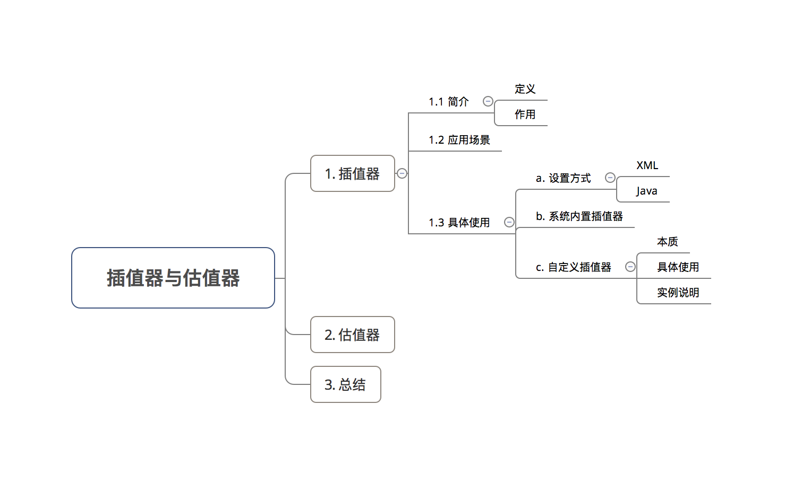

## Android动画-插值器与估值器

## 1、插值器（Interpolator）

1.1 简介

- 定义：一个接口

- 作用：设置属性值从初始值过渡到结束值的变化规律

		1）如匀速、加速 & 减速等等；
		2）即确定了动画效果变化的模式，如匀速变化、加速变化等等

1.2 应用场景

实现非线性运动的动画效果。

非线性运动：动画改变的速率不是一成不变的，如加速 & 减速运动都属于非线性运动。

1.3 具体使用

插值器在动画的使用有两种方式：在XML / Java代码中设置：

**设置方法1：在 动画效果的XML代码中设置插值器属性android:interpolator**

	<?xml version="1.0" encoding="utf-8"?>
	<scale xmlns:android="http://schemas.android.com/apk/res/android"
	
	    android:interpolator="@android:anim/overshoot_interpolator"
	    // 通过资源ID设置插值器
	    android:duration="3000"
	    android:fromXScale="0.0"
	    android:fromYScale="0.0"
	    android:pivotX="50%"
	    android:pivotY="50%"
	    android:toXScale="2"
	    android:toYScale="2" />

**设置方法2：在Java代码中设置**

	Button mButton = (Button) findViewById(R.id.Button);
	// 步骤1:创建 需要设置动画的 视图View
	
	Animation alphaAnimation = new AlphaAnimation(1,0);
	// 步骤2：创建透明度动画的对象 & 设置动画效果
	
	alphaAnimation.setDuration(3000);
	Interpolator overshootInterpolator = new OvershootInterpolator();
	// 步骤3：创建对应的插值器类对象
	
	alphaAnimation.setInterpolator(overshootInterpolator);
	// 步骤4：给动画设置插值器
	
	mButton.startAnimation(alphaAnimation);
	// 步骤5：播放动画

**b. 系统内置插值器类型**

Android内置了 9 种内置的插值器实现：

<table cellspacing="0">
	<tr>
		<td>作用</td>	
		<td>资源ID</td>	
		<td>对应的Java类</td>
	</tr>
	<tr>
		<td>动画加速进行</td>
		<td>@android:anim/accelerate_interpolator</td>
		<td>AccelerateInterpolator</td>
	</tr>
	<tr>
		<td>快速完成动画，超出再回到结束样式</td>
		<td>@android:anim/overshoot_interpolator</td>
		<td>OvershootInterpolator</td>
	</tr>
	<tr>
		<td>先加速再减速</td>
		<td>@android:anim/accelerate_decelerate_interpolator</td>
		<td>AccelerateDecelerateInterpolator</td>
	</tr>
	<tr>
		<td>先退后再加速前进</td>
		<td>@android:anim/anticipate_interpolator</td>
		<td>AnticipateInterpolator</td>
	</tr>
	<tr>
		<td>先退后再加速前进，超出终点后再回终点</td>
		<td>@android:anim/anticipate_overshoot_interpolator</td>
		<td>AnticipateOvershootInterpolator</td>
	</tr>
	<tr>
		<td>最后阶段弹球效果</td>	
		<td>@android:anim/bounce_interpolator</td>	
		<td>BounceInterpolator</td>
	</tr>
	<tr>
		<td>周期运动</td>	
		<td>@android:anim/cycle_interpolator</td>	
		<td>CycleInterpolator</td>
	</tr>
	<tr>
		<td>减速</td>	
		<td>@android:anim/decelerate_interpolator</td>	
		<td>DecelerateInterpolator</td>
	</tr>
	<tr>
		<td>匀速</td>	
		<td>@android:anim/linear_interpolator</td>	
		<td>LinearInterpolator</td>
	</tr>	
</table>

使用时：

	当在XML文件设置插值器时，只需传入对应的插值器资源ID即可;
	当在Java代码设置插值器时，只需创建对应的插值器对象即可;

系统默认的插值器是AccelerateDecelerateInterpolator，即先加速后减速。

**c.自定义插值器**

本质：根据动画的进度（0%-100%）计算出当前属性值改变的百分比；

具体使用：自定义插值器需要实现 Interpolator / TimeInterpolator接口 & 复写getInterpolation（）

	1）补间动画 实现 Interpolator接口；属性动画实现TimeInterpolator接口；
	2）TimeInterpolator接口是属性动画中新增的，用于兼容Interpolator接口，
	这使得所有过去的Interpolator实现类都可以直接在属性动画使用。

在学习自定义插值器前，我们先来看两个已经实现好的系统内置差值器：

匀速插值器：LinearInterpolator

	@HasNativeInterpolator  
	public class LinearInterpolator extends BaseInterpolator implements NativeInterpolatorFactory {  
	   // 仅贴出关键代码
	  ...
	    public float getInterpolation(float input) {  
	        return input;  
	        // 没有对input值进行任何逻辑处理，直接返回
	        // 即input值 = fraction值
	        // 因为input值是匀速增加的，因此fraction值也是匀速增加的，所以动画的运动情况也是匀速的，所以是匀速插值器
	    }
	}

先加速再减速 插值器：AccelerateDecelerateInterpolator

	@HasNativeInterpolator  
	public class AccelerateDecelerateInterpolator implements Interpolator, NativeInterpolatorFactory {  
	      // 仅贴出关键代码
	  ...
	    public float getInterpolation(float input) {  
	        return (float)(Math.cos((input + 1) * Math.PI) / 2.0f) + 0.5f;
	        // input的运算逻辑如下：
	        // 使用了余弦函数，因input的取值范围是0到1，那么cos函数中的取值范围就是π到2π。
	        // 而cos(π)的结果是-1，cos(2π)的结果是1
	        // 所以该值除以2加上0.5后，getInterpolation()方法最终返回的结果值还是在0到1之间。只不过经过了余弦运算之后，最终的结果不再是匀速增加的了，而是经历了一个先加速后减速的过程
	        // 所以最终，fraction值 = 运算后的值 = 先加速后减速
	        // 所以该差值器是先加速再减速的
	    }  
	
	}

从上面看出，自定义插值器的关键在于：**对input值根据动画的进度（0%-100%）通过逻辑计算，计算出当前属性值改变的百分比。**

下面我将用一个实例来说明该如何自定义插值器：

- 目的：写一个自定义Interpolator：先减速后加速

步骤1：根据需求实现Interpolator接口

DecelerateAccelerateInterpolator.java

	public class DecelerateAccelerateInterpolator implements TimeInterpolator {
	
	    @Override
	    public float getInterpolation(float input) {
	        float result;
	        if (input <= 0.5) {
	            result = (float) (Math.sin(Math.PI * input)) / 2;
	            // 使用正弦函数来实现先减速后加速的功能，逻辑如下：
	            // 因为正弦函数初始弧度变化值非常大，刚好和余弦函数是相反的
	            // 随着弧度的增加，正弦函数的变化值也会逐渐变小，这样也就实现了减速的效果。
	            // 当弧度大于π/2之后，整个过程相反了过来，现在正弦函数的弧度变化值非常小，渐渐随着弧度继续增加，变化值越来越大，弧度到π时结束，这样从0过度到π，也就实现了先减速后加速的效果
	        } else {
	            result = (float) (2 - Math.sin(Math.PI * input)) / 2;
	        }
	        return result;
	        // 返回的result值 = 随着动画进度呈先减速后加速的变化趋势
	    }
	}

MainActivity.java

	mButton = (Button) findViewById(R.id.Button);
	// 创建动画作用对象：此处以Button为例
	
	float curTranslationX = mButton.getTranslationX();
	// 获得当前按钮的位置
	
	ObjectAnimator animator = ObjectAnimator.ofFloat(mButton, "translationX", curTranslationX, 300,curTranslationX);
	// 创建动画对象 & 设置动画
	// 表示的是:
	// 动画作用对象是mButton
	// 动画作用的对象的属性是X轴平移
	// 动画效果是:从当前位置平移到 x=1500 再平移到初始位置
	animator.setDuration(5000);
	animator.setInterpolator(new DecelerateAccelerateInterpolator());
	// 设置插值器
	animator.start();
	// 启动动画

 

## 2. 估值器（TypeEvaluator）

2.1 简介

- 定义：一个接口

- 作用：设置 属性值 从初始值过渡到结束值 的变化具体数值

		1)插值器（Interpolator）决定值的变化规律（匀速、加速blabla），
		即决定的是变化趋势；而接下来的具体变化数值则交给而估值器;
		2)属性动画特有的属性；

2.2 应用场景

协助插值器，实现非线性运动的动画效果。

2.3 具体使用

**a.设置方式**

	ObjectAnimator anim = ObjectAnimator.ofObject(myView2, "height", new Evaluator()，1，3);
	// 在第4个参数中传入对应估值器类的对象
	// 系统内置的估值器有3个：
	// IntEvaluator：以整型的形式从初始值 - 结束值 进行过渡
	// FloatEvaluator：以浮点型的形式从初始值 - 结束值 进行过渡
	// ArgbEvaluator：以Argb类型的形式从初始值 - 结束值 进行过渡

如果上述内置的估值器无法满足需求，还可以自定义估值器。

下面将介绍如何自定义插值器（Interpolator）

**b.自定义估值器**

- 本质：根据插值器计算出当前属性值改变的百分比 & 初始值 & 结束值，来计算当前属性具体的数值。

如：动画进行了50%（初始值=100，结束值=200 ），那么匀速插值器计算出了当前属性值改变的百分比是50%，那么估值器则负责计算当前属性值 = 100 + （200-100）x50% = 150.

- 具体使用：

自定义估值器需要实现 TypeEvaluator接口 & 复写evaluate()。

	public interface TypeEvaluator {  
	
	    public Object evaluate(float fraction, Object startValue, Object endValue) {  
		// 参数说明
		// fraction：插值器getInterpolation（）的返回值
		// startValue：动画的初始值
		// endValue：动画的结束值
	
	        ....// 估值器的计算逻辑
	
	        return xxx；
	        // 赋给动画属性的具体数值
	        // 使用反射机制改变属性变化
	
		// 特别注意
		// 那么插值器的input值 和 估值器fraction有什么关系呢？
		// 答：input的值决定了fraction的值：input值经过计算后传入到插值器的getInterpolation（），然后通过实现getInterpolation（）中的逻辑算法，根据input值来计算出一个返回值，而这个返回值就是fraction了
	    }  
	}

在学习自定义插值器前，我们先来看一个已经实现好的系统内置差值器：浮点型插值器：

FloatEvaluator

	public class FloatEvaluator implements TypeEvaluator {  
	// FloatEvaluator实现了TypeEvaluator接口
	
		// 重写evaluate()
	    public Object evaluate(float fraction, Object startValue, Object endValue) {  
			// 参数说明
			// fraction：表示动画完成度（根据它来计算当前动画的值）
			// startValue、endValue：动画的初始值和结束值
	        float startFloat = ((Number) startValue).floatValue();  
	        
	        return startFloat + fraction * (((Number) endValue).floatValue() - startFloat);  
	        // 初始值 过渡 到结束值 的算法是：
	        // 1. 用结束值减去初始值，算出它们之间的差值
	        // 2. 用上述差值乘以fraction系数
	        // 3. 再加上初始值，就得到当前动画的值
	    }  
	}

- 属性动画中的ValueAnimator.ofInt() & ValueAnimator.ofFloat()都具备系统内置的估值器，即FloatEvaluator & IntEvaluator；

- 但对于ValueAnimator.ofObject()，从上面的工作原理可以看出并没有系统默认实现，因为对对象的动画操作复杂 & 多样，系统无法知道如何从初始对象过度到结束对象；

- 因此，对于ValueAnimator.ofObject()，我们需自定义估值器（TypeEvaluator）来告知系统如何进行从初始对象过渡到结束对象的逻辑。

自定义实现的逻辑如下：

	// 实现TypeEvaluator接口
	public class ObjectEvaluator implements TypeEvaluator{  
	
		// 复写evaluate（）
		// 在evaluate（）里写入对象动画过渡的逻辑
	    @Override  
	    public Object evaluate(float fraction, Object startValue, Object endValue) {  
	        // 参数说明
	        // fraction：表示动画完成度（根据它来计算当前动画的值）
	        // startValue、endValue：动画的初始值和结束值
	
	        ... // 写入对象动画过渡的逻辑
	        
	        return value;  
	        // 返回对象动画过渡的逻辑计算后的值
	    }
	}

下面我将用实例说明 该如何自定义TypeEvaluator接口并通过ValueAnimator.ofObject（）实现动画效果。

- 实现的动画效果：一个圆从一个点移动到另外一个点。

步骤1：定义对象类

因为ValueAnimator.ofObject()是面向对象操作的，所以需要自定义对象类

本例需要操作的对象是圆的点坐标:Point.java

	public class Point {
	
	    // 设置两个变量用于记录坐标的位置
	    private float x;
	    private float y;
	
	    // 构造方法用于设置坐标
	    public Point(float x, float y) {
	        this.x = x;
	        this.y = y;
	    }
	
	    // get方法用于获取坐标
	    public float getX() {
	        return x;
	    }
	
	    public float getY() {
	        return y;
	    }
	}

步骤2：根据需求实现TypeEvaluator接口

实现TypeEvaluator接口的目的是自定义如何**从初始点坐标过渡到结束点坐标**；

本例实现的是一个从左上角到右下角的坐标过渡逻辑。

PointEvaluator.java

	// 实现TypeEvaluator接口
	public class PointEvaluator implements TypeEvaluator {
	
	    // 复写evaluate（）
	    // 在evaluate（）里写入对象动画过渡的逻辑
	    @Override
	    public Object evaluate(float fraction, Object startValue, Object endValue) {
	
	        // 将动画初始值startValue 和 动画结束值endValue 强制类型转换成Point对象
	        Point startPoint = (Point) startValue;
	        Point endPoint = (Point) endValue;
	
	        // 根据fraction来计算当前动画的x和y的值
	        float x = startPoint.getX() + fraction * (endPoint.getX() - startPoint.getX());
	        float y = startPoint.getY() + fraction * (endPoint.getY() - startPoint.getY());
	        
	        // 将计算后的坐标封装到一个新的Point对象中并返回
	        Point point = new Point(x, y);
	        return point;
	    }
	}

下面将讲解如何通过对 Point 对象进行动画操作，从而实现整个自定义View的动画效果。

步骤3：将属性动画作用到自定义View当中

MyView.java

	public class MyView extends View {
	    // 设置需要用到的变量
	    public static final float RADIUS = 70f;// 圆的半径 = 70
	    private Point currentPoint;// 当前点坐标
	    private Paint mPaint;// 绘图画笔
	    
	
	    // 构造方法(初始化画笔)
	    public MyView(Context context, AttributeSet attrs) {
	        super(context, attrs);
	        // 初始化画笔
	        mPaint = new Paint(Paint.ANTI_ALIAS_FLAG);
	        mPaint.setColor(Color.BLUE);
	    }
	
	    // 复写onDraw()从而实现绘制逻辑
	    // 绘制逻辑:先在初始点画圆,通过监听当前坐标值(currentPoint)的变化,每次变化都调用onDraw()重新绘制圆,从而实现圆的平移动画效果
	    @Override
	    protected void onDraw(Canvas canvas) {
	        // 如果当前点坐标为空(即第一次)
	        if (currentPoint == null) {
	            currentPoint = new Point(RADIUS, RADIUS);
	            // 创建一个点对象(坐标是(70,70))
	
	            // 在该点画一个圆:圆心 = (70,70),半径 = 70
	            float x = currentPoint.getX();
	            float y = currentPoint.getY();
	            canvas.drawCircle(x, y, RADIUS, mPaint);
	
	
	 			// (重点关注)将属性动画作用到View中
	            // 步骤1:创建初始动画时的对象点  & 结束动画时的对象点
	            Point startPoint = new Point(RADIUS, RADIUS);// 初始点为圆心(70,70)
	            Point endPoint = new Point(700, 1000);// 结束点为(700,1000)
	
	            // 步骤2:创建动画对象 & 设置初始值 和 结束值
	            ValueAnimator anim = ValueAnimator.ofObject(new PointEvaluator(), startPoint, endPoint);
	            // 参数说明
	            // 参数1：TypeEvaluator 类型参数 - 使用自定义的PointEvaluator(实现了TypeEvaluator接口)
	            // 参数2：初始动画的对象点
	            // 参数3：结束动画的对象点
	
	            // 步骤3：设置动画参数
	            anim.setDuration(5000);
	            // 设置动画时长
	
				// 步骤3：通过 值 的更新监听器，将改变的对象手动赋值给当前对象
				// 此处是将 改变后的坐标值对象 赋给 当前的坐标值对象
	            // 设置 值的更新监听器
	            // 即每当坐标值（Point对象）更新一次,该方法就会被调用一次
	            anim.addUpdateListener(new ValueAnimator.AnimatorUpdateListener() {
	                @Override
	                public void onAnimationUpdate(ValueAnimator animation) {
	                    currentPoint = (Point) animation.getAnimatedValue();
	                    // 将每次变化后的坐标值（估值器PointEvaluator中evaluate（）返回的Piont对象值）到当前坐标值对象（currentPoint）
	                    // 从而更新当前坐标值（currentPoint）
	
						// 步骤4：每次赋值后就重新绘制，从而实现动画效果
	                    invalidate();
	                    // 调用invalidate()后,就会刷新View,即才能看到重新绘制的界面,即onDraw()会被重新调用一次
	                    // 所以坐标值每改变一次,就会调用onDraw()一次
	                }
	            });
	
	            anim.start();
	            // 启动动画
	
	
	        } else {
	            // 如果坐标值不为0,则画圆
	            // 所以坐标值每改变一次,就会调用onDraw()一次,就会画一次圆,从而实现动画效果
	
	            // 在该点画一个圆:圆心 = (30,30),半径 = 30
	            float x = currentPoint.getX();
	            float y = currentPoint.getY();
	            canvas.drawCircle(x, y, RADIUS, mPaint);
	        }
	    }
	}

步骤4：在布局文件加入自定义View空间

activity_main.xml

	<?xml version="1.0" encoding="utf-8"?>
	<RelativeLayout xmlns:android="http://schemas.android.com/apk/res/android"
	    xmlns:tools="http://schemas.android.com/tools"
	    android:layout_width="match_parent"
	    android:layout_height="match_parent"
	    android:paddingBottom="@dimen/activity_vertical_margin"
	    android:paddingLeft="@dimen/activity_horizontal_margin"
	    android:paddingRight="@dimen/activity_horizontal_margin"
	    android:paddingTop="@dimen/activity_vertical_margin"
	    tools:context="scut.carson_ho.valueanimator_ofobject.MainActivity">
	
	    <com.jie.valueanimator_ofobject.MyView
	        android:layout_width="match_parent"
	        android:layout_height="match_parent"
	         />
	</RelativeLayout>

步骤5：在主代码文件设置显示视图

MainActivity.java

	public class MainActivity extends AppCompatActivity {
	
	    @Override
	    protected void onCreate(Bundle savedInstanceState) {
	        super.onCreate(savedInstanceState);
	        setContentView(R.layout.activity_main);
	    }
	}

