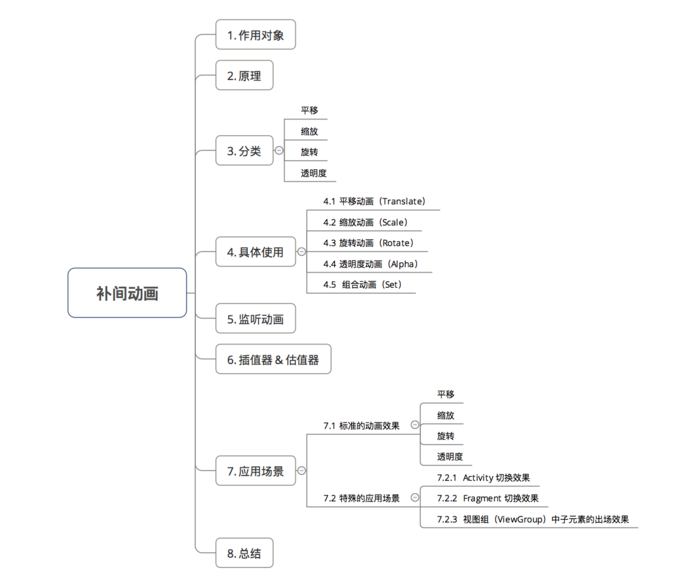

## Android 动画 -- 补间动画(tweenAnimation)

### 1、作用对象

视图控件（View）

	如Android的TextView、Button等等;
	不可作用于View组件的属性，如：颜色、背景、长度等等。

### 2、原理

通过确定开始的视图样式和结束的视图样式、中间动画变化过程由系统补全来确定一个动画。

	开始的、结束的视图样式：平移、缩放、旋转 & 透明度样式；

### 3、分类

根据不同的动画效果，补间动画分为4种动画，具体如下图：不同类型的动画对应于不同的子类。

### 4、具体使用

补间动画的使用方式分为两种：在XML 代码 / Java 代码里设置：

	前者优点：动画描述的可读性更好
	后者优点：动画效果可动态创建

#### 4.1、平移动画（Translate）

**a.设置方法1：在XML 代码中设置**

步骤1：在res/anim的文件夹里创建动画效果.xml文件;

步骤2：根据不同动画效果的语法,设置不同动画参数，从而实现动画效果;

平移动画效果设置具体如下：

view_animation.xml

	<?xml version="1.0" encoding="utf-8"?>
	// 采用<translate /> 标签表示平移动画
	<translate xmlns:android="http://schemas.android.com/apk/res/android"
	
		// 以下参数是4种动画效果的公共属性,即都有的属性
		android:duration="3000" // 动画持续时间（ms），必须设置，动画才有效果
		android:startOffset ="1000" // 动画延迟开始时间（ms）
		android:fillBefore = "true" // 动画播放完后，视图是否会停留在动画开始的状态，默认为true
		android:fillAfter = "false" // 动画播放完后，视图是否会停留在动画结束的状态，优先于fillBefore值，默认为false
		android:fillEnabled= "true" // 是否应用fillBefore值，对fillAfter值无影响，默认为true
		android:repeatMode= "restart" // 选择重复播放动画模式，restart代表正序重放，reverse代表倒序回放，默认为restart|
		android:repeatCount = "0" // 重放次数（所以动画的播放次数=重放次数+1），为infinite时无限重复
		android:interpolator = @[package:]anim/interpolator_resource // 插值器，即影响动画的播放速度,下面会详细讲
		
		// 以下参数是平移动画特有的属性
		android:fromXDelta="0" // 视图在水平方向x 移动的起始值
		android:toXDelta="500" // 视图在水平方向x 移动的结束值
		
		android:fromYDelta="0" // 视图在竖直方向y 移动的起始值
		android:toYDelta="500" // 视图在竖直方向y 移动的结束值
		/>

步骤3：在Java代码中创建Animation对象并播放动画;

	public class MainActivity extends AppCompatActivity {
	
	    @Override
	    protected void onCreate(Bundle savedInstanceState) {
	        super.onCreate(savedInstanceState);
	        setContentView(R.layout.activity_main);
	
	        Button mButton = (Button) findViewById(R.id.Button);
	        // 步骤1:创建需要设置动画的视图View
	        Animation translateAnimation = AnimationUtils.loadAnimation(this, R.anim.view_animation);
	        // 步骤2:创建动画对象,并传入设置的动画效果xml文件
	        mButton.startAnimation(translateAnimation);
	        // 步骤3:播放动画
		}
	}

**b.设置方法2：在Java代码中设置**

	Button mButton = (Button) findViewById(R.id.Button);
	// 步骤1:创建需要设置动画的视图View
	
	Animation translateAnimation = new TranslateAnimation(0，500，0，500);
	// 步骤2：创建平移动画的对象：平移动画对应的Animation子类为TranslateAnimation
	// 参数分别是：
	// 1. fromXDelta ：视图在水平方向x移动的起始值
	// 2. toXDelta ：视图在水平方向x移动的结束值
	// 3. fromYDelta ：视图在竖直方向y移动的起始值
	// 4. toYDelta：视图在竖直方向y移动的结束值
	
	translateAnimation.setDuration(3000);
	// 固定属性的设置都是在其属性前加“set”，如setDuration（）
	mButton.startAnimation(translateAnimation);
	// 步骤3:播放动画

#### 4.2 缩放动画（Scale）

**a.设置方法1：在XML代码中设置**

设置：

	<?xml version="1.0" encoding="utf-8"?>
	// 采用<scale/> 标签表示是缩放动画
	<scale  xmlns:android="http://schemas.android.com/apk/res/android"
	
	    // 以下参数是4种动画效果的公共属性,即都有的属性
	    android:duration="3000" // 动画持续时间（ms），必须设置，动画才有效果
	    android:startOffset ="1000" // 动画延迟开始时间（ms）
	    android:fillBefore = “true” // 动画播放完后，视图是否会停留在动画开始的状态，默认为true
	    android:fillAfter = “false” // 动画播放完后，视图是否会停留在动画结束的状态，优先于fillBefore值，默认为false
	    android:fillEnabled= “true” // 是否应用fillBefore值，对fillAfter值无影响，默认为true
	    android:repeatMode= “restart” // 选择重复播放动画模式，restart代表正序重放，reverse代表倒序回放，默认为restart|
	    android:repeatCount = “0” // 重放次数（所以动画的播放次数=重放次数+1），为infinite时无限重复
	    android:interpolator = @[package:]anim/interpolator_resource // 插值器，即影响动画的播放速度,下面会详细讲
	    
	    // 以下参数是缩放动画特有的属性
	    android:fromXScale="0.0" 
	    // 动画在水平方向X的起始缩放倍数
	    // 0.0表示收缩到没有；1.0表示正常无伸缩
	    // 值小于1.0表示收缩；值大于1.0表示放大
	
	    android:toXScale="2"  //动画在水平方向X的结束缩放倍数
	
	    android:fromYScale="0.0" //动画开始前在竖直方向Y的起始缩放倍数
	    android:toYScale="2" //动画在竖直方向Y的结束缩放倍数
	
	    android:pivotX="50%" // 缩放轴点的x坐标
	    android:pivotY="50%" // 缩放轴点的y坐标
	    // 轴点 = 视图缩放的中心点
	
	    // pivotX pivotY,可取值为数字，百分比，或者百分比p
	    // 设置为数字时（如50），轴点为View的左上角的原点在x方向和y方向加上50px的点。在Java代码里面设置这个参数的对应参数是Animation.ABSOLUTE。
	    // 设置为百分比时（如50%），轴点为View的左上角的原点在x方向加上自身宽度50%和y方向自身高度50%的点。在Java代码里面设置这个参数的对应参数是Animation.RELATIVE_TO_SELF。
	    // 设置为百分比p时（如50%p），轴点为View的左上角的原点在x方向加上父控件宽度50%和y方向父控件高度50%的点。在Java代码里面设置这个参数的对应参数是Animation.RELATIVE_TO_PARENT
	
	    // 两个50%表示动画从自身中间开始，具体如下图
	
	    />

使用：

	Button mButton = (Button) findViewById(R.id.Button);
	// 步骤1:创建需要设置动画的视图View
	Animation rotateAnimation = AnimationUtils.loadAnimation(this, R.anim.view_animation);
	// 步骤2:创建动画对象，并传入设置的动画效果xml文件
	mButton.startAnimation(scaleAnimation);
	// 步骤3:播放动画

**b.设置方法2：在 Java 代码中设置**

	Button mButton = (Button) findViewById(R.id.Button);
	// 步骤1:创建 需要设置动画的 视图View
	
	Animation rotateAnimation = new ScaleAnimation(0,2,0,2,Animation.RELATIVE_TO_SELF,0.5f,Animation.RELATIVE_TO_SELF,0.5f);
	// 步骤2：创建缩放动画的对象 & 设置动画效果：缩放动画对应的Animation子类为RotateAnimation
	// 参数说明:
	// 1. fromX ：动画在水平方向X的结束缩放倍数
	// 2. toX ：动画在水平方向X的结束缩放倍数
	// 3. fromY ：动画开始前在竖直方向Y的起始缩放倍数
	// 4. toY：动画在竖直方向Y的结束缩放倍数
	// 5. pivotXType:缩放轴点的x坐标的模式
	// 6. pivotXValue:缩放轴点x坐标的相对值
	// 7. pivotYType:缩放轴点的y坐标的模式
	// 8. pivotYValue:缩放轴点y坐标的相对值
	
	// pivotXType = Animation.ABSOLUTE:缩放轴点的x坐标 =  View左上角的原点 在x方向 加上 pivotXValue数值的点(y方向同理)
	// pivotXType = Animation.RELATIVE_TO_SELF:缩放轴点的x坐标 = View左上角的原点 在x方向 加上 自身宽度乘上pivotXValue数值的值(y方向同理)
	// pivotXType = Animation.RELATIVE_TO_PARENT:缩放轴点的x坐标 = View左上角的原点 在x方向 加上 父控件宽度乘上pivotXValue数值的值 (y方向同理)
	scaleAnimation.setDuration(3000);
	// 固定属性的设置都是在其属性前加“set”，如setDuration（）
	mButton.startAnimation(scaleAnimation);
	// 步骤3：播放动画

#### 4.3 旋转动画（Rotate）

**a.设置方法1：在XML 代码中设置**

设置：

	<?xml version="1.0" encoding="utf-8"?>
	// 采用<rotate/> 标签表示是旋转动画
	<rotate xmlns:android="http://schemas.android.com/apk/res/android"
	
	    // 以下参数是4种动画效果的公共属性,即都有的属性
	    android:duration="3000" // 动画持续时间（ms），必须设置，动画才有效果
	    android:startOffset ="1000" // 动画延迟开始时间（ms）
	    android:fillBefore = “true” // 动画播放完后，视图是否会停留在动画开始的状态，默认为true
	    android:fillAfter = “false” // 动画播放完后，视图是否会停留在动画结束的状态，优先于fillBefore值，默认为false
	    android:fillEnabled= “true” // 是否应用fillBefore值，对fillAfter值无影响，默认为true
	    android:repeatMode= “restart” // 选择重复播放动画模式，restart代表正序重放，reverse代表倒序回放，默认为restart|
	    android:repeatCount = “0” // 重放次数（所以动画的播放次数=重放次数+1），为infinite时无限重复
	    android:interpolator = @[package:]anim/interpolator_resource // 插值器，即影响动画的播放速度,下面会详细讲
	    
	    // 以下参数是旋转动画特有的属性
	    android:duration="1000"
	    android:fromDegrees="0" // 动画开始时 视图的旋转角度(正数 = 顺时针，负数 = 逆时针)
	    android:toDegrees="270" // 动画结束时 视图的旋转角度(正数 = 顺时针，负数 = 逆时针)
	    android:pivotX="50%" // 旋转轴点的x坐标
	    android:pivotY="0" // 旋转轴点的y坐标
	    // 轴点 = 视图缩放的中心点
	
		// pivotX pivotY,可取值为数字，百分比，或者百分比p
	    // 设置为数字时（如50），轴点为View的左上角的原点在x方向和y方向加上50px的点。在Java代码里面设置这个参数的对应参数是Animation.ABSOLUTE。
	    // 设置为百分比时（如50%），轴点为View的左上角的原点在x方向加上自身宽度50%和y方向自身高度50%的点。在Java代码里面设置这个参数的对应参数是Animation.RELATIVE_TO_SELF。
	    // 设置为百分比p时（如50%p），轴点为View的左上角的原点在x方向加上父控件宽度50%和y方向父控件高度50%的点。在Java代码里面设置这个参数的对应参数是Animation.RELATIVE_TO_PARENT
	    // 两个50%表示动画从自身中间开始，具体如下图
	
	    />

使用：

	Button mButton = (Button) findViewById(R.id.Button);
	// 步骤1:创建 需要设置动画的 视图View
	Animation scaleAnimation = AnimationUtils.loadAnimation(this, R.anim.view_animation);
	// 步骤2:创建 动画对象 并传入设置的动画效果xml文件
	mButton.startAnimation(scaleAnimation);
	// 步骤3:播放动画

**b.设置方法2：在 Java 代码中设置**

	Button mButton = (Button) findViewById(R.id.Button);
	// 步骤1:创建 需要设置动画的 视图View
	
	Animation rotateAnimation = new RotateAnimation(0,270,Animation.RELATIVE_TO_SELF,0.5f,Animation.RELATIVE_TO_SELF,0.5f);
	// 步骤2：创建旋转动画的对象 & 设置动画效果：旋转动画对应的Animation子类为RotateAnimation
	// 参数说明:
	// 1. fromDegrees ：动画开始时 视图的旋转角度(正数 = 顺时针，负数 = 逆时针)
	// 2. toDegrees ：动画结束时 视图的旋转角度(正数 = 顺时针，负数 = 逆时针)
	// 3. pivotXType：旋转轴点的x坐标的模式
	// 4. pivotXValue：旋转轴点x坐标的相对值
	// 5. pivotYType：旋转轴点的y坐标的模式
	// 6. pivotYValue：旋转轴点y坐标的相对值
	
	// pivotXType = Animation.ABSOLUTE:旋转轴点的x坐标 =  View左上角的原点 在x方向 加上 pivotXValue数值的点(y方向同理)
	// pivotXType = Animation.RELATIVE_TO_SELF:旋转轴点的x坐标 = View左上角的原点 在x方向 加上 自身宽度乘上pivotXValue数值的值(y方向同理)
	// pivotXType = Animation.RELATIVE_TO_PARENT:旋转轴点的x坐标 = View左上角的原点 在x方向 加上 父控件宽度乘上pivotXValue数值的值 (y方向同理)
	
	rotateAnimation.setDuration(3000);
	// 固定属性的设置都是在其属性前加“set”，如setDuration（）
	mButton.startAnimation(rotateAnimation);
	// 步骤3：播放动画

#### 4.4 透明度动画（Alpha）

**a.设置方法1：在XML 代码中设置**

设置：

	<?xml version="1.0" encoding="utf-8"?>
	// 采用<alpha/> 标签表示是透明度动画
	<alpha xmlns:android="http://schemas.android.com/apk/res/android"
	
	    // 以下参数是4种动画效果的公共属性,即都有的属性
	    android:duration="3000" // 动画持续时间（ms），必须设置，动画才有效果
	    android:startOffset ="1000" // 动画延迟开始时间（ms）
	    android:fillBefore = "true" // 动画播放完后，视图是否会停留在动画开始的状态，默认为true
	    android:fillAfter = "false" // 动画播放完后，视图是否会停留在动画结束的状态，优先于fillBefore值，默认为false
	    android:fillEnabled= "true" // 是否应用fillBefore值，对fillAfter值无影响，默认为true
	    android:repeatMode= "restart" // 选择重复播放动画模式，restart代表正序重放，reverse代表倒序回放，默认为restart|
	    android:repeatCount = "0" // 重放次数（所以动画的播放次数=重放次数+1），为infinite时无限重复
	    android:interpolator = @[package:]anim/interpolator_resource // 插值器，即影响动画的播放速度,下面会详细讲
	    
	    // 以下参数是透明度动画特有的属性
	    android:fromAlpha="1.0" // 动画开始时视图的透明度(取值范围: -1 ~ 1)
	    android:toAlpha="0.0"// 动画结束时视图的透明度(取值范围: -1 ~ 1)
	
	    />

使用：

	Button mButton = (Button) findViewById(R.id.Button);
	// 步骤1:创建 需要设置动画的 视图View
	Animation alphaAnimation = AnimationUtils.loadAnimation(this, R.anim.view_animation);
	// 步骤2:创建 动画对象 并传入设置的动画效果xml文件
	mButton.startAnimation(alphaAnimation);
	// 步骤3:播放动画

**b.设置方法2：在 Java 代码中设置**

	Button mButton = (Button) findViewById(R.id.Button);
	// 步骤1:创建 需要设置动画的 视图View
	
	Animation alphaAnimation = new AlphaAnimation(1,0);
	// 步骤2：创建透明度动画的对象 & 设置动画效果：透明度动画对应的Animation子类为AlphaAnimation
	// 参数说明:
	// 1. fromAlpha:动画开始时视图的透明度(取值范围: -1 ~ 1)
	// 2. toAlpha:动画结束时视图的透明度(取值范围: -1 ~ 1)
	
	alphaAnimation.setDuration(3000);
	// 固定属性的设置都是在其属性前加“set”，如setDuration（）
	mButton.startAnimation(alphaAnimation);
	// 步骤3：播放动画

#### 4.5 组合动画

上面讲的都是单个动画效果；而实际中很多需求都需要同时使用平移、缩放、旋转 & 透明度4种动画，即组合动画。

使用组合动画需要用到标签 <Set/>。

4.5.1 在XML 代码中设置

设置：

	<?xml version="1.0" encoding="utf-8"?>
	// 采用< Set/>标签
	<set xmlns:android="http://schemas.android.com/apk/res/android">
	
	// 组合动画同样具备公共属性
	    android:duration="3000" // 动画持续时间（ms），必须设置，动画才有效果
	    android:startOffset ="1000" // 动画延迟开始时间（ms）
	    android:fillBefore = “true” // 动画播放完后，视图是否会停留在动画开始的状态，默认为true
	    android:fillAfter = “false” // 动画播放完后，视图是否会停留在动画结束的状态，优先于fillBefore值，默认为false
	    android:fillEnabled= “true” // 是否应用fillBefore值，对fillAfter值无影响，默认为true
	    android:repeatMode= “restart” // 选择重复播放动画模式，restart代表正序重放，reverse代表倒序回放，默认为restart|
	    android:repeatCount = “0” // 重放次数（所以动画的播放次数=重放次数+1），为infinite时无限重复
	    android:interpolator = @[package:]anim/interpolator_resource // 插值器，即影响动画的播放速度,下面会详细讲
	    
	// 组合动画独特的属性
	    android:shareinterpolator = “true”
	    // 表示组合动画中的动画是否和集合共享同一个差值器
	    // 如果集合不指定插值器，那么子动画需要单独设置
	
	// 组合动画播放时是全部动画同时开始
	// 如果想不同动画不同时间开始就要使用android:startOffset属性来延迟单个动画播放时间
	
	// 设置旋转动画，语法同单个动画
	    <rotate
	        android:duration="1000"
	        android:fromDegrees="0"
	        android:toDegrees="360"
	        android:pivotX="50%"
	        android:pivotY="50%"
	        android:repeatMode="restart"
	        android:repeatCount="infinite"
	        />
	
	// 设置平移动画，语法同单个动画
	    <translate
	        android:duration="10000"
	        android:startOffset = “1000”// 延迟该动画播放时间
	        android:fromXDelta="-50%p"
	        android:fromYDelta="0"
	        android:toXDelta="50%p"
	        android:toYDelta="0" />
	
	// 设置透明度动画，语法同单个动画
	    <alpha
	        android:startOffset="7000"
	        android:duration="3000"
	        android:fromAlpha="1.0"
	        android:toAlpha="0.0" />
	
	
	// 设置缩放动画，语法同单个动画
	    <scale
	        android:startOffset="4000"
	        android:duration="1000"
	        android:fromXScale="1.0"
	        android:fromYScale="1.0"
	        android:pivotX="50%"
	        android:pivotY="50%"
	        android:toXScale="0.5"
	        android:toYScale="0.5" />
	// 特别注意：
	// 1. 在组合动画里scale缩放动画设置的repeatCount（重复播放）和fillBefore（播放完后，视图是否会停留在动画开始的状态）是无效的。
	// 2. 所以如果需要重复播放或者回到原位的话需要在set标签里设置
	// 3. 但是由于此处rotate旋转动画里已设置repeatCount为infinite，所以动画不会结束，也就看不到重播和回复原位
	
	</set>

使用：

	Button mButton = (Button) findViewById(R.id.Button);
	// 步骤1:创建 需要设置动画的 视图View
	Animation translateAnimation = AnimationUtils.loadAnimation(this, R.anim.view_animation);
	// 步骤2:创建 动画对象 并传入设置的动画效果xml文件
	mButton.startAnimation(translateAnimation);
	// 步骤3:播放动画

4.5.2 在 Java 代码中设置

	Button mButton = (Button) findViewById(R.id.Button);
	// 创建 需要设置动画的 视图View
	
	// 组合动画设置
	AnimationSet setAnimation = new AnimationSet(true);
	// 步骤1:创建组合动画对象(设置为true)
	
	// 步骤2:设置组合动画的属性
	// 特别说明以下情况
	// 因为在下面的旋转动画设置了无限循环(RepeatCount = INFINITE)
	// 所以动画不会结束，而是无限循环
	// 所以组合动画的下面两行设置是无效的
	setAnimation.setRepeatMode(Animation.RESTART);
	setAnimation.setRepeatCount(1);// 设置了循环一次,但无效
	
	// 步骤3:逐个创建子动画(方式同单个动画创建方式,此处不作过多描述)
	
	// 子动画1:旋转动画
	Animation rotate = new RotateAnimation(0,360,Animation.RELATIVE_TO_SELF,0.5f,Animation.RELATIVE_TO_SELF,0.5f);
	rotate.setDuration(1000);
	rotate.setRepeatMode(Animation.RESTART);
	rotate.setRepeatCount(Animation.INFINITE);
	
	// 子动画2:平移动画
	Animation translate = new TranslateAnimation(TranslateAnimation.RELATIVE_TO_PARENT,-0.5f,
	        TranslateAnimation.RELATIVE_TO_PARENT,0.5f,
	        TranslateAnimation.RELATIVE_TO_SELF,0
	        ,TranslateAnimation.RELATIVE_TO_SELF,0);
	translate.setDuration(10000);
	
	// 子动画3:透明度动画
	Animation alpha = new AlphaAnimation(1,0);
	alpha.setDuration(3000);
	alpha.setStartOffset(7000);
	
	// 子动画4:缩放动画
	Animation scale1 = new ScaleAnimation(1,0.5f,1,0.5f,Animation.RELATIVE_TO_SELF,0.5f,Animation.RELATIVE_TO_SELF,0.5f);
	scale1.setDuration(1000);
	scale1.setStartOffset(4000);
	
	// 步骤4:将创建的子动画添加到组合动画里
	setAnimation.addAnimation(alpha);
	setAnimation.addAnimation(rotate);
	setAnimation.addAnimation(translate);
	setAnimation.addAnimation(scale1);
	
	mButton.startAnimation(setAnimation);
	// 步骤5:播放动画

### 5、监听动画

Animation类通过监听动画开始 / 结束 / 重复时刻来进行一系列操作，如跳转页面等等。

通过在 Java 代码里setAnimationListener()方法设置：

	Animation.setAnimationListener(new Animation.AnimationListener() {
	    @Override
	    public void onAnimationStart(Animation animation) {
	        // 动画开始时回调
	    }
	
	    @Override
	    public void onAnimationEnd(Animation animation) {
	        // 动画结束时回调
	    }
	
	    @Override
	    public void onAnimationRepeat(Animation animation) {
	        //动画重复执行的时候回调
	    }
	});

**特别注意：**

若采取上述方法监听动画，每次监听都必须重写4个方法。

	背景：有些时候我们并不需要监听动画的所有时刻；
	问题：但上述方式是必须需要重写4个时刻的方法，这显示太累赘；
	解决方案：采用动画适配器AnimatorListenerAdapter，解决实现接口繁琐的问题。

具体如下：

	anim.addListener(new AnimatorListenerAdapter() {  
	// 向addListener()方法中传入适配器对象AnimatorListenerAdapter()
	// 由于AnimatorListenerAdapter中已经实现好每个接口
	// 所以这里不实现全部方法也不会报错
	    @Override  
	    public void onAnimationStart(Animator animation) {  
	    // 如想只想监听动画开始时刻，就只需要单独重写该方法就可以
	    }  
	});

### 6、插值器 & 估值器

[Android动画-插值器与估值器](./images/Android动画-插值器与估值器.md)

### 7、应用场景

7.1 标准的动画效果

补间动画常用于视图View的一些标准动画效果：平移、旋转、缩放 & 透明度；
除了常规的动画使用，补间动画还有一些特殊的应用场景。

7.2 特殊的应用场景

	Activity 的切换效果
	Fragement 的切换效果
	视图组（ViewGroup）中子元素的出场效果

7.2.1 Activity 的切换效果

即 Activity 启动 / 退出时的动画效果

a.启动动画

	Intent intent = new Intent(this,Acvtivity.class);
	startActivity(intent);
	overridePendingTransition(R.anim.enter_anim,R.anim.exit_anim);
	// 采用overridePendingTransition（int enterAnim, int exitAnim）进行设置
	// enterAnim：从Activity a跳转到Activity b，进入b时的动画效果资源ID
	// exitAnim：从Activity a跳转到Activity b，离开a时的动画效果资源Id
	
	// 特别注意
	// overridePendingTransition()必须要在startActivity(intent)后被调用才能生效

b.退出动画

	@Override
	public void finish(){
	    super.finish();
	    
	    overridePendingTransition(R.anim.enter_anim,R.anim.exit_anim);
		// 采用overridePendingTransition（int enterAnim, int exitAnim）进行设置
		// enterAnim：从Activity a跳转到Activity b，进入b时的动画效果资源ID
		// exitAnim：从Activity a跳转到Activity b，离开a时的动画效果资源Id
		
		// 特别注意
		// overridePendingTransition()必须要在finish()后被调用才能生效
	
	}

对于参数 enterAnim & exitAnim 的资源ID，系统有自带的效果android.R.anim.xxx，如下设置：

	Intent intent = new Intent(MainActivity.this, SecActivity.class);
	startActivity(intent);
	// 淡入淡出的动画效果      
	overridePendingTransition(android.R.anim.fade_in, android.R.anim.fade_out);
	// 从左向右滑动的效果
	overridePendingTransition(android.R.anim.slide_in_left, android.R.anim.slide_out_right);

除了使用系统自带的切换效果，还可以自定义Activity的切换效果：

a.自定义淡入淡出效果

fade_in.xml（淡入）
	
	<?xml version="1.0" encoding="utf-8"?>  
	<set xmlns:android="http://schemas.android.com/apk/res/android" >  
	  
	    <alpha  
	        android:duration="1500"  
	        android:fromAlpha="0.0"  
	        android:toAlpha="1.0" />  
	  
	</set>

fade_out.xml（淡出）

	<?xml version="1.0" encoding="utf-8"?>  
	<set xmlns:android="http://schemas.android.com/apk/res/android" >  
	  
	    <alpha  
	        android:duration="1500"  
	        android:fromAlpha="1.0"  
	        android:toAlpha="0.0" />  
	  
	</set>

在Java代码中设置:

	Intent intent = new Intent(MainActivity.this, SecActivity.class);
	startActivity(intent);
	// 自定义的淡入淡出动画效果      
	overridePendingTransition(R.anim.fade_in, R.anim.fade_out);

b. 自定义左右滑动效果

先了解 Activity 的位置信息，如下图:

从右滑到左:

	out_to_left.xml

	<?xml version="1.0" encoding="utf-8"?>
	<set xmlns:android="http://schemas.android.com/apk/res/android"
	    >
	    <translate
	        android:duration="500"
	        android:fromXDelta="0%p"
	        android:toXDelta="-100%p"
	
	         />
	</set>

	in_from_right.xml

	<?xml version="1.0" encoding="utf-8"?>
	<set xmlns:android="http://schemas.android.com/apk/res/android"
	    >
	    <translate
	        android:duration="500"
	        android:fromXDelta="100%p"
	        android:toXDelta="0%p"
	
	        />
	</set>

在Java代码中设置效果：

	Intent intent = new Intent(MainActivity.this, SecActivity.class);
	startActivity(intent)
	// 自定义 从右向左滑动的效果
	overridePendingTransition(R.anim.in_from_right, R.anim.out_to_left);

7.2.2 Fragment动画切换效果

系统自带的动画切换效果：

	FragmentTransaction fragmentTransaction = mFragmentManager.beginTransaction();
	fragmentTransaction.setTransition(int transit)；
	// 通过setTransition(int transit)进行设置
	// transit参数说明
	// 1. FragmentTransaction.TRANSIT_NONE：无动画
	// 2. FragmentTransaction.TRANSIT_FRAGMENT_OPEN：标准的打开动画效果
	// 3. FragmentTransaction.TRANSIT_FRAGMENT_CLOSE：标准的关闭动画效果
	
	// 标准动画设置好后，在Fragment添加和移除的时候都会有。

自定义动画效果：

	// 采用`FragmentTransavtion`的 `setCustomAnimations（）`进行设置
	FragmentTransaction fragmentTransaction = mFragmentManager.beginTransaction();
	fragmentTransaction.setCustomAnimations(R.anim.in_from_right,R.anim.out_to_left);
	// 此处的自定义动画效果同Activity，此处不再过多描述

7.2.3 视图组（ViewGroup）中子元素的出场效果

视图组（ViewGroup）中子元素可以具备出场时的补间动画效果

常用需求场景：为ListView的 item 设置出场动画

步骤1：设置子元素的出场动画

	view_animation.xm

	<?xml version="1.0" encoding="utf-8"?>
	// 此处采用了组合动画
	<set xmlns:android="http://schemas.android.com/apk/res/android" >
	    android:duration="3000"
	
	    <alpha
	        android:duration="1500"
	        android:fromAlpha="1.0"
	        android:toAlpha="0.0" />
	
	    <translate
	        android:fromXDelta="500"
	        android:toXDelta="0"
	         />
	</set>

步骤2：设置视图组（ViewGroup）的动画文件

	anim_layout.xml

	<?xml version="1.0" encoding="utf-8"?>
	// 采用LayoutAnimation标签
	<layoutAnimation xmlns:android="http://schemas.android.com/apk/res/android"
	    android:delay="0.5"
	    // 子元素开始动画的时间延迟
	    // 如子元素入场动画的时间总长设置为300ms
	    // 那么 delay = "0.5" 表示每个子元素都会延迟150ms才会播放动画效果
	    // 第一个子元素延迟150ms播放入场效果；第二个延迟300ms，以此类推
	
	    android:animationOrder="normal"
	    // 表示子元素动画的顺序
	    // 可设置属性为：
	    // 1. normal ：顺序显示，即排在前面的子元素先播放入场动画
	    // 2. reverse：倒序显示，即排在后面的子元素先播放入场动画
	    // 3. random：随机播放入场动画
	
	    android:animation="@anim/view_animation"
	    // 设置入场的具体动画效果
	    // 将步骤1的子元素出场动画设置到这里
	    />

步骤3：为视图组（ViewGroup）指定andorid:layoutAnimation属性

指定的方式有两种： XML / Java代码设置

方式1：在 XML 中指定

	<?xml version="1.0" encoding="utf-8"?>
	<LinearLayout xmlns:android="http://schemas.android.com/apk/res/android"
	    xmlns:tools="http://schemas.android.com/tools"
	    android:layout_width="match_parent"
	    android:layout_height="match_parent"
	    android:background="#FFFFFF"
	    android:orientation="vertical" >
	    <ListView
	        android:id="@+id/listView1"
	        android:layoutAnimation="@anim/anim_layout"
	        // 指定layoutAnimation属性用以指定子元素的入场动画
	        android:layout_width="match_parent"
	        android:layout_height="match_parent" />
	</LinearLayout>

方式2：在Java代码中指定

> 这样就不用额外设置res/ anim /anim_layout.xml该xml文件了

	ListView lv = (ListView) findViewById(R.id.listView1);
	
	Animation animation = AnimationUtils.loadAnimation(this,R.anim.anim_item);
	// 加载子元素的出场动画
	
	LayoutAnimationController controller = new LayoutAnimationController(animation);
	controller.setDelay(0.5f);
	controller.setOrder(LayoutAnimationController.ORDER_NORMAL);
	// 设置LayoutAnimation的属性
	
	lv.setLayoutAnimation(controller);
	// 为ListView设置LayoutAnimation的属性

## 参考文档 vs 面试题

[Android动画-补间动画](https://www.jianshu.com/p/733532041f46)

[插值器与估值器](https://www.jianshu.com/p/2f19fe1e3ca1)

[酷炫的Activity切换动画](https://www.jianshu.com/p/37e94f8b6f59)