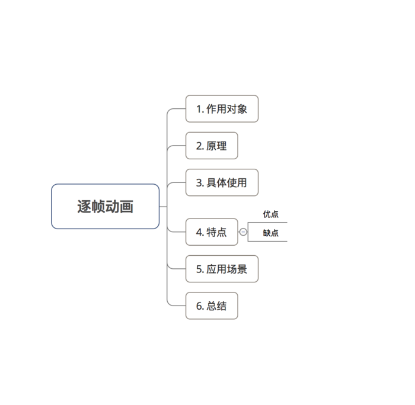

## Android动画-逐帧动画

### 1、作用对象

视图控件（View）

	如Android的TextView、Button等等；
	不可作用于View组件的属性，如：颜色、背景、长度等等；

### 2、原理

- 将动画拆分为 帧 的形式，且定义每一帧 = 每一张图片。

- 逐帧动画的本质：按序播放一组预先定义好的图片。

### 3、具体使用

步骤1：将动画资源（即每张图片资源）放到 drawable文件夹里

技巧：

	找到自己需要的gif动画；
	用gif分解软件（如 GifSplitter）将gif分解成一张张图片即可；

步骤2：设置 & 启动 动画

设置 & 启动 逐帧动画有两种方式：在XML / Java代码。

**a.方式1：XML实现**

设置：

	knight_attack.xml

	<?xml version="1.0" encoding="utf-8"?>
	<animation-list
	    xmlns:android="http://schemas.android.com/apk/res/android"
	    android:oneshot="true" // 设置是否只播放一次，默认为false
	    >
	
		// item = 动画图片资源；duration = 设置一帧持续时间(ms)
	    <item android:drawable="@drawable/a0" android:duration="100"/>
	    <item android:drawable="@drawable/a1" android:duration="100"/>
	    <item android:drawable="@drawable/a2" android:duration="100"/>
	    <item android:drawable="@drawable/a3" android:duration="100"/>
	</animation-list>

使用：

	public class FrameActivity extends AppCompatActivity {

	    private Button btn_startFrame,btn_stopFrame;
	    private ImageView iv;
	    private AnimationDrawable animationDrawable;
	
	        iv = (ImageView) findViewById(R.id.iv);
	        btn_startFrame = (Button) findViewById(R.id.btn_startFrame);
	        btn_stopFrame = (Button) findViewById(R.id.btn_stopFrame);
	
	        <-- 开始动画 -->
	        btn_startFrame.setOnClickListener(new View.OnClickListener() {
	            @Override
	            public void onClick(View v) {
	                iv.setImageResource(R.drawable.knight_attack);
	                // 1. 设置动画
	                animationDrawable = (AnimationDrawable) iv.getDrawable();
	                // 2. 获取动画对象
	                animationDrawable.start();
	                // 3. 启动动画
	            }
	        });

	        //停止动画
	        btn_stopFrame.setOnClickListener(new View.OnClickListener() {
	            @Override
	            public void onClick(View v) {
	                
	                iv.setImageResource(R.drawable.knight_attack);
	                // 1. 设置动画
	                animationDrawable = (AnimationDrawable) iv.getDrawable();
	                // 2. 获取动画对象
	                animationDrawable.stop();
	                // 3. 暂停动画
	            }
	        });
	
	    }
	}

**b.方式2：在Java代码中实现**

	<-- 直接从drawable文件夹获取动画资源（图片） -->
    animationDrawable = new AnimationDrawable();
    for (int i = 0; i <= 3; i++) {
        int id = getResources().getIdentifier("a" + i, "drawable", getPackageName());
        Drawable drawable = getResources().getDrawable(id);
        animationDrawable.addFrame(drawable, 100);//100是持续时间
    }

    <-- 开始动画 -->
    btn_startFrame.setOnClickListener(new View.OnClickListener() {
        @Override
        public void onClick(View v) {
            animationDrawable.setOneShot(true);
            iv.setImageDrawable(animationDrawable);
            // 获取资源对象
            animationDrawable.stop();
             // 特别注意：在动画start()之前要先stop()，不然在第一次动画之后会停在最后一帧，这样动画就只会触发一次
            animationDrawable.start();
            // 启动动画
           
        }
    });

    <-- 停止动画 -->
    btn_stopFrame.setOnClickListener(new View.OnClickListener() {
        @Override
        public void onClick(View v) {
            animationDrawable.setOneShot(true);
            iv.setImageDrawable(animationDrawable);
            animationDrawable.stop();
        }
    });

### 4、特点

- 优点：使用简单、方便

- 缺点：容易引起OOM，因为会使用大量 & 尺寸较大的图片资源

> 尽量避免使用尺寸较大的图片

### 5、应用场景

较为复杂的个性化动画效果。

> 使用时一定要避免使用尺寸较大的图片，否则会引起OOM。
