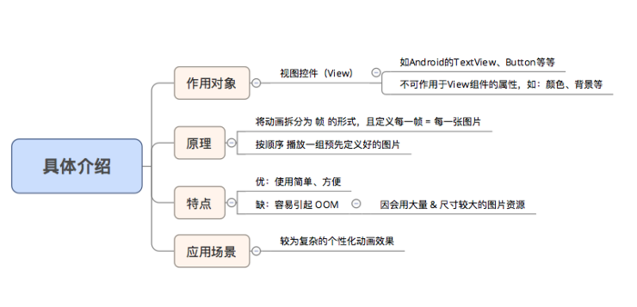
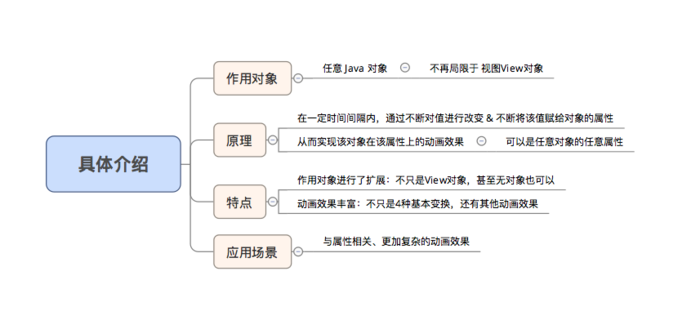

## Android动画

### 1、动画类型 

- Android动画分为两大类：视图动画和属性动画，具体如下：

	其中，视图动画又分为：补间动画和逐帧动画

### 2、视图动画（View Animation）

- 作用对象：视图（View）
- 具体分类：补间动画 & 逐帧动画

2.1 补间动画（Tween Animation）

- 简介

- 分类

根据不同的动画效果，补间动画分为4种动画，具体如下图：

不同类型的动画对应于不同的子类

具体使用:

[Android动画-补间动画](./Android动画-补间动画.md)

2.2 逐帧动画

- 简介

具体使用：

[Android动画-逐帧动画](./Android动画-逐帧动画.md)

 

### 3、属性动画

3.1 为什么要使用属性动画

- 属性动画（Property Animation）是在 Android 3.0（API 11）后才提供的一种全新动画模式

- 那么为什么要提供属性动画（Property Animation）？

具体请看下图：

3.2 属性动画

- 简介

- 具体使用

属性动画的使用类主要是：ValueAnimator 类 & ObjectAnimator 类，具体介绍如下:

[Android动画-属性动画](./Android动画-属性动画.md)

### 4、动画总结 & 对比

4.1 总结

4.2 两类动画的区别

两类动画的根本区别在于：是否改变动画本身的属性：

- 视图动画：无改变动画的属性

	因为视图动画在动画过程中仅对图像进行变换，从而达到了动画效果

> 变换操作包括：平移、缩放、旋转和透明

- 属性动画：改变了动画属性

	因属性动画在动画过程中对动态改变了对象属性，从而达到了动画效果

**特别注意：**

使用视图动画时：无论动画结果在哪，该View的位置不变。响应区域都是在原地，不会根据结果而移动；

而属性动画 则会通过改变属性 从而使动画移动

### 5、插值器 & 估值器

5.1 简介

5.2 具体使用

[Android动画-插值器与估值器](Android动画-插值器与估值器.md)

### 6、使用问题 & 建议

## 参考文档 vs 面试题

[Android动画-动画知识](https://www.jianshu.com/p/53759778284a)

[Android动画-补间动画](https://www.jianshu.com/p/733532041f46)

[Android动画-逐帧动画](https://www.jianshu.com/p/225fe1feba60)

[Android动画-属性动画](https://www.jianshu.com/p/2412d00a0ce4)

[Android动画-插值器与估值器](https://www.jianshu.com/p/2f19fe1e3ca1)

1.Android中的动画有哪几类，它们的特点和区别是什么？

(见上文)

2.Interpolator和TypeEvaluator的作用？
