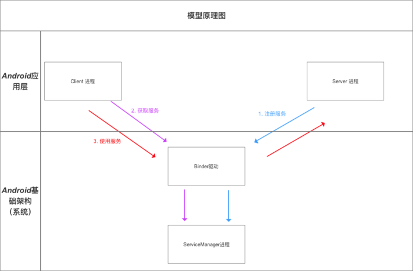

## Android的四大组件之一 Content Provider

定义： 内容提供者，是 Android 四大组件之一

## ContentProvider作用

进程间进行数据交互、数据共享，即跨进程通信。

## ContentProvider原理

ContentProvider的底层原理 =  [Android中的Binder机制](https://www.jianshu.com/p/4ee3fd07da14)

##### [Android中的Binder机制](https://www.jianshu.com/p/4ee3fd07da14)

### 1、Binder到底是什么？

中文即 粘合剂，意思为粘合了两个不同的进程

我认为：对于Binder的定义，在不同场景下其定义不同

### 2、知识储备

在讲解Binder前，我们先了解一些Linux的基础知识

2.1、进程空间划分

一个进程空间分为用户空间和内核空间（Kernel），即把进程内用户 & 内核 隔离开来。

二者区别：

	进程之间，用户空间的数据不可共享，所以用户空间 = 不可共享空间
	进程之间，内核空间的数据可共享，所以内核空间 = 可共享空间

**注意：** 所有进程共用1个内核空间

进程内用户空间 & 内核空间进行交互需通过系统调用，主要通过函数：

	copy_from_user（）：将用户空间的数据拷贝到内核空间
	copy_to_user（）：将内核空间的数据拷贝到用户空间

 

2.2、进程隔离 & 跨进程通信（ IPC ）

进程隔离：

	为了保证安全性、独立性，一个进程不能直接操作或者访问另一个进程，即Android的进程是相互独立、隔离的。

跨进程通信（IPC）：

	即进程间需进行数据交互、通信。

- 跨进程通信的基本原理：

	a. Binder的作用则是：连接两个进程，实现了mmap()系统调用，主要负责 创建数据接收的缓存空间 & 管理数据接收缓存。
	b. 注：传统的跨进程通信需拷贝数据2次，但Binder机制只需1次，主要是使用到了内存映射，具体下面会详细说明。

[内存映射知识](https://www.jianshu.com/p/719fc4758813)

### 3、Binder跨进程通信机制 模型

3.1、模型原理图

Binder 跨进程通信机制 模型 基于 Client - Server 模式

3.2、模型组成角色说明

此处重点讲解 Binder驱动作用中的跨进程通信的原理：

- 简介

- 跨进程通信的核心原理 [参考地址](https://www.jianshu.com/p/719fc4758813)

3.3、模型原理步骤说明

3.4、额外说明

**说明1：Client进程、Server进程 & Service Manager 进程之间的交互 都必须通过Binder驱动（使用 open 和 ioctl文件操作函数），而非直接交互。**

原因：

	1）Client进程、Server进程、Service Manager进程属于进程空间的用户空间，不可进行进程间交互。
	2）Binder驱动属于进程空间的内核空间，可进行进程间或进程内交互。

所以，原理图可表示为以下：

**注意：** 虚线表示并非直接交互。

**说明2：  Binder驱动 & Service Manager进程 属于Android基础架构（即系统已经实现好了）；而Client进程和Server进程属于Android应用层（需要开发者自己实现）。**

所以，在进行跨进程通信时，开发者只需自定义Client进程 &  Server进程并显式使用上述3个步骤，最终借助Android的基本架构功能就可完成进程间通信。

**说明3：Binder请求的线程管理**

	Server进程会创建很多线程来处理Binder请求。
	Binder模型的线程管理采用Binder驱动的线程池，并由Binder驱动自身进行管理。

> 而不是由Server进程来管理的

	一个进程的Binder线程数默认最大是16，超过的请求会被阻塞等待空闲的Binder线程

> 所以，在进程间通信时处理并发问题时，如使用ContentProvider时，它的CRUD（创建、检索、更新和删除）方法只能同时有16个线程同时工作

### 4、Binder机制在Android中的具体实现原理

	Binder机制在Android中的实现主要依靠Binder类，其实现了IBinder 接口。

实例说明：Client进程需要调用Server进程的加法函数（将整数a和b相加）
即：
	
	Client进程需要传两个整数给Server进程；
	Server进程需要把相加后的结果返回给Client进程。

步骤1：注册服务

- 过程描述：

Server进程通过Binder驱动向Service Manager进程注册服务。

- 代码实现：

Server进程创建一个Binder对象。
	
	1.Binder实体是Server进程在Binder驱动中的存在形式；
	2.该对象保存Server和ServiceManager的信息（保存在内核空间中）；
	3.Binder驱动通过内核空间的Binder实体找到用户空间的Server对象；

代码分析：

	
	Binder binder = new Stub();
	// 步骤1：创建Binder对象 ->>分析1
	
	// 步骤2：创建 IInterface 接口类的匿名类
	// 创建前，需要预先定义 继承了IInterface 接口的接口 -->分析3
	IInterface plus = new IPlus(){
	
		// 确定Client进程需要调用的方法
		public int add(int a,int b) {
		   return a+b;
		}
		
		// 实现IInterface接口中唯一的方法
		public IBinder asBinder（）{ 
		    return null ;
		}
	};

	// 步骤3
	binder.attachInterface(plus，"add two int");
	// 1. 将（add two int，plus）作为（key,value）对存入到Binder对象中的一个Map<String,IInterface>对象中
	// 2. 之后，Binder对象 可根据add two int通过queryLocalIInterface（）获得对应IInterface对象（即plus）的引用，可依靠该引用完成对请求方法的调用
	// 分析完毕，跳出
	
	
	<-- 分析1：Stub类 -->
	public class Stub extends Binder {
		 // 继承自Binder类 ->>分析2
	
	      // 复写onTransact（）
	      @Override
	      boolean onTransact(int code, Parcel data, Parcel reply, int flags){
	      // 具体逻辑等到步骤3再具体讲解，此处先跳过
			switch (code) { 
				case Stub.add： { 
				
					data.enforceInterface("add two int"); 
					
					int  arg0  = data.readInt();
					int  arg1  = data.readInt();
					
					int  result = this.queryLocalIInterface("add two int") .add( arg0,  arg1); 
					
					reply.writeInt(result); 
					
					return true; 
				}
	       } 
	  return super.onTransact(code, data, reply, flags); 
	
	}
	// 回到上面的步骤1，继续看步骤2
	
	<-- 分析2：Binder 类 -->
	public class Binder implement IBinder{
		// Binder机制在Android中的实现主要依靠的是Binder类，其实现了IBinder接口
		// IBinder接口：定义了远程操作对象的基本接口，代表了一种跨进程传输的能力
		// 系统会为每个实现了IBinder接口的对象提供跨进程传输能力
		// 即Binder类对象具备了跨进程传输的能力
	
	    void attachInterface(IInterface plus, String descriptor)；

	    // 作用：
	    // 1. 将（descriptor，plus）作为（key,value）对存入到Binder对象中的一个Map<String,IInterface>对象中
	    // 2. 之后，Binder对象 可根据descriptor通过queryLocalIInterface（）获得对应IInterface对象（即plus）的引用，可依靠该引用完成对请求方法的调用
	
	    IInterface queryLocalInterface(Stringdescriptor) ；
	    // 作用：根据 参数 descriptor 查找相应的IInterface对象（即plus引用）
	
	    boolean onTransact(int code, Parcel data, Parcel reply, int flags)；
	    // 定义：继承自IBinder接口的
	    // 作用：执行Client进程所请求的目标方法（子类需要复写）
	    // 参数说明：
	    // code：Client进程请求方法标识符。即Server进程根据该标识确定所请求的目标方法
	    // data：目标方法的参数。（Client进程传进来的，此处就是整数a和b）
	    // reply：目标方法执行后的结果（返回给Client进程）
	     // 注：运行在Server进程的Binder线程池中；当Client进程发起远程请求时，远程请求会要求系统底层执行回调该方法
	
	    final class BinderProxy implements IBinder {
	     // 即Server进程创建的Binder对象的代理对象类
	     // 该类属于Binder的内部类
	    }
	    // 回到分析1原处
	}
	

	<-- 分析3：IInterface接口实现类 -->
	public interface IPlus extends IInterface {
		// 继承自IInterface接口->>分析4
		// 定义需要实现的接口方法，即Client进程需要调用的方法
		public int add(int a,int b);
		// 返回步骤2
	}
	

	<-- 分析4：IInterface接口类 -->
	// 进程间通信定义的通用接口
	// 通过定义接口，然后再服务端实现接口、客户端调用接口，就可实现跨进程通信。
	public interface IInterface{
	    // 只有一个方法：返回当前接口关联的 Binder 对象。
	    public IBinder asBinder();
	}
	// 回到分析3原处

注册服务后，Binder驱动持有Server进程创建的Binder实体。

步骤2：获取服务

- Client进程使用某个service前（此处是相加函数），须通过Binder驱动向ServiceManager进程获取相应的Service信息。

具体代码实现过程如下：

此时，Client进程与Server进程已经建立了连接。

步骤3：使用服务

Client进程根据获取到的Service信息（Binder代理对象），通过Binder驱动建立与该Service所在Server进程通信的链路，并开始使用服务。

- 过程描述

		1.Client进程将参数（整数a和b）发送到Server进程；
		2.Server进程根据Client进程要求调用目标方法（即加法函数）；
		3.Server进程将目标方法的结果（即加法后的结果）返回给Client进程；

- 代码实现过程

(1).Client进程 将参数（整数a和b）发送到Server进程

	
	// 1. Client进程 将需要传送的数据写入到Parcel对象中
	// data = 数据 = 目标方法的参数（Client进程传进来的，此处就是整数a和b） + IInterface接口对象的标识符descriptor
	  android.os.Parcel data = android.os.Parcel.obtain();
	  data.writeInt(a); 
	  data.writeInt(b); 
	
	  data.writeInterfaceToken("add two int");；
	  // 方法对象标识符让Server进程在Binder对象中根据"add two int"通过queryLocalIInterface（）查找相应的IInterface对象（即Server创建的plus），Client进程需要调用的相加方法就在该对象中
	
	  android.os.Parcel reply = android.os.Parcel.obtain();
	  // reply：目标方法执行后的结果（此处是相加后的结果）
	
	// 2. 通过 调用代理对象的transact（） 将 上述数据发送到Binder驱动
	  binderproxy.transact(Stub.add, data, reply, 0)
	  // 参数说明：
	    // 1. Stub.add：目标方法的标识符（Client进程 和 Server进程 自身约定，可为任意）
	    // 2. data ：上述的Parcel对象
	    // 3. reply：返回结果
	    // 0：可不管
	
	// 注：在发送数据后，Client进程的该线程会暂时被挂起
	// 所以，若Server进程执行的耗时操作，请不要使用主线程，以防止ANR
	
	
	// 3. Binder驱动根据 代理对象 找到对应的真身Binder对象所在的Server 进程（系统自动执行）
	// 4. Binder驱动把 数据 发送到Server 进程中，并通知Server 进程执行解包（系统自动执行）

(2).Server进程根据Client进要求 调用 目标方法（即加法函数）

	// 1. 收到Binder驱动通知后，Server 进程通过回调Binder对象onTransact（）进行数据解包 & 调用目标方法
  	public class Stub extends Binder {

          // 复写onTransact（）
          @Override
          boolean onTransact(int code, Parcel data, Parcel reply, int flags){
          // code即在transact（）中约定的目标方法的标识符

          switch (code) { 
                case Stub.add： { 
                  // a. 解包Parcel中的数据
                       data.enforceInterface("add two int"); 
                        // a1. 解析目标方法对象的标识符

                       int  arg0  = data.readInt();
                       int  arg1  = data.readInt();
                       // a2. 获得目标方法的参数
                      
                       // b. 根据"add two int"通过queryLocalIInterface（）获取相应的IInterface对象（即Server创建的plus）的引用，通过该对象引用调用方法
                       int  result = this.queryLocalIInterface("add two int") .add( arg0,  arg1); 
                      
                        // c. 将计算结果写入到reply
                        reply.writeInt(result); 
                        
                        return true; 
                  }
           } 
      return super.onTransact(code, data, reply, flags); 
      // 2. 将结算结果返回 到Binder驱动

	   }
	}

(3).Server进程 将目标方法的结果（即加法后的结果）返回给Client进程

	// 1. Binder驱动根据 代理对象 沿原路 将结果返回 并通知Client进程获取返回结果
	// 2. 通过代理对象 接收结果（之前被挂起的线程被唤醒）

    binderproxy.transact(Stub.ADD, data, reply, 0)；
    reply.readException();；
    result = reply.readInt()；

下面，我用一个原理图 & 流程图来总结(3)的内容

原理图

流程图

### 5、优点

对比 Linux （Android基于Linux）上的其他进程通信方式（管道、消息队列、共享内存、
信号量、Socket），Binder 机制的优点有

### 6、从模型结构组成的Binder驱动来说：

整个Binder模型的原理步骤 & 源码分析

## ContentProvider具体使用

### 1、统一资源标识符（URI）

- 定义：Uniform Resource Identifier，即统一资源标识符

- 作用：唯一标识 ContentProvider中的数据

> 外界进程通过 URI 找到对应的ContentProvider中的数据，再进行数据操作

- 具体使用

URI分为 系统预置 & 自定义，分别对应系统内置的数据（如通讯录、日程表等等）和自定义数据库

	// 设置URI
	Uri uri = Uri.parse("content://com.carson.provider/User/1") 
	// 上述URI指向的资源是：名为 `com.carson.provider`的`ContentProvider` 中表名 为`User` 中的 `id`为1的数据
	
	// 特别注意：URI模式存在匹配通配符* & ＃
	
	// *：匹配任意长度的任何有效字符的字符串
	// 以下的URI 表示 匹配provider的任何内容
	content://com.example.app.provider/* 
	// ＃：匹配任意长度的数字字符的字符串
	// 以下的URI 表示 匹配provider中的table表的所有行
	content://com.example.app.provider/table/#

### 2、MIME数据类型

- 作用：指定某个扩展名的文件用某种应用程序来打开

如指定.html文件采用text应用程序打开、指定.pdf文件采用flash应用程序打开

- 具体使用

2.1、ContentProvider根据URI返回MIME类型

	ContentProvider.geType(uri) ；

2.2、MIME类型组成

每种MIME类型 由2部分组成 = 类型 + 子类型

> MIME类型是 一个 包含2部分的字符串

	text / html
	// 类型 = text、子类型 = html
	
	text/css
	text/xml
	application/pdf

2.3、MIME类型形式

MIME类型有2种形式
	
	// 形式1：单条记录  
	vnd.android.cursor.item/自定义
	// 形式2：多条记录（集合）
	vnd.android.cursor.dir/自定义 
	
	// 注：
	  // 1. vnd：表示父类型和子类型具有非标准的、特定的形式。
	  // 2. 父类型已固定好（即不能更改），只能区别是单条还是多条记录
	  // 3. 子类型可自定义

实例说明

	<-- 单条记录 -->
	  // 单个记录的MIME类型
	  vnd.android.cursor.item/vnd.yourcompanyname.contenttype 
	
	  // 若一个Uri如下
	  content://com.example.transportationprovider/trains/122   
	  // 则ContentProvider会通过ContentProvider.geType(url)返回以下MIME类型
	  vnd.android.cursor.item/vnd.example.rail
	
	
	<-- 多条记录 -->
	  // 多个记录的MIME类型
	  vnd.android.cursor.dir/vnd.yourcompanyname.contenttype 
	  // 若一个Uri如下
	  content://com.example.transportationprovider/trains 
	  // 则ContentProvider会通过ContentProvider.geType(url)返回以下MIME类型
	  vnd.android.cursor.dir/vnd.example.rail

### 3、ContentProvider类

3.1、组织数据方式

- ContentProvider主要以**表格的形式**组织数据

**注意：** 同时也支持文件数据，只是表格形式用得比较多

- 每个表格中包含多张表，每张表包含行和列，分别对应记录和字段

**注意：** 同数据库

3.2、主要方法

- 进程间共享数据的本质是：添加、删除、获取 、修改（更新）数据

所以ContentProvider的核心方法也主要是上述4个作用：

	<-- 4个核心方法 -->
	  public Uri insert(Uri uri, ContentValues values) 
	  // 外部进程向 ContentProvider 中添加数据
	
	  public int delete(Uri uri, String selection, String[] selectionArgs) 
	  // 外部进程 删除 ContentProvider 中的数据
	
	  public int update(Uri uri, ContentValues values, String selection, String[] selectionArgs)
	  // 外部进程更新 ContentProvider 中的数据
	
	  public Cursor query(Uri uri, String[] projection, String selection, String[] selectionArgs,  String sortOrder)　 
	  // 外部应用 获取 ContentProvider 中的数据
	
	  // 注：
	  // 1. 上述4个方法由外部进程回调，并运行在ContentProvider进程的Binder线程池中（不是主线程）
	 // 2. 存在多线程并发访问，需要实现线程同步
	   // a. 若ContentProvider的数据存储方式是使用SQLite & 一个，则不需要，因为SQLite内部实现好了线程同步，若是多个SQLite则需要，因为SQL对象之间无法进行线程同步
	  // b. 若ContentProvider的数据存储方式是内存，则需要自己实现线程同步
	
	<-- 2个其他方法 -->
	public boolean onCreate() 
	// ContentProvider创建后 或 打开系统后其它进程第一次访问该ContentProvider时 由系统进行调用
	// 注：运行在ContentProvider进程的主线程，故不能做耗时操作
	
	public String getType(Uri uri)
	// 得到数据类型，即返回当前 Url 所代表数据的MIME类型

- Android为常见的数据（如通讯录、日程表等）提供了内置了默认的ContentProvider
但也可根据需求自定义ContentProvider，但上述6个方法必须重写

- ContentProvider类并不会直接与外部进程交互，而是通过ContentResolver类

### 4、ContentResolver类

4.1、 作用

统一管理不同 ContentProvider间的操作。

	即通过URI即可操作不同的ContentProvider中的数据；
	外部进程通过ContentResolver类从而与ContentProvider类进行交互；

**为什么要使用通过ContentResolver类从而与ContentProvider类进行交互，而不直接访问ContentProvider类?**

	一般来说，一款应用要使用多个ContentProvider，若需要了解每个ContentProvider的不同实现从而再完成数据交互，操作成本高，难度大。
	所以在ContentProvider类上加多了一个ContentResolver类对所有的ContentProvider进行统一管理。

具体使用：

ContentResolver类提供了与ContentProvider类相同名字、作用的4个方法：

	// 外部进程向 ContentProvider 中添加数据
	public Uri insert(Uri uri, ContentValues values)　 
	
	// 外部进程 删除 ContentProvider 中的数据
	public int delete(Uri uri, String selection, String[] selectionArgs)
	
	// 外部进程更新 ContentProvider 中的数据
	public int update(Uri uri, ContentValues values, String selection, String[] selectionArgs)　 
	
	// 外部应用 获取 ContentProvider 中的数据
	public Cursor query(Uri uri, String[] projection, String selection, String[] selectionArgs, String sortOrder)

实例说明

	// 使用ContentResolver前，需要先获取ContentResolver
	// 可通过在所有继承Context的类中 通过调用getContentResolver()来获得ContentResolver
	ContentResolver resolver =  getContentResolver(); 
	
	// 设置ContentProvider的URI
	Uri uri = Uri.parse("content://cn.scu.myprovider/user"); 
	 
	// 根据URI 操作 ContentProvider中的数据
	// 此处是获取ContentProvider中 user表的所有记录 
	Cursor cursor = resolver.query(uri, null, null, null, "userid desc");

Android 提供了3个用于辅助ContentProvide的工具类

	ContentUris
	UriMatcher
	ContentObserver

- ContentUris类

作用：操作URI

具体使用：

核心方法有两个：withAppendedId（） &parseId（）

	// withAppendedId（）作用：向URI追加一个id
	Uri uri = Uri.parse("content://cn.scu.myprovider/user") 
	Uri resultUri = ContentUris.withAppendedId(uri, 7);  
	// 最终生成后的Uri为：content://cn.scu.myprovider/user/7
	
	// parseId（）作用：从URL中获取ID
	Uri uri = Uri.parse("content://cn.scu.myprovider/user/7") 
	long personid = ContentUris.parseId(uri); 
	//获取的结果为:7

- UriMatcher类

作用：

在ContentProvider 中注册URI，根据 URI 匹配 ContentProvider 中对应的数据表

具体使用：
	
	// 步骤1：初始化UriMatcher对象
    UriMatcher matcher = new UriMatcher(UriMatcher.NO_MATCH); 
    //常量UriMatcher.NO_MATCH  = 不匹配任何路径的返回码
    // 即初始化时不匹配任何东西

	// 步骤2：在ContentProvider 中注册URI（addURI（））
    int URI_CODE_a = 1；
    int URI_CODE_b = 2；
    matcher.addURI("cn.scu.myprovider", "user1", URI_CODE_a); 
    matcher.addURI("cn.scu.myprovider", "user2", URI_CODE_b); 
    // 若URI资源路径 = content://cn.scu.myprovider/user1 ，则返回注册码URI_CODE_a
    // 若URI资源路径 = content://cn.scu.myprovider/user2 ，则返回注册码URI_CODE_b

	// 步骤3：根据URI 匹配 URI_CODE，从而匹配ContentProvider中相应的资源（match（））
	
	@Override   
	    public String getType(Uri uri) {   
	      Uri uri = Uri.parse(" content://cn.scu.myprovider/user1");   
	
	      switch(matcher.match(uri)){   
	     // 根据URI匹配的返回码是URI_CODE_a
	     // 即matcher.match(uri) == URI_CODE_a
	      case URI_CODE_a:   
	        return tableNameUser1;   
	        // 如果根据URI匹配的返回码是URI_CODE_a，则返回ContentProvider中的名为tableNameUser1的表
	      case URI_CODE_b:   
	        return tableNameUser2;
	        // 如果根据URI匹配的返回码是URI_CODE_b，则返回ContentProvider中的名为tableNameUser2的表
	    }   
	}

- ContentObserver类

定义：内容观察者

- 作用：观察 Uri引起 ContentProvider 中的数据变化 & 通知外界（即访问该数据访问者）

> 当ContentProvider 中的数据发生变化（增、删 & 改）时，就会触发该 ContentObserver类

	// 步骤1：注册内容观察者ContentObserver
	    getContentResolver().registerContentObserver（uri）；
	    // 通过ContentResolver类进行注册，并指定需要观察的URI
	
	// 步骤2：当该URI的ContentProvider数据发生变化时，通知外界（即访问该ContentProvider数据的访问者）
	    public class UserContentProvider extends ContentProvider { 
	      public Uri insert(Uri uri, ContentValues values) { 
	      db.insert("user", "userid", values); 
	      getContext().getContentResolver().notifyChange(uri, null); 
	      // 通知访问者
	   } 
	}
	
	// 步骤3：解除观察者
	 getContentResolver().unregisterContentObserver（uri）；
	    // 同样需要通过ContentResolver类进行解除

## 进程内通信

由于ContentProvider不仅常用于进程间通信，同时也适用于进程内通信

#### 1.进程内通信

步骤说明

	创建数据库类
	自定义 ContentProvider 类
	注册 创建的 ContentProvider类
	进程内访问 ContentProvider的数据

#### 2.进程间进行数据共享

## 优点

- 安全

ContentProvider为应用间的数据交互提供了一个安全的环境：允许把自己的应用数据根据需求开放给 其他应用 进行 增、删、改、查，而不用担心因为直接开放数据库权限而带来的安全问题

- 访问简单 & 高效

对比于其他对外共享数据的方式，数据访问方式会因数据存储的方式而不同：

	采用 文件方式 对外共享数据，需要进行文件操作读写数据；
	采用 Sharedpreferences 共享数据，需要使用 sharedpreferences API读写数据

这使得访问数据变得复杂 & 难度大。

	而采用ContentProvider方式，其 解耦了 底层数据的存储方式，使得无论底层数据存储采用何种方式，外界对数据的访问方式都是统一的，这使得访问简单 & 高效

## 参考地址 vs 面试题

[Android：关于ContentProvider的知识](https://www.jianshu.com/p/ea8bc4aaf057)

1.谈谈你对ContentProvider的理解？

（见上文）

2.ContentProvider、ContentResolver、ContentObserver 之间的关系？

ContentProvider是Android的四大组件之一，可见它在Android中的作用非同小可。它主要的作用是：实现各个应用程序之间的（跨应用）数据共享，比如联系人应用中就使用了ContentProvider,你在自己的应用中可以读取和修改联系人的数据，不过需要获得相应的权限。其实它也只是一个中间人，真正的数据源是文件或者SQLite等。

一个应用实现ContentProvider来提供内容给别的应用来操作， 通过ContentResolver来操作别的应用数据，当然在自己的应用中也可以。 

ContentObserver——内容观察者，目的是观察(捕捉)特定Uri引起的数据库的变化，继而做一些相应的处理，它类似于数据库技术中的触发器(Trigger)，当ContentObserver所观察的Uri发生变化时，便会触发它。触发器分为表触发器、行触发器，相应地ContentObserver也分为“表“ContentObserver、“行”ContentObserver，当然这是与它所监听的Uri MIME Type有关的
