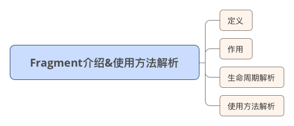
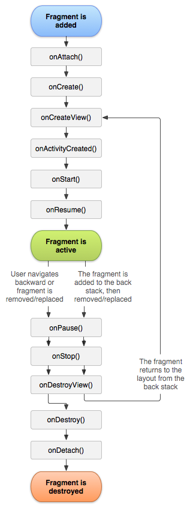
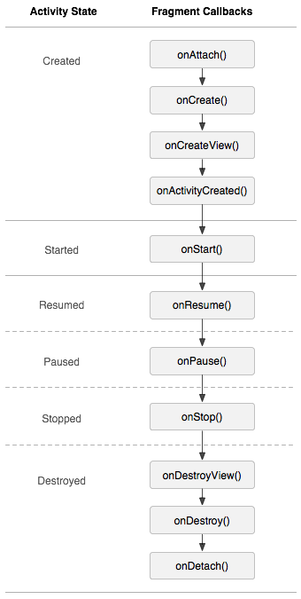
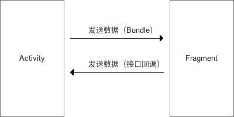

## Fragment

### 1、定义

Activity界面中的一部分，可理解为模块化的Activity

	1)Fragment不能独立存在，必须嵌入到Activity中；
	2)Fragment具有自己的生命周期，接收它自己的事件，并可以在Activity运行时被添加或删除;
	3)Fragment的生命周期直接受所在的Activity的影响;
	如：当Activity暂停时，它拥有的所有Fragment们都暂停

### 2、作用

支持动态、灵活的界面设计

	Fragment从Android3.0后引入；
	在低版本Android3.0前使用Fragment，需要采用android-support-v4.jar兼容包；

### 3、生命周期解析

3.1 详解每个方法的调用场景

	onAttach方法
	Fragment和Activity建立关联的时候调用（获得activity的传递的值）

	onCreateView方法
	为Fragment创建视图（加载布局）时调用（给当前的fragment绘制UI布局，可以使用线程更新UI）

	onActivityCreated方法
	当Activity中的onCreate方法执行完后调用（表示activity执行oncreate方法完成了的时候会调用此方法）

	onDestroyView方法
	Fragment中的布局被移除时调用（表示fragment销毁相关联的UI布局）

	onDetach方法
	Fragment和Activity解除关联的时候调用（脱离activity）

3.2 fragment生命周期解析

当一个fragment被创建的时候：

	onAttach()
	onCreate()
	onCreateView()
	onActivityCreated()

当这个fragment对用户可见的时候，它会经历以下状态:(可以理解为从创建到显示/或切换)

	onStart()
	onResume()

当这个fragment进入“后台模式”的时候，它会经历以下状态:

	onPause()
	onStop()

当这个fragment被销毁了（或者持有它的activity被销毁了）:

	onPause()
	onStop()
	onDestroyView()·
	onDestroy()
	onDetach()

就像Activity一样，在以下的状态中，可以使用Bundle对象保存一个fragment的对象:

	onCreate()
	onCreateView()
	onActivityCreated()

3.3 其他场景的调用

屏幕灭掉
	
	onPause() 
	onSaveInstanceState() 
	onStop()

屏幕解锁

	onStart() 
	onResume()

切换到其他Fragment

	onPause() 
	onStop() 
	onDestroyView()

切换回本身的Fragment

	onCreateView() 
	onActivityCreated() 
	onStart() 
	onResume()

回到桌面

	onPause() 
	onSaveInstanceState() 
	onStop()

回到应用
	
	onStart() 
	onResume()

退出应用
	
	onPause() 
	onStop() 
	onDestroyView() 
	onDestroy() 
	onDetach()

3.4 Fragment和Activity的生命周期很相似，以下是对比图

### 4、具体使用

- 由于Fragment作为Activity一部分，所以Fragment的使用一般是添加到Activity中

- 将Fragment添加到Activity中一般有2种方法:

		1)在Activity的layout.xml布局文件中静态添加;
		2)在Activity的.java文件中动态添加;

4.1 在Activity的layout.xml布局文件中静态添加

(1)、Activity的布局文件

	fragment_layout_test.xml

	<LinearLayout xmlns:android="http://schemas.android.com/apk/res/android"
	xmlns:tools="http://schemas.android.com/tools"
	android:layout_width="match_parent"
	android:layout_height="match_parent"
	android:orientation="vertical" >
	
	// 该fragment类定义在包名为"com.jie.app"中的FragmentLayoutTest类的内部类ExampleFragment中
	<fragment android:name="com.jie.app.FragmentLayoutTest$ExampleFragment"
	    android:id="@+id/fg_list"
	    android:layout_weight="1"
	    android:layout_width="match_parent"
	    android:layout_height="match_parent"/>
	
	</LinearLayout>

(2)、Fragment的布局文件
	
	example_fragment.xml

	<LinearLayout xmlns:android="http://schemas.android.com/apk/res/android"
	    xmlns:tools="http://schemas.android.com/tools"
	    android:layout_width="match_parent"
	    android:layout_height="match_parent"
	    android:orientation="vertical" >
	
	    <TextView
	        android:text="@string/example_fragment"
	        android:layout_width="wrap_content"
	        android:layout_height="wrap_content"/>
	   
	</LinearLayout>

(3)、Activity的.java文件

	FragmentLayoutTest.java

	// 在Activity使用Fragment时，需要考虑版本兼容问题
	// 1. Android 3.0后，Activity可直接继承自Activity，并且在其中嵌入使用Fragment
	// 2. Android 3.0前，Activity需FragmentActivity（其也继承自Activity），同时需要导入android-support-v4.jar兼容包，这样在Activity中才能嵌入Fragment
	
	public class FragmentLayoutTest extends Activity {
	
	    @Override
	    protected void onCreate(Bundle savedInstanceState) {
	        super.onCreate(savedInstanceState);
	        setContentView(R.layout.fragment_layout_test);
	        // 设置上述布局文件
	    }
	
	    // 继承自Fragment
	    // 布局文件中的Fragment通过该FragmentLayoutTest的内部类ExampleFragment实现
	    public static class ExampleFragment extends Fragment {
	        @Override
	        public View onCreateView(LayoutInflater inflater, ViewGroup container,
	                                 Bundle savedInstanceState) {
	            
	            return inflater.inflate(R.layout.example_fragment, container, false);
	             // 将example_fragment.xml作为该Fragment的布局文件
	            // 即相当于FragmentLayoutTest直接调用example_fragment.xml来显示到Fragment中
	        }
	    }
	}

4.2 在Activity的.java文件中动态添加

(1).在Activity的布局文件定义1占位符（FrameLayout）
这样做的好处是：可动态在Activity中添加不同的 Fragment，更加灵活

	fragment_transaction_test.xml

	<LinearLayout xmlns:android="http://schemas.android.com/apk/res/android"
	    android:layout_width="match_parent"
	    android:layout_height="match_parent"
	    android:orientation="vertical" >
	    
	    <FrameLayout
	        android:id="@+id/about_fragment_container"
	        android:layout_width="match_parent"
	        android:layout_height="match_parent"/>
	    
	</LinearLayout>

(2).设置Fragment的布局文件

	example_fragment.xml

	<LinearLayout xmlns:android="http://schemas.android.com/apk/res/android"
    xmlns:tools="http://schemas.android.com/tools"
    android:layout_width="match_parent"
    android:layout_height="match_parent"
    android:orientation="vertical" >

    	<TextView
	        android:text="@string/example_fragment"
	        android:layout_width="wrap_content"
	        android:layout_height="wrap_content"/>
   
	</LinearLayout>

(3).在Activity的.java文件中动态添加Fragment

	FragmentTransactionTest

	public class FragmentTransactionTest extends Activity {

	    @Override
	    protected void onCreate(Bundle savedInstanceState) {
	        super.onCreate(savedInstanceState);
	        setContentView(R.layout.fragment_transaction_test);
	        
	        // 步骤1：获取FragmentManager
	        FragmentManager fragmentManager = getFragmentManager();
	
	        // 步骤2：获取FragmentTransaction        
	        FragmentTransaction fragmentTransaction = fragmentManager.beginTransaction();
	        
	        // 步骤3：创建需要添加的Fragment ：ExampleFragment
	        ExampleFragment fragment = new ExampleFragment();
	
	        // 步骤4：动态添加fragment
	        // 即将创建的fragment添加到Activity布局文件中定义的占位符中（FrameLayout）
	        fragmentTransaction.add(R.id.about_fragment_container, fragment);
	        fragmentTransaction.commit();
	    }
	    
	    // 继承与Fragment
	    public static class ExampleFragment extends Fragment {
	        @Override
	        public View onCreateView(LayoutInflater inflater, ViewGroup container,
	                                 Bundle savedInstanceState) {
	            
	            return inflater.inflate(R.layout.example_fragment, container, false);
	            // 将example_fragment.xml作为该Fragment的布局文件
	        }
	    }
	}

### 5、Fragment与Activity的通信

**a.Activity传递数据到Fragment**

- 采用 Bundle方式。

实例：
	
	//传递
	public class Activity2Fragment extends AppCompatActivity {

	    TextView text;
	
	    @Override
	    protected void onCreate(Bundle savedInstanceState) {
	        super.onCreate(savedInstanceState);
	        setContentView(R.layout.activcity_2_fragment);
	
	        text = (TextView) findViewById(R.id.text);
	
	        // 步骤1：获取FragmentManager
	        FragmentManager fragmentManager = getFragmentManager();
	
	        // 步骤2：获取FragmentTransaction
	        FragmentTransaction fragmentTransaction = fragmentManager.beginTransaction();
	
	        // 步骤3：创建需要添加的Fragment 
	        final mFragment fragment = new mFragment();
	
	        // 步骤4:创建Bundle对象
	        // 作用:存储数据，并传递到Fragment中
	        Bundle bundle = new Bundle();
	
	        // 步骤5:往bundle中添加数据
	        bundle.putString("message", "I love Google");
	
	        // 步骤6:把数据设置到Fragment中
	        fragment.setArguments(bundle);
	
	        // 步骤7：动态添加fragment
	        // 即将创建的fragment添加到Activity布局文件中定义的占位符中（FrameLayout）
	        fragmentTransaction.add(R.id.fragment_container, fragment);
	        fragmentTransaction.commit();
	    }
	}

	//接收
	public class mFragment extends Fragment {
	    Button button;
	    TextView text;
	    Bundle bundle;
	    String message;
	
	    @Override
	    public View onCreateView(LayoutInflater inflater, ViewGroup container, Bundle savedInstanceState) {
	        View contentView = inflater.inflate(R.layout.fragment, container, false);
	        // 设置布局文件
	
	        button = (Button) contentView.findViewById(R.id.button);
	        text = (TextView) contentView.findViewById(R.id.text);
	
	        // 步骤1:通过getArgments()获取从Activity传过来的全部值
	        bundle = this.getArguments();
	
	        // 步骤2:获取某一值
	        message = bundle.getString("message");
	
	        // 步骤3:设置按钮,将设置的值显示出来
	        button.setOnClickListener(new View.OnClickListener() {
	            @Override
	            public void onClick(View v) {
	                // 显示传递过来的值
	                text.setText(message);
	            }
	        });
	
	        return contentView;
	    }
	}

**b.Fragment传递数据到Activity**

- 采用 接口回调 方式。

接口回调： 把实现了某一接口的类所创建的对象的引用 赋给 该接口声明的变量，通过该接口变量 调用 该实现类对象的实现的接口方法。
	
	//接口
	public interface ICallBack {
	    void get_message_from_Fragment(String string);
	}
	
	//传递
	public class mFragment extends Fragment {
	    @Override
	    public View onCreateView(LayoutInflater inflater, ViewGroup container, Bundle savedInstanceState) {
	        View contentView = inflater.inflate(R.layout.fragment, container, false);
	        // 设置布局文件
	        return contentView;
	    }
	
	    // 设置 接口回调 方法
	    public void sendMessage(ICallBack callBack){
	        callBack.get_message_from_Fragment("消息:我来自Fragment");
	    }
	}
	
	//接收
	public class MainActivity extends AppCompatActivity {

	    Button button;
	    TextView text;
	
	    @Override
	    protected void onCreate(Bundle savedInstanceState) {
	        super.onCreate(savedInstanceState);
	        setContentView(R.layout.activity_main);
	
	        button = (Button)findViewById(R.id.button);
	        text = (TextView)findViewById(R.id.text);
	
	        // 步骤1：获取FragmentManager
	        FragmentManager fragmentManager = getFragmentManager();
	
	        // 步骤2：获取FragmentTransaction
	        FragmentTransaction fragmentTransaction = fragmentManager.beginTransaction();
	
	        // 步骤3：创建需要添加的Fragment 
	        final mFragment fragment = new mFragment();
	
	        // 步骤4：动态添加fragment
	        // 即将创建的fragment添加到Activity布局文件中定义的占位符中（FrameLayout）
	        fragmentTransaction.add(R.id.fragment_container, fragment);
	        fragmentTransaction.commit();
	
	        button.setOnClickListener(new View.OnClickListener() {
	            @Override
	            public void onClick(View v) {
	                // 通过接口回调将消息从fragment发送到Activity
	                fragment.sendMessage(new ICallBack() {
	                    @Override
	                    public void get_message_from_Fragment(String string) {
	                            text.setText(string);
	                    }
	                });
	            }
	        });
	    }
	}

- 总结：

## 参考文档  vs 面试题

[Android：Fragment最全面介绍 & 使用方法解析](https://www.jianshu.com/p/2bf21cefb763)

[Fragment全解析系列（一）：那些年踩过的坑](https://www.jianshu.com/p/d9143a92ad94)

[Fragment全解析系列（二）：正确的使用姿势](https://www.jianshu.com/p/fd71d65f0ec6)

[Fragment之我的解决方案：Fragmentation](https://www.jianshu.com/p/38f7994faa6b)

1.为什么要用Fragment？

	将activity分离成多个可重用的组件，每个都有它自己的生命周期和UI；
	创建动态灵活的UI设计，可以适应于不同的屏幕尺寸，从手机到平板电脑；
	Fragment是一个独立的模块,紧紧地与activity绑定在一起，可以在运行中动态地移除、加入、交换等；
	解决Activity间的切换不流畅，轻量切换；
	替代TabActivity做导航，性能更好；

2.Fragment各种情况下的生命周期？

(见上文)

[Android开发：5分钟解析Activity&Fragment生命周期](https://www.jianshu.com/p/b1ff03a7bb1f)

3.Fragment之间传递数据的方式？

[Fragment之间数据传递的三种方式](https://www.jianshu.com/p/f87baad32662)

4.Fragment与Activity的通信方式？

(见上文)

	采用Bundle方式；
	采用接口回调方式；

4.Fragment的add与replace的区别 ？

	add方式实现fragment的效果就是：切换fragment时不会重新创建，是什么样子切换回来还是什么样子；
	replace的效果就是：切换fragment时每次都会重新创建初始化

5.getFragmentManager，getSupportFragmentManager ，getChildFragmentManager三者之间的区别？

- getFragmentManager()所得到的是所在fragment的父容器的管理器；

- getChildFragmentManager()所得到的是在fragment里面子容器的管理器；

- getSupportFragmentManager()主要用于支持3.0以下android系统API版本；

		3.0以上系统可以直接调用getFragmentManager()，因为fragment是3.0以后才出现的组件；

		3.0之前的系统可以借助V4包里面的getSupportFragmentManager()方法来间接获取FragmentManager()对象；

		3.0版本之后，有了Fragment的api，就可以直接使用getFragmentManager()这个方法来获取对象。

**容易出现bug的地方**

- Fragment嵌套Fragment要用getChildFragmentManager

解决方案

	FragmentManager childFragmentManager = getChildFragmentManager();
	ViewPagerAdapter viewPagerAdapter = new ViewPagerAdapter(childFragmentManager, fragments);

6.FragmentPagerAdapter与FragmentStatePagerAdapter的区别与使用场景？

默认情况下（setOffscreenPageLimit没有调用）

- FragmentPagerAdapter：

保存所有加入的fragment，虽然步长超过1的页面会调用destroyItem，但是在fragment的生命周期里，只有**onDestroyView调用了**，没有调用onDestory，也没有调用onDetach，**所以fragment只是把上面的view销毁了，fragment并没有销毁**；

下次再创建的时候，只会调用onCreateView和onActivityCreated，所以FragmentPagerAdapter里所有fragment都没有销毁，这样占用内存大，同时避免了频繁的销毁和创建，适用于页面比较少的情况。

- FragmentStatePagerAdapter：

对步长以内的fragment，跟FragmentPagerAdapter一样，不会调用任何销毁操作，再次显示也无需重新创建；

对步长以外的fragment会调用destroyItem，跟FragmentPagerAdapter不一样，会**真正销毁**（同时销毁view和fragment，调用onDestroyView以及其后面的所有销毁方法），重建时会从最初的onAttach开始一直到onActivityCreated，适用于页面比较多的情况。

7.用Fragment有遇过什么坑吗，怎么解决？

[那些年踩过的坑](https://www.jianshu.com/p/d9143a92ad94)