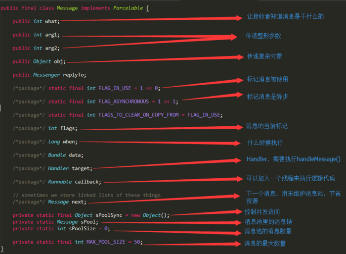

## Handler机制和底层实现 

handler机制：

上面一共出现了几种类，ActivityThread，Handler，MessageQueue，Looper，msg（Message）,对这些类作简要介绍：

ActivityThread：程序的启动入口，为什么要介绍这个类，是因为该类就是我们说的主线程，它对Looper进行操作的。

Handler：字面意思是操控者，该类有比较重要的地方，就是通过handler来发送消息（sendMessage）到MessageQueue和 操作控件的更新（handleMessage）。handler下面持有这MessageQueue和Looper的对象。

MessageQueue：字面意思是消息队列，就是封装Message类。对Message进行插入和取出操作。

Message：这个类是封装消息体并被发送到MessageQueue中的，给类是通过链表实现的，其好处方便MessageQueue的插入和取出操作。还有一些字段是（int what，Object obj，int arg1，int arg2）。what是用户定义的消息和代码，以便接收者（handler）知道这个是关于什么的。obj是用来传输任意对象的，arg1和arg2是用来传递一些简单的整数类型的。

下面，我们按照启动顺序来进行源码分析：

从上面可以看出，ActivityThread类是用来启动Android的，其源码为：

接下来，我们看到Looper类了，我们进去看看里面的源码实现：

首先，我们看看里面有哪些字段：

然后我们迫不及待地要想去看看prepareMainLooper方法，到底干了什么

这里我们可以看到，prepareMainLooper是为了设置一个持有消息队列和消息序列器的Looper进去ThreadLocal。接下来我们看看loop方法吧：

我们可以看到loop方法中，会取出内部的消息序列器，并且迭代里面的消息，根据消息的target分发消息（到handleMessage方法中）。

如果你有疑问，你应该是不清楚Looper的MessageQueue为什么会有Message。那么我们就马上去看，到底是哪里添加消息的。话说，到了这里我也好像没有分析到和我们handler相关的操作吧。因为你和我都知道handler的作用是sendMessage和handleMessage，所以我们知道，Looper中的消息序列器的消息体，肯定是从sendMessage中添加进去的。不墨迹,我们马上进入Handler的源码分析。

首先，我们先看看Handler的字段:

接着，我们看看Handler的构造方法，我们可以看到，Handler有两类构造方法（别看到6个，它们都是往这两种方法调用的）：

接着，我们要进入Handler.dispatchMessage()方法，因为我们要解释上面刚刚Looper.loop方法。dispatchMessage的方法很简单，只有三个方向，其源码为：

到这里为止，执行代码就结束了。那么问题来了，消息从哪里来的？带着这个疑问，我们马上进入Handler.sendMessage()逻辑去看看，其源码是：

好不容易找到了发送消息的逻辑并理解了，但是还要去壳，在MessageQueue中分析了,首先，我们回顾下，消息序列器是在Looper.prepare()中初始化的。

MessageQueue源码，构造方法很简单：

然后我们再到达MessageQueue.enqueueMessage()方法中看源码：

这个是发送消息的最终执行代码，就是把消息放进消息序列器。在Looper.loop()方法中，我们是需要不断从消息序列器中取出消息的。其过程也是我们可以进去MessageQueue.next()的源码中看看：

这样，整个过程就完成了。在这些执行过程中，Message是它们的物件。我们可以看看Message的结构：

除此之外，Message的数据结构是基于链表的，方法都很简单的，我就不贴出来了。

**总结一下:**

其实就是用一个ThreadLocal来存储对象，然后在执行的时候，能够保证对象的不变形，这样就能达到在主先线程更新UI了。

## 参考文档 vs 面试题

[Android的Handler机制](https://www.jianshu.com/p/b03d46809c4d)

1.Handler机制和底层实现？

（见上文）

2.Looper、MessageQueue、Message、Handler的关系？

（见上文）

[关系](https://blog.csdn.net/lovedren/article/details/51701477)