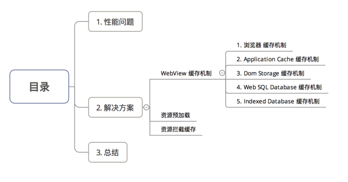
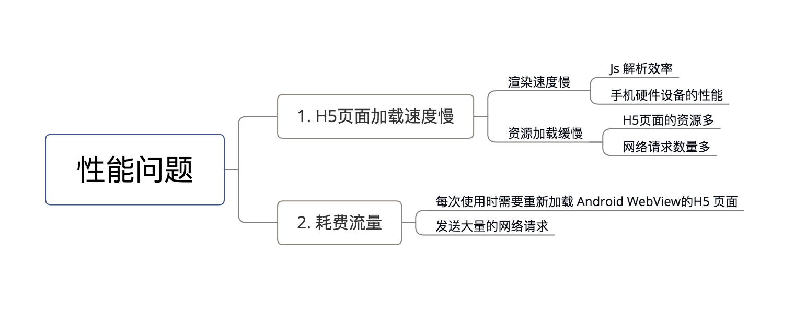

## Android Hybrid开发 -> WebView


### 1.简介

一个基于webkit引擎、展现web页面的控件

a. Android 4.4前：Android Webview在低版本 & 高版本采用了不同的webkit版本的内核

b. Android 4.4后：直接使用了Chrome内核


### 2.作用

在 Android 客户端上加载h5页面
	
	显示和渲染Web页面
	直接使用html文件（网络上或本地assets中）作布局

在本地 与 h5页面实现交互 & 调用
	
	可和JavaScript交互调用

其他：WebView控件功能强大，除了具有一般View的属性和设置外，还可以对url请求、页面加载、渲染、页面交互进行强大的处理。


### 3.具体使用

一般来说Webview可单独使用，可联合其工具类一起使用，所以接下来，我会介绍：

- Webview类自身的常见方法

- Webview的最常用的工具类：WebSettings类、WebViewClient类、WebChromeClient类

- Android 和 Js的交互


3.1 Webview类常用方法

(1). 加载url


加载方式根据资源分为三种

	//方式1. 加载一个网页：
	webView.loadUrl("http://www.google.com/");
	
	//方式2：加载apk包中的html页面
	webView.loadUrl("file:///android_asset/test.html");
	
	//方式3：加载手机本地的html页面
	webView.loadUrl("content://com.android.htmlfileprovider/sdcard/test.html");
	
	// 方式4： 加载 HTML 页面的一小段内容
	WebView.loadData(String data, String mimeType, String encoding)
	// 参数说明：
	// 参数1：需要截取展示的内容
	// 内容里不能出现 ’#’, ‘%’, ‘\’ , ‘?’ 这四个字符，若出现了需用 %23, %25, %27, %3f 对应来替代，否则会出现异常
	// 参数2：展示内容的类型
	// 参数3：字节码

(2). WebView的状态

	//激活WebView为活跃状态，能正常执行网页的响应
	webView.onResume() ；
	
	//当页面被失去焦点被切换到后台不可见状态，需要执行onPause
	//通过onPause动作通知内核暂停所有的动作，比如DOM的解析、plugin的执行、JavaScript执行。
	webView.onPause()；
	
	//当应用程序(存在webview)被切换到后台时，这个方法不仅仅针对当前的webview而是全局的全应用程序的webview
	//它会暂停所有webview的layout，parsing，javascripttimer。降低CPU功耗。
	webView.pauseTimers()
	//恢复pauseTimers状态
	webView.resumeTimers()；
	
	//销毁Webview
	//在关闭了Activity时，如果Webview的音乐或视频，还在播放。就必须销毁Webview
	//但是注意：webview调用destory时,webview仍绑定在Activity上
	//这是由于自定义webview构建时传入了该Activity的context对象
	//因此需要先从父容器中移除webview,然后再销毁webview:
	rootLayout.removeView(webView); 
	webView.destroy();


(3). 关于前进 / 后退网页

	//是否可以后退
	Webview.canGoBack() 
	//后退网页
	Webview.goBack()
	
	//是否可以前进                     
	Webview.canGoForward()
	//前进网页
	Webview.goForward()
	
	//以当前的index为起始点前进或者后退到历史记录中指定的steps
	//如果steps为负数则为后退，正数则为前进
	Webview.goBackOrForward(intsteps)


常见用法：Back键控制网页后退

- 问题：在不做任何处理前提下，浏览网页时点击系统的“Back”键,整个 Browser 会调用 finish()而结束自身

- 目标：点击返回后，是网页回退而不是推出浏览器

- 解决方案：在当前Activity中处理并消费掉该 Back 事件

		public boolean onKeyDown(int keyCode, KeyEvent event) {
		    if ((keyCode == KEYCODE_BACK) && mWebView.canGoBack()) { 
		        mWebView.goBack();
		        return true;
		    }
		    return super.onKeyDown(keyCode, event);
		}


(4). 清除缓存数据

	//清除网页访问留下的缓存
	//由于内核缓存是全局的因此这个方法不仅仅针对webview而是针对整个应用程序.
	Webview.clearCache(true);
	
	//清除当前webview访问的历史记录
	//只会webview访问历史记录里的所有记录除了当前访问记录
	Webview.clearHistory()；
	
	//这个api仅仅清除自动完成填充的表单数据，并不会清除WebView存储到本地的数据
	Webview.clearFormData()；


3.2 常用工具类


(1). WebSettings类

作用：对WebView进行配置和管理

配置步骤 & 常见方法：

配置步骤1：添加访问网络权限（AndroidManifest.xml）

	<uses-permission android:name="android.permission.INTERNET"/>

配置步骤2：生成一个WebView组件（有两种方式）

	//方式1：直接在在Activity中生成
	WebView webView = new WebView(this)
	
	//方法2：在Activity的layout文件里添加webview控件：
	WebView webview = (WebView) findViewById(R.id.webView1);


配置步骤3：进行配置-利用WebSettings子类（常见方法）

	//声明WebSettings子类
	WebSettings webSettings = webView.getSettings();
	
	//如果访问的页面中要与Javascript交互，则webview必须设置支持Javascript
	webSettings.setJavaScriptEnabled(true);  
	//若加载的html里有JS在执行动画等操作，会造成资源浪费（CPU、电量）
	//在onStop和onResume里分别把setJavaScriptEnabled()给设置成false和true即可
	
	//支持插件
	webSettings.setPluginsEnabled(true); 
	
	//设置自适应屏幕，两者合用
	webSettings.setUseWideViewPort(true); //将图片调整到适合webview的大小 
	webSettings.setLoadWithOverviewMode(true); //缩放至屏幕的大小
	
	//缩放操作
	webSettings.setSupportZoom(true); //支持缩放，默认为true。是下面那个的前提。
	webSettings.setBuiltInZoomControls(true); //设置内置的缩放控件。若为false，则该WebView不可缩放
	webSettings.setDisplayZoomControls(false); //隐藏原生的缩放控件
	
	//其他细节操作
	webSettings.setCacheMode(WebSettings.LOAD_CACHE_ELSE_NETWORK); //关闭webview中缓存 
	webSettings.setAllowFileAccess(true); //设置可以访问文件 
	webSettings.setJavaScriptCanOpenWindowsAutomatically(true); //支持通过JS打开新窗口 
	webSettings.setLoadsImagesAutomatically(true); //支持自动加载图片
	webSettings.setDefaultTextEncodingName("utf-8");//设置编码格式


常见用法：设置WebView缓存

- 当加载 html 页面时，WebView会在/data/data/包名目录下生成 database 与 cache 两个文件夹

- 请求的 URL记录保存在 WebViewCache.db，而 URL的内容是保存在 WebViewCache 文件夹下

- 是否启用缓存：
	
 优先使用缓存: 

	WebView.getSettings().setCacheMode(WebSettings.LOAD_CACHE_ELSE_NETWORK); 
	//缓存模式如下：
	//LOAD_CACHE_ONLY: 不使用网络，只读取本地缓存数据
	//LOAD_DEFAULT: （默认）根据cache-control决定是否从网络上取数据。
	//LOAD_NO_CACHE: 不使用缓存，只从网络获取数据.
	//LOAD_CACHE_ELSE_NETWORK，只要本地有，无论是否过期，或者no-cache，都使用缓存中的数据。
	
不使用缓存: 

	WebView.getSettings().setCacheMode(WebSettings.LOAD_NO_CACHE);


结合使用（离线加载）

	if (NetStatusUtil.isConnected(getApplicationContext())) {
	    webSettings.setCacheMode(WebSettings.LOAD_DEFAULT);//根据cache-control决定是否从网络上取数据。
	} else {
	    webSettings.setCacheMode(WebSettings.LOAD_CACHE_ELSE_NETWORK);//没网，则从本地获取，即离线加载
	}
	
	webSettings.setDomStorageEnabled(true); // 开启 DOM storage API 功能
	webSettings.setDatabaseEnabled(true);   //开启 database storage API 功能
	webSettings.setAppCacheEnabled(true);//开启 Application Caches 功能
	
	String cacheDirPath = getFilesDir().getAbsolutePath() + APP_CACAHE_DIRNAME;
	webSettings.setAppCachePath(cacheDirPath); //设置  Application Caches 缓存目录

**注意：** 每个 Application 只调用一次 WebSettings.setAppCachePath()，WebSettings.setAppCacheMaxSize()


(2). WebViewClient类

作用：处理各种通知 & 请求事件

常见方法：

常见方法1：shouldOverrideUrlLoading()

作用：打开网页时不调用系统浏览器， 而是在本WebView中显示；在网页上的所有加载都经过这个方法,这个函数我们可以做很多操作。

	//步骤1. 定义Webview组件
	Webview webview = (WebView) findViewById(R.id.webView1);
	
	//步骤2. 选择加载方式
	//方式1. 加载一个网页：
	webView.loadUrl("http://www.google.com/");
	
	//方式2：加载apk包中的html页面
	webView.loadUrl("file:///android_asset/test.html");
	
	//方式3：加载手机本地的html页面
	webView.loadUrl("content://com.android.htmlfileprovider/sdcard/test.html");
	
	//步骤3. 复写shouldOverrideUrlLoading()方法，使得打开网页时不调用系统浏览器， 而是在本WebView中显示
	webView.setWebViewClient(new WebViewClient(){
	  @Override
	  public boolean shouldOverrideUrlLoading(WebView view, String url) {
	      view.loadUrl(url);
	  return true;
	  }
	});


常见方法2：onPageStarted()

作用：开始载入页面调用的，我们可以设定一个loading的页面，告诉用户程序在等待网络响应。

	webView.setWebViewClient(new WebViewClient(){
		@Override
		public void  onPageStarted(WebView view, String url, Bitmap favicon) {
		//设定加载开始的操作
		}
	});


常见方法3：onPageFinished()

作用：在页面加载结束时调用。我们可以关闭loading 条，切换程序动作。

	webView.setWebViewClient(new WebViewClient(){
		@Override
		public void onPageFinished(WebView view, String url) {
		 //设定加载结束的操作
		}
	});


常见方法4：onLoadResource()

作用：在加载页面资源时会调用，每一个资源（比如图片）的加载都会调用一次。

	webView.setWebViewClient(new WebViewClient(){
		@Override
		public boolean onLoadResource(WebView view, String url) {
		 //设定加载资源的操作
		}
	});


常见方法5：onReceivedError()

作用：加载页面的服务器出现错误时（如404）调用。

> App里面使用webview控件的时候遇到了诸如404这类的错误的时候，若也显示浏览器里面的那种错误提示页面就显得很丑陋了，那么这个时候我们的app就需要加载一个本地的错误提示页面，即webview如何加载一个本地的页面


	//步骤1：写一个html文件（error_handle.html），用于出错时展示给用户看的提示页面
	//步骤2：将该html文件放置到代码根目录的assets文件夹下
	
	//步骤3：复写WebViewClient的onRecievedError方法
	//该方法传回了错误码，根据错误类型可以进行不同的错误分类处理
	webView.setWebViewClient(new WebViewClient(){
		@Override
		public void onReceivedError(WebView view, int errorCode, String description, String failingUrl){
		switch(errorCode){
	        case HttpStatus.SC_NOT_FOUND:
	            view.loadUrl("file:///android_assets/error_handle.html");
	            break;
	        }
	    }
	});


常见方法6：onReceivedSslError()

作用：处理https请求

> webView默认是不处理https请求的，页面显示空白，需要进行如下设置：

	webView.setWebViewClient(new WebViewClient() {    
	    @Override    
	    public void onReceivedSslError(WebView view, SslErrorHandler handler, SslError error){    
	        handler.proceed();    //表示等待证书响应
	       //handler.cancel();      //表示挂起连接，为默认方式
	       //handler.handleMessage(null);    //可做其他处理
	    }    
	});  
	
	// 特别注意：5.1以上默认禁止了https和http混用，以下方式是开启
	if (Build.VERSION.SDK_INT >= Build.VERSION_CODES.LOLLIPOP) {
		mWebView.getSettings().setMixedContentMode(WebSettings.MIXED_CONTENT_ALWAYS_ALLOW);
	}


(3). WebChromeClient类

- 作用：辅助 WebView 处理 Javascript 的对话框,网站图标,网站标题等等。

- 常见使用：

常见方法1： onProgressChanged()

作用：获得网页的加载进度并显示

	webview.setWebChromeClient(new WebChromeClient(){
	  @Override
	  public void onProgressChanged(WebView view, int newProgress) {
	      if (newProgress < 100) {
	          String progress = newProgress + "%";
	          progress.setText(progress);
	        } else {
	    }
	});


常见方法2： onReceivedTitle()

作用：获取Web页中的标题

	webview.setWebChromeClient(new WebChromeClient(){
		@Override
		public void onReceivedTitle(WebView view, String title) {
		   titleview.setText(title)；
		}
	})


常见方法3： onJsAlert()

作用：支持javascript的警告框

> 一般情况下在 Android 中为 Toast，在文本里面加入\n就可以换行

	webview.setWebChromeClient(new WebChromeClient() {
	    
	    @Override
	    public boolean onJsAlert(WebView view, String url, String message, final JsResult result){
			new AlertDialog.Builder(MainActivity.this)
			    .setTitle("JsAlert")
			    .setMessage(message)
			    .setPositiveButton("OK", new DialogInterface.OnClickListener() {
			        @Override
			        public void onClick(DialogInterface dialog, int which) {
			            result.confirm();
			        }
			    })
			    .setCancelable(false)
			    .show();
			return true;
	    }
	}）


常见方法4： onJsConfirm()

作用：支持javascript的确认框

	webview.setWebChromeClient(new WebChromeClient() {   
		@Override
		public boolean onJsConfirm(WebView view, String url, String message, final JsResult result) {
		    new AlertDialog.Builder(MainActivity.this)
		            .setTitle("JsConfirm")
		            .setMessage(message)
		            .setPositiveButton("OK", new DialogInterface.OnClickListener() {
		                @Override
		                public void onClick(DialogInterface dialog, int which) {
		                    result.confirm();
		                }
		            })
		            .setNegativeButton("Cancel", new DialogInterface.OnClickListener() {
		                @Override
		                public void onClick(DialogInterface dialog, int which) {
		                    result.cancel();
		                }
		            })
		            .setCancelable(false)
		            .show();
			// 返回布尔值：判断点击时确认还是取消
			// true表示点击了确认；false表示点击了取消；
			return true;
		}
	})


常见方法5： onJsPrompt()

作用：支持javascript输入框

> 点击确认返回输入框中的值，点击取消返回 null

	webview.setWebChromeClient(new WebChromeClient() {
		@Override
		public boolean onJsPrompt(WebView view, String url, String message, String defaultValue, final JsPromptResult result) {
			final EditText et = new EditText(MainActivity.this);
			et.setText(defaultValue);
			new AlertDialog.Builder(MainActivity.this)
	        .setTitle(message)
	        .setView(et)
	        .setPositiveButton("OK", new DialogInterface.OnClickListener() {
	            @Override
	            public void onClick(DialogInterface dialog, int which) {
	                result.confirm(et.getText().toString());
	            }
	        })
	        .setNegativeButton("Cancel", new DialogInterface.OnClickListener() {
	            @Override
	            public void onClick(DialogInterface dialog, int which) {
	                result.cancel();
	            }
	        })
	        .setCancelable(false)
	        .show();
	
			return true;
		}
	})


3.3 WebView与JavaScript的交互


(1). Android通过WebView调用 JS 代码

对于Android调用JS代码的方法有2种：

	通过WebView的loadUrl()
	通过WebView的evaluateJavascript()


- 方式1：通过WebView的loadUrl()

实例介绍：点击Android按钮，即调用WebView JS（文本名为javascript）中callJS（）

具体使用：

步骤1：将需要调用的JS代码以.html格式放到src/main/assets文件夹里

需要加载JS代码：javascript.html

	// 文本名：javascript
	<!DOCTYPE html>
	<html>
	<head>
	<meta charset="utf-8">
	<title>Carson_Ho</title>
	// JS代码
	<script>
	// Android需要调用的方法
	function callJS(){
		alert("Android调用了JS的callJS方法");
	}
	</script>
	</head>
	</html>


步骤2：在Android里通过WebView设置调用JS代码

Android代码：MainActivity.java

	public class MainActivity extends AppCompatActivity {
	
	    WebView mWebView;
	    Button button;
	
	    @Override
	    protected void onCreate(Bundle savedInstanceState) {
	        super.onCreate(savedInstanceState);
	        setContentView(R.layout.activity_main);
	
	        mWebView =(WebView) findViewById(R.id.webview);
	
	        WebSettings webSettings = mWebView.getSettings();
	
	        // 设置与Js交互的权限
	        webSettings.setJavaScriptEnabled(true);
	        // 设置允许JS弹窗
	        webSettings.setJavaScriptCanOpenWindowsAutomatically(true);
	
	        // 先载入JS代码
	        // 格式规定为:file:///android_asset/文件名.html
	        mWebView.loadUrl("file:///android_asset/javascript.html");
	
	        button = (Button) findViewById(R.id.button);
	
	
	        button.setOnClickListener(new View.OnClickListener() {
	            @Override
	            public void onClick(View v) {
	                // 通过Handler发送消息
	                mWebView.post(new Runnable() {
	                    @Override
	                    public void run() {
	
	                        // 注意调用的JS方法名要对应上
	                        // 调用javascript的callJS()方法
	                        mWebView.loadUrl("javascript:callJS()");
	                    }
	                });
	                
	            }
	        });
	
	        // 由于设置了弹窗检验调用结果,所以需要支持js对话框
	        // webview只是载体，内容的渲染需要使用webviewChromClient类去实现
	        // 通过设置WebChromeClient对象处理JavaScript的对话框
	        //设置响应js 的Alert()函数
	        mWebView.setWebChromeClient(new WebChromeClient() {
	            @Override
	            public boolean onJsAlert(WebView view, String url, String message, final JsResult result) {
	                AlertDialog.Builder b = new AlertDialog.Builder(MainActivity.this);
	                b.setTitle("Alert");
	                b.setMessage(message);
	                b.setPositiveButton(android.R.string.ok, new DialogInterface.OnClickListener() {
	                    @Override
	                    public void onClick(DialogInterface dialog, int which) {
	                        result.confirm();
	                    }
	                });
	                b.setCancelable(false);
	                b.create().show();
	                return true;
	            }
	        });
	    }
	}

**特别注意：** JS代码调用一定要在 onPageFinished()回调之后才能调用，否则不会调用。

> onPageFinished()属于WebViewClient类的方法，主要在页面加载结束时调用


- 方式2：通过WebView的evaluateJavascript()

优点：该方法比第一种方法效率更高、使用更简洁。

	1.因为该方法的执行不会使页面刷新，而第一种方法（loadUrl ）的执行则会。
	2.Android 4.4 后才可使用

具体使用：

	// 只需要将第一种方法的loadUrl()换成下面该方法即可
	mWebView.evaluateJavascript（"javascript:callJS()", new ValueCallback<String>() {
	    @Override
	    public void onReceiveValue(String value) {
	        //此处为 js 返回的结果
	    }
	});


(2). 方法对比


(3). 使用建议

两种方法混合使用，即Android 4.4以下使用方法1，Android 4.4以上方法2

	// Android版本变量
	final int version = Build.VERSION.SDK_INT;
	// 因为该方法在 Android 4.4 版本才可使用，所以使用时需进行版本判断
	if (version < 18) {
	    mWebView.loadUrl("javascript:callJS()");
	} else {
	    mWebView.evaluateJavascript（"javascript:callJS()", new ValueCallback<String>() {
	        @Override
	        public void onReceiveValue(String value) {
	            //此处为 js 返回的结果
	        }
	    });
	}


(4). JS通过WebView调用 Android 代码


对于JS调用Android代码的方法有3种：

	1.通过WebView的addJavascriptInterface（）进行对象映射
	2.通过 WebViewClient 的shouldOverrideUrlLoading ()方法回调拦截 url
	3.通过 WebChromeClient 的onJsAlert()、onJsConfirm()、onJsPrompt（）方法回调拦截JS对话框alert()、confirm()、prompt（） 消息


- 方式1：通过 WebView的addJavascriptInterface（）进行对象映射

步骤1：定义一个与JS对象映射关系的Android类：AndroidtoJs

AndroidtoJs.java

	// 继承自Object类
	public class AndroidtoJs extends Object {
	
	    // 定义JS需要调用的方法
	    // 被JS调用的方法必须加入@JavascriptInterface注解
	    @JavascriptInterface
	    public void hello(String msg) {
	        System.out.println("JS调用了Android的hello方法");
	    }
	}

步骤2：将需要调用的JS代码以.html格式放到src/main/assets文件夹里

需要加载JS代码：javascript.html

	<!DOCTYPE html>
	<html>
	<head>
	<meta charset="utf-8">
	<title>Carson</title>  
	<script>
	 function callAndroid(){
		// 由于对象映射，所以调用test对象等于调用Android映射的对象
	    test.hello("js调用了android中的hello方法");
	 }
	</script>
	</head>
	<body>
	//点击按钮则调用callAndroid函数
	<button type="button" id="button1" onclick="callAndroid()"></button>
	</body>
	</html>

步骤3：在Android里通过WebView设置Android类与JS代码的映射

	public class MainActivity extends AppCompatActivity {
	
	    WebView mWebView;
	
	    @Override
	    protected void onCreate(Bundle savedInstanceState) {
	        super.onCreate(savedInstanceState);
	        setContentView(R.layout.activity_main);
	
	        mWebView = (WebView) findViewById(R.id.webview);
	        WebSettings webSettings = mWebView.getSettings();
	
	        // 设置与Js交互的权限
	        webSettings.setJavaScriptEnabled(true);
	
	        // 通过addJavascriptInterface()将Java对象映射到JS对象
	        //参数1：Javascript对象名
	        //参数2：Java对象名
	        mWebView.addJavascriptInterface(new AndroidtoJs(), "test");//AndroidtoJS类对象映射到js的test对象
	
	        // 加载JS代码
	        // 格式规定为:file:///android_asset/文件名.html
	        mWebView.loadUrl("file:///android_asset/javascript.html");
		}
	}

**特点**

	优点：使用简单，仅将Android对象和JS对象映射即可
	
	缺点：存在严重的漏洞问题，具体请看：Android WebView 使用漏洞


- 方式2：通过 WebViewClient 的方法shouldOverrideUrlLoading()回调拦截 url

具体原理：

	1) Android通过 WebViewClient 的回调方法shouldOverrideUrlLoading ()拦截 url
	2) 解析该 url 的协议
	3) 如果检测到是预先约定好的协议，就调用相应方法

步骤1：在JS约定所需要的Url协议

	<!DOCTYPE html>
	<html>
	<head>
	<meta charset="utf-8">
	<title>Carson_Ho</title>
	<script>
	 function callAndroid(){
	    /*约定的url协议为：js://webview?arg1=111&arg2=222*/
	    document.location = "js://webview?arg1=111&arg2=222";
	 }
	</script>
	</head>
	<!-- 点击按钮则调用callAndroid（）方法  -->
	<body>
	<button type="button" id="button1" onclick="callAndroid()">点击调用Android代码</button>
	</body>
	</html>

当该JS通过Android的``` mWebView.loadUrl("file:///android_asset/javascript.html") ```加载后，就会回调shouldOverrideUrlLoading()


步骤2：在Android通过WebViewClient复写shouldOverrideUrlLoading()

MainActivity.java

	public class MainActivity extends AppCompatActivity {
	
	    WebView mWebView;
	
	    @Override
	    protected void onCreate(Bundle savedInstanceState) {
	        super.onCreate(savedInstanceState);
	        setContentView(R.layout.activity_main);
	
	        mWebView = (WebView) findViewById(R.id.webview);
	
	        WebSettings webSettings = mWebView.getSettings();
	
	        // 设置与Js交互的权限
	        webSettings.setJavaScriptEnabled(true);
	        // 设置允许JS弹窗
	        webSettings.setJavaScriptCanOpenWindowsAutomatically(true);
	
	        // 步骤1：加载JS代码
	        // 格式规定为:file:///android_asset/文件名.html
	        mWebView.loadUrl("file:///android_asset/javascript.html");
	
	
			// 复写WebViewClient类的shouldOverrideUrlLoading方法
			mWebView.setWebViewClient(new WebViewClient() {
			  @Override
			  public boolean shouldOverrideUrlLoading(WebView view, String url) {
			
			      // 步骤2：根据协议的参数，判断是否是所需要的url
			      // 一般根据scheme（协议格式） & authority（协议名）判断（前两个参数）
			      //假定传入进来的 url = "js://webview?arg1=111&arg2=222"（同时也是约定好的需要拦截的）
			
			      Uri uri = Uri.parse(url);                                 
			      // 如果url的协议 = 预先约定的 js 协议
			      // 就解析往下解析参数
			      if ( uri.getScheme().equals("js")) {
			
			          // 如果 authority  = 预先约定协议里的 webview，即代表都符合约定的协议
			          // 所以拦截url,下面JS开始调用Android需要的方法
			          if (uri.getAuthority().equals("webview")) {
			
			             //  步骤3：
			              // 执行JS所需要调用的逻辑
			              System.out.println("js调用了Android的方法");
			              // 可以在协议上带有参数并传递到Android上
			              HashMap<String, String> params = new HashMap<>();
			              Set<String> collection = uri.getQueryParameterNames();
			
			          }
			
			          return true;
			      }
			      return super.shouldOverrideUrlLoading(view, url);
			  }
			});
	   }
	}

**特点**

	优点：不存在方式1的漏洞；
	缺点：JS获取Android方法的返回值复杂。

如果JS想要得到Android方法的返回值，只能通过 WebView 的 loadUrl()去执行 JS 方法把返回值传递回去，相关的代码如下：

	// Android：MainActivity.java
	mWebView.loadUrl("javascript:returnResult(" + result + ")");
	
	// JS：javascript.html
	function returnResult(result){
	    alert("result is" + result);
	}


- 方式3：通过 WebChromeClient 的onJsAlert()、onJsConfirm()、onJsPrompt()方法回调拦截JS对话框alert()、confirm()、prompt()消息

在JS中，有三个常用的对话框方法：


方式3的原理：Android通过 WebChromeClient 的onJsAlert()、onJsConfirm()、onJsPrompt（）方法回调分别拦截JS对话框

下面的例子将用拦截 JS的输入框（即prompt（）方法）说明 ：

	常用的拦截是：拦截 JS的输入框（即prompt（）方法）
	因为只有prompt（）可以返回任意类型的值，操作最全面方便、更加灵活；而alert（）对话框没有返回值；confirm（）对话框只能返回两种状态（确定 / 取消）两个值

步骤1：加载JS代码，如下：

javascript.html

	<!DOCTYPE html>
	<html>
	<head>
	<meta charset="utf-8">
	<title>Carson_Ho</title>
	<script>
	function clickprompt(){
		// 调用prompt（）
		var result=prompt("js://demo?arg1=111&arg2=222");
		alert("demo " + result);
	}
	</script>
	</head>
	<!-- 点击按钮则调用clickprompt()  -->
	<body>
	<button type="button" id="button1" onclick="clickprompt()">点击调用Android代码</button>
	</body>
	</html>

当使用 ``` mWebView.loadUrl("file:///android_asset/javascript.html") ``` 加载了上述JS代码后，就会触发回调onJsPrompt（），具体如下：

	如果是拦截警告框（即alert()），则触发回调onJsAlert()；
	如果是拦截确认框（即confirm()），则触发回调onJsConfirm()；


步骤2：在Android通过WebChromeClient复写onJsPrompt()

	public class MainActivity extends AppCompatActivity {
	    WebView mWebView;
	
	    @Override
	    protected void onCreate(Bundle savedInstanceState) {
	        super.onCreate(savedInstanceState);
	        setContentView(R.layout.activity_main);
	
	        mWebView = (WebView) findViewById(R.id.webview);
	        WebSettings webSettings = mWebView.getSettings();
	
	        // 设置与Js交互的权限
	        webSettings.setJavaScriptEnabled(true);
	        // 设置允许JS弹窗
	        webSettings.setJavaScriptCanOpenWindowsAutomatically(true);
	
			// 先加载JS代码
	        // 格式规定为:file:///android_asset/文件名.html
	        mWebView.loadUrl("file:///android_asset/javascript.html");
	
	        mWebView.setWebChromeClient(new WebChromeClient() {
		        // 拦截输入框(原理同方式2)
		        // 参数message:代表promt（）的内容（不是url）
		        // 参数result:代表输入框的返回值
		        @Override
		        public boolean onJsPrompt(WebView view, String url, String message, String defaultValue, JsPromptResult result) {
		            // 根据协议的参数，判断是否是所需要的url(原理同方式2)
		            // 一般根据scheme（协议格式） & authority（协议名）判断（前两个参数）
		            //假定传入进来的 url = "js://webview?arg1=111&arg2=222"（同时也是约定好的需要拦截的）
		
		            Uri uri = Uri.parse(message);
		            // 如果url的协议 = 预先约定的 js 协议
		            // 就解析往下解析参数
		            if ( uri.getScheme().equals("js")) {	
		                // 如果 authority  = 预先约定协议里的 webview，即代表都符合约定的协议
		                // 所以拦截url,下面JS开始调用Android需要的方法
		                if (uri.getAuthority().equals("webview")) {
		                    // 执行JS所需要调用的逻辑
		                    System.out.println("js调用了Android的方法");
		                    // 可以在协议上带有参数并传递到Android上
		                    HashMap<String, String> params = new HashMap<>();
		                    Set<String> collection = uri.getQueryParameterNames();
		
		                    //参数result:代表消息框的返回值(输入值)
		                    result.confirm("js调用了Android的方法成功啦");
		                }
		                return true;
		            }
		            return super.onJsPrompt(view, url, message, defaultValue, result);
		        }
		
				// 通过alert()和confirm()拦截的原理相同，此处不作过多讲述		
		        // 拦截JS的警告框
		        @Override
		        public boolean onJsAlert(WebView view, String url, String message, JsResult result) {
		            return super.onJsAlert(view, url, message, result);
		        }
		
		        // 拦截JS的确认框
		        @Override
		        public boolean onJsConfirm(WebView view, String url, String message, JsResult result) {
		            return super.onJsConfirm(view, url, message, result);
		        }
		    });
		}
	}

- 三种方式的对比 & 使用场景


### 4.使用漏洞


4.1 WebView中，主要漏洞有三类：

	任意代码执行漏洞
	密码明文存储漏洞
	域控制不严格漏洞


4.2 具体分析

(1). WebView 任意代码执行漏洞

出现该漏洞的原因有三个：

	WebView 中 addJavascriptInterface（） 接口
	WebView 内置导出的 searchBoxJavaBridge_对象
	WebView 内置导出的 accessibility 和 accessibilityTraversalObject 对象

##### addJavascriptInterface 接口引起远程代码执行漏洞

a.漏洞产生原因

JS调用Android的其中一个方式是通过addJavascriptInterface接口进行对象映射：

	webView.addJavascriptInterface(new JSObject(), "myObj");
	// 参数1：Android的本地对象
	// 参数2：JS的对象
	// 通过对象映射将Android中的本地对象和JS中的对象进行关联，从而实现JS调用Android的对象和方法

所以，漏洞产生原因是：当JS拿到Android这个对象后，就可以调用这个Android对象中所有的方法，包括系统类（java.lang.Runtime 类），从而进行任意代码执行。

> 如可以执行命令获取本地设备的SD卡中的文件等信息从而造成信息泄露

具体获取系统类的描述：（结合 Java 反射机制）

	Android中的对象有一公共的方法：getClass() ；
	该方法可以获取到当前类 类型Class
	该类有一关键的方法： Class.forName；
	该方法可以加载一个类（可加载 java.lang.Runtime 类）
	而该类是可以执行本地命令的

以下是攻击的Js核心代码：

	function execute(cmdArgs){  
	    // 步骤1：遍历 window 对象
	    // 目的是为了找到包含 getClass （）的对象
	    // 因为Android映射的JS对象也在window中，所以肯定会遍历到
	    for (var obj in window) {  
			if ("getClass" in window[obj]) {  
			
			// 步骤2：利用反射调用forName（）得到Runtime类对象
			    alert(obj);          
			    return  window[obj].getClass().forName("java.lang.Runtime")  
			
			// 步骤3：以后，就可以调用静态方法来执行一些命令，比如访问文件的命令
			getMethod("getRuntime",null).invoke(null,null).exec(cmdArgs);  
			
			// 从执行命令后返回的输入流中得到字符串，有很严重暴露隐私的危险。
			// 如执行完访问文件的命令之后，就可以得到文件名的信息了。
	        }  
	    }  
	}

注意：

	当一些 APP 通过扫描二维码打开一个外部网页时，攻击者就可以执行这段 js 代码进行漏洞攻击。
	在微信盛行、扫一扫行为普及的情况下，该漏洞的危险性非常大。


b.解决方案

b1. Google 在Android4.2 版本中规定对被调用的函数以 @JavascriptInterface进行注解从而避免漏洞攻击

b2. Android4.2版本之前

在Android4.2版本之前采用拦截prompt()进行漏洞修复

具体步骤如下：

- 继承 WebView ，重写 addJavascriptInterface 方法，然后在内部自己维护一个对象映射关系的 Map；

> 将需要添加的 JS 接口放入该Map中

- 每次当 WebView 加载页面前加载一段本地的 JS 代码，原理是：

	让JS调用一Javascript方法：该方法是通过调用prompt（）把JS中的信息（含特定标识，方法名称等）传递到Android端；

	在Android的onJsPrompt（）中 ，解析传递过来的信息，再通过反射机制调用Java对象的方法，这样实现安全的JS调用Android代码

> 关于Android返回给JS的值：可通过prompt（）把Java中方法的处理结果返回到Js中

具体需要加载的JS代码如下：

	javascript:(function JsAddJavascriptInterface_(){  
	// window.jsInterface 表示在window上声明了一个Js对象
	
		//   jsInterface = 注册的对象名
		// 它注册了两个方法，onButtonClick(arg0)和onImageClick(arg0, arg1, arg2)
		// 如果有返回值，就添加上return
	    if (typeof(window.jsInterface)!='undefined') {      
	        console.log('window.jsInterface_js_interface_name is exist!!');}   
	    else {  
	        window.jsInterface = {     
	
	     		// 声明方法形式：方法名: function(参数)
	            onButtonClick:function(arg0) {   
					// prompt（）返回约定的字符串
					// 该字符串可自己定义
					// 包含特定的标识符MyApp和 JSON 字符串（方法名，参数，对象名等）    
	                return prompt('MyApp:'+JSON.stringify({obj:'jsInterface',func:'onButtonClick',args:[arg0]}));  
	            },  
	              
	
	            onImageClick:function(arg0,arg1,arg2) {   
	         return
	prompt('MyApp:'+JSON.stringify({obj:'jsInterface',func:'onImageClick',args:[arg0,arg1,arg2]}));  
	            },  
	        };  
	    }  
	}  
	)()
	
	// 当JS调用 onButtonClick（） 或 onImageClick（） 时，就会回调到Android中的 onJsPrompt （）
	// 我们解析出方法名，参数，对象名
	// 再通过反射机制调用Java对象的方法

- 关于该方法的其他细节:

细节1：加载上述JS代码的时机

由于当 WebView 跳转到下一个页面时，之前加载的 JS 可能已经失效
所以，通常需要在以下方法中加载 JS：

	onLoadResource（）；
	doUpdateVisitedHistory（）；
	onPageStarted（）；
	onPageFinished（）；
	onReceivedTitle（）；
	onProgressChanged（）；

细节2：需要过滤掉 Object 类的方法

由于最终是通过反射得到Android指定对象的方法，所以同时也会得到基类的其他方法（最顶层的基类是 Object类）

为了不把 getClass（）等方法注入到 JS 中，我们需要把 Object 的共有方法过滤掉，需要过滤的方法列表如下：

	getClass()
	hashCode()
	notify()
	notifyAl()
	equals()
	toString()
	wait()


##### searchBoxJavaBridge_接口引起远程代码执行漏洞

a.漏洞产生原因

在Android 3.0以下，Android系统会默认通过searchBoxJavaBridge_的Js接口给 WebView 添加一个JS映射对象：searchBoxJavaBridge_对象

该接口可能被利用，实现远程任意代码。

b.解决方案

删除searchBoxJavaBridge_接口

// 通过调用该方法删除接口
removeJavascriptInterface（）；

##### accessibility和 accessibilityTraversal接口引起远程代码执行漏洞

问题分析与解决方案同上，这里不作过多阐述。


(2). 密码明文存储漏洞

a.问题分析

WebView默认开启密码保存功能：

	mWebView.setSavePassword(true)

开启后，在用户输入密码时，会弹出提示框：询问用户是否保存密码；

如果选择”是”，密码会被明文保到 /data/data/com.package.name/databases/webview.db 中，这样就有被盗取密码的危险


b.解决方案

关闭密码保存提醒

	WebSettings.setSavePassword(false)


(3). 域控制不严格漏洞

a.问题分析

先看Android里的* WebViewActivity.java*：

	public class WebViewActivity extends Activity {
	    private WebView webView;
	    public void onCreate(Bundle savedInstanceState) {
	        super.onCreate(savedInstanceState);
	        setContentView(R.layout.activity_webview);
	        webView = (WebView) findViewById(R.id.webView);
	
	        //webView.getSettings().setAllowFileAccess(false);                    (1)
	        //webView.getSettings().setAllowFileAccessFromFileURLs(true);         (2)
	        //webView.getSettings().setAllowUniversalAccessFromFileURLs(true);    (3)
	        Intent i = getIntent();
	        String url = i.getData().toString(); //url = file:///data/local/tmp/attack.html 
	        webView.loadUrl(url);
	    }
	 }
	
	/**Mainifest.xml**/
	// 将该 WebViewActivity 在Mainifest.xml设置exported属性
	// 表示：当前Activity是否可以被另一个Application的组件启动
	android:exported="true"

即 A 应用可以通过 B 应用导出的 Activity 让 B 应用加载一个恶意的 file 协议的 url，从而可以获取 B 应用的内部私有文件，从而带来数据泄露威胁

> 具体：当其他应用启动此 Activity 时， intent 中的 data 直接被当作 url 来加载（假定传进来的 url 为 file:///data/local/tmp/attack.html ），其他 APP 通过使用显式 ComponentName 或者其他类似方式就可以很轻松的启动该 WebViewActivity 并加载恶意url。

面我们着重分析WebView中getSettings类的方法对 WebView 安全性的影响：

	setAllowFileAccess()
	setAllowFileAccessFromFileURLs()
	setAllowUniversalAccessFromFileURLs()

1). setAllowFileAccess()

	// 设置是否允许 WebView 使用 File 协议
	webView.getSettings().setAllowFileAccess(true);     
	// 默认设置为true，即允许在 File 域下执行任意 JavaScript 代码

使用 file 域加载的 js代码能够使用进行同源策略跨域访问，从而导致隐私信息泄露

	同源策略跨域访问：对私有目录文件进行访问
	针对 IM 类产品，泄露的是聊天信息、联系人等等
	针对浏览器类软件，泄露的是cookie 信息泄露。

如果不允许使用 file 协议，则不会存在上述的威胁；

	webView.getSettings().setAllowFileAccess(true);     

但同时也限制了 WebView 的功能，使其不能加载本地的 html 文件，如下图：

	移动版的 Chrome 默认禁止加载 file 协议的文件


解决方案：

对于不需要使用 file 协议的应用，禁用 file 协议

	setAllowFileAccess(false); 

对于需要使用 file 协议的应用，禁止 file 协议加载 JavaScript

	setAllowFileAccess(true); 
	
	// 禁止 file 协议加载 JavaScript
	if (url.startsWith("file://") {
	    setJavaScriptEnabled(false);
	} else {
	    setJavaScriptEnabled(true);
	}


2). setAllowFileAccessFromFileURLs

	// 设置是否允许通过 file url 加载的 Js代码读取其他的本地文件
	webView.getSettings().setAllowFileAccessFromFileURLs(true);
	// 在Android 4.1前默认允许
	// 在Android 4.1后默认禁止

当AllowFileAccessFromFileURLs（）设置为 true 时，攻击者的JS代码为：

	<script>
	function loadXMLDoc(){
	    var arm = "file:///etc/hosts";
	    var xmlhttp;
	    if (window.XMLHttpRequest)
	    {
	        xmlhttp=new XMLHttpRequest();
	    }
	    xmlhttp.onreadystatechange=function()
	    {
	        //alert("status is"+xmlhttp.status);
	        if (xmlhttp.readyState==4)
	        {
	              console.log(xmlhttp.responseText);
	        }
	    }
	    xmlhttp.open("GET",arm);
	    xmlhttp.send(null);
	}
	loadXMLDoc();
	</script>

	// 通过该代码可成功读取 /etc/hosts 的内容数据

解决方案：

	设置setAllowFileAccessFromFileURLs(false);

> 当设置成为 false 时，上述JS的攻击代码执行会导致错误，表示浏览器禁止从 file url 中的 javascript 读取其它本地文件


3). setAllowUniversalAccessFromFileURLs()

	// 设置是否允许通过 file url 加载的 Javascript 可以访问其他的源(包括http、https等源)
	webView.getSettings().setAllowUniversalAccessFromFileURLs(true);
	
	// 在Android 4.1前默认允许（setAllowFileAccessFromFileURLs()不起作用）
	// 在Android 4.1后默认禁止

当AllowFileAccessFromFileURLs()被设置成true时，攻击者的JS代码是：

	// 通过该代码可成功读取 http://www.so.com 的内容
	<script>
	function loadXMLDoc(){
	    var arm = "http://www.so.com";
	    var xmlhttp;
	    if (window.XMLHttpRequest)
	    {
	        xmlhttp=new XMLHttpRequest();
	    }
	    xmlhttp.onreadystatechange=function()
	    {
	        //alert("status is"+xmlhttp.status);
	        if (xmlhttp.readyState==4)
	        {
	             console.log(xmlhttp.responseText);
	        }
	    }
	    xmlhttp.open("GET",arm);
	    xmlhttp.send(null);
	}
	loadXMLDoc();
	</script>

解决方案：

	设置setAllowUniversalAccessFromFileURLs(false);


4). setJavaScriptEnabled

	// 设置是否允许 WebView 使用 JavaScript（默认是不允许）
	webView.getSettings().setJavaScriptEnabled(true);  
	
	// 但很多应用（包括移动浏览器）为了让 WebView 执行 http 协议中的 JavaScript，都会主动设置为true，不区别对待是非常危险的。

即使把setAllowFileAccessFromFileURLs（）和setAllowUniversalAccessFromFileURLs（）都设置为 false，通过 file URL 加载的 javascript 仍然有方法访问其他的本地文件：符号链接跨源攻击

> 前提是允许 file URL 执行 javascript，即webView.getSettings().setJavaScriptEnabled(true);

这一攻击能奏效的原因是：通过 javascript 的延时执行和将当前文件替换成指向其它文件的软链接就可以读取到被符号链接所指的文件。具体攻击步骤：

	1.把恶意的 js 代码输出到攻击应用的目录下，随机命名为 xx.html，修改该目录的权限；
	2.修改后休眠 1s，让文件操作完成；
	3.完成后通过系统的 Chrome 应用去打开该 xx.html 文件
	4.等待 4s 让 Chrome 加载完成该 html，最后将该 html 删除，并且使用 ln -s 命令为 Chrome 的 Cookie 文件创建软连接

> 注：在该命令执行前 xx.html 是不存在的；执行完这条命令之后，就生成了这个文件，并且将 Cookie 文件链接到了 xx.html 上。

于是就可通过链接来访问 Chrome 的 Cookie

	1.Google 没有进行修复，只是让Chrome 最新版本默认禁用 file 协议，所以这一漏洞在最新版的 Chrome 中并不存在
	2.但是，在日常大量使用 WebView 的App和浏览器，都有可能受到此漏洞的影响。通过利用此漏洞，容易出现数据泄露的危险

如果是 file 协议，禁用 javascript 可以很大程度上减小跨源漏洞对 WebView 的威胁。

	1.但并不能完全杜绝跨源文件泄露。
	2.例：应用实现了下载功能，对于无法加载的页面，会自动下载到 sd 卡中；由于 sd 卡中的文件所有应用都可以访问，于是可以通过构造一个 file URL 指向被攻击应用的私有文件，然后用此 URL 启动被攻击应用的 WebActivity，这样由于该 WebActivity 无法加载该文件，就会将该文件下载到 sd 卡下面，然后就可以从 sd 卡上读取这个文件了

最终解决方案：

对于不需要使用 file 协议的应用，禁用 file 协议

	// 禁用 file 协议；
	setAllowFileAccess(false); 
	setAllowFileAccessFromFileURLs(false);
	setAllowUniversalAccessFromFileURLs(false);

对于需要使用 file 协议的应用，禁止 file 协议加载 JavaScript

	// 需要使用 file 协议
	setAllowFileAccess(true); 
	setAllowFileAccessFromFileURLs(false);
	setAllowUniversalAccessFromFileURLs(false);
	
	// 禁止 file 协议加载 JavaScript
	if (url.startsWith("file://") {
	    setJavaScriptEnabled(false);
	} else {
	    setJavaScriptEnabled(true);
	}

[WebView Demo](https://github.com/Carson-Ho/Webview_Cache)


### 5.缓存机制 & 资源加载方案



5.1 Android WebView 存在什么性能问题

- Android WebView 里 H5 页面加载速度慢

- 耗费流量


5.2 H5 页面加载速度慢


下面会详细介绍：

(1). 渲染速度慢

前端H5页面渲染的速度取决于 两个方面：

- Js 解析效率

	Js 本身的解析过程复杂、解析速度不快 & 前端页面涉及较多 JS 代码文件，所以叠加起来会导致 Js 解析效率非常低

- 手机硬件设备的性能

	由于Android机型碎片化，这导致手机硬件设备的性能不可控，而大多数的Android手机硬件设备无法达到很好很好的硬件性能

总结：上述两个原因 导致 H5页面的渲染速度慢


(2). 页面资源加载缓慢

H5 页面从服务器获得，并存储在 Android手机内存里：

- H5页面一般会比较多

每加载一个 H5页面，都会产生较多网络请求：

	HTML 主 URL 自身的请求；
	HTML外部引用的JS、CSS、字体文件，图片也是一个独立的 HTTP 请求
	每一个请求都串行的，这么多请求串起来，这导致 H5页面资源加载缓慢

总结：H5页面加载速度慢的原因：渲染速度慢 & 页面资源加载缓慢 导致。


5.3 耗费流量

- 每次使用 H5页面时，用户都需要重新加载 Android WebView的H5 页面

- 每加载一个 H5页面，都会产生较多网络请求（上面提到）

- 每一个请求都串行的，这么多请求串起来，这导致消耗的流量也会越多


综上所述，产生Android WebView性能问题主要原因是：



上述问题导致了Android WebView的H5 页面体验 与 原生Native 存在较大差距


5.4 解决方案

针对上述Android WebView的性能问题，我提出了3种解决方案：

- 前端H5的缓存机制（WebView 自带）

- 资源预加载

- 资源拦截

下面我将详细介绍：

(1). 前端H5的缓存机制

定义: 缓存，即离线存储

	1.这意味着 H5网页 加载后会存储在缓存区域，在无网络连接时也可访问
	2.WebView的本质 = 在 Android中嵌入 H5页面，所以，Android WebView自带的缓存机制其实就是 H5页面的缓存机制
	3.Android WebView除了新的File System缓存机制还不支持，其他都支持。

作用:

	离线浏览：用户可在没有网络连接时进行H5页面访问
	提高页面加载速度 & 减少流量消耗：直接使用已缓存的资源，不需要重新加载


具体应用

此处讲解主要讲解 前端H5的缓存机制 的缓存机制 & 缓存模式 ：

	a. 缓存机制：如何将加载过的网页数据保存到本地
	b. 缓存模式：加载网页时如何读取之前保存到本地的网页缓存

前者是保存，后者是读取，请注意区别


5.5 缓存机制

Android WebView自带的缓存机制有5种：

	1.浏览器 缓存机制
	2.Application Cache 缓存机制
	3.Dom Storage 缓存机制
	4.Web SQL Database 缓存机制
	5.Indexed Database 缓存机制
	6.File System 缓存机制（H5页面新加入的缓存机制，虽然Android WebView暂时不支持，但会进行简单介绍）

下面将详细介绍每种缓存机制：

(1). 浏览器缓存机制

- 原理：

根据 HTTP 协议头里的 Cache-Control（或 Expires）和 Last-Modified（或 Etag）等字段来控制文件缓存的机制

下面详细介绍Cache-Control、Expires、Last-Modified & Etag四个字段

	Cache-Control：用于控制文件在本地缓存有效时长

如服务器回包：Cache-Control:max-age=600，则表示文件在本地应该缓存，且有效时长是600秒（从发出请求算起）。在接下来600秒内，如果有请求这个资源，浏览器不会发出 HTTP 请求，而是直接使用本地缓存的文件

	Expires：与Cache-Control功能相同，即控制缓存的有效时间

Expires是 HTTP1.0 标准中的字段，Cache-Control 是 HTTP1.1 标准中新加的字段，当这两个字段同时出现时，Cache-Control 优先级较高

	Last-Modified：标识文件在服务器上的最新更新时间

下次请求时，如果文件缓存过期，浏览器通过 If-Modified-Since 字段带上这个时间，发送给服务器，由服务器比较时间戳来判断文件是否有修改。如果没有修改，服务器返回304告诉浏览器继续使用缓存；如果有修改，则返回200，同时返回最新的文件

	Etag：功能同Last-Modified ，即标识文件在服务器上的最新更新时间

1.不同的是，Etag 的取值是一个对文件进行标识的特征字串。

2.在向服务器查询文件是否有更新时，浏览器通过If-None-Match 字段把特征字串发送给服务器，由服务器和文件最新特征字串进行匹配，来判断文件是否有更新：没有更新回包304，有更新回包200

3.Etag 和 Last-Modified 可根据需求使用一个或两个同时使用。两个同时使用时，只要满足基中一个条件，就认为文件没有更新。


常见用法是：

	Cache-Control与 Last-Modified 一起使用；
	Expires与 Etag一起使用；

即一个用于控制缓存有效时间，一个用于在缓存失效后，向服务查询是否有更新

**特别注意：** 浏览器缓存机制 是 浏览器内核的机制，一般都是标准的实现

> 即Cache-Control、 Last-Modified 、 Expires、 Etag都是标准实现，你不需要操心


- 特点：

优点：支持 Http协议层

不足：缓存文件需要首次加载后才会产生；浏览器缓存的存储空间有限，缓存有被清除的可能；缓存的文件没有校验。

- 应用场景：

静态资源文件的存储，如JS、CSS、字体、图片等。

	Android Webview会将缓存的文件记录及文件内容会存在当前 app 的 data 目录中。

- 具体实现：

Android WebView内置自动实现，即不需要设置即实现

	1.Android 4.4后的 WebView 浏览器版本内核：Chrome
	2.浏览器缓存机制 是 浏览器内核的机制，一般都是标准的实现


(2). Application Cache 缓存机制

- 原理：

以文件为单位进行缓存，且文件有一定更新机制（类似于浏览器缓存机制）

AppCache 原理有两个关键点：manifest 属性和 manifest 文件

	<!DOCTYPE html>
	<html manifest="demo_html.appcache">
	// HTML 在头中通过 manifest 属性引用 manifest 文件
	// manifest 文件：就是上面以 appcache 结尾的文件，是一个普通文件文件，列出了需要缓存的文件
	// 浏览器在首次加载 HTML 文件时，会解析 manifest 属性，并读取 manifest 文件，获取 Section：CACHE MANIFEST 下要缓存的文件列表，再对文件缓存
	<body>
	...
	</body>
	</html>
	
	// 原理说明如下：
	// AppCache 在首次加载生成后，也有更新机制。被缓存的文件如果要更新，需要更新 manifest 文件
	// 因为浏览器在下次加载时，除了会默认使用缓存外，还会在后台检查 manifest 文件有没有修改（byte by byte)
	发现有修改，就会重新获取 manifest 文件，对 Section：CACHE MANIFEST 下文件列表检查更新
	// manifest 文件与缓存文件的检查更新也遵守浏览器缓存机制
	// 如用户手动清了 AppCache 缓存，下次加载时，浏览器会重新生成缓存，也可算是一种缓存的更新
	// AppCache 的缓存文件，与浏览器的缓存文件分开存储的，因为 AppCache 在本地有 5MB（分 HOST）的空间限制

- 特点：

方便构建Web App的缓存

> 专门为 Web App离线使用而开发的缓存机制


- 应用场景：

存储静态文件（如JS、CSS、字体文件）

	应用场景 同 浏览器缓存机制
	但AppCache 是对 浏览器缓存机制 的补充，不是替代。

- 具体实现：

		// 通过设置WebView的settings来实现
		WebSettings settings = getSettings();
		
		// 1. 设置缓存路径
		String cacheDirPath = context.getFilesDir().getAbsolutePath()+"cache/";
		settings.setAppCachePath(cacheDirPath);
		
		// 2. 设置缓存大小
		settings.setAppCacheMaxSize(20*1024*1024);
		
		// 3. 开启Application Cache存储机制
		settings.setAppCacheEnabled(true);
		
		// 特别注意
		// 每个 Application 只调用一次 WebSettings.setAppCachePath() 和
		WebSettings.setAppCacheMaxSize()


(3). Dom Storage 缓存机制

- 原理：

通过存储字符串的 Key - Value 对来提供

	DOM Storage 分为 sessionStorage &  localStorage； 二者使用方法基本相同，区别在于作用范围不同：
	a. sessionStorage：具备临时性，即存储与页面相关的数据，它在页面关闭后无法使用
	b. localStorage：具备持久性，即保存的数据在页面关闭后也可以使用。

- 特点：

存储空间大（5MB）：存储空间对于不同浏览器不同，如Cookies 才 4KB

存储安全、便捷： Dom Storage 存储的数据在本地，不需要经常和服务器进行交互

> 不像 Cookies每次请求一次页面，都会向服务器发送网络请求


- 应用场景：

存储临时、简单的数据

	代替 **将 不需要让服务器知道的信息 存储到 cookies **的这种传统方法
	Dom Storage 机制类似于 Android 的 SharedPreference机制


- 具体实现：

		// 通过设置 `WebView`的`Settings`类实现
		WebSettings settings = getSettings();
		
		settings.setDomStorageEnabled(true);
		// 开启DOM storage


(4). Web SQL Database 缓存机制

- 原理：

基于 SQL 的数据库存储机制


- 特点：

充分利用数据库的优势，可方便对数据进行增加、删除、修改、查询


- 应用场景：

存储适合数据库的结构化数据


- 具体实现：
	
		// 通过设置WebView的settings实现
		WebSettings settings = getSettings();
		
		// 设置缓存路径
		String cacheDirPath = context.getFilesDir().getAbsolutePath()+"cache/";
		settings.setDatabasePath(cacheDirPath);
		
		// 开启 数据库存储机制
		settings.setDatabaseEnabled(true);

**特别说明：**

根据官方说明，Web SQL Database存储机制不再推荐使用（不再维护），取而代之的是 IndexedDB缓存机制


(5). IndexedDB 缓存机制

- 原理：

属于 NoSQL 数据库，通过存储字符串的 Key - Value 对来提供

> 类似于 Dom Storage 存储机制 的key-value存储方式


- 特点：
	


- 应用场景：

存储复杂、数据量大的结构化数据


- 具体实现：

		// 通过设置WebView的settings实现
		WebSettings settings = getSettings();
		
		settings.setJavaScriptEnabled(true);
		// 只需设置支持JS就自动打开IndexedDB存储机制
		// Android 在4.4开始加入对 IndexedDB 的支持，只需打开允许 JS 执行的开关就好了。


(6). File System

- 原理：

为H5页面的数据提供一个虚拟的文件系统

	1.可进行文件（夹）的创建、读、写、删除、遍历等操作，就像 Native App 访问本地文件系统一样
	2.虚拟的文件系统是运行在沙盒中
	3.不同 WebApp 的虚拟文件系统是互相隔离的，虚拟文件系统与本地文件系统也是互相隔离的。

虚拟文件系统提供了两种类型的存储空间：临时 & 持久性：

	1.临时的存储空间：由浏览器自动分配，但可能被浏览器回收
	2.持久性的存储空间：需要显式申请；自己管理（浏览器不会回收，也不会清除内容）；存储空间大小通过配额管理，首次申请时会一个初始的配额，配额用完需要再次申请

- 特点：

可存储数据体积较大的二进制数据

可预加载资源文件

可直接编辑文件


- 应用场景：

通过文件系统管理数据


- 具体使用：

由于File System是H5新加入的缓存机制，所以Android WebView暂时不支持


**缓存机制汇总:**


**使用建议：**

综合上述缓存机制的分析，我们可以根据需求场景的不同（缓存不同类型的数据场景） 从而选择不同的缓存机制（组合使用）

以下是缓存机制的使用建议：


5.6 缓存模式

- 定义：缓存模式是一种当加载H5网页时该如何读取之前保存到本地缓存,从而进行使用的方式。

> 即告诉Android WebView 什么时候去读缓存，以哪种方式去读缓存

Android WebView 自带的缓存模式有4种：

缓存模式说明: 

	// LOAD_CACHE_ONLY: 不使用网络，只读取本地缓存数据
	// LOAD_NO_CACHE: 不使用缓存，只从网络获取数据.
	// LOAD_DEFAULT: （默认）根据cache-control决定是否从网络上取数据。
	// LOAD_CACHE_ELSE_NETWORK，只要本地有，无论是否过期，或者no-cache，都使用缓存中的数据。

具体使用：

	WebView.getSettings().setCacheMode(WebSettings.LOAD_CACHE_ELSE_NETWORK);
	// 设置参数即可


5.7 资源预加载

- 定义：提早加载将需使用的H5页面，即 提前构建缓存

> 使用时直接取过来用而不用在需要时才去加载

- 具体实现：

预加载WebView对象 & 预加载H5资源


(1). 预加载WebView对象

此处主要分为2方面：首次使用的WebView对象 & 后续使用的WebView对象

具体如下图


(2). 预加载H5资源

- 原理：

1.在应用启动、初始化第一个WebView对象时，直接开始网络请求加载H5页面

2.后续需打开这些H5页面时就直接从该本地对象中获取

	a. 从而事先加载常用的H5页面资源（加载后就有缓存了）
	b. 此方法虽然不能减小WebView初始化时间，但数据请求和WebView初始化可以并行进行，总体的页面加载时间就缩短了；缩短总体的页面加载时间。

- 具体实现：

在Android 的BaseApplication里初始化一个WebView对象（用于加载常用的H5页面资源）；当需使用这些页面时再从BaseApplication里取过来直接使用

- 应用场景：

对于Android WebView的首页建议使用这种方案，能有效提高首页加载的效率


5.8 自身构建缓存

为了有效解决 Android WebView 的性能问题，除了使用 Android WebView 自身的缓存机制，还可以自己针对某一需求场景构建缓存机制

- 需求场景：


- 实现步骤:

1.事先将更新频率较低、常用 & 固定的H5静态资源 文件（如JS、CSS文件、图片等） 放到本地

2.拦截H5页面的资源网络请求并进行检测

3.如果检测到本地具有相同的静态资源就直接从本地读取进行替换，而不发送该资源的网络请求到服务器获取


- 具体实现：

重写WebViewClient 的 shouldInterceptRequest 方法，当向服务器访问这些静态资源时进行拦截，检测到是相同的资源则用本地资源代替

	// 假设现在需要拦截一个图片的资源并用本地资源进行替代
	
	        mWebview.setWebViewClient(new WebViewClient() {
	            // 重写 WebViewClient  的  shouldInterceptRequest （）
	            // API 21 以下用shouldInterceptRequest(WebView view, String url)
	            // API 21 以上用shouldInterceptRequest(WebView view, WebResourceRequest request)
	            // 下面会详细说明
	
	             // API 21 以下用shouldInterceptRequest(WebView view, String url)
	            @Override
	            public WebResourceResponse shouldInterceptRequest(WebView view, String url) {
	
	                // 步骤1:判断拦截资源的条件，即判断url里的图片资源的文件名
	                if (url.contains("logo.gif")) {
	                // 假设网页里该图片资源的地址为：http://abc.com/imgage/logo.gif
	                // 图片的资源文件名为:logo.gif
	
	                    InputStream is = null;
	                    // 步骤2:创建一个输入流
	
	                    try {
	                        is =getApplicationContext().getAssets().open("images/abc.png");
	                        // 步骤3:获得需要替换的资源(存放在assets文件夹里)
	                        // a. 先在app/src/main下创建一个assets文件夹
	                        // b. 在assets文件夹里再创建一个images文件夹
	                        // c. 在images文件夹放上需要替换的资源（此处替换的是abc.png图片）
	
	                    } catch (IOException e) {
	                        e.printStackTrace();
	                    }
	
	                    // 步骤4:替换资源
	                    WebResourceResponse response = new WebResourceResponse("image/png",
	                            "utf-8", is);
	                    // 参数1：http请求里该图片的Content-Type,此处图片为image/png
	                    // 参数2：编码类型
	                    // 参数3：存放着替换资源的输入流（上面创建的那个）
	                    return response;
	                }
	
	                return super.shouldInterceptRequest(view, url);
	            }
	
	            
	           // API 21 以上用shouldInterceptRequest(WebView view, WebResourceRequest request)
	            @TargetApi(Build.VERSION_CODES.LOLLIPOP)
	            @Override
	            public WebResourceResponse shouldInterceptRequest(WebView view, WebResourceRequest request) {
	
	               // 步骤1:判断拦截资源的条件，即判断url里的图片资源的文件名
	                if (request.getUrl().toString().contains("logo.gif")) {
	                // 假设网页里该图片资源的地址为：http://abc.com/imgage/logo.gif
	                // 图片的资源文件名为:logo.gif
	
	                    InputStream is = null;
	                    // 步骤2:创建一个输入流
	
	                    try {
	                        is = getApplicationContext().getAssets().open("images/abc.png");
	                         // 步骤3:获得需要替换的资源(存放在assets文件夹里)
	                        // a. 先在app/src/main下创建一个assets文件夹
	                        // b. 在assets文件夹里再创建一个images文件夹
	                        // c. 在images文件夹放上需要替换的资源（此处替换的是abc.png图片
	
	                    } catch (IOException e) {
	                        e.printStackTrace();
	                    }
	
	                    // 步骤4:替换资源
	                    WebResourceResponse response = new WebResourceResponse("image/png",
	                            "utf-8", is);
	                    // 参数1：http请求里该图片的Content-Type,此处图片为image/png
	                    // 参数2：编码类型
	                    // 参数3：存放着替换资源的输入流（上面创建的那个）
	                    return response;
	                }
	                return super.shouldInterceptRequest(view, request);
	            }
	
	    });
	
	}


- 具体实例：


下面我将通过 替换主页面（http:// ip.cn/）中的一个图片（http:// s.ip-cdn.com/img/logo.gif） 来对静态资源拦截 进行说明。


**具体步骤 & 代码如下：**

步骤1：定义WebView布局

activity_main.xml

	<?xml version="1.0" encoding="utf-8"?>
	<RelativeLayout xmlns:android="http://schemas.android.com/apk/res/android"
	    xmlns:tools="http://schemas.android.com/tools"
	    android:layout_width="match_parent"
	    android:layout_height="match_parent"
	    android:paddingBottom="@dimen/activity_vertical_margin"
	    android:paddingLeft="@dimen/activity_horizontal_margin"
	    android:paddingRight="@dimen/activity_horizontal_margin"
	    android:paddingTop="@dimen/activity_vertical_margin"
	    tools:context="scut.carson_ho.webview_interceptrequest.MainActivity">
	
	    <WebView
	        android:id="@+id/webview"
	        android:layout_width="match_parent"
	        android:layout_height="match_parent" />
	</RelativeLayout>


步骤2：进行资源的拦截、检测 & 替换（详细请看注释）

MainActivity.java

	public class MainActivity extends AppCompatActivity {
	    
	    WebView mWebview;
	    
	    @Override
	    protected void onCreate(Bundle savedInstanceState) {
	        super.onCreate(savedInstanceState);
	        setContentView(R.layout.activity_main);
	        
	        mWebview = (WebView) findViewById(R.id.webview);
	        // 创建WebView对象
	
	        mWebview.getSettings().setJavaScriptEnabled(true);
	        // 支持与JS交互
	
	        mWebview.loadUrl("http://ip.cn/");
	        // 加载需要显示的网页
	
	        mWebview.setWebViewClient(new WebViewClient() {
	
	             // 复写shouldInterceptRequest
	             //API21以下用shouldInterceptRequest(WebView view, String url)
	            @Override
	            public WebResourceResponse shouldInterceptRequest(WebView view, String url) {
	
	                // 步骤1:判断拦截资源的条件，即判断url里的图片资源的文件名
	                // 此处网页里图片的url为:http://s.ip-cdn.com/img/logo.gif
	                // 图片的资源文件名为:logo.gif
	
	                if (url.contains("logo.gif")) {
	
	                    InputStream is = null;
	                    // 步骤2:创建一个输入流
	
	
	                    try {
	                        is =getApplicationContext().getAssets().open("images/error.png");
	                        // 步骤3:打开需要替换的资源(存放在assets文件夹里)
	                        // 在app/src/main下创建一个assets文件夹
	                        // assets文件夹里再创建一个images文件夹,放一个error.png的图片
	
	                    } catch (IOException e) {
	                        e.printStackTrace();
	                    }
	                    // 步骤4:替换资源
	
	                    WebResourceResponse response = new WebResourceResponse("image/png",
	                            "utf-8", is);
	                    // 参数1:http请求里该图片的Content-Type,此处图片为image/png
	                    // 参数2:编码类型
	                    // 参数3:替换资源的输入流
	
	                    System.out.println("旧API");
	                    return response;
	                }
	
	                return super.shouldInterceptRequest(view, url);
	            }
	
	
	            // API21以上用shouldInterceptRequest(WebView view, WebResourceRequest request)
	            @TargetApi(Build.VERSION_CODES.LOLLIPOP)
	            @Override
	            public WebResourceResponse shouldInterceptRequest(WebView view, WebResourceRequest request) {
	
	                // 步骤1:判断拦截资源的条件，即判断url里的图片资源的文件名
	                // 此处图片的url为:http://s.ip-cdn.com/img/logo.gif
	                // 图片的资源文件名为:logo.gif
	                if (request.getUrl().toString().contains("logo.gif")) {
	
	                    InputStream is = null;
	                    // 步骤2:创建一个输入流
	
	                    try {
	                        is = getApplicationContext().getAssets().open("images/error.png");
	                        // 步骤3:打开需要替换的资源(存放在assets文件夹里)
	                        // 在app/src/main下创建一个assets文件夹
	                        // assets文件夹里再创建一个images文件夹,放一个error.png的图片
	
	                    } catch (IOException e) {
	                        e.printStackTrace();
	                    }
	                    //步骤4:替换资源
	                   
	                    WebResourceResponse response = new WebResourceResponse("image/png",
	                            "utf-8", is);
	                    // 参数1：http请求里该图片的Content-Type,此处图片为image/png
	                    // 参数2：编码类型
	                    // 参数3：存放着替换资源的输入流（上面创建的那个）
	                    
	                    return response;
	                }
	                return super.shouldInterceptRequest(view, request);
	            }
	
	    });
	
		}
	}


步骤3：加入网络权限

Manifest.xml

	 <uses-permission android:name="android.permission.INTERNET"/>

**特别注意：**

关于上述放到本地的静态资源也是可以更新的：

	发布新版本安装更新
	增量更新：在用户处于WIFI环境时让服务器推送到本地

> 很多著名的App（如微信）就是采用小范围更新本地资源的


##### 这种缓存机制的好处:

- 有效解决 H5页面静态资源 加载速度慢 & 流量消耗多的问题

- 开发成本低

	没有改变前端H5的任何代码，不需要为 APP 做定制化的东西
	该方法只是更好地加快H5加载速度，哪怕失效，也不会对H5页面产生其他负面影响

- 同样能获得相应的cookie

	发送的网络请求会直接带上先前用户操作所留下的 cookie 而都能够留下来，因为我们没有更改资源的 URL 地址


### 6.如何避免WebView内存泄露


6.1 不在xml中定义 Webview ，而是在需要的时候在Activity中创建，并且Context使用 getApplicationgContext()


	LinearLayout.LayoutParams params = new LinearLayout.LayoutParams(ViewGroup.LayoutParams.MATCH_PARENT, ViewGroup.LayoutParams.MATCH_PARENT);
	mWebView = new WebView(getApplicationContext());
	mWebView.setLayoutParams(params);
	mLayout.addView(mWebView);


6.2  在 Activity 销毁（ WebView ）的时候，先让 WebView 加载null内容，然后移除 WebView，再销毁 WebView，最后置空


6.3 实例

	@Override
	protected void onDestroy() {
	    if (mWebView != null) {
	        mWebView.loadDataWithBaseURL(null, "", "text/html", "utf-8", null);
	        mWebView.clearHistory();
	
	        ((ViewGroup) mWebView.getParent()).removeView(mWebView);
	        mWebView.destroy();
	        mWebView = null;
	    }
	    super.onDestroy();
	}


	import android.graphics.Bitmap;
	import android.os.Bundle;
	import android.support.v7.app.AppCompatActivity;
	import android.view.KeyEvent;
	import android.view.ViewGroup;
	import android.webkit.WebChromeClient;
	import android.webkit.WebSettings;
	import android.webkit.WebView;
	import android.webkit.WebViewClient;
	import android.widget.TextView;
	
	
	public class MainActivity extends AppCompatActivity {
	    WebView mWebview;
	    WebSettings mWebSettings;
	    TextView beginLoading,endLoading,loading,mtitle;
	
	    @Override
	    protected void onCreate(Bundle savedInstanceState) {
	        super.onCreate(savedInstanceState);
	        setContentView(R.layout.activity_main);
	
	
	        mWebview = (WebView) findViewById(R.id.webView1);
	        beginLoading = (TextView) findViewById(R.id.text_beginLoading);
	        endLoading = (TextView) findViewById(R.id.text_endLoading);
	        loading = (TextView) findViewById(R.id.text_Loading);
	        mtitle = (TextView) findViewById(R.id.title);
	
	        mWebSettings = mWebview.getSettings();
	
	        mWebview.loadUrl("http://www.baidu.com/");
	
	        
	        //设置不用系统浏览器打开,直接显示在当前Webview
	        mWebview.setWebViewClient(new WebViewClient() {
	            @Override
	            public boolean shouldOverrideUrlLoading(WebView view, String url) {
	                view.loadUrl(url);
	                return true;
	            }
	        });
	
	        //设置WebChromeClient类
	        mWebview.setWebChromeClient(new WebChromeClient() {
	
	
	            //获取网站标题
	            @Override
	            public void onReceivedTitle(WebView view, String title) {
	                System.out.println("标题在这里");
	                mtitle.setText(title);
	            }
	
	
	            //获取加载进度
	            @Override
	            public void onProgressChanged(WebView view, int newProgress) {
	                if (newProgress < 100) {
	                    String progress = newProgress + "%";
	                    loading.setText(progress);
	                } else if (newProgress == 100) {
	                    String progress = newProgress + "%";
	                    loading.setText(progress);
	                }
	            }
	        });
	
	
	        //设置WebViewClient类
	        mWebview.setWebViewClient(new WebViewClient() {
	            //设置加载前的函数
	            @Override
	            public void onPageStarted(WebView view, String url, Bitmap favicon) {
	                System.out.println("开始加载了");
	                beginLoading.setText("开始加载了");
	
	            }
	
	            //设置结束加载函数
	            @Override
	            public void onPageFinished(WebView view, String url) {
	                endLoading.setText("结束加载了");
	
	            }
	        });
	    }
	
	    //点击返回上一页面而不是退出浏览器
	    @Override
	    public boolean onKeyDown(int keyCode, KeyEvent event) {
	        if (keyCode == KeyEvent.KEYCODE_BACK && mWebview.canGoBack()) {
	            mWebview.goBack();
	            return true;
	        }
	
	        return super.onKeyDown(keyCode, event);
	    }
	
	    //销毁Webview
	    @Override
	    protected void onDestroy() {
	        if (mWebview != null) {
	            mWebview.loadDataWithBaseURL(null, "", "text/html", "utf-8", null);
	            mWebview.clearHistory();
	
	            ((ViewGroup) mWebview.getParent()).removeView(mWebview);
	            mWebview.destroy();
	            mWebview = null;
	        }
	        super.onDestroy();
	    }
	}


## 参考地址 vs 面试题

[Android：Webview使用攻略](https://www.jianshu.com/p/3c94ae673e2a)


1.描述一下Webview的作用？

WebView控件功能强大，除了具有一般View的属性和设置外，还可以对url请求、页面加载、渲染、页面交互进行强大的处理。 

2.WebView的内核是什么？

Android的Webview在低版本和高版本采用了不同的webkit版本内核，4.4后直接使用了Chrome。

3.描述一下WebView与js的交互方式？

（见上文）

Android调用JS代码的方法有2种：

	通过WebView的.loadUrl("javascript:callJS()")
	通过WebView的.evaluateJavascript（"javascript:callJS()", new 	ValueCallback<String>() {
	    @Override
	    public void onReceiveValue(String value) {
	        //此处为 js 返回的结果
	    }
	});

JS通过WebView调用 Android 代码：

	1.通过WebView的addJavascriptInterface(new AndroidtoJs(), "test")进行对象映射，被JS调用的方法必须加入@JavascriptInterface注解;

	2.通过 WebViewClient 的shouldOverrideUrlLoading ()方法回调拦截 url
	3.通过 WebChromeClient 的onJsAlert()、onJsConfirm()、onJsPrompt（）方法回调拦截JS对话框alert()、confirm()、prompt（） 消息

	2,3选择回答

4.描述一下WebView的缓存机制？

（见上文）

答最重要的3种：
	
	a.浏览器 缓存机制
	b.Dom storage 缓存机制(sessionStorage(临时性),localStorage(永久性))
	c.indexed Database 缓存机制

5.WebView的性能优化？

（见上文）

回答 渲染慢，加载慢的解决方法

防止内存泄漏的办法

	动态添加webview,不要写在xml里；
	Activity 销毁（ WebView ）的时候，先让 WebView 加载null内容，然后移除 WebView，再销毁 WebView，最后置空；

6.第三方WebView组件？

[Crosswalk与TBS服务](https://www.jianshu.com/p/d3ef9c62b6c8)
