## JNI 与 NDK

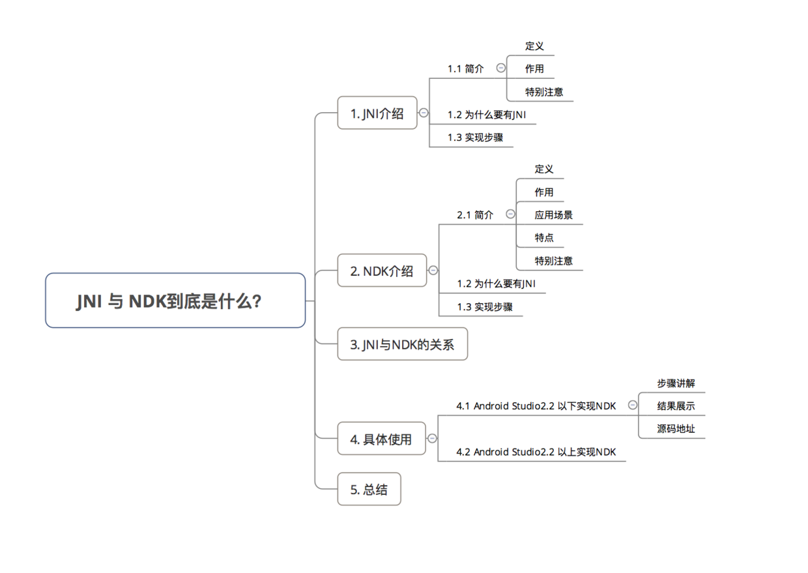

### 1.JNI介绍

1.1简介

- 定义：Java Native Interface，即 Java本地接口

- 作用： 使得Java 与 本地其他类型语言（如C、C++）交互

> 即在 Java代码 里调用 C、C++等语言的代码 或 C、C++代码调用 Java 代码

- 特别注意：

		JNI是 Java 调用 Native 语言的一种特性
		JNI 是属于 Java 的，与 Android 无直接关系

1.2 为什么要有 JNI？

	背景：实际使用中，Java 需要与 本地代码 进行交互
	
	问题：因为 Java 具备跨平台的特点，所以Java 与 本地代码交互的能力非常弱
	
	解决方案： 采用 JNI特性 增强 Java 与 本地代码交互的能力

1.3 实现步骤：

1.在Java中声明Native方法（即需要调用的本地方法）

2.编译上述 Java源文件javac（得到 .class文件）

3.通过 javah 命令导出JNI的头文件（.h文件）

4.使用 Java需要交互的本地代码 实现在 Java中声明的Native方法 

> 如 Java 需要与 C++ 交互，那么就用C++实现 Java的Native方法

5.编译.so库文件

6.通过Java命令执行 Java程序，最终实现Java调用本地代码

### 2.NDK介绍

2.1 简介

- 定义：Native Development Kit，是 Android的一个工具开发包 

> NDK是属于 Android 的，与Java并无直接关系

- 作用：快速开发C、 C++的动态库，并自动将so和应用一起打包成 APK 

	即可通过 NDK在 Android中 使用 JNI与本地代码（如C、C++）交互

- 应用场景：在Android的场景下 使用JNI

> 即 Android开发的功能需要本地代码（C/C++）实现

- 特点

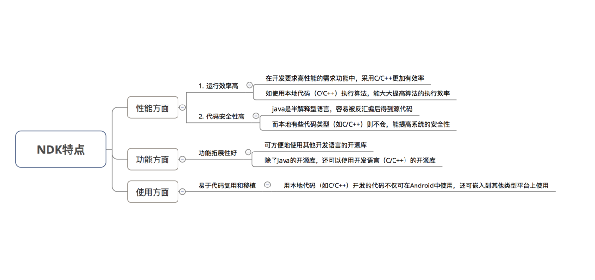

- 额外注意

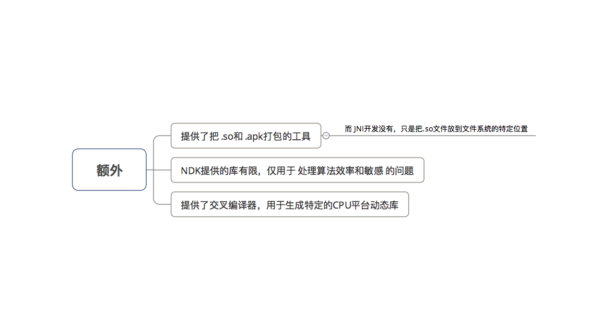

2.2 使用步骤

1.配置 Android NDK环境

2.创建 Android 项目，并与 NDK进行关联

3.在 Android 项目中声明所需要调用的 Native方法

4.使用 Android需要交互的本地代码 实现在Android中声明的Native方法 

> 比如 Android 需要与 C++ 交互，那么就用C++ 实现 Java的Native方法

5.通过 ndk - bulid 命令编译产生.so库文件

6.编译 Android Studio 工程，从而实现 Android 调用本地代码

### 3.NDK与JNI关系

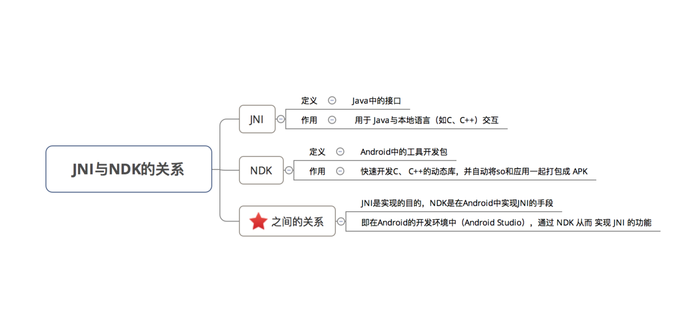

### 4.具体使用

4.1 Android Studio2.2以下实现NDK

- 步骤1：配置 Android NDK环境

(1).下载Android NDK工具包

	本文采用的Android NDK版本是：android-ndk-r14b-darwin-x86_64

(2).解压 NDK包

**注意：** 解压路径 不要出现空格和中文

**建议：** 将解压路径设置为：Android Studio的SDK目录里，并命名为ndk-bundle 

> 解压路径：/Users/Carson_Ho/Library/Android/sdk/ndk-bundle

**好处：** 启动Android Studio时，Android Studio会自动检查它并直接添加到ndk.dir中，那么在使用时，就不用配置Android Studio与NDK的关联工作

(3).安装 & 配置NDK

在终端依次输入下列命令

	// 先输入以下命令
	pico .bash_profile 
	
	// 再依次输入下列命令（后面的路径需要根据你NDK解压路径设置）
	export PATH=${PATH}:/Users/Carson_Ho/Library/Android/sdk/ndk-bundle 
	A_NDK_ROOT=/Users/Carson_Ho/Library/Android/sdk/ndk-bundle
	export A_NDK_ROOT
	// 注意检查空格、中 & 英字符区分
	
	// 输入以下组合命令 进行保存
	control＋X
	// 输入后，选择Y
	
	// 最后，更新刚配置的环境变量
	source .bash_profile
	
	// 验证NDK是否配置成功
	// 1. 关闭终端 并 重新打开
	// 2. 若无错误提示，则成功配置

至此，关于Android NDK的环境配置已经完成

- 步骤2： 关联Andorid Studio项目 与 NDK

你的项目每次需要使用 NDK 时，都需要将该项目关联到 NDK

> 注意：此处使用的是Andorid Studio，与Eclipse不同

具体配置如下：

a. 在Gradle的 local.properties中添加配置

	ndk.dir=/Users/Carson_Ho/Library/Android/sdk/ndk-bundle

若ndk目录存放在SDK的目录中，并命名为ndk-bundle，则该配置自动添加

b. 在Gradle的 gradle.properties中添加配置

	android.useDeprecatedNdk=true 
	// 对旧版本的NDK支持

c. 在Gradle的build.gradle添加ndk节点

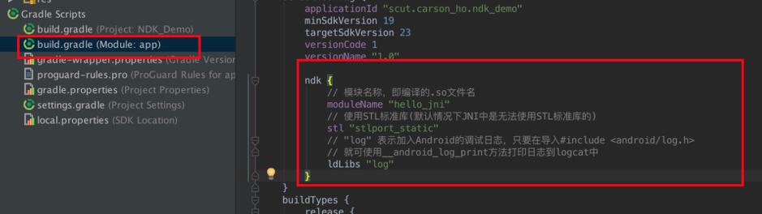

	...
	ndk {
		//模块名称，即编译的.so文件名
		moduleName "hello_jni"
		//使用STL标准库（默认情况下JNI中是无法使用STL标准库）
		stl "stlport_static"
		//"log"表示加入Android的调试日志，只要导入#include <android/log.h>
		//就可使用__android_log_print方法打印日志到logcat中
		ldLibs "log"
	}
	...

至此，将Andorid Studio的项目 与 NDK 关联完毕

- 步骤3：创建本地代码文件

即需要在Android项目中调用的本地代码文件 

> 此处采用 C++作为展示

test.cpp

	# include <jni.h>
	# include <stdio.h>
	
	extern "C"
	{
	
	    JNIEXPORT jstring JNICALL Java_scut_carson_1ho_ndk_1demo_MainActivity_getFromJNI(JNIEnv *env, jobject obj ){
	       // 参数说明
	       // 1. JNIEnv：代表了VM里面的环境，本地的代码可以通过该参数与Java代码进行操作
	       // 2. obj：定义JNI方法的类的一个本地引用（this）
	    return env -> NewStringUTF("Hello i am from JNI!");
	    // 上述代码是返回一个String类型的"Hello i am from JNI!"字符串
	    }
	}

此处需要注意：

1）如果本地代码是C++（.cpp或者.cc），要使用extern "C" { }把本地方法括进去

2）JNIEXPORT jstring JNICALL中的JNIEXPORT 和 JNICALL不能省

3）关于方法名Java_scut_carson_1ho_ndk_1demo_MainActivity_getFromJNI 

	格式 = Java _包名 _ 类名_Java需要调用的方法名
	Java必须大写
	对于包名，包名里的.要改成_，_要改成_1 

> 如我的包名是：scut.carson_ho.ndk_demo，则需要改成scut_carson_1ho_ndk_1demo 
最后，将创建好的test.cpp文件放入到工程文件目录中的src/main/jni文件夹 
若无jni文件夹，则手动创建。

下面我讲解一下JNI类型与Java类型对应的关系介绍:

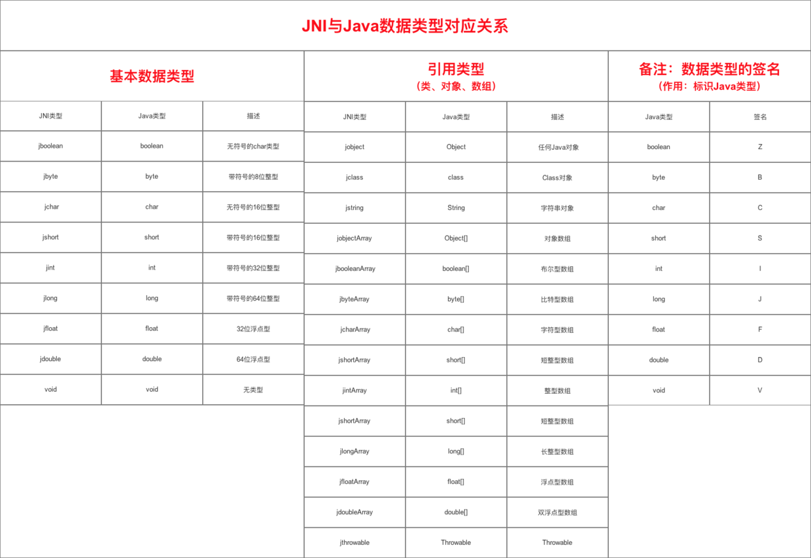

- 步骤4：创建Android.mk文件

作用：指定源码编译的配置信息 

> 如工作目录，编译模块的名称，参与编译的文件等

具体使用：

Android.mk
	
	LOCAL_PATH       :=  $(call my-dir)
	// 设置工作目录，而my-dir则会返回Android.mk文件所在的目录
	
	include              $(CLEAR_VARS)
	// 清除几乎所有以LOCAL——PATH开头的变量（不包括LOCAL_PATH）
	
	LOCAL_MODULE     :=  hello_jni
	// 设置模块的名称，即编译出来.so文件名
	// 注，要和上述步骤中build.gradle中NDK节点设置的名字相同
	
	LOCAL_SRC_FILES  :=  test.cpp
	// 指定参与模块编译的C/C++源文件名
	
	include              $(BUILD_SHARED_LIBRARY)
	// 指定生成的静态库或者共享库在运行时依赖的共享库模块列表。

最后，将上述文件同样放在`src/main/jni`文件夹中。

- 步骤5：创建Application.mk文件

作用：配置编译平台相关内容

具体使用：

*Application.mk*

	APP_ABI := armeabi
	// 最常用的APP_ABI字段：指定需要基于哪些CPU平台的.so文件
	// 常见的平台有armeabi x86 mips，其中移动设备主要是armeabi平台
	// 默认情况下，Android平台会生成所有平台的.so文件，即同APP_ABI := armeabi x86 mips
	// 指定CPU平台类型后，就只会生成该平台的.so文件，即上述语句只会生成armeabi平台的.so文件

最后，将上述文件同样放在`src/main/jni`文件夹中

- 步骤6：编译上述文件，生成.so库文件

经过上述步骤，在src/main/jni文件夹中已经有3个文件

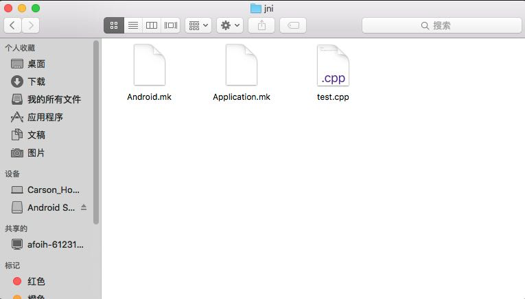

打开终端，输入以下命令:

	// 步骤1：进入该文件夹
	cd /Users/Carson_Ho/AndroidStudioProjects/NDK_Demo/app/src/main/jni 
	// 步骤2：运行NDK编译命令
	ndk-build

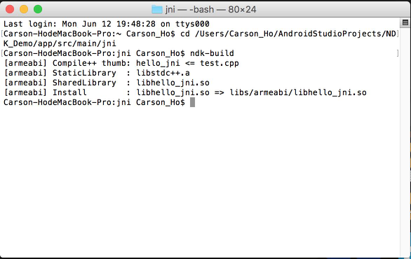

编译成功后，在src/main/会多了两个文件夹libs & obj，其中libs下存放的是.so库文件

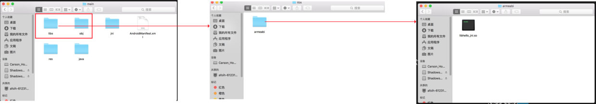

- 步骤7：在src/main/中创建一个名为jniLibs的文件夹，并将上述生成的so文件夹放到该目录下

1.要把名为 CPU平台的文件夹放进去，而不是把.so文件放进去

2.如果本来就有.so文件，那么就直接创建名为jniLibs的文件夹并放进去就可以

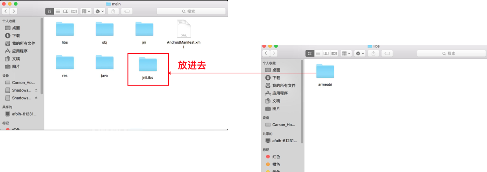

- 步骤8：在Andoird Studio项目中使用NDK实现JNI功能

此时，我们已经将本地代码文件编译成.so库文件并放入到工程文件中

在Java代码中调用本地代码中的方法，具体代码如下：

MainActivity.java

	public class MainActivity extends AppCompatActivity  {
	
	    // 步骤1:加载生成的so库文件
	    // 注意要跟.so库文件名相同
	    static {
	
	        System.loadLibrary("hello_jni");
	    }
	
	    // 步骤2:定义在JNI中实现的方法
	    public native String getFromJNI();
	
	    // 此处设置了一个按钮用于触发JNI方法
	    private Button Button;
	
	    @Override
	    protected void onCreate(Bundle savedInstanceState) {
	        super.onCreate(savedInstanceState);
	        setContentView(R.layout.activity_main);
	
	        // 通过Button调用JNI中的方法
	        Button = (Button) findViewById(R.id.button);
	        Button.setOnClickListener(new View.OnClickListener() {
	            @Override
	            public void onClick(View v) {
	                Button.setText(getFromJNI());
	
	            }
	        });
	    }
	}

主布局文件：activity_main.xml

	<RelativeLayout xmlns:android="http://schemas.android.com/apk/res/android"
	    xmlns:tools="http://schemas.android.com/tools"
	    android:layout_width="match_parent"
	    android:layout_height="match_parent"
	    android:paddingBottom="@dimen/activity_vertical_margin"
	    android:paddingLeft="@dimen/activity_horizontal_margin"
	    android:paddingRight="@dimen/activity_horizontal_margin"
	    android:paddingTop="@dimen/activity_vertical_margin"
	    tools:context="scut.carson_ho.ndk_demo.MainActivity">
	
	    // 此处设置了一个按钮用于触发JNI方法
	    <Button
	        android:id="@+id/button"
	        android:layout_centerInParent="true"
	        android:layout_width="300dp"
	        android:layout_height="50dp"
	        android:text="调用JNI代码" />
	
	</RelativeLayout>

[NDK_Demo](https://github.com/Carson-Ho/NDK_Demo)

4.2 Android Studio2.2以上实现NDK

如果你的Android Studio是2.2以上的，那么请采用下述方法

> 因为Android Studio2.2以上已经内部集成 NDK，所以只需要在Android Studio内部进行配置就可以

步骤讲解：

- 步骤1：按提示创建工程

在创建工程时，需要配置 NDK，根据提示一步步安装即可。

- 步骤2：根据需求使用NDK

配置好NDK后，Android Studio会自动生成C++文件并设置好调用的代码

你只需要根据需求修改C++文件 & Android就可以使用了。

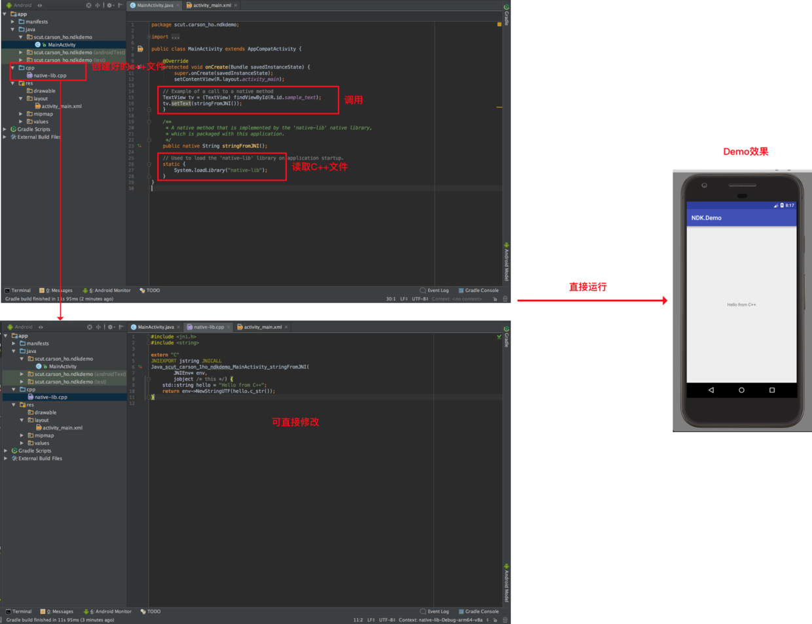

### 5.注册JNI函数的两种方式

5.1 静态方法

这种方法我们比较常见，但比较麻烦，大致流程如下： 

- 先创建Java类，声明Native方法，编译成.class文件。 

- 使用Javah命令生成C/C++的头文件

	例如：javah -jni com.devilwwj.jnidemo.TestJNI，则会生成一个以.h为后缀的文件com_devilwwj_jnidemo_TestJNI.h。 

- 创建.h对应的源文件，然后实现对应的native方法，如下图所示：

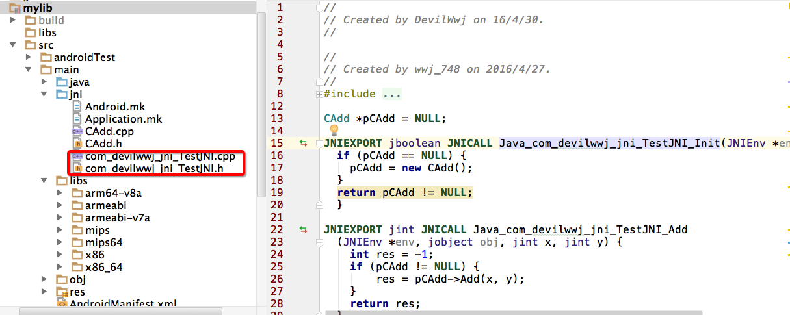

说一下这种方法的弊端：

	需要编译所有声明了native函数的Java类，每个所生成的class文件都得用javah命令生成一个头文件。

	javah生成的JNI层函数名特别长，书写起来很不方便

	初次调用native函数时要根据函数名字搜索对应的JNI层函数来建立关联关系，这样会影响运行效率 
	摘自：深入理解Android卷I

既然有这么多弊端，我们自然要考虑一下有没有其他更好的方法下一节就是我要讲的替代方法，Android用的也是这种方法。

5.2 动态注册

我们知道Java Native函数和JNI函数时一一对应的，JNI中就有一个叫JNINativeMethod的结构体来保存这个对应关系，实现动态注册方就需要用到这个结构体。

举个例子，你就一下子明白了：

声明native方法还是一样的：

	public class JavaHello {
	    public static native String hello();
	}

创建jni目录，然后在该目录创建hello.c文件，如下：

	#include <stdlib.h>
	#include <string.h>
	#include <stdio.h>
	#include <jni.h>
	#include <assert.h>
	
	/**
	 * 定义native方法
	 */
	JNIEXPORT jstring JNICALL native_hello(JNIEnv *env, jclass clazz)
	{
	    printf("hello in c native code./n");
	    return (*env)->NewStringUTF(env, "hello world returned.");
	}
	
	// 指定要注册的类
	#define JNIREG_CLASS "com/devilwwj/library/JavaHello"
	
	// 定义一个JNINativeMethod数组，其中的成员就是Java代码中对应的native方法
	static JNINativeMethod gMethods[] = {
	    { "hello", "()Ljava/lang/String;", (void*)native_hello},
	};
	
	
	static int registerNativeMethods(JNIEnv* env, const char* className,
	JNINativeMethod* gMethods, int numMethods) {
	    jclass clazz;
	    clazz = (*env)->FindClass(env, className);
	    if (clazz == NULL) {
	        return JNI_FALSE;
	    }
	    if ((*env)->RegisterNatives(env, clazz, gMethods, numMethods) < 0) {
	        return JNI_FALSE;
	    }
	    return JNI_TRUE;
	}
	
	/***
	 * 注册native方法
	 */
	static int registerNatives(JNIEnv* env) {
	    if (!registerNativeMethods(env, JNIREG_CLASS, gMethods, sizeof(gMethods) / sizeof(gMethods[0]))) {
	        return JNI_FALSE;
	    }
	    return JNI_TRUE;
	}
	
	/**
	 * 如果要实现动态注册，这个方法一定要实现
	 * 动态注册工作在这里进行
	 */
	JNIEXPORT jint JNICALL JNI_OnLoad(JavaVM* vm, void* reserved) {
	    JNIEnv* env = NULL;
	    jint result = -1;
	
	    if ((*vm)-> GetEnv(vm, (void**) &env, JNI_VERSION_1_4) != JNI_OK) {
	        return -1;
	    }
	    assert(env != NULL);
	
	    if (!registerNatives(env)) { //注册
	        return -1;
	    }
	    result = JNI_VERSION_1_4;
	
	    return result;
	
	}

先仔细看一下上面的代码，看起来好像多了一些代码，稍微解释下，如果要实现动态注册就必须实现JNI_OnLoad方法，这个是JNI的一个入口函数，我们在Java层通过System.loadLibrary加载完动态库后，紧接着就会去查找一个叫JNI_OnLoad的方法。如果有，就会调用它，而动态注册的工作就是在这里完成的。在这里我们会去拿到JNI中一个很重要的结构体JNIEnv，env指向的就是这个结构体，通过env指针可以找到指定类名的类，并且调用JNIEnv的RegisterNatives方法来完成注册native方法和JNI函数的对应关系。

我们在上面看到声明了一个JNINativeMethod数组，这个数组就是用来定义我们在Java代码中声明的native方法，我们可以在jni.h文件中查看这个结构体的声明：

	typedef struct {
	    const char* name;
	    const char* signature;
	    void*       fnPtr;
	} JNINativeMethod;

结构体成员变量分别对应的是Java中的native方法的名字，如本文的hello；Java函数的签名信息、JNI层对应函数的函数指针。

以上就是动态注册JNI函数的方法，上面只是一个简单的例子，如果你还想再实现一个native方法，只需要在JNINativeMethod数组中添加一个元素，然后实现对应的JNI层函数即可，下次我们加载动态库时就会动态的将你声明的方法注册到JNI环境中，而不需要你做其他任何操作。

## 参考文档 vs 面试题

[JNI 与 NDK](https://blog.csdn.net/carson_ho/article/details/73250163)

[Android NDK环境配置](https://blog.csdn.net/carson_ho/article/details/73250111)

1.什么是NDK库 ？

（见上文）

2.Java如何调用c、c++语言？JNI如何调用java层代码？ 

（见上文）

3.如何在JNI中注册native函数，有几种注册方式? 

（见上文）

4.你用JNI来实现过什么功能吗？怎么实现的？ 

加密处理、影音方面、图形图像处理 

当出现一些用java语言无法处理的任务时，开发人员就可以利用JNI技术来完成。一般来说下面几种情况需要用到JNI技术：

	1.开发时，需要调用java语言不支持的依赖于操作系统平台的特性的一些功能。
	例如：需要调用当前的Unix系统的某个功能，而java不支持这个功能，就需要用到JNI技术来实现。
	
	2.开发时，为了整合一些以前的非java语言开发的某些系统。
	例如，需要用到开发早期实现的一些C或C++语言开发的一些功能或系统，将这些功能整合到当前的系统或新的版本中。
	
	3.开发时，为了节省程序的运行时间，必须采用一些低级或中级语言。
	例如为了创建一个省时的应用，不得不采用汇编语言，然后采用java语言通过JNI技术调用这个低级语言的应用。