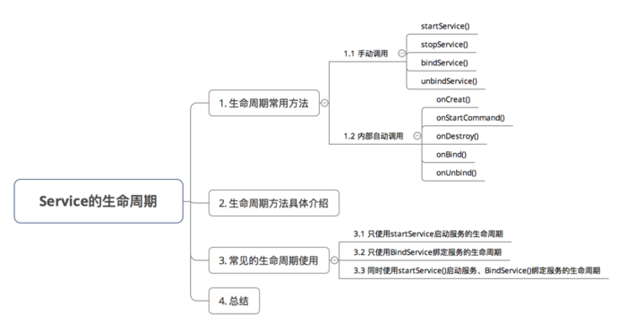
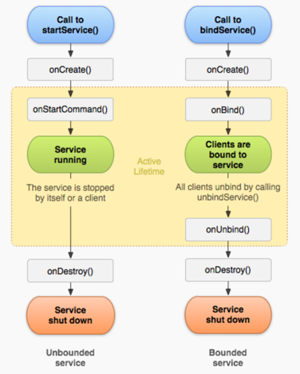

# 四大组件之一 -> Service

## 应用场景

1.下载app服务

2.Android MQTT消息推送（营业厅取号服务）

## 介绍

Service（服务）一个运行在后台执行长时间运行的操作组件，它不提供任何用户界面，作为与Activity同级的组件，它依旧是运行在主线程中。

其它组件可以启动一个Service，当这个Service启动之后便会在后台执行，这里需要注意，由于是在主线程中，所以我们需要另外开启一个线程来执行我们的耗时操作。

此外，一个组件还可以与一个Service进行绑定来实现组件之间的交互，甚至可以执行IPC进程间通信。

Service可以在后台执行很多任务，比如处理网络事务，播放音乐，文件读写或者与一个内容提供者交互，等等---

## 服务分类

1、本地服务（Local）

该服务依附在主进程上而不是独立的进程，这样在一定程度上节约了资源，另外本地服务因为是在同一进程因此不需要IPC，也不需要AIDL。

相应bindService会方便很多，当主进程被Kill后，服务便会终止。一般使用在音乐播放器播放等不需要常驻的服务。

2、远程服务(Remote Service)

该服务是独立的进程，对应进程名格式为所在包名加上你指定的android:process字符串。

一般定义方式 

	android:process=":service" 

由于是独立的进程，因此在Activity所在进程被Kill的时候，该服务依然在运行，不受其他进程影响，有利于为多个进程提供服务具有较高的灵活性。

由于是独立的进程，会占用一定资源，并且使用AIDL进行IPC比较麻烦。一般用于系统的Service，这种Service是常驻的

## Service启动方式

1、startService启动的服务

用于启动一个服务执行后台任务，不与组件进行通信，停止服务使用stopService。 

当一个应用组件比如activity通过调用startService()来启动一个服务的时候，服务便处于启动状态。一旦启动，服务可以在后台无限期地运行下去，即使当启动它的组件已经销毁。

通常情况下，一个启动的service执行一个单一的操作并且不会返回任何结果给调用者。

2、bindService启动的服务

用于启动的服务需要进行通信。停止服务使用unbindService。 

当一个应用组件通过调用bindService()来与一个服务绑定时，服务便处于绑定状态。

一个绑定的服务提供了一个客户端-服务器端接口来允许组件与服务进行交互，发送请求，得到结果甚至通过IPC进程间通信来完成操作。只有当其它组件与服务进行绑定时，服务才会处于绑定状态。

多个组件可以同时与服务绑定，但是当他们全部都解除绑定时，服务就会销毁

## 服务的生命周期

1、StartService：

一个Service被使用startService方法启动，不管是否调用了bindService（绑定服务）或unbindService（解除绑定服务）到该Service，该Service都会在后台运行并不受影响。

一个Service被使用startService方法启动多少次，onCreate方法只会调用一次，**onStartCommand方法将会被调用多次（与startService的次数一致）**，且系统只会创建一个Service实例（结束该Service也只需要调用一次stopService），该Service会一直在后台运行直至调用stopService或调用自身的stopSelf方法。

**注：在系统资源不足的情况下，服务有可能被系统结束（kill）**；

2、BindService：

如果一个Service在某个Activity中被调用bindService方法启动，不论bindService被调用几次，Service的onCreate方法只会执行一次，同时onStartCommand方法始终不会调用。

当建立连接后，Service会一直运行，除非调用unbindService来解除绑定、断开连接或调用该Service的Context不存在了（如Activity被Finish——即通过bindService启动的Service的生命周期依附于启动它的Context），系统在这时会自动停止该Service

3、StartService and BindService：

当一个Service在被启动(startService 的同时又被绑定(bindService )，该Service将会一直在后台运行，并且不管调用几次，onCreate方法始终只会调用一次，onStartCommand的调用次数与startService 调用的次数一致（使用bindService 方法不会调用onStartCommand）。

同时，调用unBindService 不会停止Service，必须调用stopService 或Service自身的stopSelf 来停止服务。

4、停止Service：

当一个服务被终止（stopService 、stopSelf 、unbindService ）时，onDestory方法将会被调用——所以我们需要在该方法中清除一些工作（依附该Service生命周期上的，比如：停止在Service中创建并运行的线程）。

**特别注意**：

	1.在使用startService方法启动服务后，一定要调用stopService方法来停
	止该服务（同上，可以在Activity的onDestory中来停止服务）；
	
	2.在某处调用bindService绑定Service的时候，要在对应的某处调用 unbindService来解除绑定。
	（如在Activity中绑定了Service，可以在onDestory中来解除绑定——虽然绑定的Service会在Activity结束时自动解除、停止）；
	
	3.如果同时使用startService与bindService方法启动Service，
	需要终止该Service时，要调用stopService和unbindService方法。
	（unbindService依附于启动它的Context，startServicec并不依附于启动它的Context。
	如果先调用unbindService，这时服务并不会被终止，当调用stopService后，服务才会被终止；
	如果先调用stopService，服务也不会被终止，当调用unbindService或者之前调用bindService的Context不存在了
	（如Activity被finish掉了）服务才会自动停止）；
	
	4.当手机屏幕发生旋转时，如果Activity设置的是自动旋转的话，在旋转的过程中，Activity会重新创建，
	那么之前通过bindService建立的连接便会断开(之前的Context不存在了)，服务也会被自动停止。
	

## Service使用

1.创建服务

	public class MyService extends Service{
 
	    //服务创建
	    @Override
	    public void onCreate() {
	        super.onCreate();
	    }
	    
	    // 服务启动
	    @Override
	    public int onStartCommand(Intent intent, int flags, int startId) {
	        return super.onStartCommand(intent, flags, startId);
	    }
	    
	    //服务销毁
	    @Override
	    public void onDestroy() {
	        stopSelf(); //自杀服务
	        super.onDestroy();
	    }
	   
	    //绑定服务
	    @Nullable
	    @Override
	    public IBinder onBind(Intent intent) {
	        return new MyBinder();
	    }

	    // IBinder是远程对象的基本接口，是为高性能而设计的轻量级远程调用机制的核心部分。但它不仅用于远程 
	    // 调用，也用于进程内调用。这个接口定义了与远程对象交互的协议。
	    // 不要直接实现这个接口，而应该从Binder派生。 
	    // Binder类已实现了IBinder接口 
	    class MyBinder extends Binder { 
	            /** * 获取Service的方法 * @return 返回PlayerService */ 
	            public MyService getService(){ 
	                   return MyService.this;   
	            } 
	     }
	}

如果你用的是 startService的方式那么 onBind方法可以忽略

2.注册服务

 	<service
            android:name=".service.MyService"
            android:exported="true"
            android:label="MyService" />

3.开启服务

start

	public class MyActivity extends AppCompatActivity{
	　　private Intent intent;

	　　@Override
	　　protected void onCreate(Bundle savedInstanceState) {
	　　　　super.onCreate(savedInstanceState);
	　　　　setContentView(R.layout.activity_main);
		   //启动服务
	　　　　intent = new Intent(this, MyService.class);
	　　　　startService(intent);
	　　}

	　　@Override
	　　protected void onDestroy() {
	　　　　super.onDestroy();
	　　　　stopService(intent);// 在退出Activity时停止该服务,如果希望常驻后台，可以不进行停止。
	　　}
	}

bind

	public class MyActivity extends Activity{
	　　@Override
	　　protected void onCreate(Bundle savedInstanceState) {
	　　　　super.onCreate(savedInstanceState);
	　　　　setContentView(R.layout.activity_main);
	       //绑定目标Service
	　　　　Intent intent = new Intent(this, MyActivity.class);
	　　　　bindService(intent, serviceConnection,  Context.BIND_AUTO_CREATE);
	　　}

	　　@Override
	　　protected void onDestroy() {
	　　　　super.onDestroy();
	　　　　unbindService(serviceConnection);// 解除绑定，断开连接
	　　}

	　　// 在Activity中，我们通过ServiceConnection接口来取得建立连接与连接意外丢失的回调
	　　ServiceConnection serviceConnection = new ServiceConnection() {        　　　　
		   @Override
	　　　　public void onServiceConnected(ComponentName name, IBinder service){
	　　　　　　// 建立连接
	　　　　　　// 获取服务的操作对象
	           MyService.MyBinder binder = (MyService.MyBinder)service;
	           binder.getService();// 获取到的Service即MyService
	　　　　} 

	　　　　@Override
	　　　　public void onServiceDisconnected(ComponentName name) {
	　　　　　　// 连接断开
	　　　　}
	　　};
	}

绑定服务，一般涉及到组件或进程之间的通信，既然需要通信，那么我们肯定需要一个连接，这里ServiceConnection就是我们所需要的连接，通过Ibinder的传递，我们可以获取到Service的Ibinder对象，从而进行相关操作

## 粘性服务、非粘性服务

关于粘性服务，这里需要提到 Service的onStartCommand返回值

	START_STICKY：
	sticky的意思是“粘性的”。
	使用这个返回值时，我们启动的服务跟应用程序"粘"在一起，如果在执行完onStartCommand后，服务被异常kill掉，
	系统会自动重启该服务。当再次启动服务时，传入的第一个参数将为null;

	START_NOT_STICKY：
	“非粘性的”。
	使用这个返回值时，如果在执行完onStartCommand后，服务被异常kill掉，系统不会自动重启该服务。

	START_REDELIVER_INTENT：
	重传Intent。
	使用这个返回值时，如果在执行完onStartCommand后，服务被异常kill掉，系统会自动重启该服务，并将Intent的值传入。

## AndroidManifest.xml中Service元素常见属性

	andorid:name
	服务类名。可以是完整的包名+类名。也可使用. 代替包名。
	
	adroid:exported
	其他应用能否访问该服务，如果不能，则只有本应用或有相同用户ID的应用能访问。默认为false。
	
	android:enabled
	标识服务是否可以被系统实例化。true--系统默认启动，false--不启动。(默认值为true)
	
	android:label
	显示给用户的服务名称。如果没有进行服务名称的设置，默认显示服务的类名。
	
	android:process
	服务所运行的进程名。默认是在当前进程下运行，与包名一致。
	如果进行了设置，将会在包名后加上设置的集成名。
	如果名称设置为冒号: 开头，一个对应用程序私有的新进程会在需要时和运行到这个进程时建立。
	如果名称为小写字母开头，服务会在一个相同名字的全局进程运行，如果有权限这样的话，
	这允许不同应用程序的组件可以分享一个进程，减少了资源的使用。
	
	android:icon
	服务的图标。
	
	android:permission
	申请使用该服务的权限，如果没有配置下相关权限，服务将不执行，
	使用startService() 、bindService()方法将都得不到执行。
	
	关于服务，当我们在应用开发中，如果需要长时间的在后台运行，独立完成某一些事情的情况下，请使用Service！

## Activity 与 Service 通信方式

1.binder + 回调(listener)

主要思路：Acitivity 将实例传入 Service，同时利用回调更新UI

2.binder + Handler

主要思路：Service 持有 Activity的Handler 对象，Service 通过往该Handler send message 的方式，达到通信的目的。

3.广播 （推荐LocalBroadcastManager）

主要思路：利用系统的LocalBroadcastManager，Service send message， Activity receive message；

4.开源组件(EventBus，otto)

主要思路：利用反射或者注释的方式实现对注册类的注册，然后遍历当前的注册表，通过key进行查询，然后dispatch，调用相应的事件处理方法。（不同的开源框架实现有所区别）

5.AIDL （Android Interface Definition Language，Android接口定义语言）

[进程间通信-IPC/使用AIDL](进程间通信-IPC.md)

**总结**

目前Android 组件之间主流的通信方式如上所述的5种，哪种对于项目更加合适，需要考虑的适用情况有：

	1)、进程内通信还是进程间通信
	2)、一对一通信，还是一对多
	3)、单向还是双向
	4)、性能
	5)、其他(安全性，代码可读性，实现复杂性)等等；

	public class MainActivity extends Activity implements View.OnClickListener, OnProgressListener, Handler.Callback{
	
		private DownloadService mDownloadService;
		private ProgressBar mProgressBar;
		
		private LocalBroadcastManager mLocalBroadcastManager;
		
		@Override
		protected void onCreate(Bundle savedInstanceState) {
		    super.onCreate(savedInstanceState);
		    setContentView(R.layout.activity_main);
		
		    mProgressBar = (ProgressBar)findViewById(R.id.progressBar);
		    findViewById(R.id.button1).setOnClickListener(this);
		    findViewById(R.id.button2).setOnClickListener(this);
		
		    Intent intent = new Intent("com.example.downloadservice");
		    bindService(intent, serviceConnection, BIND_AUTO_CREATE);
		
		    mLocalBroadcastManager = LocalBroadcastManager.getInstance(this);
		
		    EventBus.getDefault().register(this);
		}
		
		@Override
		protected void onResume() {
		    super.onResume();
		    mLocalBroadcastManager.registerReceiver(mBroadcastReceiver, new IntentFilter("from_downloadService"));
		}
		
		@Override
		protected void onDestroy() {
		    unbindService(serviceConnection);
		    mLocalBroadcastManager.unregisterReceiver(mBroadcastReceiver);
		    EventBus.getDefault().unregister(this);
		    super.onDestroy();
		}
		
		/**
		 * 通信方式四：第三方开源组件eventbus
		 * @param progressEvent
		 */
		public void onEvent(ProgressEvent progressEvent) {
		    mProgressBar.setProgress(progressEvent.getProgress());
		}
		
		/**
		 * 通信方式一
		 * @param progress
		 */
		@Override
		public void OnProgress(int progress) {
		    mProgressBar.setProgress(progress);
		}
		
		
		/**
		 * 通信方式二
		 * @param message
		 */
		@Override
		public boolean handleMessage(Message message) {
		    mProgressBar.setProgress(message.what);
		    return false;
		}
		
		@Override
		public void onClick(View view) {
		    int id = view.getId();
		    switch (id) {
		        case R.id.button1:
		            mDownloadService.startDownload();
		            break;
		        case R.id.button2:
		            break;
		        default:
		            break;
		    }
		}
		
		ServiceConnection serviceConnection = new ServiceConnection() {
		    @Override
		    public void onServiceConnected(ComponentName componentName, IBinder iBinder) {
		        mDownloadService = ((DownloadService.MsgBinder) iBinder).getService();
		
		        /**
		         * 通信方式一
		         */
		        /*if (mDownloadService != null) {
		            mDownloadService.setOnProgressListener(MainActivity.this);
		        }*/
		
		        /**
		         * 通信方式二
		         * //TODO:考虑内存泄露
		         */
		        /*if (mDownloadService != null) {
		            mDownloadService.setHandler(new Handler(MainActivity.this));
		        }*/
		    }
		
		    @Override
		    public void onServiceDisconnected(ComponentName componentName) {
		    }
		};
		
		/**
		 * 通信方式三
		 */
		BroadcastReceiver mBroadcastReceiver = new BroadcastReceiver() {
		    @Override
		    public void onReceive(Context context, Intent intent) {
		        mProgressBar.setProgress(intent.getIntExtra("KEY_PROGRESS", -1));
		    }
		};
	}

	public class DownloadService extends Service {
	
		public final static int MAX_PROGRESS = 100;
		
		private int mProgress = 0;
		
		private OnProgressListener mOnProgressListener;
		
		private Handler mHandler;
		
		public DownloadService() {
		}
		
		@Override
		public IBinder onBind(Intent intent) {
		    return new MsgBinder();
		}
		
		/**
		 * 通信方式一：通过回调的方式
		 * @param onProgressListener
		 */
		public void setOnProgressListener(OnProgressListener onProgressListener) {
		    this.mOnProgressListener = onProgressListener;
		}
		
		/**
		 * 通信方式二：通过持有Activity handler的方式
		 * @param handler
		 */
		public void setHandler(Handler handler) {
		    this.mHandler = handler;
		}
		
		/**
		 * //TODO:考虑并发性
		 */
		public void startDownload() {
		    new Thread(new Runnable() {
		        @Override
		        public void run() {
		            while (mProgress < MAX_PROGRESS) {
		                mProgress += 5;
		
		                /**
		                 * 通信方式一
		                 */
		                /*if (mOnProgressListener != null) {
		                    mOnProgressListener.OnProgress(mProgress);
		                }*/
		
		                /**
		                 * 通信方式二
		                 */
		                /*if (mHandler != null) {
		                    Message message = new Message();
		                    message.what = mProgress;
		                    mHandler.sendMessage(message);
		                }*/
		
		
		                /**
		                 * 通信方式三
		                 */
		                /*Intent intent = new Intent("from_downloadService");
		                intent.putExtra("KEY_PROGRESS", mProgress);
		                LocalBroadcastManager.getInstance(DownloadService.this).sendBroadcast(intent);*/
						
						/**
		                 * 通信方式四：第三方开源组件eventbus
		                 */
		                EventBus.getDefault().post(new ProgressEvent(mProgress));
		
		                try {
		                    Thread.sleep(1000);
		                } catch (Exception e) {
		                    e.printStackTrace();
		                }
		            }
		        }
		    }).start();
		}
		
		public class MsgBinder extends Binder {
		
		    public DownloadService getService() {
		        return DownloadService.this;
		    }
		}
	}

	public interface OnProgressListener {
	    void OnProgress(int progress);
	}
	

	public class ProgressEvent {
		public ProgressEvent(int mProgress) {
		    this.mProgress = mProgress;
		}
		
		public int getProgress() {
		    return mProgress;
		}
		
		public void setProgress(int mProgress) {
		    this.mProgress = mProgress;
		}
		
		private int mProgress = 0;
	
	}

## 参考文档 vs 面试题

[Android 四大组件：Service 知识讲解攻略](https://www.jianshu.com/p/d963c55c3ab9)

[Android（本地、可通信的、前台、远程）Service使用全面介绍](https://www.jianshu.com/p/e04c4239b07e)

1.Activity 怎么和Service 绑定？

(见上文)

2.Service的开启方式？

(见上文)

3.请描述一下Service 的生命周期？

(见上文)

4.Service和Activity怎么进行数据交互？ 

(见上文)