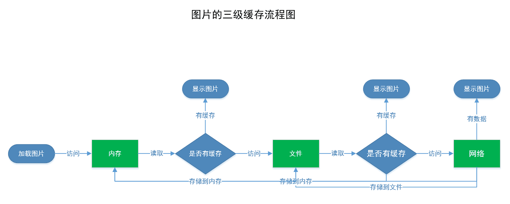

# 图片

## Android中图片的三级缓存浅析

图片的三级缓存机制一般是指应用加载图片的时候，分别去访问内存，文件和网络而获取图片数据的一种行为。

##### 1.三级缓存流程图

##### 2.代码框架搭建

2.1 with(context)

这个方法传入上下文，返回ImageManager对象。

	/**
	* 初始化对象
	*
	* @param context
	* @return
	*/
	public static ImageManager with(Context context) {
	  mContext = context;
	  return getInstance();
	}

因为ImageManager会不断的调用，所以要做成单列。

	/**
	* 获取对象的单列
	* @return
	*/

	private volatile static  ImageManager instance = null;  
    private ImageManager(){}  
    public static ImageManager getInstance() {  
        if (instance == null) {  
            synchronized (ImageManager.class) {  
                if (instance == null) {  
                    instance = new ImageManager();  
                }  
            }  
        }  
        return instance;  
    }

2.2 load(url)

这个方法返回一个自定义的RequestCreator内部类，对图片的操作都在这个内部类中进行。

	/**
	* 加载图片的url地址，返回RequestCreator对象
	*
	* @param url
	* @return
	*/
	public RequestCreator load(String url) {
	
	  return new RequestCreator(url);
	}

RequestCreator的构造方法中接收传入的url 。

	// 初始化图片的url地址
	public RequestCreator(String url) {
	  this.url = url;
	}

2.3 into(imageview)

这是RequestCreator类的方法，也是工具类的核心方法，这个方法里进行图片的三个缓存处理。

- 实例

使用自己封装的图片缓存工具类加载图片

	ImageManager.with(mContext).load(imgUrl).placeholder(R.drawable.ic_default).error(R.drawable.ic_error).into(ivImage);

##### 3.内存缓存

3.1 Java中对象的四种引用类型介绍

- 强引用

Java中所有new出来的对象都是强引用类型，回收的时候，GC宁愿抛出OOM异常，也不回收它。

	Map<String, Bitmap> mImageCache = new HashMap<>();

- 软引用，SoftReference

内存足够时，不回收。内存不够时，就回收。这里使用这种方式缓存对象。
	
	Map<String, SoftReference<Bitmap>> mImageCache = new HashMap<>();

- 弱引用，WeakReference

GC一出来工作就回收它。

- 虚引用，PhantomReference

用完就消失。

3.2 使用LruCache类来做缓存

LruCache其实是一个Hash表，内部使用的是LinkedHashMap存储数据。使用LruCache类可以规定缓存内存的大小，并且这个类内部使用到了 最近最少使用算法 来管理缓存内存

3.3 代码实现内存缓存

a.创建缓存集合

	/**
	* 内存储存图片的集合
	* 使用lrucache缓存图片,这里不能申明在方法里，不然会被覆盖掉
	* 使用软引用类型对象
	* 4兆的大小作为缓存
	*/
	private LruCache<String, SoftReference<Bitmap>> mImageCache = new LruCache<>(1024 * 1024 * 4);

b.访问内存时先从集合中取出软引用，获取BitMap

	// 1 去内存之中找，有就显示，没有就往下走
	SoftReference<Bitmap> reference = mImageCache.get(url);
	Bitmap cacheBitmap;
	if(reference != null){
	  cacheBitmap = reference.get();
	  // 有就显示图片
	  imageView.setImageBitmap(cacheBitmap);
	
	  Log.d("RequestCreator:", "内存中有图片显示");
	  // 不往下走了
	  return;
	}

c.如果缓存集合中的数据为空，就继续往下走

##### 4.文件缓存

4.1 缓存文件存储的路径设定

存储的路径首先要考虑SD卡的缓存目录，当SD卡不存在时，就只能存到内部存储的缓存目录了

	/**
	* 获取缓存路径目录
	*/
	private File getCacheDir() {
	
	  // 获取保存的文件夹路径
	  File file;
	  if (Environment.getExternalStorageState() == Environment.MEDIA_MOUNTED) {
	      // 有SD卡就保存到sd卡
	      file = mContext.getExternalCacheDir();
	  } else {
	      // 没有就保存到内部储存
	      file = mContext.getCacheDir();
	  }
	  return file;
	}

4.2 解析文件生成Bitmap对象

存储的文件的名字截取URL中的名字

文件名使用Md5加密

	/**
	* 从文件中获取bitmap
	*
	* @return
	*/
	private Bitmap getBitmapFromFile() {
	  // 从url中获取文件名字
	  String fileName = url.substring(url.lastIndexOf("/") + 1);
	
	  File file = new File(getCacheDir(),MD5Util.encodeMd5(fileName));
	  // 确保路径没有问题
	  if (file.exists() && file.length() > 0) {
	      // 返回图片
	      return BitmapFactory.decodeFile(file.getAbsolutePath());
	  } else {
	      return null;
	  }
	}

4.3 判断是否有缓存

有缓存则读取出来显示，并且将缓存存入内存，没有就继续往下走

	// 2 去本地硬盘中找，有就显示，没有就继续往下走
	// 将文件转换成bitmap对象
	Bitmap diskBitmap = getBitmapFromFile();
	if (diskBitmap != null) {
	  // 本地磁盘有就显示图片
	  imageView.setImageBitmap(diskBitmap);
	
	  // 保存到内存中去
	  mImageCache.put(url, new SoftReference<Bitmap>(diskBitmap));
	
	  Log.d("RequestCreator:", "磁盘中有图片显示");
	
	  // 不往下走了
	  return;
	}

##### 5.联网加载

5.1 简单线程池处理耗时的网络请求

创建线程池对象

	/**
	* 构建出线程池，5条线程
	*/
	private  ExecutorService mExecutorService = Executors.newFixedThreadPool(5);

提交任务，让RequestCreator实现Runnable接口，run方法中执行任务

	// 联网请求数据
	// 前面两步都没有的话就去联网加载数据
	// 将从网络上获取的数据放到线程池去执行
	mExecutorService.submit(this);

5.2 联网加载数据

使用HttpUrlConnection连接网络

	// 子线程
	// 处理网络请求
	try {
	  URL loadUrl = new URL(url);
	  HttpURLConnection conn = (HttpURLConnection) loadUrl.openConnection();
	
	  conn.setRequestMethod("GET");
	  conn.setConnectTimeout(2000);
	
	  if (conn.getResponseCode() == 200) {
	      InputStream is = conn.getInputStream();
	
	      // 获取到图片进行显示
	      final Bitmap bm = BitmapFactory.decodeStream(is);
	
	      mHandler.post(new Runnable() {
	          @Override
	          public void run() {
	              // 主线程
	              imageView.setImageBitmap(bm);
	          }
	      });
	
	      Log.d("RequestCreator:", "联网显示图片");
	  } else {
	      // 联网失败,显示失败图片
	      showError();
	  }
	} catch (Exception e) {
	  e.printStackTrace();
	  // 发生异常显示失败图片
	  showError();
	}

5.3 保存数据到内存和文件

使用缓存保存数据

	// 3.1 保存到内存
	mImageCache.put(url, new SoftReference<>(bm));
	
	// 3.2 保存到磁盘
	// 从url中获取文件名字
	String fileName = url.substring(url.lastIndexOf("/") + 1);
	
	// 获取存储路径
	File file = new File(getCacheDir(), MD5Util.encodeMd5(fileName));
	FileOutputStream os = new FileOutputStream(file);
	// 将图片转换为文件进行存储
	bm.compress(Bitmap.CompressFormat.JPEG, 100, os);

##### 6.细节处理

6.1 设置占位图

界面一上来加载图片时肯定是空白的，所以需要一张占位图。

RequestCreator类提供一个方法，将占位图片资源ID传进来

	/**
	* 设置默认图片，占位图片
	*
	* @param holderResId
	*/
	public RequestCreator placeholder(int holderResId) {
	  this.holderResId = holderResId;
	
	  return this;
	}

在into方法中，读取缓存之前，就让默认图显示

	// 一进来先设置占位图片
	imageView.setImageResource(holderResId);

6.2 设置错误图片

加载数据出现错误和异常都显示错误图片

	/**
	* 显示错误图片
	*/
	private void showError() {
	  mHandler.post(new Runnable() {
	      @Override
	      public void run() {
	          imageView.setImageResource(errorResId);
	      }
	  });
	}

## glide4.x 的使用

1.基本用法

加载图片

	Glide.with(fragment)
	    .load(url)
	    .into(imageView);

取消加载图片

	Glide.with(fragment).clear(imageView);

2.加载占位图

加载过程中的占用(Placeholder)

	RequestOptions requestOptions = new RequestOptions();
	requestOptions.placeholder(R.drawable.placeholder);
	requestOptions.transform(new GlideCircleformation());
	
	Glide.with(this).load(url).apply(requestOptions).into(imageView);

加载失败后显示的图片(Error)

	RequestOptions requestOptions = new RequestOptions();
	requestOptions.error(R.drawable.error);
	requestOptions.transform(new GlideCircleformation());

	Glide.with(this).load(url).apply(requestOptions).into(imageView);

3.图片的转换

Glide中的大部分设置项都可以通过 RequestOptions 类和 apply() 方法来应用到程序中。 
使用 request options 可以实现（包括但不限于）：

	占位图(Placeholders)
	转换(Transformations)
	缓存策略(Caching Strategies)
	组件特有的设置项，例如编码质量，或Bitmap的解码配置等。

4.加载圆形图片

	Glide.with(this)
	    .load(url)
	    .apply(RequestOptions.circleCropTransform())
	    .into(imageView);

5.加载图片带淡入淡出的动画效果

	 Glide.with(this)
	    .load(url)
	    .transition(withCrossFade())
	    .into(imageView);

6.缓存

Glide的默认缓存策略是AUTOMATIC

6.1在磁盘缓存
	
	Glide.with(fragment)
	.load(url)
	.into(imageView);

	RequestOptions requestOptions = new RequestOptions();
    requestOptions.placeholder(R.drawable.a1);
    requestOptions.diskCacheStrategy(DiskCacheStrategy.ALL)

    Glide.with(this).load(url).apply(requestOptions).into(imageView);

6.2仅从缓存加载图片

	Glide.with(fragment)
	  .load(url)
	  .onlyRetrieveFromCache(true)
	  .into(imageView);

6.3跳过内存缓存

	Glide.with(fragment)
	  .load(url)
	  .skipMemoryCache(true)
	  .into(imageView);

6.4跳过磁盘缓存

	Glide.with(fragment)
	  .load(url)
	  .diskCacheStrategy(DiskCacheStrategy.NONE)
	  .into(imageView);

6.5跳过所有的缓存

	Glide.with(fragment)
	  .load(url)
	  .diskCacheStrategy(DiskCacheStrategy.NONE)
	  .skipMemoryCache(true)
	  .into(imageView);

6.6清理磁盘的缓存

	Glide.get(applicationContext).clearDiskCache();

7.高级用法

加载一个图片为高斯模糊效果

	Glide.with(getActivity())
	.load("http://img1.imgtn.bdimg.com/it/u=594559231,2167829292&fm=27&gp=0.jpg")
	.apply(RequestOptions.bitmapTransform(new GlideBlurformation(getActivity())))
	.into(ivTest);

用到的其他工具类

GlideBlurformation.java

	package com.jie.utils;
	
	import android.content.Context;
	import android.graphics.Bitmap;
	import android.support.annotation.NonNull;
	
	import com.bumptech.glide.load.engine.bitmap_recycle.BitmapPool;
	import com.bumptech.glide.load.resource.bitmap.BitmapTransformation;
	
	import java.security.MessageDigest;
	
	public class GlideBlurformation extends BitmapTransformation {
	    private Context context;
	
	    public GlideBlurformation(Context context) {
	        this.context = context;
	    }
	
	    @Override
	    protected Bitmap transform(@NonNull BitmapPool pool, @NonNull Bitmap toTransform, int outWidth, int outHeight) {
	        return BlurBitmapUtil.instance().blurBitmap(context, toTransform, 20,outWidth,outHeight);
	    }
	
	    @Override
	    public void updateDiskCacheKey(MessageDigest messageDigest) {
	
	    }
	}

BlurBitmapUtil.java

	package com.jie.utils;
	
	import android.annotation.TargetApi;
	import android.content.Context;
	import android.graphics.Bitmap;
	import android.os.Build;
	import android.renderscript.Allocation;
	import android.renderscript.Element;
	import android.renderscript.RenderScript;
	import android.renderscript.ScriptIntrinsicBlur;

	public class BlurBitmapUtil {
	
	    private static BlurBitmapUtil sInstance;
	
	    private BlurBitmapUtil() {
	    }
	
	    public static BlurBitmapUtil instance() {
	        if (sInstance == null) {
	            synchronized (BlurBitmapUtil.class) {
	                if (sInstance == null) {
	                    sInstance = new BlurBitmapUtil();
	                }
	            }
	        }
	        return sInstance;
	    }
	
	    /**
	     * @param context   上下文对象
	     * @param image     需要模糊的图片
	     * @param outWidth  输入出的宽度
	     * @param outHeight 输出的高度
	     * @return 模糊处理后的Bitmap
	     */
	    @TargetApi(Build.VERSION_CODES.JELLY_BEAN_MR1)
	    public Bitmap blurBitmap(Context context, Bitmap image, float blurRadius, int outWidth, int outHeight) {
	        // 将缩小后的图片做为预渲染的图片
	        Bitmap inputBitmap = Bitmap.createScaledBitmap(image, outWidth, outHeight, false);
	        // 创建一张渲染后的输出图片
	        Bitmap outputBitmap = Bitmap.createBitmap(inputBitmap);
	
	        // 创建RenderScript内核对象
	        RenderScript rs = RenderScript.create(context);
	        // 创建一个模糊效果的RenderScript的工具对象
	        ScriptIntrinsicBlur blurScript = ScriptIntrinsicBlur.create(rs, Element.U8_4(rs));
	
	        // 由于RenderScript并没有使用VM来分配内存,所以需要使用Allocation类来创建和分配内存空间
	        // 创建Allocation对象的时候其实内存是空的,需要使用copyTo()将数据填充进去
	        Allocation tmpIn = Allocation.createFromBitmap(rs, inputBitmap);
	        Allocation tmpOut = Allocation.createFromBitmap(rs, outputBitmap);
	
	        // 设置渲染的模糊程度, 25f是最大模糊度
	        if (Build.VERSION.SDK_INT >= Build.VERSION_CODES.JELLY_BEAN_MR1) {
	            blurScript.setRadius(blurRadius);
	        }
	        // 设置blurScript对象的输入内存
	        blurScript.setInput(tmpIn);
	        // 将输出数据保存到输出内存中
	        blurScript.forEach(tmpOut);
	
	        // 将数据填充到Allocation中
	        tmpOut.copyTo(outputBitmap);
	
	        return outputBitmap;
	    }
	}

## 参考文档 vs 面试题

[glide v4 api](https://muyangmin.github.io/glide-docs-cn/)

1.说一下三级缓存的原理？

(见上文)