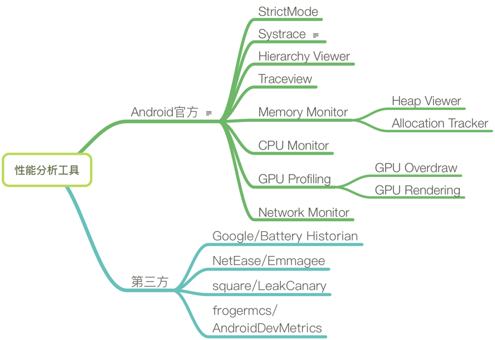

## Android性能优化 

**性能优化包括内存，处理效率，视觉流畅度，CPU，电量，流量等方面，针对手机的性能去做相应的方案。**

个人认为更应该把握好内存优化、处理效率（代码质量）、视觉流畅度（布局优化）

### 1.android ANR发生的原因总结和解决办法

ANR的全称是application not responding，意思就是程序未响应，类似于我们在windows上见到的程序未响应。

- ANR的发生是有条件限制的，分为以下三点：

	1.只有主线程才会产生ANR，主线程就是UI线程；

	2.必须发生某些输入事件或特定操作，比如按键或触屏等输入事件，在BroadcastReceiver或Service的各个生命周期调用函数；

	3.上述事件响应超时，不同的context规定的上限时间不同

	 	a.主线程对输入事件5秒内没有处理完毕
	
	    b.主线程在执行BroadcastReceiver的onReceive()函数时10秒内没有处理完毕
	
	    c.主线程在Service的各个生命周期函数时20秒内没有处理完毕。

- 那么导致ANR的根本原因是什么呢？简单的总结有以下两点：
	
	1.主线程执行了耗时操作，比如数据库操作或网络编程
	
	2.其他进程（就是其他程序）占用CPU导致本进程得不到CPU时间片，比如其他进程的频繁读写操作可能会导致这个问题。

- 细分的话，导致ANR的原因有如下几点：

	1.耗时的网络访问
	
	2.大量的数据读写
	
	3.数据库操作
	
	4.硬件操作（比如camera)
	
	5.调用thread的join()方法、sleep()方法、wait()方法或者等待线程锁的时候
	
	6.service binder的数量达到上限
	
	7.system server中发生WatchDog ANR
	
	8.service忙导致超时无响应
	
	9.其他线程持有锁，导致主线程等待超时
	
	10.其它线程终止或崩溃导致主线程一直等待

- 解决办法

	如何避免ANR的发生呢或者说ANR的解决办法是什么呢？

		1.避免在主线程执行耗时操作，所有耗时操作应新开一个子线程完成，然后再在主线程更新UI。
		
		2.BroadcastReceiver要执行耗时操作时应启动一个service，将耗时操作交给service来完成。
		
		3.避免在Intent Receiver里启动一个Activity，因为它会创建一个新的画面，并从当前用户正在运行的程序上抢夺焦点。
		如果你的应用程序在响应Intent广播时需要向用户展示什么，你应该使用Notification Manager来实现。

### 2.内存溢出 vs 内存泄漏

2.1 内存溢出（out of memory）

- 定义：内存溢出是指当对象的内存占用已经超出分配内存的空间大小，这时未经处理的异常就会抛出。

比如常见的内存溢出情况有：bitmap过大；引用没释放；资源对象没关闭

- 内存溢出的原因：

	1、内存泄露导致

	
	2、占用内存较多的对象

2.2 内存泄漏（memory leak）

- 概念：有些对象只有有限的生命周期。当它们的任务完成之后，它们将被垃圾回收。如果在对象的生命周期本该结束的时候，这个对象还被一系列的引用，这就会导致内存泄漏。

- 内存泄漏对程序的影响？

	内存泄漏是造成应用程序OOM的主要原因之一。

	我们知道Android系统为每个应用程序分配的内存是有限的，而当一个应用中产生的内存泄漏比较多时，这就难免会导致应用所需要的内存超过系统分配的内存限额，这就造成了内存溢出从而导致应用Crash。

- 如何检查和分析内存泄漏？

	因为内存泄漏是在堆内存中，所以对我们来说并不是可见的。通常我们可以借助MAT、LeakCanary等工具来检测应用程序是否存在内存泄漏。

		1、MAT是一款强大的内存分析工具，功能繁多而复杂。

		2、LeakCanary则是由Square开源的一款轻量级的第三方内存泄漏检测工具，当检测到程序中产生内存泄漏时，它将以最直观的方式告诉我们哪里产生了内存泄漏和导致谁泄漏了而不能被回收。

- 常见的内存泄漏及解决方法：

	(1) 单例造成的内存泄漏

	由于单例的静态特性使得其生命周期和应用的生命周期一样长，如果一个对象已经不再需要使用了，而单例对象还持有该对象的引用，就会使得该对象不能被正常回收，从而导致了内存泄漏。

	示例：防止单例导致内存泄漏的实例

		// 使用了单例模式
		public class AppManager {
		    private static AppManager instance;
		    private Context context;
		    private AppManager(Context context) {
		        this.context = context;
		    }
		    public static AppManager getInstance(Context context) {
		        if (instance != null) {
		            instance = new AppManager(context);
		        }
		        return instance;
		    }
		}

	(2) 非静态内部类创建静态实例造成的内存泄漏
	
	例如，有时候我们可能会在启动频繁的Activity中，为了避免重复创建相同的数据资源，可能会出现如下写法：

		public class MainActivity extends AppCompatActivity {
	
		    private static TestResource mResource = null;
		
		    @Override
		    protected void onCreate(Bundle savedInstanceState) {
		        super.onCreate(savedInstanceState);
		        setContentView(R.layout.activity_main);
		        if(mResource == null){
		            mResource = new TestResource();
		        }
		        //...
		    }
		    
		    class TestResource {
		    //...
		    }
		}

	这样在Activity内部创建了一个非静态内部类的单例，每次启动Activity时都会使用该单例的数据。虽然这样避免了资源的重复创建，但是这种写法却会造成内存泄漏。

	因为非静态内部类默认会持有外部类的引用，而该非静态内部类又创建了一个静态的实例，该实例的生命周期和应用的一样长，这就导致了该静态实例一直会持有该Activity的引用，从而导致Activity的内存资源不能被正常回收。

	**解决方法：** 将该内部类设为静态内部类或将该内部类抽取出来封装成一个单例，如果需要使用Context，就使用Application的Context。

	(3) Handler造成的内存泄漏

	示例：创建匿名内部类的静态对象

		public class MainActivity extends AppCompatActivity {
		
		    private final Handler handler = new Handler() {
		        @Override
		        public void handleMessage(Message msg) {
		            // ...
		        }
		    };
		
		    @Override
		    protected void onCreate(Bundle savedInstanceState) {
		        super.onCreate(savedInstanceState);
		        setContentView(R.layout.activity_main);
		
		        new Thread(new Runnable() {
		            @Override
		            public void run() {
		                // ...
		                handler.sendEmptyMessage(0x123);
		            }
		        });
		    }
		}

	1、从Android的角度

	当Android应用程序启动时，该应用程序的主线程会自动创建一个Looper对象和与之关联的MessageQueue。当主线程中实例化一个Handler对象后，它就会自动与主线程Looper的MessageQueue关联起来。所有发送到MessageQueue的Messag都会持有Handler的引用，所以Looper会据此回调Handle的handleMessage()方法来处理消息。只要MessageQueue中有未处理的Message，Looper就会不断的从中取出并交给Handler处理。另外，主线程的Looper对象会伴随该应用程序的整个生命周期。

	2、Java角度

	在Java中，非静态内部类和匿名类内部类都会潜在持有它们所属的外部类的引用，但是静态内部类却不会

	对上述的示例进行分析，当MainActivity结束时，未处理的消息持有handler的引用，而handler又持有它所属的外部类也就是MainActivity的引用。这条引用关系会一直保持直到消息得到处理，这样阻止了MainActivity被垃圾回收器回收，从而造成了内存泄漏。
	
	**解决方法：** 将Handler类独立出来或者使用静态内部类，这样便可以避免内存泄漏。

	
	(4) 线程造成的内存泄漏

	示例：AsyncTask和Runnable

		public class MainActivity extends AppCompatActivity {
		
		    @Override
		    protected void onCreate(Bundle savedInstanceState) {
		        super.onCreate(savedInstanceState);
		        setContentView(R.layout.activity_main);
		
		        new Thread(new MyRunnable()).start();
		        new MyAsyncTask(this).execute();
		    }
		
		    class MyAsyncTask extends AsyncTask<Void, Void, Void> {
		
		        // ...
		
		        public MyAsyncTask(Context context) {
		            // ...
		        }
		
		        @Override
		        protected Void doInBackground(Void... params) {
		            // ...
		            return null;
		        }
		
		        @Override
		        protected void onPostExecute(Void aVoid) {
		            // ...
		        }
		    }
		
		    class MyRunnable implements Runnable {
		        @Override
		        public void run() {
		            // ...
		        }
		    }
		}

	AsyncTask和Runnable都使用了匿名内部类，那么它们将持有其所在Activity的隐式引用。如果任务在Activity销毁之前还未完成，那么将导致Activity的内存资源无法被回收，从而造成内存泄漏。

	**解决方法：** 将AsyncTask和Runnable类独立出来或者使用静态内部类，这样便可以避免内存泄漏。

	(5) 资源未关闭造成的内存泄漏

	对于使用了BraodcastReceiver，ContentObserver，File，Cursor，Stream，Bitmap等资源，应该在Activity销毁时及时关闭或者注销，否则这些资源将不会被回收，从而造成内存泄漏。

		1）比如在Activity中register了一个BraodcastReceiver，但在Activity结束后没有unregister该BraodcastReceiver。

		2）资源性对象比如Cursor，Stream、File文件等往往都用了一些缓冲，我们在不使用的时候，应该及时关闭它们，以便它们的缓冲及时回收内存。它们的缓冲不仅存在于java虚拟机内，还存在于java虚拟机外。如果我们仅仅是把它的引用设置为null，而不关闭它们，往往会造成内存泄漏。

		3）对于资源性对象在不使用的时候，应该调用它的close()函数将其关闭掉，然后再设置为null。在我们的程序退出时一定要确保我们的资源性对象已经关闭。

		4）Bitmap对象不在使用时调用recycle()释放内存。2.3以后的bitmap应该是不需要手动recycle了，内存已经在java层了。

	(6) 使用ListView时造成的内存泄漏

	初始时ListView会从BaseAdapter中根据当前的屏幕布局实例化一定数量的View对象，同时ListView会将这些View对象缓存起来。当向上滚动ListView时，原先位于最上面的Item的View对象会被回收，然后被用来构造新出现在下面的Item。这个构造过程就是由getView()方法完成的，getView()的第二个形参convertView就是被缓存起来的Item的View对象（初始化时缓存中没有View对象则convertView是null）。

	构造Adapter时，没有使用缓存的convertView。

	**解决方法：** 在构造Adapter时，使用缓存的convertView。

	(7) 集合容器中的内存泄露

	我们通常把一些对象的引用加入到了集合容器（比如ArrayList）中，当我们不需要该对象时，并没有把它的引用从集合中清理掉，这样这个集合就会越来越大。如果这个集合是static的话，那情况就更严重了。

	**解决方法：** 在退出程序之前，将集合里的东西clear，然后置为null，再退出程序。

	
	(8) WebView造成的泄露

	当我们不要使用WebView对象时，应该调用它的destory()函数来销毁它，并释放其占用的内存，否则其长期占用的内存也不能被回收，从而造成内存泄露。

	**解决方法：** 为WebView另外开启一个进程，通过AIDL与主线程进行通信，WebView所在的进程可以根据业务的需要选择合适的时机进行销毁，从而达到内存的完整释放。

- 如何避免内存泄漏？

	(1) 在涉及使用Context时，对于生命周期比Activity长的对象应该使用Application的Context。
	凡是使用Context优先考虑Application的Context，当然它并不是万能的，对于有些地方则必须使用Activity的Context。对于Application，Service，Activity三者的Context的应用场景如下：

	

	其中，NO1表示Application和Service可以启动一个Activity，不过需要创建一个新的task任务队列。而对于Dialog而言，只有在Activity中才能创建。除此之外三者都可以使用。

	2、对于需要在静态内部类中使用非静态外部成员变量（如：Context、View )，可以在静态内部类中使用弱引用来引用外部类的变量来避免内存泄漏。

	3、对于不再需要使用的对象，显示的将其赋值为null，比如使用完Bitmap后先调用recycle()，再赋为null。

	4、保持对对象生命周期的敏感，特别注意单例、静态对象、全局性集合等的生命周期。

	5、对于生命周期比Activity长的内部类对象，并且内部类中使用了外部类的成员变量，可以这样做避免内存泄漏：

		1）将内部类改为静态内部类

		2）静态内部类中使用弱引用来引用外部类的成员变量

## 参考文档 vs 面试题

1.ANR产生的原因是什么？

(见上文)

2.内存泄漏是什么,以及解决办法？ 

(见上文)

3.内存溢出(OOM)是什么,以及解决办法？ 

(见上文)

4.内存泄漏和内存溢出区别？

(见上文)

5.如何防止线程的内存泄漏？

(见上文)

6.启动页白屏及黑屏解决？ 

我们在开发android应用程序时，往往会添加启动页面；这时会遇到一个问题，就是启动页面会先显示一下白色背景或者黑色背景（根据你application使用的主题不同导致白色背景或者黑色背景），然后才会显示我们需要的效果。
    
这是因为：activity在执行setContentView()方法后才会显示布局，所以在setContentView()方法前面不要放耗时的操作。如果activity是继承下来的，那么也要注意一下父activity的onCreate()方法不要放耗时的操作。

还有一种情况就是，题主在onCreate()方法来调用了requestWindowFeature()方法来设置全屏，这样也会导致先显示白屏（黑屏）再跳转。

解决方案：在res/values下添加一个主题如下

	

然后在启动的anctivity使用该主题

	<activity
	    android:name=".ui.WelcomeActivity"
	    android:screenOrientation="portrait"
	    android:theme="@style/Theme.beginBackground">
	    <intent-filter>
	        <action android:name="android.intent.action.MAIN"/>
	
	        <category android:name="android.intent.category.LAUNCHER"/>
	    </intent-filter>
	</activity>

7.启动太慢怎么解决？ 

（具体问题具体分析）

8.启动太慢怎么解决？

（同上面一个道理，也可以做个闪屏页当缓冲时间。）
 
9.App启动崩溃异常捕捉？

（参考app的crashActivity）