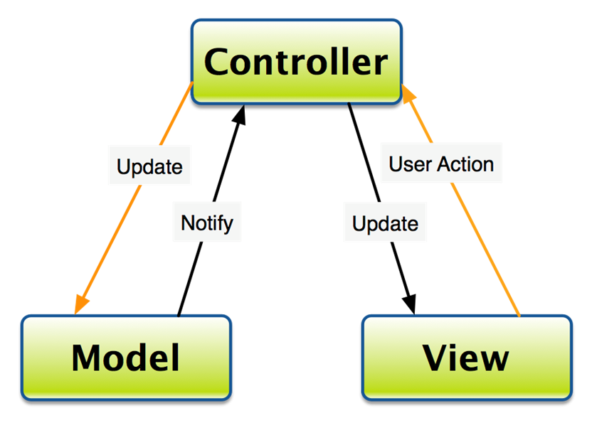
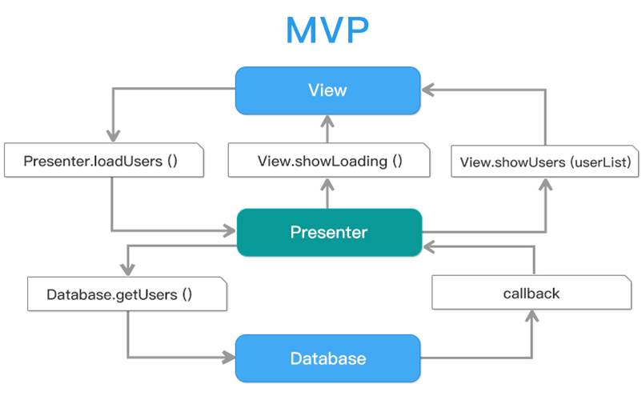
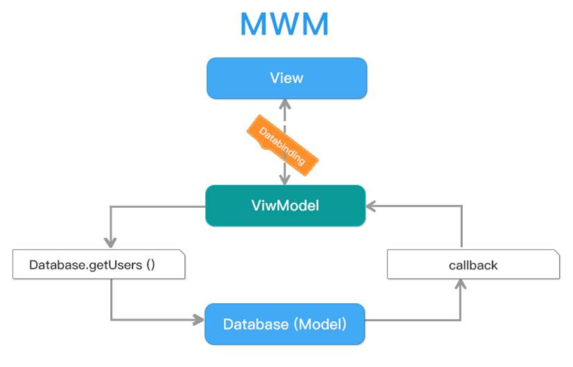

## MVC  -  MVP  -  MVVM  架构模式

### 1.MVC

Android原生开发采用XML文件实现页面布局，通过Java在Activity或Fragment中开发业务逻辑，这种开发模式实际上已经采用了MVC的思想，分离视图和控制器。

MVC模式（Model–view–controller）是软件工程中的一种软件架构模式，把软件系统分为三个基本部分：模型（Model）、视图（View）和控制器（Controller）。

在Android编程中，View对应xml布局文件，Model对应实体模型（网络、数据库、I/O），Controller对应Activity业务逻辑，数据处理和UI处理。

如下图所示：

MVC的缺点：

随着业务的增长Controller里的代码会越来越臃肿，因为它不只要负责业务逻辑，还要控制View的展示。也就是说Activity、Fragment杂糅了Controller和View，耦合变大。并不能算作真正意义上的MVC

### 2.MVP

MVP是从MVC过渡而来，MVP框架由三部分组成：View负责显示，Presenter负责逻辑处理，Model提供数据。

Android开发从MVC过渡到MVP，最主要的变化就是将Activity中负责业务逻辑的代码移到Presenter中，Activity只充当MVP中的View，负责界面初始化以及建立界面控件与Presenter的关联。

这样拆分之后，Presenter承担了大量的逻辑操作，避免了Activity的臃肿。

整个架构如下图所示：

	View(Activity)负责响应用户操作，通过Presenter暴露的方法请求数据；
	Presenter在获取数据后，通过View(Activity)暴露的方法实现界面控制（showLoading/showUsers）；
	Presenter的数据是通过Model来获取的，Model包含网络、数据库以及I/O等；
	Model通过回调的方式将数据传到Presenter中

- MVP优点：

	避免了传统开发模式中View和Model耦合的情况，提高了代码可扩展性、组件复用能力、团队协作的效率以及单元测试的便利性。

- MVP缺点：

	Model到Presenter的数据传递过程需要通过回调；
	View(Activity)需要持有Presenter的引用，同时Presenter也需要持有View(Activity)的引用，增加了控制的复杂度；
	MVC中Activity的代码很臃肿，转移到MVP的Presenter中，同样造成了Presenter在业务逻辑复杂时的代码臃肿。

### 3.MVVM

MVVM是Model-View-ViewModel的简称，从实际效果来看，ViewModel是View的数据模型和Presenter的结合

具体结构如下图所示：

	View（视图层）采用XML文件进行界面的描述；
	Model（模型层）通过网络和本地数据库获取视图层所需数据；
	ViewModel（视图-模型层）负责View和Model之间的通信，以此分离视图和数据;

View和Model之间通过Android Data Binding技术，实现视图和数据的双向绑定；

ViewModel持有Model的引用，通过Model的方法请求数据；获取数据后，通过Callback（回调）的方式回到ViewModel中，由于ViewModel与View的双向绑定，使得界面得以实时更新。同时，界面输入的数据变化时，由于双向绑定技术，ViewModel中的数据得以实时更新，提高了数据采集的效率。

采用ViewModel解决MVP中View(Activity)和Presenter相互持有对方引用的问题，界面由数据进行驱动，响应界面操作无需由View(Activity)传递，数据的变化也无需Presenter调用View(Activity)实现，使得数据传递的过程更加简洁，高效。

### 4.MVC->MVP->MVVM异同点

- 相同点：

三者的共同点，也就是Model和View

Model：数据对象，同时，提供本应用外部对应用程序数据的操作的接口，也可能在数据变化时发出变更通知。Model不依赖于View的实现，只要外部程序调用Model的接口就能够实现对数据的增删改查。

View：UI层，提供对最终用户的交互操作功能，包括UI展现代码及一些相关的界面逻辑代码

- 不同点：

三者的差异在于如何粘合View和Model，实现用户的交互操作以及变更通知

(1). Controller

Controller接收View的操作事件，根据事件不同，或者调用Model的接口进行数据操作，或者进行View的跳转，从而也意味着一个Controller可以对应多个View。Controller对View的实现不太关心，只会被动地接收，Model的数据变更不通过Controller直接通知View，通常View采用观察者模式监听Model的变化

(2). Presenter

Presenter与Controller一样，接收View的命令，对Model进行操作；与Controller不同的是Presenter会反作用于View，Model的变更通知首先被Presenter获得，然后Presenter再去更新View。一个Presenter只对应于一个View。根据Presenter和View对逻辑代码分担的程度不同，这种模式又有两种情况：Passive View和Supervisor Controller。

(3). ViewModel

这种模式的关键技术就是数据绑定（data binding），View的变化会直接影响ViewModel，ViewModel的变化或者内容也会直接体现在View上

## MVC->MVP->MVVM演进过程

MVC -> MVP -> MVVM 这几个软件设计模式是一步步演化发展的，MVVM 是从 MVP 的进一步发展与规范，MVP 隔离了MVC中的 M 与 V 的直接联系后，靠 Presenter 来中转，所以使用 MVP 时 P 是直接调用 View 的接口来实现对视图的操作的，这个 View 接口的东西一般来说是 showData、showLoading等等。M 与 V已经隔离了，方便测试了，但代码还不够优雅简洁，所以 MVVM 就弥补了这些缺陷。在 MVVM 中就出现的 Data Binding 这个概念，意思就是 View 接口的 showData 这些实现方法可以不写了，通过 Binding 来实现