## Android之网络知识


### 1、描述一次完整的网络请求过程

(1). 域名解析;

(2). 建立TCP连接（TCP的三次握手）;

(3). 建立TCP连接后发起HTTP请求，服务器响应HTTP请求;

(4). 浏览器解析html代码，并请求html代码中的资源（图片、css、js...）;


这是一个很经典的面试题，在这题中可以将本文讲得内容都串联起来。

	1.首先做 DNS 查询，如果这一步做了智能 DNS 解析的话，会提供访问速度最快的 IP 地址回来
	2.接下来是 TCP 握手，应用层会下发数据给传输层，这里 TCP 协议会指明两端的端口号，然后下发给网络层。网络层中的 IP 协议会确定 IP 地址，并且指示了数据传输中如何跳转路由器。然后包会再被封装到数据链路层的数据帧结构中，最后就是物理层面的传输了
	3.TCP 握手结束后会进行 TLS 握手，然后就开始正式的传输数据
	4.数据在进入服务端之前，可能还会先经过负责负载均衡的服务器，它的作用就是将请求合理的分发到多台服务器上，这时假设服务端会响应一个 HTML 文件
	5.首先浏览器会判断状态码是什么，如果是 200 那就继续解析，如果 400 或 500 的话就会报错，如果 300 的话会进行重定向，这里会有个重定向计数器，避免过多次的重定向，超过次数也会报错
	6.浏览器开始解析文件，如果是 gzip 格式的话会先解压一下，然后通过文件的编码格式知道该如何去解码文件
	7.文件解码成功后会正式开始渲染流程，先会根据 HTML 构建 DOM 树，有 CSS 的话会去构建 CSSOM 树。如果遇到 script 标签的话，会判断是否存在 async 或者 defer ，前者会并行进行下载并执行 JS，后者会先下载文件，然后等待 HTML 解析完成后顺序执行，如果以上都没有，就会阻塞住渲染流程直到 JS 执行完毕。遇到文件下载的会去下载文件，这里如果使用 HTTP 2.0 协议的话会极大的提高多图的下载效率。
	8.初始的 HTML 被完全加载和解析后会触发 DOMContentLoaded 事件
	9.CSSOM 树和 DOM 树构建完成后会开始生成 Render 树，这一步就是确定页面元素的布局、样式等等诸多方面的东西
	10.在生成 Render 树的过程中，浏览器就开始调用 GPU 绘制，合成图层，将内容显示在屏幕上了


- DNS

DNS 的作用就是通过域名查询到具体的 IP。

因为 IP 存在数字和英文的组合（IPv6），很不利于人类记忆，所以就出现了域名。你可以把域名看成是某个 IP 的别名，DNS 就是去查询这个别名的真正名称是什么。

在 TCP 握手之前就已经进行了 DNS 查询，这个查询是操作系统自己做的。当你在浏览器中想访问 www.google.com 时，会进行一下操作：

	1.操作系统会首先在本地缓存中查询
	2.没有的话会去系统配置的 DNS 服务器中查询
	3.如果这时候还没得话，会直接去 DNS 根服务器查询，这一步查询会找出负责 com 这个一级域名的服务器
	4.然后去该服务器查询 google 这个二级域名
	5.接下来三级域名的查询其实是我们配置的，你可以给 www 这个域名配置一个 IP，然后还可以给别的三级域名配置一个 IP

以上介绍的是 DNS 迭代查询，还有种是递归查询，区别就是前者是由客户端去做请求，后者是由系统配置的 DNS 服务器做请求，得到结果后将数据返回给客户端。

**注意：** DNS 是基于 UDP 做的查询


### 2、HTTP

- 简介：

超文本传送协议(Hypertext Transfer Protocol )，HTTP协议是建立在TCP协议之上的一种应用。

HTTP连接最显著的特点是客户端发送的每次请求都需要服务器回送响应，在请求结束后，会主动释放连接。从建立连接到关闭连接的过程称为“一次连接”。

1）在HTTP 1.0中，客户端的每次请求都要求建立一次单独的连接，在处理完本次请求后，就自动释放连接。

2）在HTTP 1.1中则可以在一次连接中处理多个请求，并且多个请求可以重叠进行，不需要等待一个请求结束后再发送下一个请求。

由于HTTP在每次请求结束后都会主动释放连接，因此HTTP连接是一种“短连接”，要保持客户端程序的在线状态，需要不断地向服务器发起连接请求。
通常的做法是即时不需要获得任何数据，客户端也保持每隔一段固定的时间向服务器发送一次“保持连接”的请求，服务器在收到该请求后对客户端进行回复，
表明知道 客户端“在线”。若服务器长时间无法收到客户端的请求，则认为客户端“下线”，若客户端长时间无法收到服务器的回复，则认为网络已经断开。


- HTTP的组成图示

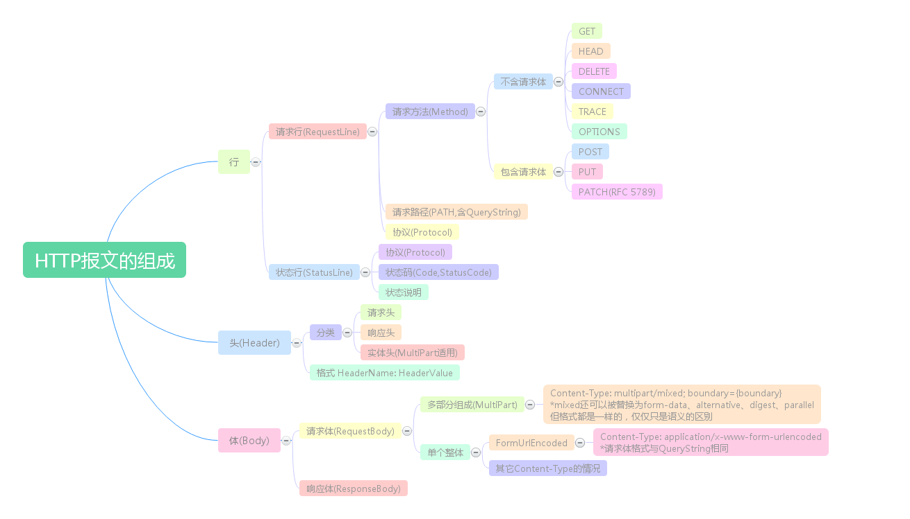

2.1、HTTP请求报文格式

- HTTP的请求报文分为三个部分： 请求行、请求头和请求体。

http报文格式如图：

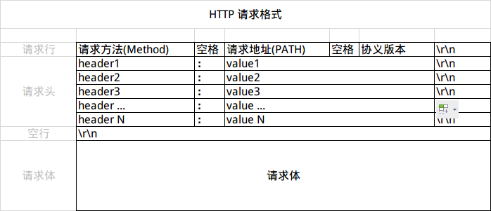

**注：** 部分文章也将HTTP请求报文分为两部分请求头和请求体，请求头的第一行为请求行

(1) 请求行

请求行（Request Line）分为三个部分：请求方法、请求地址和协议版本，以CRLF(回车换行)结束。

HTTP/1.1 定义的请求方法有8种：GET、POST、PUT、DELETE、PATCH、HEAD、OPTIONS、TRACE。最常的两种GET和POST，如果是RESTful接口的话一般会用到GET、POST、DELETE、PUT


在了解请求地址之前，先了解一下URL的构成

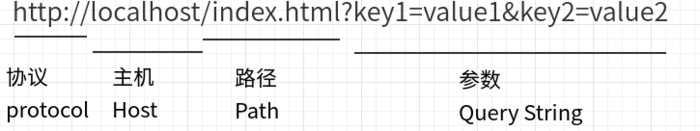


HTTP请求报文格式示例：

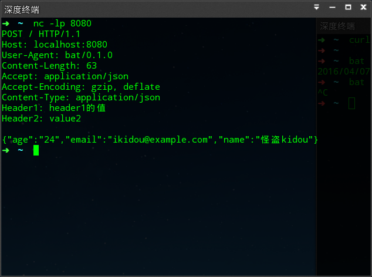


2.2、HTTP响应报文格式

- HTTP的响应报文分为三个部分： 状态行、响应头和响应体。

(1) 状态行

状态行分为三个部分：状态码、状态说明和协议版本。

[HTTP状态码详解](http://tool.oschina.net/commons?type=5)

常见状态码

	2XX 成功
	
	200 OK，表示从客户端发来的请求在服务器端被正确处理
	204 No content，表示请求成功，但响应报文不含实体的主体部分
	205 Reset Content，表示请求成功，但响应报文不含实体的主体部分，但是与 204 响应不同在于要求请求方重置内容
	206 Partial Content，进行范围请求

	3XX 重定向
	
	301 moved permanently，永久性重定向，表示资源已被分配了新的 URL
	302 found，临时性重定向，表示资源临时被分配了新的 URL
	303 see other，表示资源存在着另一个 URL，应使用 GET 方法获取资源
	304 not modified，表示服务器允许访问资源，但因发生请求未满足条件的情况
	307 temporary redirect，临时重定向，和302含义相同

	4XX 客户端错误
	
	400 bad request，请求报文存在语法错误
	401 unauthorized，表示发送的请求需要有通过 HTTP 认证的认证信息
	403 forbidden，表示对请求资源的访问被服务器拒绝
	404 not found，表示在服务器上没有找到请求的资源

	5XX 服务器错误
	
	500 internal sever error，表示服务器端在执行请求时发生了错误
	501 Not Implemented，表示服务器不支持当前请求所需要的某个功能
	503 service unavailable，表明服务器暂时处于超负载或正在停机维护，无法处理请求


HTTP响应报文格式示例：

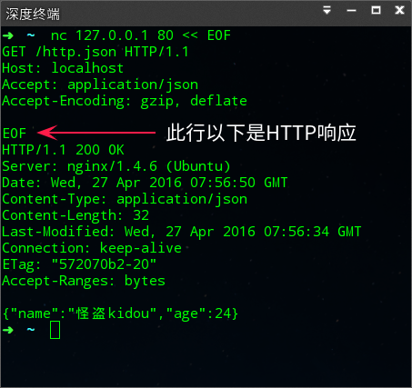

**总结：** HTTP响应的格式上除状态行(第一行)与请求的请求行不一样以外，其它**就格式而言**是一样的。


2.3、Header

Header可用于传递一些附加信息，格式： 键: 值，注意冒号后面有一个**空格**。

如：

	Content-Length: 1024
	Content-Type: text/plain


(1) 请求和响应常见通用Header

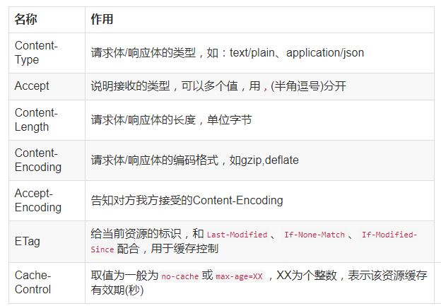


(2) 常见**请求**Header

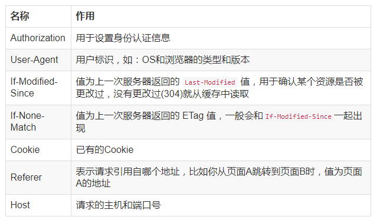

(3) 常见**响应**Header

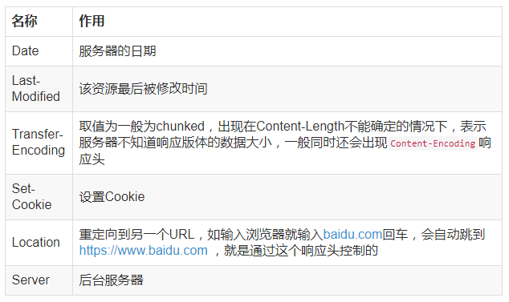


2.4、请求体的3种形式

根据应用场景的不同，HTTP请求的请求体有三种不同的形式

- 第一种：请求体是任意类型

移动开发者常见的，**请求体是任意类型**，服务器不会解析请求体，请求体的处理需要自己解析。

如：POST请求发送JSON，就是这中。


- 第二种：带有键值对的请求参数

第二种和第三种都有固定格式的，是服务器端开发人员最先了解到的两种。这里的格式要求就是URL中Query String的格式要求：**多个键值对之间用&连接，键与值之前用=连接，且只能用ASCII字符，非ASCII字符需使用UrlEncode编码。**

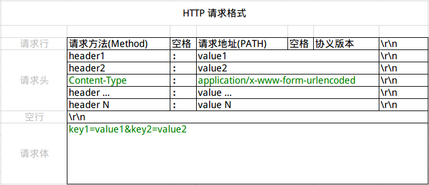


- 第三种：文件上传类型

第三种请求体的请求体被分成为多个部分，文件上传时会被使用，这种格式最先应该是被用于邮件传输中，每个字段/文件都被boundary（Content-Type中指定）分成单独的段，每段以-- 加 boundary开头，然后是该段的描述头，描述头之后空一行接内容，请求结束的标制为boundary后面加--，结构见下图：

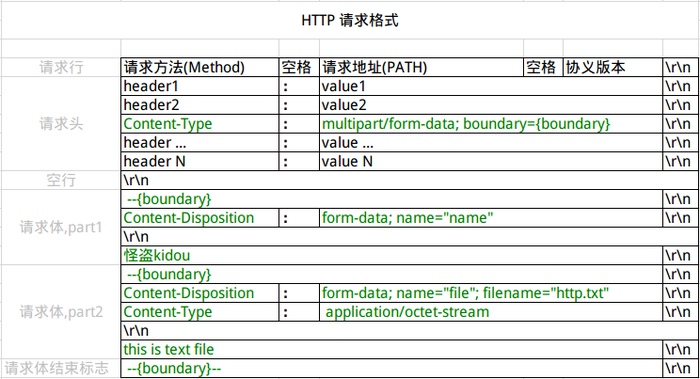


区分是否被当成文件的关键是Content-Disposition是否包含filename，因为文件有不同的类型，所以还要使用Content-Type指示文件的类型，如果不知道是什么类型取值可以为application/octet-stream表示该文件是个二进制文件，如果不是文件则Content-Type可以省略

下图为一个带有文件的上传的请求体原文

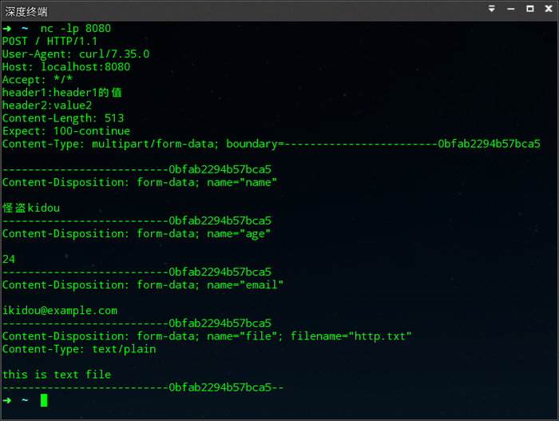


**注意：** 

第二、三种请求体需求配合特定的Content-Type请求头，如：

	1）第二种配合Content-Type：application/x-www-form-urlencoded；
	2）第三种配合Content-Type： multipart/form-data; 
	3）如果两者(请求体和content-type)没有相配合，那么服务器不会解析请求体，也就是说只会当成第一种情况！


2.5、响应体

	Content-Type: text/html;charset=UTF-8

-> 对应响应的是html文本

	Content-Type: text/plain;charset=UTF-8   

-> 对应响应的是json {}

	Content-Type: text/xml;charset=UTF-8  

-> 对应响应的是xml


2.6、推荐调试工具

(1) cURL

cURL 相当强大命令行工具，基本上你知道的上层协议它都支持，具体使用方法就自行发现了，下图为发起一个HTTP GET请求并打印请求和响应的详细内容。

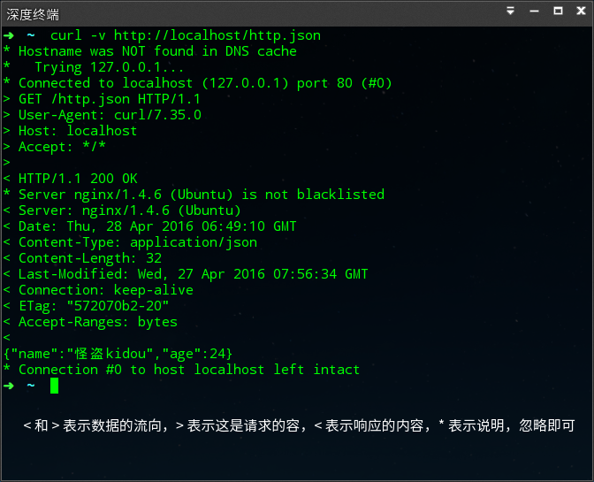

(2) bat

bat 是astaxie(谢孟军) 用Golang开发的类似cURL的命令行API调试工具,可以方便的打印出HTTP请求和响应，还能高亮Header、格式化JSON等功能，非常好用，API调式神器。

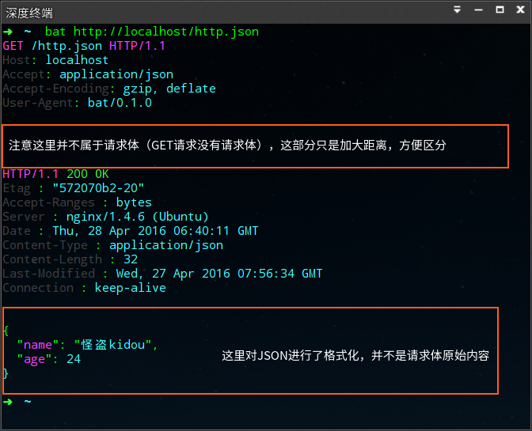

(3) nc
nc 是 netcat 的简写，被称为“网络工具中的瑞士军刀”，不过我个人是把它当成Socket用，经常使用它来打印各种请求，当然它的作用可不只是这样，你也可以用它发起各式各样的请求，以前调式POP3也是用的它，只不过请求报文得自己写，上面有个图“HTTP请求和响应”就是用nc完成的。


2.7、Post 和 Get 的区别

在技术上说：

	Get 请求能缓存，Post 不能
	Post 相对 Get 安全一点点，因为Get 请求都包含在 URL 里，且会被浏览器保存历史纪录，Post 不会，但是在抓包的情况下都是一样的。
	Post 可以通过 request body来传输比 Get 更多的数据，Get 没有这个技术
	URL有长度限制，会影响 Get 请求，但是这个长度限制是浏览器规定的，不是 RFC 规定的
	Post 支持更多的编码类型且不对数据类型限制


### https


- 为什么需要HTTPS

	在日常互联网浏览网页时，我们接触到的大多都是HTTP协议，这种协议是未加密，即明文的。这使得HTTP协议在传输隐私数据时非常不安全。因此，浏览器鼻祖 Netscape 公司设计了 SSL（Secure Sockets Layer） 协议，用于对 HTTP 协议传输进行数据加密，即 HTTPS。

> SSL 目前版本是 3.0，之后升级为了 TLS（Transport Layer Security） 协议，TLS 目前为 1.2 版本。如未特别说明，SSL 与 TLS 均指同一协议。


- HTTPS工作原理：

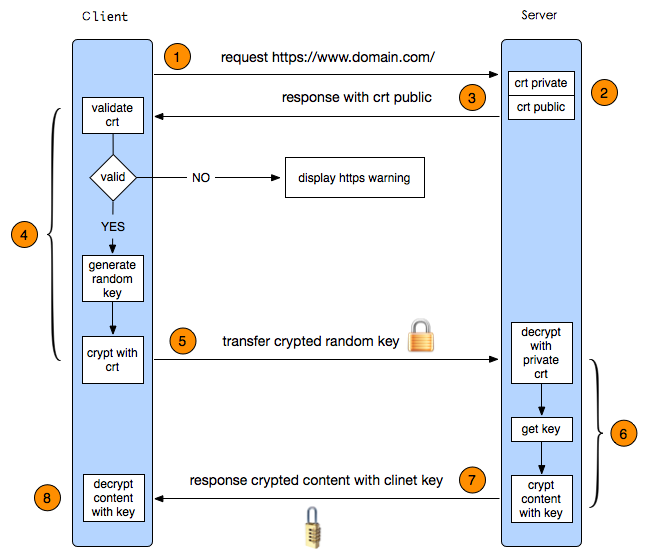

简要理解： 

	客户端与服务端传输加密数据之前建立连接确认(就是你是不是我要通信的合法对象)；
	以及确定我们传输过程中对数据加密 选用哪一种加密算法和Hash算法；
	客户端用公钥加密发送信息，私钥解密接收信息；

**STEP 1:** 客户端发起HTTPS请求

SSL连接总是由客户端启动，在SSL会话开始时，执行SSL握手。

用户在浏览器里输入一个https网址，然后连接到server的443端口。

客户端发送以下：

	a.列出客户端支持的加密方式列表（以客户端首选项顺序排序）
	如SSL的版本、客户端支持的加密算法和客户端支持的数据压缩方法(Hash 算法)。
	b.包含28字节的随机数，client_random


**STEP 2:** 服务端的配置

采用HTTPS 协议的服务器必须要有一套数字证书，可以自己制作，也可以向组织申请。

客户端和服务器至少必须支持一个公共密码对，否则握手失败。服务器一般选择最大的公共密码对。


**STEP 3:** 传送证书

服务器端返回以下：

a、服务器端选出的一套加密算法和Hash算法

b、服务器生成的随机数```server_random```

c、SSL数字证书（服务器使用带有SSL的X.509 V3数字证书），这个证书包含网站地址，公钥public_key，证书的颁发机构，过期时间等等

**STEP 4:** 客户端解析证书

这部分工作是由客户端的TLS来完成的。

1.首先会验证证书是否有效，这是对服务端的一种认证，比如颁发机构，过期时间等等，如果发现异常，则会弹出一个警告框，提示证书存在问题

2.如果证书没有问题，那么浏览器根据步骤3的```server_random```生成一个随机值 ```premaster_secret```和```master_secret```。

3.Hash握手信息，用第3步返回约定好的Hash算法对握手信息取Hash值，然后用随机数加密“握手消息+握手消息Hash值（签名）


**STEP 5:** 传送加密信息

客户端发送以下：

客户端发送公钥```public_key```加密的```premaster secret```。

目的就是让服务端得到这个随机值，以后客户端和服务端的通信就可以通过这个随机值来进行加密解密了


**STEP 6:** 服务端解密信息

服务端用私钥```private_key```解密后，得到了客户端传过来的随机值premaster_secret(私钥)，又由于服务器在步骤1中收到的```client_random```，所以服务器根据相同的生成算法，在相同输入参数的情况下，得到相同的```master_secret```。然后把内容通过该值进行对称加密


**STEP 7:** 传输加密后的信息

服务器端返回以下：

将被```premaster_key```对称加密的信息返回客户端，客户端可还原


**STEP 8:** 客户端解密信息

客户端用之前生成的私钥解密服务端传过来的信息，于是获取了解密后的内容。
整个过程第三方即使监听到了数据，也束手无策。


- SSL/TLS

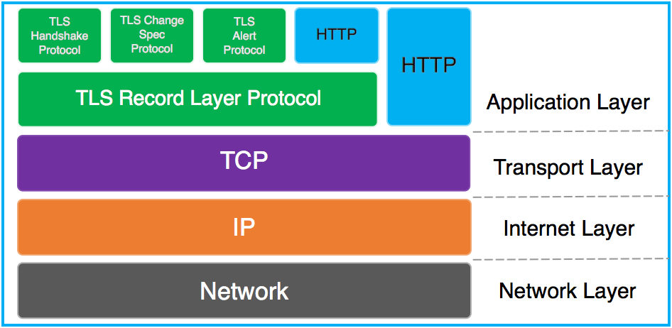

HTTPS 可以认为是 HTTP + TLS


- 加密方式

加密算法一般分为对称加密与非对称加密

(1).对称加密

客户端与服务器使用相同的密钥对消息进行加密

将信息和私钥通过某种算法混合在一起，这样除非知道私钥，不然无法获取内容，而正好客户端和服务端都知道这个私钥，所以只要加密算法够彪悍，私钥够复杂，数据就够安全。

优点：

	加密强度高，很难被破解
	计算量小，仅为非对称加密计算量的0.1%

缺点：

	无法安全的生成和管理密钥
	服务器管理大量客户端密钥复杂


(2).非对称加密

非对称指加密与解密的密钥为两种密钥。服务器提供公钥，客户端通过公钥对消息进行加密，并由服务器端的私钥对密文进行解密

优点：

	安全

缺点：

	性能低下，CPU计算资源消耗巨大，一次完全的TLS握手，密钥交换时的非对称加密解密占了整个握手过程的90%以上。而对称加密的计算量只相当于非对称加密的0.1%，因此如果对应用层使用非对称加密，性能开销过大，无法承受。
	非对称加密对加密内容长度有限制，不能超过公钥的长度。比如现在常用的公钥长度是2048位，意味着被加密消息内容不能超过256字节。


- HTTPS 下的加密

HTTPS一般使用的加密与HASH算法如下：

	非对称加密算法：RSA，DSA/DSS
	对称加密算法：AES，RC4，3DES
	HASH算法：MD5，SHA1，SHA256

其中非对称加密算法用于在握手过程中加密生成的密码，

对称加密算法用于对真正传输的数据进行加密，

而HASH算法用于验证数据的完整性。

由于浏览器生成的密码是整个数据加密的关键，因此在传输的时候使用了非对称加密算法对其加密。非对称加密算法会生成公钥和私钥，公钥只能用于加密数据，因此可以随意传输，而网站的私钥用于对数据进行解密，所以网站都会非常小心的保管自己的私钥，防止泄漏。

TLS握手过程中如果有任何错误，都会使加密连接断开，从而阻止了隐私信息的传输。

正是由于HTTPS非常的安全，攻击者无法从中找到下手的地方，于是更多的是采用了假证书的手法来欺骗客户端，从而获取明文的信息，但是这些手段都可以被识别出来


- HTTP 和 HTTPS 的相同点：

		大多数情况下，HTTP和HTTPS是相同的，因为都是采用同一个基础的协议，作为HTTP或HTTPS客户端——浏览器，设立一个连接到Web服务器指定的端口。
		当服务器接收到请求，它会返回一个状态码以及消息，这个回应可能是请求信息、或者指示某个错误发送的错误信息。
		系统使用统一资源定位器URI模式，因此资源可以被唯一指定。而HTTPS和HTTP唯一不同的只是一个协议头(https)的说明，其他都是一样的。


- HTTP 和 HTTPS 的不同之处：

		HTTP的URL以http://开头，而HTTPS的URL以https://开头
		HTTP是不安全的，而HTTPS是安全的
		HTTP标准端口是80，而HTTPS的标准端口是 443
		在 OSI 网络模型中，HTTP 工作于应用层，而 HTTPS 工作在传输层
		HTTP 无需加密，而 HTTPS 对传输的数据进行加密
		HTTP 无需证书，而 HTTPS 需要认证证书


### 3、TCP vs UDP

3.1、UDP

- 面向报文

UDP是一个面向报文（报文可以理解为一段段的数据）的协议。意思就是UDP只是报文的搬运工，不会对报文进行任何拆分和拼接操作。

具体来说：

	在发送端，应用层将数据传递给传输层的UDP协议，UDP只会给数据增加一个UDP头标识下是UDP协议，然后就传递给网络层了；
	在接收端，网络层将数据传递给传输层，UDP只去除IP报文头就传递给应用层，不会任何拼接操作。


- 不可靠性

（1）、UDP是无连接的，也就是说通信不需要建立和断开连接，远地的主机在收到UDP报文后也不需要给出任何确认。

（2）、UDP也是不可靠的。协议收到什么数据就传递什么数据，并且也不会备份数据，对方能不能收到是不关心的。

（3）、UDP 没有拥塞控制，一直会以恒定的速度发送数据。即使网络条件不好，也不会对发送速率进行调整。这样实现的弊端就是在网络条件不好的情况下可能会导致丢包，但是优点也很明显，在某些实时性要求高的场景（比如电话会议）就需要使用UDP而不是TCP。

对应的应用层的协议主要有 DNS,TFTP,DHCP,SNMP,NFS 等。


- 高效

因为UDP没有TCP那么复杂，需要保证数据不丢失且有序到达。所以UDP的头部开销小，只有八字节，相比 TCP的至少二十字节要少得多，在传输数据报文时是很高效的。


- 传输方式

UDP不止支持一对一的传输方式，同样支持一对多，多对多，多对一的方式，也就是说UDP提供了单播，多播，广播的功能。


3.2、TCP连接

- 简介：

TCP提供面向连接的服务，在传送数据之前必须先建立连接，数据传送完成后要释放连接。

因此TCP是一种可靠的的运输服务，但是正因为这样，不可避免的增加了许多的开销，比如确认，流量控制等。

对应的应用层的协议主要有 SMTP,TELNET,HTTP,FTP 等。

TCP(Transmission Control Protocol)传输控制协议。TCP是主机对主机层的传输控制协议，提供可靠的连接服务，采用三次握手确认建立一个连接。

位码即tcp标志位，有6种 标示:

	SYN(synchronous建立联机) 
	ACK(acknowledgement 确认) 
	PSH(push传送) 
	FIN(finish结束) 
	RST(reset重置) 
	URG(urgent紧急)
	Sequence number(顺序号码) 
	Acknowledge number(确认号码)


手机能够使用联网功能是因为手机底层实现了TCP/IP协议，可以使手机终端通过无线网络建立TCP连接。

TCP协议可以对上层网络提供接口，使上层网络数据的传输建立在"无差别"的网络之上。建立起一个TCP连接需要经过"三次握手"：

第一次握手：客户端发送syn包(syn=j)到服务器，并进入SYN_SEND状态，等待服务器确认；

第二次握手：服务器收到syn包，必须确认客户的SYN（ack=j+1），同时自己也发送一个SYN包（syn=k），即SYN+ACK包，此时服务器进入SYN_RECV状态；

第三次握手：客户端收到服务器的SYN＋ACK包，向服务器发送确认包ACK(ack=k+1)，此包发送完毕，客户端和服务器进入ESTABLISHED状态，完成三次握手。
握手完成后，两台主机开始传输数据了。

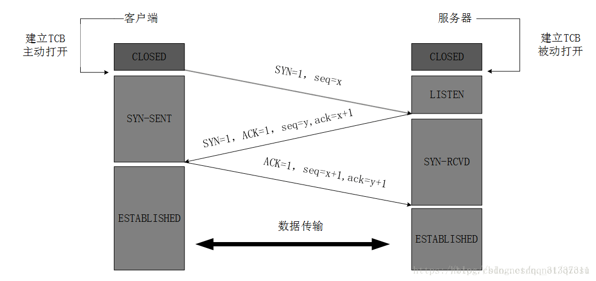

注意: 第三次握手返回的  seq=x+1 (应该表示的是从新随机的一个，与前文的x x+1)无关


为什么要三次握手？

  如果只有一次握手，Client不能确定与Server的单向连接，更加不能确定Server与Client的单向连接；
  如果只有两次握手，Client确定与Server的单向连接，但是Server不能确定与Client的单向连接；
  只有三次握手，Client与Server才能相互确认双向连接，实现双工数据传输。


握手过程中传送的包里不包含数据，三次握手完毕后，客户端与服务器才正式开始传送数据。理想状态下，TCP连接一旦建立，在通信双方中的任何一方主动关闭连接之前，TCP 连接都将被一直保持下去。断开连接时服务器和客户端均可以主动发起断开TCP连接的请求，断开过程需要经过“四次挥手”。

实例一:

	IP 192.168.1.116.3337 > 192.168.1.123.7788: S 3626544836:3626544836
	IP 192.168.1.123.7788 > 192.168.1.116.3337: S 1739326486:1739326486 ack 3626544837
	IP 192.168.1.116.3337 > 192.168.1.123.7788: ack 1739326487,ack 1
	
	第一次握手：192.168.1.116发送位码syn＝1,随机产生seq number=3626544836的数据包到192.168.1.123,192.168.1.123
	由SYN=1知道192.168.1.116要求建立联机;
	
	第二次握手：192.168.1.123收到请求后要确认联机信息，向192.168.1.116发送ack number=3626544837,syn=1,ack=1,
	随机产生seq=1739326486的包;
	
	第三次握手：192.168.1.116收到后检查ack number是否正确，即第一次发送的seq number+1,以及位码ack是否为1，若正确，
	192.168.1.116会再发送ack number=1739326487,ack=1，192.168.1.123收到后确认seq=seq+1,ack=1则连接建立成功。
	
实例二:
	
	TCP的作用是流量控制，主要是控制数据流的传输。下面以浏览网页为例，根据自身理解来解释一下这个过程。
	（注：第二个ack属于代码段ack位）
	pc浏览服务器网页此过程不包括域名查询，只描述TCP与http数据流的变化。
	pc与http服务器进行三次握手来建立连接。
	1.pc：seq=0 ack=0 syn=1 ack=0 发送给服务器建立同步请求。
	2.server： seq=0 ack=1 syn=1 ack=1 发送给客户端建立同步响应.
	3.pc:seq=1 ack=1 syn=0 ack=1 发送给服务器,三次握手完成建立同步信息成功.
	4.pc产生http数据消息,向服务器发送get请求.
	5.服务器收到请求并发送TCP确认,然后发送http数据信息给客户端的浏览器.
	6.客户端收到服务器的http信息,然后发送TCP确认信息给服务器.
	7.客户端发送FIN+ACK给服务器,要求结束数据传输.
	8.服务器发送TCP确认消息用于确认pc的TCP的FIN消息
	9.服务器向客户端发送FIN+ACK消息用于结束TCP会话.
	10.客户端发送确认信息给服务器,整个会话结束.

四次挥手:

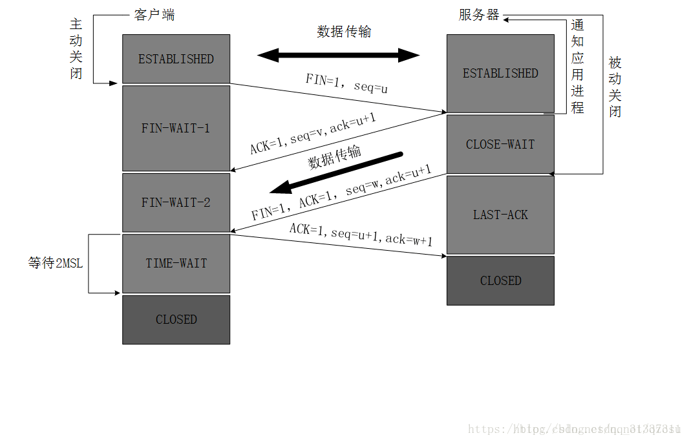

第一次挥手：
Client发送一个FIN，用来关闭Client到Server的数据传送，Client进入FIN_WAIT_1状态。

第二次挥手：
Server收到FIN后，发送一个ACK给Client，确认序号为收到序号+1（与SYN相同，一个FIN占用一个序号），Server进入CLOSE_WAIT状态。

第三次挥手：
Server发送一个FIN，用来关闭Server到Client的数据传送，Server进入LAST_ACK状态。

第四次挥手：
Client收到FIN后，Client进入TIME_WAIT状态，接着发送一个ACK给Server，确认序号为收到序号+1，Server进入CLOSED状态，完成四次挥手。


为什么要四次挥手？

	"三次握手"的第二次握手发送SYN+ACK回应第一次握手的SYN，
	但是"四次挥手"的第二次挥手只能发送ACK回应第一次挥手的FIN，因为此时Server可能还有数据传输给Client，
	所以Server传输数据完成后才能发起第三次挥手发送FIN给Client，等待Client的第四次挥手ACK。


为什么建立连接是三次握手，关闭连接确是四次挥手呢？

	建立连接的时候， 服务器在LISTEN状态下，收到建立连接请求的SYN报文后，把ACK和SYN放在一个报文里发送给客户端。 
	而关闭连接时，服务器收到对方的FIN报文时，仅仅表示对方不再发送数据了但是还能接收数据，而自己也未必全部数据都发送给对方了，
	所以己方可以立即关闭，也可以发送一些数据给对方后，再发送FIN报文给对方来表示同意现在关闭连接，
	因此，己方ACK和FIN一般都会分开发送，从而导致多了一次。


为什么客户端最后还要等待2MSL？

	MSL（Maximum Segment Lifetime），TCP允许不同的实现可以设置不同的MSL值。
	
	第一，保证客户端发送的最后一个ACK报文能够到达服务器，因为这个ACK报文可能丢失，站在服务器的角度看来，
	我已经发送了FIN+ACK报文请求断开了，客户端还没有给我回应，应该是我发送的请求断开报文它没有收到，
	于是服务器又会重新发送一次，而客户端就能在这个2MSL时间段内收到这个重传的报文，接着给出回应报文，并且会重启2MSL计时器。
	
	第二，防止类似与"三次握手"中提到了的"已经失效的连接请求报文段"出现在本连接中。客户端发送完最后一个确认报文后，
	在这个2MSL时间中，就可以使本连接持续的时间内所产生的所有报文段都从网络中消失。这样新的连接中不会出现旧连接的请求报文。


- 总结：udp/tcp的区别


1.tcp是一对一面向连接，udp可以一对一也可以一对多连接。

2.tcp稳定可靠不丢包，udp不稳定不可靠会丢包。

3.tcp占用时间长，占用资源多，udp占用时间少，占用资源少。

4.tcp可以保证数据传输的前后顺序，udp不能保证


TCP与UDP区别总结：

	1、TCP面向连接（如打电话要先拨号建立连接）;UDP是无连接的，即发送数据之前不需要建立连接
	2、TCP提供可靠的服务。也就是说，通过TCP连接传送的数据，无差错，不丢失，不重复，且按序到达;UDP尽最大努力交付，即不保   证可靠交付
	3、TCP面向字节流，实际上是TCP把数据看成一连串无结构的字节流;UDP是面向报文的
	  UDP没有拥塞控制，因此网络出现拥塞不会使源主机的发送速率降低（对实时应用很有用，如IP电话，实时视频会议等）
	4、每一条TCP连接只能是点到点的;UDP支持一对一，一对多，多对一和多对多的交互通信
	5、TCP首部开销20字节;UDP的首部开销小，只有8个字节
	6、TCP的逻辑通信信道是全双工的可靠信道，UDP则是不可靠信道


3.3、IP协议 Internet Protocol


IP是网络之间互连的协议，中文简称为"网协"，也就是为计算机网络相互连接进行通信而设计的协议。


IP地址具有唯一性，根据用户性质的不同，可以分为5类。

另外，IP还有进入防护，知识产权，指针寄存器等含义。

IP是怎样实现网络互连设备，如以太网、分组交换网等，它们相互之间不能互通，不能互通的主要原因是因为它们所传送数据的基本单元（技术上称之为"帧"）的格式不同。

IP协议实际上是一套由软件、程序组成的协议软件，它把各种不同"帧"统一转换成"IP数据包"格式，这种转换是因特网的一个最重要的特点，
使所有各种计算机都能在因特网上实现互通，即具有“开放性”的特点。

IP协议中还有一个非常重要的内容，那就是给因特网上的每台计算机和其它设备都规定了一个唯一的地址，叫做"IP地址"。


### 4、Socket

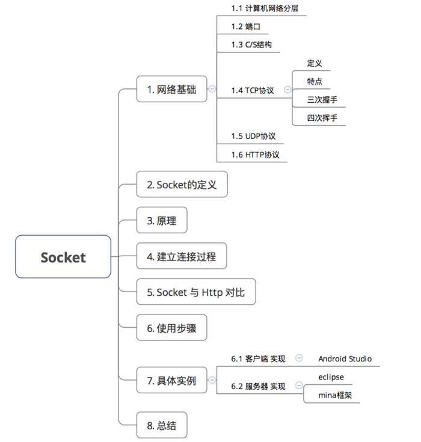


4.1、Socket定义:

- 即套接字，是应用层 与 TCP/IP 协议族通信的中间软件抽象层，表现为一个封装了 TCP / IP协议族的编程接口（API）；


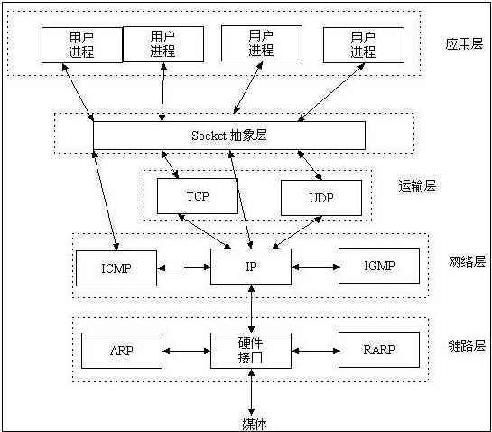

	a.Socket不是一种协议，而是一个编程调用接口（API），属于传输层（主要解决数据如何在网络中传输）
	b.即：通过Socket，我们才能在Andorid平台上通过 TCP/IP协议进行开发
	c.对用户来说，只需调用Socket去组织数据，以符合指定的协议，即可通信

- 成对出现，一对套接字：

		Socket ={(IP地址1:PORT端口号)，(IP地址2:PORT端口号)}


- 一个 Socket实例唯一代表一个主机上的一个应用程序的通信链路；


4.2、建立Socket连接过程

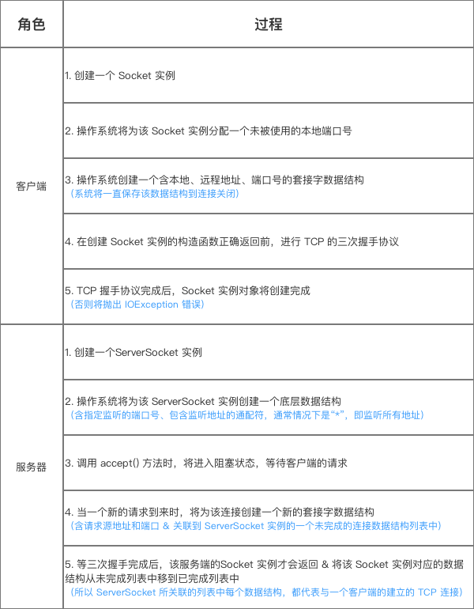


4.3、原理

Socket的使用类型主要有两种

- 流套接字（streamsocket） ：基于TCP协议，采用**流的方式**提供可靠的字节流服务

- 数据报套接字(datagramsocket)：基于UDP协议，采用**数据报文**提供数据打包发送的服务

具体原理图如下：

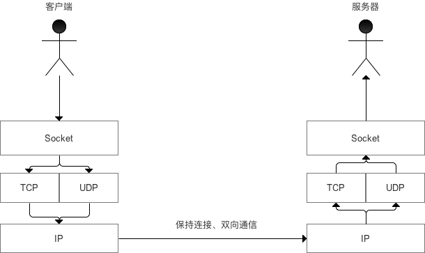


4.4、Socket vs Http


- Socket属于传输层，因为 TCP / IP协议属于传输层，解决的是数据如何在网络中传输的问题

- HTTP协议属于应用层，解决的是如何包装数据

由于二者不属于同一层面，所以本来是没有可比性的。但随着发展，默认的Http里封装了下面几层的使用，所以才会出现Socket & HTTP协议的对比：（主要是工作方式的不同）：

- Http：采用**请求—响应**方式

		即建立网络连接后，当客户端向服务器发送请求后，服务器端才能向客户端返回数据。
		可理解为：是客户端有需要才进行通信

- Socket：采用**服务器主动发送数据**的方式

		即建立网络连接后，服务器可主动发送消息给客户端，而不需要由客户端向服务器发送请求
		可理解为：是服务器端有需要才进行通信

由于通常情况下Socket连接就是TCP连接，因此Socket连接一旦建立，通信双方即可开始相互发送数据内容，直到双方连接断开。
但在实际网络应用中，客户端到服务器之间的通信往往需要穿越多个中间节点，例如路由器、网关、防火墙等，
大部分防火墙默认会关闭长时间处于非活跃状态的连接而导致Socket连接断连，因此需要通过轮询告诉网络，该连接处于活跃状态。

而HTTP连接使用的是“请求—响应”的方式，不仅在请求时需要先建立连接，而且需要客户端向服务器发出请求后，服务器端才能回复数据。

很多情况下，需要服务器端主动向客户端推送数据，保持客户端与服务器数据的实时与同步。

此时若双方建立的是Socket连接，服务器就可以直接将数据传送给客户端；
若双方建立的是HTTP连接，则服务器需要等到客户端发送一次请求后才能将数据传回给客户端。

因此，客户端**定时**向服务器端发送连接请求，不仅可以保持在线，同时也是在“询问”服务器是否有新的数据，如果有就将数据传给客户端。

4.5、Socket使用步骤

Socket可基于TCP或者UDP协议，但TCP更加常用

创建Socket连接时，可以指定使用的传输层协议，Socket可以支持不同的传输层协议（TCP或UDP），当使用TCP协议进行连接时，该Socket连接就是一个TCP连接。

实例的Socket将基于TCP协议

	// 步骤1：创建客户端 & 服务器的连接
	
	// 创建Socket对象 & 指定服务端的IP及端口号 
	Socket socket = new Socket("192.168.1.32", 1989);  
	
	// 判断客户端和服务器是否连接成功  
	socket.isConnected());
	
	         
	// 步骤2：客户端 & 服务器 通信
	// 通信包括：客户端 接收服务器的数据 & 发送数据 到 服务器
	
	<-- 操作1：接收服务器的数据 -->
	
		// 步骤1：创建输入流对象InputStream
		InputStream is = socket.getInputStream() 
		
		// 步骤2：创建输入流读取器对象 并传入输入流对象
		// 该对象作用：获取服务器返回的数据
		InputStreamReader isr = new InputStreamReader(is);
		BufferedReader br = new BufferedReader(isr);
		
		// 步骤3：通过输入流读取器对象 接收服务器发送过来的数据
		br.readLine()；
	
	
	<-- 操作2：发送数据 到 服务器 -->                  
	
		// 步骤1：从Socket 获得输出流对象OutputStream
		// 该对象作用：发送数据
		OutputStream outputStream = socket.getOutputStream(); 
		
		// 步骤2：写入需要发送的数据到输出流对象中
		outputStream.write（（"Carson_Ho"+"\n"）.getBytes("utf-8")）；
		// 特别注意：数据的结尾加上换行符才可让服务器端的readline()停止阻塞
		
		// 步骤3：发送数据到服务端 
		outputStream.flush();  
	
	
	// 步骤3：断开客户端 & 服务器 连接
	
	 os.close();
	// 断开 客户端发送到服务器 的连接，即关闭输出流对象OutputStream
	
	br.close();
	// 断开 服务器发送到客户端 的连接，即关闭输入流读取器对象BufferedReader
	
	socket.close();
	// 最终关闭整个Socket连接


4.6、具体实例

(1). 客户端 实现

步骤1：加入网络权限

	<uses-permission android:name="android.permission.INTERNET" />

步骤2：主布局界面设置

包括创建Socket连接、客户端 & 服务器通信的按钮

	<Button
	        android:id="@+id/connect"
	        android:layout_width="match_parent"
	        android:layout_height="wrap_content"
	        android:text="connect" />
	
	    <Button
	        android:id="@+id/disconnect"
	        android:layout_width="match_parent"
	        android:layout_height="wrap_content"
	        android:text="disconnect" />
	
	    <TextView
	        android:id="@+id/receive_message"
	        android:layout_width="match_parent"
	        android:layout_height="wrap_content" />
	
	    <Button
	        android:id="@+id/Receive"
	        android:layout_width="match_parent"
	        android:layout_height="wrap_content"
	        android:text="Receive from message" />
	
	    <EditText
	        android:id="@+id/edit"
	        android:layout_width="match_parent"
	        android:layout_height="wrap_content" />
	
	    <Button
	        android:id="@+id/send"
	        android:layout_width="match_parent"
	        android:layout_height="wrap_content"
	        android:text="send"/>


步骤3：创建Socket连接、客户端 & 服务器通信

MainActivity.java

	
	import android.os.Bundle;
	import android.os.Handler;
	import android.os.Message;
	import android.support.v7.app.AppCompatActivity;
	import android.view.View;
	import android.widget.Button;
	import android.widget.EditText;
	import android.widget.TextView;
	
	import java.io.BufferedReader;
	import java.io.IOException;
	import java.io.InputStream;
	import java.io.InputStreamReader;
	import java.io.OutputStream;
	import java.net.Socket;
	import java.util.concurrent.ExecutorService;
	import java.util.concurrent.Executors;
	
	public class MainActivity extends AppCompatActivity {
	
	    /**
	     * 主 变量
	     */
	
	    // 主线程Handler
	    // 用于将从服务器获取的消息显示出来
	    private Handler mMainHandler;
	
	    // Socket变量
	    private Socket socket;
	
	    // 线程池
	    // 为了方便展示,此处直接采用线程池进行线程管理,而没有一个个开线程
	    private ExecutorService mThreadPool;
	
	    /**
	     * 接收服务器消息 变量
	     */
	    // 输入流对象
	    InputStream is;
	
	    // 输入流读取器对象
	    InputStreamReader isr ;
	    BufferedReader br ;
	
	    // 接收服务器发送过来的消息
	    String response;
	
	
	    /**
	     * 发送消息到服务器 变量
	     */
	    // 输出流对象
	    OutputStream outputStream;
	
	    /**
	     * 按钮 变量
	     */
	
	    // 连接 断开连接 发送数据到服务器 的按钮变量
	    private Button btnConnect, btnDisconnect, btnSend;
	
	    // 显示接收服务器消息 按钮
	    private TextView Receive,receive_message;
	
	    // 输入需要发送的消息 输入框
	    private EditText mEdit;
	
	    @Override
	    protected void onCreate(Bundle savedInstanceState) {
	        super.onCreate(savedInstanceState);
	        setContentView(R.layout.activity_main);
	
	        /**
	         * 初始化操作
	         */
	
	        // 初始化所有按钮
	        btnConnect = (Button) findViewById(R.id.connect);
	        btnDisconnect = (Button) findViewById(R.id.disconnect);
	        btnSend = (Button) findViewById(R.id.send);
	        mEdit = (EditText) findViewById(R.id.edit);
	        receive_message = (TextView) findViewById(R.id.receive_message);
	        Receive = (Button) findViewById(R.id.Receive);
	
	        // 初始化线程池
	        mThreadPool = Executors.newCachedThreadPool();
	
	
	        // 实例化主线程,用于更新接收过来的消息
	        mMainHandler = new Handler() {
	            @Override
	            public void handleMessage(Message msg) {
	                switch (msg.what) {
	                    case 0:
	                        receive_message.setText(response);
	                        break;
	                }
	            }
	        };
	
	
	        /**
	         * 创建客户端 & 服务器的连接
	         */
	        btnConnect.setOnClickListener(new View.OnClickListener() {
	            @Override
	            public void onClick(View v) {
	
	                // 利用线程池直接开启一个线程 & 执行该线程
	                mThreadPool.execute(new Runnable() {
	                    @Override
	                    public void run() {
	
	                        try {
	
	                            // 创建Socket对象 & 指定服务端的IP 及 端口号
	                            socket = new Socket("192.168.1.172", 8989);
	
	                            // 判断客户端和服务器是否连接成功
	                            System.out.println(socket.isConnected());
	
	                        } catch (IOException e) {
	                            e.printStackTrace();
	                        }
	
	                    }
	                });
	
	            }
	        });
	
	        /**
	         * 接收 服务器消息
	         */
	        Receive.setOnClickListener(new View.OnClickListener() {
	            @Override
	            public void onClick(View v) {
	
	                // 利用线程池直接开启一个线程 & 执行该线程
	                mThreadPool.execute(new Runnable() {
	                    @Override
	                    public void run() {
	
	                          try {
	                            // 步骤1：创建输入流对象InputStream
	                            is = socket.getInputStream();
	
	                              // 步骤2：创建输入流读取器对象 并传入输入流对象
	                              // 该对象作用：获取服务器返回的数据
	                              isr = new InputStreamReader(is);
	                              br = new BufferedReader(isr);
	
	                              // 步骤3：通过输入流读取器对象 接收服务器发送过来的数据
	                              response = br.readLine();
	
	                              // 步骤4:通知主线程,将接收的消息显示到界面
	                              Message msg = Message.obtain();
	                              msg.what = 0;
	                              mMainHandler.sendMessage(msg);
	
	                        } catch (IOException e) {
	                            e.printStackTrace();
	                        }
	
	                    }
	                });
	
	            }
	        });
	
	
	        /**
	         * 发送消息 给 服务器
	         */
	        btnSend.setOnClickListener(new View.OnClickListener() {
	            @Override
	            public void onClick(View v) {
	
	                // 利用线程池直接开启一个线程 & 执行该线程
	                mThreadPool.execute(new Runnable() {
	                    @Override
	                    public void run() {
	
	                        try {
	                            // 步骤1：从Socket 获得输出流对象OutputStream
	                            // 该对象作用：发送数据
	                            outputStream = socket.getOutputStream();
	
	                            // 步骤2：写入需要发送的数据到输出流对象中
	                            outputStream.write((mEdit.getText().toString()+"\n").getBytes("utf-8"));
	                            // 特别注意：数据的结尾加上换行符才可让服务器端的readline()停止阻塞
	
	                            // 步骤3：发送数据到服务端
	                            outputStream.flush();
	
	                        } catch (IOException e) {
	                            e.printStackTrace();
	                        }
	
	                    }
	                });
	
	            }
	        });
	
	
	        /**
	         * 断开客户端 & 服务器的连接
	         */
	        btnDisconnect.setOnClickListener(new View.OnClickListener() {
	            @Override
	            public void onClick(View v) {
	
	                try {
	                    // 断开 客户端发送到服务器 的连接，即关闭输出流对象OutputStream
	                    outputStream.close();
	
	                    // 断开 服务器发送到客户端 的连接，即关闭输入流读取器对象BufferedReader
	                    br.close();
	
	                    // 最终关闭整个Socket连接
	                    socket.close();
	
	                    // 判断客户端和服务器是否已经断开连接
	                    System.out.println(socket.isConnected());
	
	                } catch (IOException e) {
	                    e.printStackTrace();
	                }
	
	            }
	        });
	
	
	    }
	}


(2). 服务器 实现

因本文主要讲解客户端，所以服务器仅仅是为了配合客户端展示

服务器代码请在eclipse平台运行


<br/>

### 5、WebSocket

WebSocket protocol 是HTML5一种新的协议。它实现了浏览器与服务器全双工通信(full-duplex)。一开始的握手需要借助HTTP请求完成。

- 目的：即时通讯，替代轮询

	网站上的即时通讯是很常见的，比如网页的QQ，聊天系统等。按照以往的技术能力通常是采用轮询、Comet技术解决。
		
	HTTP协议是非持久化的，单向的网络协议，在建立连接后只允许浏览器向服务器发出请求后，服务器才能返回相应的数据。当需要即时通讯时，通过轮询在特定的时间间隔（如1秒），由浏览器向服务器发送Request请求，然后将最新的数据返回给浏览器。这样的方法最明显的缺点就是需要不断的发送请求；
	而且通常HTTP request的Header是非常长的，为了传输一个很小的数据 需要付出巨大的代价，是很不合算的，占用了很多的宽带。
	
**缺点：** 会导致过多不必要的请求，浪费流量和服务器资源，每一次请求、应答，都浪费了一定流量在相同的头部信息上。

然而 WebSocket 的出现可以弥补这一缺点。在WebSocket中，只需要服务器和浏览器通过HTTP协议进行一个握手的动作，然后单独建立一条TCP的通信通道进行数据的传送。


5.1、WebSocket 机制

WebSocket 是 HTML5 一种新的协议。它实现了浏览器与服务器全双工通信，能更好的节省服务器资源和带宽并达到实时通讯，它建立在 TCP 之上，同 HTTP 一样通过 TCP 来传输数据，但是它和 HTTP 最大不同是：

- WebSocket 是一种双向通信协议，在建立连接后，WebSocket 服务器和 Browser/Client Agent 都能主动的向对方发送或接收数据，就像 Socket 一样；

- WebSocket 需要类似 TCP 的客户端和服务器端通过握手连接，连接成功后才能相互通信


##### WebSocket 请求响应客户端服务器交互图：

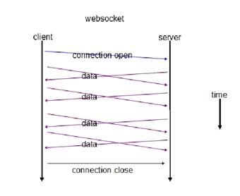

WebSocket 是类似 Socket 的 TCP 长连接的通讯模式，一旦 WebSocket 连接建立后，后续数据都以帧序列的形式传输。

在客户端断开 WebSocket 连接或 Server 端断掉连接前，不需要客户端和服务端重新发起连接请求。

在海量并发及客户端与服务器交互负载流量大的情况下，极大的节省了网络带宽资源的消耗，有明显的性能优势，且客户端发送和接受消息是在同一个持久连接上发起，实时性优势明显。


5.2、 WebSocket 实现


5.3、关系说明

(1) WebSocket与HTTP的关系

相同点：

	1.都是一样基于TCP的，都是可靠性传输协议。
	2.都是应用层协议

不同点：

	1.WebSocket是双向通信协议，模拟Socket协议，可以双向发送或接受信息。HTTP是单向的。
	2.WebSocket是需要握手进行建立连接的

联系：

	WebSocket在建立握手时，数据是通过HTTP传输的。但是建立之后，在真正传输时候是不需要HTTP协议的


(2) WebSocket与Socket的关系

Socket其实并不是一个协议，而是为了方便使用TCP或UDP而抽象出来的一层，是位于应用层和传输控制层之间的一组接口。

当两台主机通信时，必须通过Socket连接，Socket则利用TCP/IP协议建立TCP连接。TCP连接则更依靠于底层的IP协议，IP协议的连接则依赖于链路层等更低层次。

WebSocket则是一个典型的应用层协议。

区别：

	Socket是传输控制层协议，WebSocket是应用层协议。


(3) HTML5与WebSocket的关系

WebSocket API 是HTML5标准的一部分， 但这并不代表WebSocket一定要用在HTML中，或者只能在基于浏览器的应用程序中使用。

<br/>

### 6、主流网络请求开源库的对比（Android-Async-Http、Volley、OkHttp、Retrofit）

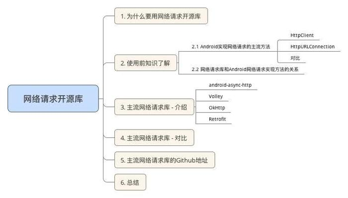

6.1 为什么要用网络请求开源库？

网络请求开源库是一个将 网络请求的相关功能封装好的类库

- 没有网络请求框架之前

	App想与服务器进行网络请求交互是一件很痛苦的事：因为Android的主线程不能进行网络请求，需另开1个线程请求、考虑到线程池,缓存等一堆问题

- 使用网络请求库后

	实现网络请求的需求同时不需要考虑:

		异步请求
		线程池
		缓存
		...

	同时还：

		降低开发难度
		缩短开发周期
		使用方便

6.2 储备知识

(1). Android实现网络请求的主流方法（SDK自带）

HttpClient、HttpURLConnection

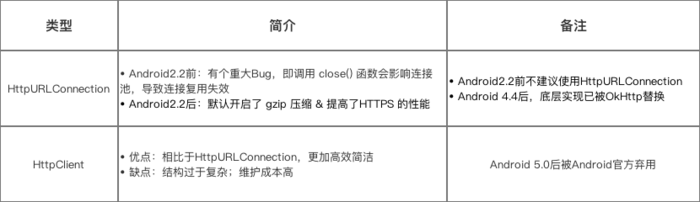


(2). 网络请求库 与 Android网络请求方法的关系

- 网络请求库的本质 = 封装了 网络请求 + 异步 + 数据处理功能的库

- 其中，网络请求功能则是采用Android网络请求的原生方法（HttpClient或HttpURLConnection）

- 具体如下图

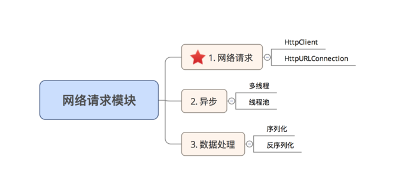


6.3 主流的网络请求库 简介

如今Android中主流的网络请求框架有：

Android-Async-Http、Volley、OkHttp、Retrofit。

下面是简单介绍：


6.4 网络请求库- 对比

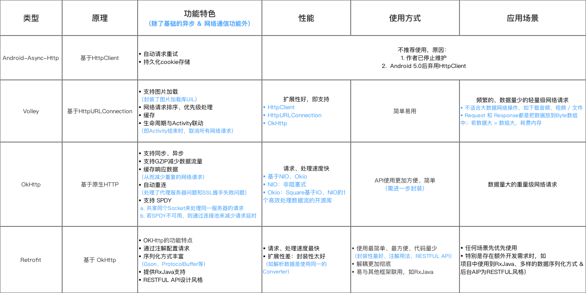

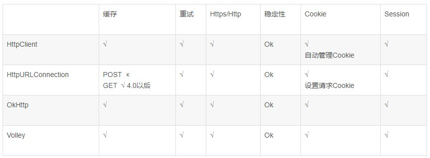


## 参考地址 vs 面试题

[协议](https://blog.csdn.net/qq_31337311/article/details/80781273)

[Socket使用攻略](https://www.jianshu.com/p/089fb79e308b)

[主流网络请求开源库的对比（Android-Async-Http、Volley、OkHttp、Retrofit）](https://www.jianshu.com/p/050c6db5af5a)


2.描述一下http？

（见上文）

3.描述一下https？

https中哪里用了对称加密，哪里用了非对称加密，对加密算法（如RSA）等是否有了解？

[文章](https://showme.codes/2017-02-20/understand-https/ )

4.三次握手，四次挥手的具体细节？

（见上文）

5.TCP与UDP的区别？

（见上文）

6.WebSocket与socket的区别？

（见上文）

7.HttpClient和HttpURLConnection的区别？

Volley，okhttp，retrofit之间的区别和核心原理和使用场景？

（见上文）