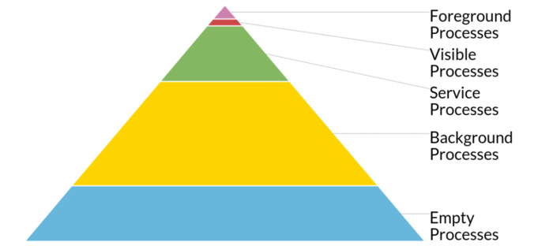
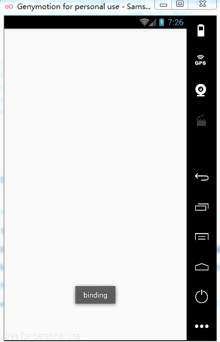
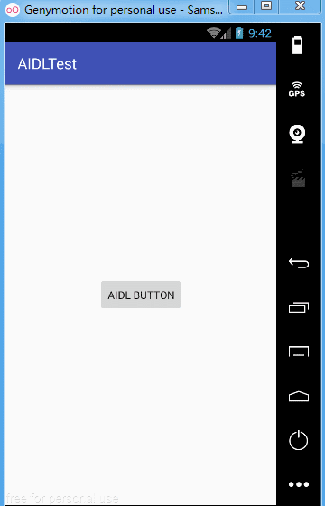

## 进程间通信-IPC

- 前言：

	如果一个进程占用内存超过了这个内存限制，就会报OOM的问题，很多涉及到大图片的频繁操作或者需要读取一大段数据在内存中使用时，很容易报OOM的问题。为了彻底地解决应用内存的问题，Android引入了多进程的概念，它允许在同一个应用内，为了分担主进程的压力，将占用内存的某些页面单独开一个进程，比如Flash、视频播放页面，频繁绘制的页面等

### 1.多进程

多进程就是多个进程的意思，那么什么是进程呢？

当一个应用在开始运行时，系统会为它创建一个进程，一个应用默认只有一个进程，这个进程（主进程）的名称就是应用的包名。

进程的特点：

- 进程是**系统资源和分配**的基本单位，而线程是**调度**的基本单位。
- 每个进程都有自己独立的资源和内存空间。
- 其它进程不能任意访问当前进程的内存和资源。
- 系统给每个进程分配的内存会有限制。

根据上边的引言和进程的特点可以看出，使用多进程的场景为：**需要使apk所使用的内存限制扩大**

### 2.进程的等级

按优先级可以分为五类，优先级从高到低排列：

- Android进程分类：

1.前台进程：

该进程包含正在与用户进行交互的界面组件，比如一个Activity。

在接收关键生命周期方法时会让一个进程临时提升为前台进程，包括任何服务的生命周期方法onCreate()和onDestroy()和任何广播接收器onReceive()方法。这样做确保了这些组件的操作是有效的原子操作，每个组件都能执行完成而不被杀掉。

2.可见进程：

该进程中的组件虽然没有和用户交互，但是仍然可以被看到。

activity可见的时候不一定在前台。一个简单的例子是前台的 activity 使用对话框启动了一个新的 activity 或者一个透明 activity 。另一个例子是当调用运行时权限对话框时（事实上它就是一个 activity！）。

3.服务进程：

该进程包含在执行后台操作的服务组件，比如播放音乐的Service。

对于许多在后台做处理（如加载数据）而没有立即成为前台服务的应用都属于这种情况。

**请特别注意：** 从onStartCommand()返回的常量，如果服务由于内存压力被杀掉，它表示控制什么发生什么：

START_STICKY表示希望系统可用的时候自动重启服务，但不关心是否能获得最后一次的 Intent （例如，可以重建自己的状态或者控制自己的 start/stop 生命周期）。

START_REDELIVER_INTENT是为那些在被杀死之后重启时重新获得 Intent 的服务的，直到用传递给 onStartCommand() 方法的 startId 参数调用stopSelf()为止。这里会使用 Intent 和 startId 作为队列完成工作。

START_NOT_STICKY用于那些杀掉也没关系的服务。这适合那些管理周期性任务的服务，它们只是等待下一个时间窗口工作。

4.后台进程：

该进程包含的组件没有与用户交互，用户也看不到 Service。

在一般操作场景下，设备上的许多内存就是用在这上面的，使可以重新回到之前打开过的某个 activity 。

5.空进程：

没有任何界面组件、服务组件，或触发器组件，只是出于缓存的目的而被保留（为了更加有效地使用内存而不是完全释放掉），只要 Android 需要可以随时杀掉它们。

### 3.多进程的创建

Android多进程创建很简单，只需要在AndroidManifest.xml的声明四大组件的标签中增加”android:process”属性即可。命名之后，就成了一个单独的进程。

- process分私有进程和全局进程：

私有进程的名称前面有冒号，例如：

	<service android:name=".MusicService"   
           android:process=":musicservice"/>//

全局进程的名称前面没有冒号，例如：

	<service android:name=".MusicService"   
           android:process="com.trampcr.musicdemo.service"/>

为了节省系统内存，在退出该Activity的时候可以将其杀掉（如果没有人为杀掉该进程，在程序完全退出时该进程会被系统杀掉）。

多进程被创建好了，应用运行时就会对进程进行初始化，如果一个application中有多个进程，在进行全局初始化时，多进程会被初始化多次。

**解决办法：** 判断当前进程，然后做相应的初始化操作。

### 4.多进程间的通信IPC

IPC：InterProcess Communication，即进程间通信

我们知道，同一个进程的多个线程是共享该进程的所有资源，但多个进程间内存是不可见的，也就是说多个进程间内存是不共享的。那么进程间是如何进行通信的呢？

Android中提供了三种方法：

	1.系统实现。
	2.AIDL（Android Interface Definition Language，Android接口定义语言）：大部分应用程序不应该使用AIDL去创建一个绑定服务，因为它需要多线程能力，并可能导致一个更复杂的实现。
	3.Messenger：利用Handler实现。（适用于多进程、单线程，不需要考虑线程安全），其底层基于AIDL

##### (1). 使用Messenger

如需让服务与远程进程通信，则可使用Messenger为服务提供接口。
定义一个MessengerService继承自Service，并在AndroidManifest.xml中声明并给一个进程名，使该服务成为一个单独的进程。

代码如下：

MessengerService.java

	public class MessengerService extends Service{
	
	    class IncomingHandler extends Handler{
	        @Override
	        public void handleMessage(Message msg) {
	            super.handleMessage(msg);
	            switch (msg.what){
	                case 0:
	                    Toast.makeText(getApplicationContext(), "hello, trampcr", Toast.LENGTH_SHORT).show();
	                    break;
	            }
	        }
	    }
	
	    Messenger mMessenger = new Messenger(new IncomingHandler());
	
	    @Nullable
	    @Override
	    public IBinder onBind(Intent intent) {
	        Toast.makeText(getApplicationContext(), "binding", Toast.LENGTH_SHORT).show();
	        return mMessenger.getBinder();
	    }
	}

AndroidManifest.xml文件的配置如下：

	<service android:name=".MessengerService"  
         android:process="com.jie.messenger.service"/>

MessengerActivity.java

	public class MessengerActivity extends Activity{
	
	    private boolean mBound;
	    private Messenger mMessenger;
	    private ServiceConnection mServiceConnection = new ServiceConnection() {
	        @Override
	        public void onServiceConnected(ComponentName name, IBinder service) {
	            mMessenger = new Messenger(service);
	            mBound = true;
	        }
	
	        @Override
	        public void onServiceDisconnected(ComponentName name) {
	            mMessenger = null;
	            mBound = false;
	        }
	    };
	
	    public void sayHello(View v){
	        if(!mBound){
	            return;
	        }
	        Message msg = Message.obtain(null, 0 , 0, 0);
	        try {
	            mMessenger.send(msg);
	        } catch (RemoteException e) {
	            e.printStackTrace();
	        }
	    }
	
	    @Override
	    protected void onCreate(Bundle savedInstanceState) {
	        super.onCreate(savedInstanceState);
	        setContentView(R.layout.activity_messenger);
	    }
	
	    @Override
	    protected void onStart() {
	        super.onStart();
	        Intent intent = new Intent(MessengerActivity.this, MessengerService.class);
	        bindService(intent, mServiceConnection, BIND_AUTO_CREATE);
	    }
	
	    @Override
	    protected void onStop() {
	        super.onStop();
	        if(mBound){
	            unbindService(mServiceConnection);
	            mBound = false;
	        }
	    }
	}

通过以上代码，可以看到Messenger的使用方法：

	1.服务实现一个Handler，由其接收来自客户端的每个调用的回调。
	2.Handler用于创建Messenger对象（对Handler的引用）。
	3.Messenger创建一个IBinder，服务通过onBind()使其返回客户端。
	4.客户端使用IBinder将Messenger（引用服务的Handler）实例化，然后使用后者将Message对象发送给服务。
	5.服务在其Handler中（具体地讲，是在handleMessage()方法中）接收每个Message。

这样，客户端并没有调用服务的“方法”。而客户端传递的“消息”（Message对象）是服务在其Handler中接收的

以上代码实现的应用，刚打开会弹出一个binding，binding表示打开应用Activity就通过Messenger连接了一个服务进程，然后点击say hello会弹出hello,trampcr，这表示了Activity通过Messenger将Message发送给了服务进程。如下图：

MessengerService进程与MessengerActivity之间的通信

##### (2).使用AIDL

AIDL是一种接口描述语言，通常用于进程间通信。

使用AIDL的步骤：

1.创建AIDL，在main下新建一个文件夹aidl，然后在aidl下新建AIDL文件，这时系统会自动为该文件创建一个包名。

aidl文件中会有一个默认的basicType方法，我们为它增加一个getName方法。代码如下：

	interface IMyAidlInterface {
	    /**
	     * Demonstrates some basic types that you can use as parameters
	     * and return values in AIDL.
	     */
	    void basicTypes(int anInt, long aLong, boolean aBoolean, float aFloat,
	            double aDouble, String aString);
	
	    String getName(String nickName);
	}

以上是我们自己创建的aidl文件，系统还会自动生成aidl代码，所在位置为：build/generated/source/aidl下debug和release，但是此时debug下没有任何东西，可以rebuild或运行一下程序，再次打开debug，发现生成了一个包和一个aidl文件。

2.在java下新建一个类AIDLService继承自Service。代码如下：

	public class AIDLService extends Service {
	
	    IMyAidlInterface.Stub mStub = new IMyAidlInterface.Stub() {
	        @Override
	        public void basicTypes(int anInt, long aLong, boolean aBoolean, float aFloat, double aDouble, String aString) throws RemoteException {
	
	        }
	
	        @Override
	        public String getName(String nickName) throws RemoteException {
	            return "aidl " + nickName;
	        }
	    };
	
	    @Nullable
	    @Override
	    public IBinder onBind(Intent intent) {
	        return mStub;
	    }
	}

3.在AndroidManifest.xml中注册，并给一个进程名，是该服务成为一个独立的进程。

	<service android:name=".AIDLService"   
            android:process="com.aidl.test.service"/>

4.在MainActivity中进行与AIDLService之间的进程间通信。代码如下：

	public class MainActivity extends AppCompatActivity {
	
	    private Button mBtnAidl;
	    private IMyAidlInterface mIMyAidlInterface;
	
	    ServiceConnection mServiceConnection = new ServiceConnection() {
	        @Override
	        public void onServiceConnected(ComponentName name, IBinder service) {
	            mIMyAidlInterface = IMyAidlInterface.Stub.asInterface(service);
	        }
	
	        @Override
	        public void onServiceDisconnected(ComponentName name) {
	
	        }
	    };
	
	    @Override
	    protected void onCreate(Bundle savedInstanceState) {
	        super.onCreate(savedInstanceState);
	        setContentView(R.layout.activity_main);
	        mBtnAidl = (Button) findViewById(R.id.btn_aidl);
	
	        bindService(new Intent(MainActivity.this, AIDLService.class), mServiceConnection, BIND_AUTO_CREATE);
	
	        mBtnAidl.setOnClickListener(new View.OnClickListener() {
	            @Override
	            public void onClick(View v) {
	                if(mIMyAidlInterface != null){
	                    try {
	                        String name = mIMyAidlInterface.getName("I'm nick");
	                        Toast.makeText(MainActivity.this, "name = " + name, Toast.LENGTH_SHORT).show();
	                    } catch (RemoteException e) {
	                        e.printStackTrace();
	                    }
	                }
	            }
	        });
	    }
	}

在Activity中利用bindService与AIDLService进行连接，通过IMyAidlInterface实例与AIDLService进程进行通信，如下图所示：

AIDLService进程与MainActivity之间的通信

##### (3).AIDL和Messenger的区别：

Messenger不适用大量并发的请求：Messenger以串行的方式来处理客户端发来的消息，如果大量的消息同时发送到服务端，服务端仍然只能一个个的去处理。

Messenger主要是为了传递消息：对于需要跨进程调用服务端的方法，这种情景不适用Messenger。

Messenger的底层实现是AIDL，系统为我们做了封装从而方便上层的调用。

AIDL适用于大量并发的请求，以及涉及到服务端端方法调用的情况

### 5.序列化插件

5.1 Parcelable code generate：自动生成实现了Parcelable接口的对象。

5.2 parcel：

 android提供了一种新的类型：parcel（英文解释：包裹，小包），本类用来封装数据的容器，封装后的数据可以通过Intent或IPC传递，除了基本类型外，只有实现了Parcelable接口的类才能放入parcel中。

parcel一般都用在Binder通信，通过read和write方法进行客户端与服务端的数据传递（通信）。

- Parcelable的实现使用：  

Parcelabel 的实现，需要在类中添加一个静态成员变量 CREATOR，这个变量需要继承 Parcelable.Creator 接口。

- Parcelable和Serializable的区别：

android自定义对象可序列化有两个选择一个是Serializable和Parcelable

a.对象为什么需要序列化

    1.永久性保存对象，保存对象的字节序列到本地文件。
    2.通过序列化对象在网络中传递对象。
    3.通过序列化对象在进程间传递对象。

b.当对象需要被序列化时如何选择所使用的接口

    1.在使用内存的时候Parcelable比Serializable的性能高。
    2.Serializable在序列化的时候会产生大量的临时变量，从而引起频繁的GC（内存回收）。
    3.Parcelable不能使用在将对象存储在磁盘上这种情况，因为在外界的变化下Parcelable不能很好的保证数据的持续性。

## 参考文档 vs 面试题

1.进程间通信的方式？

（见上文）

2.什么是AIDL？ AIDL解决了什么问题？

（见上文）

3.Android进程分类？

（见上文 5种）

4.Binder机制的作用和原理？

