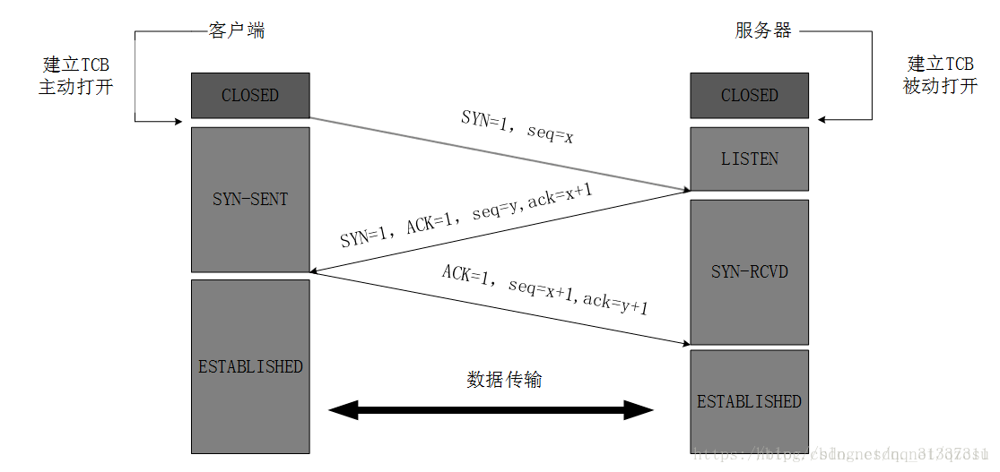
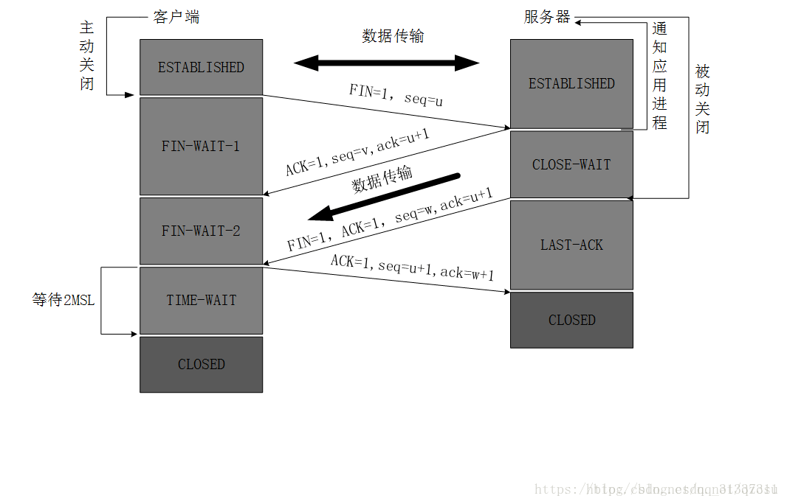

##  各种协议总结

##### TCP vs UDP

1. UDP，在传送数据前不需要先建立连接，远地的主机在收到UDP报文后也不需要给出任何确认。
虽然UDP不提供可靠交付，但是正是因为这样，省去和很多的开销，使得它的速度比较快，比如一些对实时性要求较高的服务，就常常使用的是UDP。
对应的应用层的协议主要有 DNS,TFTP,DHCP,SNMP,NFS 等。

2. TCP，提供面向连接的服务，在传送数据之前必须先建立连接，数据传送完成后要释放连接。
因此TCP是一种可靠的的运输服务，但是正因为这样，不可避免的增加了许多的开销，比如确认，流量控制等。
对应的应用层的协议主要有 SMTP,TELNET,HTTP,FTP 等。


##### TCP连接

TCP(Transmission Control Protocol) 传输控制协议。TCP是主机对主机层的传输控制协议，提供可靠的连接服务，采用三次握手确认建立一个连接。
位码即tcp标志位，有6种 标示:

```
SYN(synchronous建立联机) 
ACK(acknowledgement 确认) 
PSH(push传送) 
FIN(finish结束) 
RST(reset重置) 
URG(urgent紧急)
Sequence number(顺序号码) 
Acknowledge number(确认号码)

```

手机能够使用联网功能是因为手机底层实现了TCP/IP协议，可以使手机终端通过无线网络建立TCP连接。

TCP协议可以对上层网络提供接口，使上层网络数据的传输建立在“无差别”的网络之上。建立起一个TCP连接需要经过“三次握手”：

第一次握手：客户端发送syn包(syn=j)到服务器，并进入SYN_SEND状态，等待服务器确认；

第二次握手：服务器收到syn包，必须确认客户的SYN（ack=j+1），同时自己也发送一个SYN包（syn=k），即SYN+ACK包，此时服务器进入SYN_RECV状态；

第三次握手：客户端收到服务器的SYN＋ACK包，向服务器发送确认包ACK(ack=k+1)，此包发送完毕，客户端和服务器进入ESTABLISHED状态，完成三次握手。
握手完成后，两台主机开始传输数据了。



```
为什么要三次握手？

  如果只有一次握手，Client不能确定与Server的单向连接，更加不能确定Server与Client的单向连接；
  如果只有两次握手，Client确定与Server的单向连接，但是Server不能确定与Client的单向连接；
  只有三次握手，Client与Server才能相互确认双向连接，实现双工数据传输。

```

握手过程中传送的包里不包含数据，三次握手完毕后，客户端与服务器才正式开始传送数据。理想状态下，TCP连接一旦建立，在通信双方中的任何一方主动关闭连接之前，TCP 连接都将被一直保持下去。断开连接时服务器和客户端均可以主动发起断开TCP连接的请求，断开过程需要经过“四次挥手”。

```

实例一:
IP 192.168.1.116.3337 > 192.168.1.123.7788: S 3626544836:3626544836
IP 192.168.1.123.7788 > 192.168.1.116.3337: S 1739326486:1739326486 ack 3626544837
IP 192.168.1.116.3337 > 192.168.1.123.7788: ack 1739326487,ack 1

第一次握手：192.168.1.116发送位码syn＝1,随机产生seq number=3626544836的数据包到192.168.1.123,192.168.1.123
由SYN=1知道192.168.1.116要求建立联机;

第二次握手：192.168.1.123收到请求后要确认联机信息，向192.168.1.116发送ack number=3626544837,syn=1,ack=1,
随机产生seq=1739326486的包;

第三次握手：192.168.1.116收到后检查ack number是否正确，即第一次发送的seq number+1,以及位码ack是否为1，若正确，
192.168.1.116会再发送ack number=1739326487,ack=1，192.168.1.123收到后确认seq=seq+1,ack=1则连接建立成功。

实例二:

TCP的作用是流量控制，主要是控制数据流的传输。下面以浏览网页为例，根据自身理解来解释一下这个过程。
（注：第二个ack属于代码段ack位）
pc浏览服务器网页此过程不包括域名查询，只描述TCP与http数据流的变化。
pc与http服务器进行三次握手来建立连接。
1.pc：seq=0 ack=0 syn=1 ack=0 发送给服务器建立同步请求。
2.server： seq=0 ack=1 syn=1 ack=1 发送给客户端建立同步响应.
3.pc:seq=1 ack=1 syn=0 ack=1 发送给服务器,三次握手完成建立同步信息成功.
4.pc产生http数据消息,向服务器发送get请求.
5.服务器收到请求并发送TCP确认,然后发送http数据信息给客户端的浏览器.
6.客户端收到服务器的http信息,然后发送TCP确认信息给服务器.
7.客户端发送FIN+ACK给服务器,要求结束数据传输.
8.服务器发送TCP确认消息用于确认pc的TCP的FIN消息
9.服务器向客户端发送FIN+ACK消息用于结束TCP会话.
10.客户端发送确认信息给服务器,整个会话结束.

```

四次挥手:



第一次挥手：
Client发送一个FIN，用来关闭Client到Server的数据传送，Client进入FIN_WAIT_1状态。

第二次挥手：
Server收到FIN后，发送一个ACK给Client，确认序号为收到序号+1（与SYN相同，一个FIN占用一个序号），Server进入CLOSE_WAIT状态。

第三次挥手：
Server发送一个FIN，用来关闭Server到Client的数据传送，Server进入LAST_ACK状态。

第四次挥手：
Client收到FIN后，Client进入TIME_WAIT状态，接着发送一个ACK给Server，确认序号为收到序号+1，Server进入CLOSED状态，完成四次挥手。

```
为什么要四次挥手？
“三次握手”的第二次握手发送SYN+ACK回应第一次握手的SYN，
但是“四次挥手”的第二次挥手只能发送ACK回应第一次挥手的FIN，因为此时Server可能还有数据传输给Client，
所以Server传输数据完成后才能发起第三次挥手发送FIN给Client，等待Client的第四次挥手ACK。

```

```
为什么客户端最后还要等待2MSL？

MSL（Maximum Segment Lifetime），TCP允许不同的实现可以设置不同的MSL值。

第一，保证客户端发送的最后一个ACK报文能够到达服务器，因为这个ACK报文可能丢失，站在服务器的角度看来，
我已经发送了FIN+ACK报文请求断开了，客户端还没有给我回应，应该是我发送的请求断开报文它没有收到，
于是服务器又会重新发送一次，而客户端就能在这个2MSL时间段内收到这个重传的报文，接着给出回应报文，并且会重启2MSL计时器。

第二，防止类似与“三次握手”中提到了的“已经失效的连接请求报文段”出现在本连接中。客户端发送完最后一个确认报文后，
在这个2MSL时间中，就可以使本连接持续的时间内所产生的所有报文段都从网络中消失。这样新的连接中不会出现旧连接的请求报文。

为什么建立连接是三次握手，关闭连接确是四次挥手呢？

建立连接的时候， 服务器在LISTEN状态下，收到建立连接请求的SYN报文后，把ACK和SYN放在一个报文里发送给客户端。 
而关闭连接时，服务器收到对方的FIN报文时，仅仅表示对方不再发送数据了但是还能接收数据，而自己也未必全部数据都发送给对方了，
所以己方可以立即关闭，也可以发送一些数据给对方后，再发送FIN报文给对方来表示同意现在关闭连接，
因此，己方ACK和FIN一般都会分开发送，从而导致多了一次。
MSL（Maximum Segment Lifetime），TCP允许不同的实现可以设置不同的MSL值。

第一，保证客户端发送的最后一个ACK报文能够到达服务器，因为这个ACK报文可能丢失，站在服务器的角度看来，
我已经发送了FIN+ACK报文请求断开了，客户端还没有给我回应，应该是我发送的请求断开报文它没有收到，
于是服务器又会重新发送一次，而客户端就能在这个2MSL时间段内收到这个重传的报文，接着给出回应报文，并且会重启2MSL计时器。

第二，防止类似与“三次握手”中提到了的“已经失效的连接请求报文段”出现在本连接中。
客户端发送完最后一个确认报文后，在这个2MSL时间中，就可以使本连接持续的时间内所产生的所有报文段都从网络中消失。
这样新的连接中不会出现旧连接的请求报文。

为什么建立连接是三次握手，关闭连接确是四次挥手呢？

建立连接的时候， 服务器在LISTEN状态下，收到建立连接请求的SYN报文后，把ACK和SYN放在一个报文里发送给客户端。 
而关闭连接时，服务器收到对方的FIN报文时，仅仅表示对方不再发送数据了但是还能接收数据，而自己也未必全部数据都发送给对方了，
所以己方可以立即关闭，也可以发送一些数据给对方后，再发送FIN报文给对方来表示同意现在关闭连接，
因此，己方ACK和FIN一般都会分开发送，从而导致多了一次。

```

> 总结：udp/tcp的区别

1.tcp是一对一面向连接，udp可以一对一也可以一对多连接。

2.tcp稳定可靠不丢包，udp不稳定不可靠会丢包。

3.tcp占用时间长，占用资源多，udp占用时间少，占用资源少。

4.tcp可以保证数据传输的前后顺序，udp不能保证


##### HTTP协议

HTTP协议即超文本传送协议(Hypertext Transfer Protocol )，是Web联网的基础，也是手机联网常用的协议之一，HTTP协议是建立在TCP协议之上的一种应用。

HTTP连接最显著的特点是客户端发送的每次请求都需要服务器回送响应，在请求结束后，会主动释放连接。从建立连接到关闭连接的过程称为“一次连接”。

1）在HTTP 1.0中，客户端的每次请求都要求建立一次单独的连接，在处理完本次请求后，就自动释放连接。

2）在HTTP 1.1中则可以在一次连接中处理多个请求，并且多个请求可以重叠进行，不需要等待一个请求结束后再发送下一个请求。

由于HTTP在每次请求结束后都会主动释放连接，因此HTTP连接是一种“短连接”，要保持客户端程序的在线状态，需要不断地向服务器发起连接请求。
通常的做法是即时不需要获得任何数据，客户端也保持每隔一段固定的时间向服务器发送一次“保持连接”的请求，服务器在收到该请求后对客户端进行回复，
表明知道 客户端“在线”。若服务器长时间无法收到客户端的请求，则认为客户端“下线”，若客户端长时间无法收到服务器的回复，则认为网络已经断开。


##### SOCKET原理

###### 1. 套接字（socket）概念

套接字（socket）是通信的基石，是支持TCP/IP协议的网络通信的基本操作单元。它是网络通信过程中端点的抽象表示，
包含进行网络通信必须的五种信息：连接使用的协议，本地主机的IP地址，本地进程的协议端口，远地主机的IP地址，远地进程的协议口。

应用层通过传输层进行数据通信时，TCP会遇到同时为多个应用程序进程提供并发服务的问题。多个TCP连接或多个应用程序进程可能需要通过同一个
TCP协议端口传输数据。为了区别不同的应用程序进程和连接，许多计算机操作系统为应用程序与TCP／IP协议交互提供了套接字(Socket)接口。
应用层可以和传输层通过Socket接口，区分来自不同应用程序进程或网络连接的通信，实现数据传输的并发服务。


###### 2. 建立socket连接

建立Socket连接至少需要一对套接字，其中一个运行于客户端，称为ClientSocket ，另一个运行于服务器端，称为ServerSocket 。

套接字之间的连接过程分为三个步骤：服务器监听，客户端请求，连接确认。

服务器监听：服务器端套接字并不定位具体的客户端套接字，而是处于等待连接的状态，实时监控网络状态，等待客户端的连接请求。

客户端请求：指客户端的套接字提出连接请求，要连接的目标是服务器端的套接字。为此，客户端的套接字必须首先描述它要连接的服务器的套接字，
指出服务器端套接字的地址和端口号，然后就向服务器端套接字提出连接请求。

连接确认：当服务器端套接字监听到或者说接收到客户端套接字的连接请求时，就响应客户端套接字的请求，建立一个新的线程，把服务器端套接字的描述发
给客户端，一旦客户端确认了此描述，双方就正式建立连接。而服务器端套接字继续处于监听状态，继续接收其他客户端套接字的连接请求。


###### 4. SOCKET连接与TCP连接

创建Socket连接时，可以指定使用的传输层协议，Socket可以支持不同的传输层协议（TCP或UDP），当使用TCP协议进行连接时，该Socket连接就是一个TCP连接。


###### 5. Socket连接与HTTP连接

由于通常情况下Socket连接就是TCP连接，因此Socket连接一旦建立，通信双方即可开始相互发送数据内容，直到双方连接断开。
但在实际网络应用中，客户端到服务器之间的通信往往需要穿越多个中间节点，例如路由器、网关、防火墙等，
大部分防火墙默认会关闭长时间处于非活跃状态的连接而导致 Socket 连接断连，因此需要通过轮询告诉网络，该连接处于活跃状态。
而HTTP连接使用的是“请求—响应”的方式，不仅在请求时需要先建立连接，而且需要客户端向服务器发出请求后，服务器端才能回复数据。

很多情况下，需要服务器端主动向客户端推送数据，保持客户端与服务器数据的实时与同步。

此时若双方建立的是Socket连接，服务器就可以直接将数据传送给客户端；

若双方建立的是HTTP连接，则服务器需要等到客户端发送一次请求后才能将数据传回给客户端，

因此，客户端**定时**向服务器端发送连接请求，不仅可以保持在线，同时也是在“询问”服务器是否有新的数据，如果有就将数据传给客户端

##### IP协议

IP是英文Internet Protocol（网络之间互连的协议）的缩写，中文简称为“网协”，也就是为计算机网络相互连接进行通信而设计的协议。
在因特网中，它是能使连接到网上的所有计算机网络实现相互通信的一套规则，规定了计算机在因特网上进行通信时应当遵守的规则。
任何厂家生产的计算机系统，只要遵守 IP协议就可以与因特网互连互通。IP地址具有唯一性，根据用户性质的不同，可以分为5类。
另外，IP还有进入防护，知识产权，指针寄存器等含义。

IP是怎样实现网络互连设备，如以太网、分组交换网等，它们相互之间不能互通，不能互通的主要原因是因为它们所传送数据的基本单元（技术上称之为“帧”）
的格式不同。IP协议实际上是一套由软件、程序组成的协议软件，它把各种不同“帧”统一转换成“IP数据包”格式，这种转换是因特网的一个最重要的特点，
使所有各种计算机都能在因特网上实现互通，即具有“开放性”的特点。

IP协议中还有一个非常重要的内容，那就是给因特网上的每台计算机和其它设备都规定了一个唯一的地址，叫做“IP 地址”。
由于有这种唯一的地址，才保证了用户在连网的计算机上操作时，能够高效而且方便地从千千万万台计算机中选出自己所需的对象来。
如今电信网正在与 IP网走向融合，以IP为基础的新技术是热门的技术，如用IP网络传送话音的技术（即VoIP）就很热门，
其它如IP overATM、IPoverSDH、IP over WDM等等，都是IP技术的研究重点。


[参考地址](https://blog.csdn.net/qq_31337311/article/details/80781273)


